# TÌM HIỂU CMS JOOMLA VÀ THIẾT KẾ WEBSITE GIỚI THIỆU THÔNG TIN TRUNG TÂM GIỚI THIỆU VIỆC LÀM

**Sinh viên thực hiện:** Lê Thị Như  
**MSSV:** 170124876  
**Lớp:** DX24TT8  
**Học phần:** Thực tập đồ án cơ sở ngành  
**Mã học phần:** 220265  
**Giảng viên hướng dẫn:** ThS. Nguyễn Hoàng Duy Thiện  
**Trường:** Đại học Trà Vinh  
**Năm thực hiện:** 2026

---

# MỤC LỤC

# MỞ ĐẦU

##  Lý do chọn đề tài
## Mục đích nghiên cứu
## Đối tượng nghiên cứu
## Phạm vi nghiên cứu
## Phương pháp nghiên cứu
## Bố cục đồ án

# CHƯƠNG 1. TỔNG QUAN

## 1.1. Tổng quan về lĩnh vực việc làm
## 1.2. Khảo sát và tham khảo các Website Trung tâm Giới thiệu việc làm
### 1.2.1. Website tham khảo 1
### 1.2.2. Website tham khảo 2
### 1.2.3. Website tham khảo 3
### 1.2.4. Nhận xét và đánh giá các Website tham khảo

## 1.3. Thực trạng tra cứu và tìm kiếm việc làm
## 1.4. Tổng quan về Trung tâm Giới thiệu việc làm
## 1.5. Phát biểu bài toán
## 1.6. Mục tiêu của hệ thống
## 1.7. Yêu cầu của hệ thống
### 1.7.1. Yêu cầu chức năng
### 1.7.2. Yêu cầu phi chức năng
## 1.8. Định hướng giải quyết

# CHƯƠNG 2. NGHIÊN CỨU LÝ THUYẾT

## 2.1. Cơ sở lý thuyết về hệ thống thông tin
## 2.2. Tổng quan về website
## 2.3. Hệ quản trị nội dung Joomla
## 2.4. Ngôn ngữ HTML, CSS, JavaScript
## 2.5. PHP và cơ sở dữ liệu
## 2.6. XAMPP và môi trường máy chủ cục bộ
## 2.7. Git và GitHub
## 2.8. Các công cụ sử dụng trong quá trình thực hiện
## 2.9. Kết luận chương

# CHƯƠNG 3. HIỆN THỰC HÓA NGHIÊN CỨU

## 3.1. Phân tích yêu cầu hệ thống
## 3.2. Phân tích đối tượng sử dụng
## 3.3. Phân tích chức năng
## 3.4. Thiết kế hệ thống
### 3.4.1. Sơ đồ Use Case
### 3.4.2. Sơ đồ hoạt động
### 3.4.3. Sơ đồ kiến trúc hệ thống
### 3.4.4. Thiết kế cơ sở dữ liệu
## 3.5. Thiết kế giao diện
## 3.6. Cài đặt Joomla
## 3.7. Xây dựng và cấu hình website
## 3.8. Xây dựng các chức năng chính
## 3.9. Cấu hình môi trường XAMPP
## 3.10. Đưa website lên GitHub
## 3.11. Kiểm thử hệ thống

# CHƯƠNG 4. KẾT QUẢ NGHIÊN CỨU

## 4.1. Kết quả xây dựng hệ thống
## 4.2. Giao diện trang chủ
## 4.3. Chức năng tìm kiếm việc làm
## 4.4. Chức năng lựa chọn ngành nghề
## 4.5. Chức năng hiển thị thông tin việc làm
## 4.6. Chức năng quản lý nội dung
## 4.7. Các giao diện chức năng khác
## 4.8. Kết quả kiểm thử
## 4.9. Đánh giá hệ thống
### 4.9.1. Ưu điểm
### 4.9.2. Hạn chế

# CHƯƠNG 5. KẾT LUẬN VÀ HƯỚNG PHÁT TRIỂN

## 5.1. Kết luận
## 5.2. Những kết quả đạt được
## 5.3. Những hạn chế
## 5.4. Hướng phát triển

# DANH MỤC TÀI LIỆU THAM KHẢO

# PHỤ LỤC

## Phụ lục A: Một số đoạn mã nguồn
## Phụ lục B: Cấu trúc cơ sở dữ liệu
## Phụ lục C: Hình ảnh quá trình cài đặt
## Phụ lục D: Các giao diện của hệ thống

# MỞ ĐẦU

## 1. Lý do chọn đề tài

Trong bối cảnh công nghệ thông tin ngày càng được ứng dụng rộng rãi trong các hoạt động quản lý và cung cấp thông tin, Website trở thành một phương tiện quan trọng giúp các tổ chức truyền tải thông tin đến người sử dụng một cách nhanh chóng và thuận tiện.

Đối với lĩnh vực việc làm, người lao động có nhu cầu thường xuyên tra cứu thông tin tuyển dụng, vị trí việc làm, ngành nghề, địa điểm làm việc và các yêu cầu của nhà tuyển dụng. Vì vậy, việc xây dựng một Website giới thiệu thông tin Trung tâm Giới thiệu việc làm có thể hỗ trợ người tìm việc tiếp cận thông tin thuận tiện hơn, đồng thời giúp Trung tâm tổ chức và quản lý nội dung trên Website.

Joomla là một hệ quản trị nội dung cho phép xây dựng và quản lý Website thông qua giao diện quản trị. Joomla hỗ trợ quản lý bài viết, danh mục, menu, module và nhiều chức năng khác, phù hợp với việc xây dựng một Website giới thiệu thông tin.

Xuất phát từ những lý do trên, em lựa chọn đề tài:

**“TÌM HIỂU CMS JOOMLA VÀ THIẾT KẾ WEBSITE GIỚI THIỆU THÔNG TIN TRUNG TÂM GIỚI THIỆU VIỆC LÀM”.**

## 2. Mục đích nghiên cứu

Đề tài được thực hiện nhằm tìm hiểu cách cài đặt, cấu hình và quản trị Website sử dụng hệ quản trị nội dung Joomla.

Bên cạnh đó, đề tài hướng đến việc xây dựng một Website giới thiệu thông tin Trung tâm Giới thiệu việc làm với các nội dung chính như giới thiệu Trung tâm, thông tin việc làm, thông tin nhà tuyển dụng, tin tức và thông báo.

Website được xây dựng chức năng tìm kiếm và lựa chọn ngành nghề nhằm hỗ trợ người dùng tra cứu thông tin việc làm phù hợp.

Thông qua quá trình thực hiện, đề tài giúp vận dụng kiến thức về Website, hệ quản trị nội dung, cơ sở dữ liệu, HTML, CSS, JavaScript, XAMPP, Git và GitHub vào một sản phẩm thực tế.

## 3. Đối tượng nghiên cứu

Đối tượng nghiên cứu của đề tài gồm:

- Hệ quản trị nội dung Joomla.
- Cách tổ chức và quản lý nội dung trên Website.
- Các thành phần của Joomla như bài viết, danh mục, menu và module.
- Chức năng tìm kiếm và lựa chọn ngành nghề.
- Cơ sở dữ liệu được sử dụng trong Website Joomla.
- Môi trường máy chủ cục bộ XAMPP.
- Công cụ quản lý mã nguồn Git và nền tảng GitHub.
- Công cụ Ngrok phục vụ việc truy cập Website từ Internet trong quá trình thử nghiệm.

## 4. Phạm vi nghiên cứu

Đề tài tập trung xây dựng Website giới thiệu thông tin Trung tâm Giới thiệu việc làm trên môi trường máy chủ cục bộ.

Website tập trung vào các nội dung và chức năng chính:

- Giới thiệu thông tin Trung tâm.
- Cung cấp thông tin việc làm.
- Phân loại việc làm theo ngành nghề.
- Tìm kiếm việc làm theo từ khóa.
- Lựa chọn ngành nghề khi tìm kiếm.
- Hiển thị thông tin nhà tuyển dụng.
- Cập nhật tin tức và thông báo.
- Quản lý nội dung thông qua trang quản trị Joomla.
- Sao lưu và phục hồi Website, cơ sở dữ liệu.
- Quản lý mã nguồn và tài liệu của đồ án trên GitHub.
- Thử nghiệm truy cập Website thông qua Ngrok.

Đề tài không tập trung xây dựng hệ thống tuyển dụng trực tuyến quy mô lớn, không triển khai quy trình ứng tuyển trực tuyến hoàn chỉnh và không xây dựng hệ thống quản lý hồ sơ ứng viên chuyên sâu.

## 5. Phương pháp nghiên cứu

Đề tài sử dụng các phương pháp nghiên cứu sau:

**Phương pháp nghiên cứu tài liệu:**  
Tìm hiểu tài liệu liên quan đến Joomla, Website, hệ quản trị nội dung, HTML, CSS, JavaScript, PHP, cơ sở dữ liệu, XAMPP, Git và GitHub.

**Phương pháp khảo sát:**  
Khảo sát và tham khảo một số Website Trung tâm Giới thiệu việc làm để tìm hiểu cách tổ chức nội dung, giao diện, chức năng tìm kiếm và cách trình bày thông tin việc làm.

**Phương pháp phân tích:**  
Phân tích yêu cầu, đối tượng sử dụng, chức năng và cấu trúc Website trước khi tiến hành xây dựng.

**Phương pháp thực nghiệm:**  
Cài đặt Joomla trên XAMPP, xây dựng nội dung, cấu hình giao diện, tạo các chức năng tìm kiếm và lựa chọn ngành nghề, sau đó kiểm tra hoạt động của Website.

**Phương pháp kiểm thử:**  
Kiểm tra các chức năng chính của Website, bao gồm hiển thị nội dung, điều hướng menu, tìm kiếm việc làm, lọc theo ngành nghề, quản lý bài viết, sao lưu và phục hồi.

## 6. Bố cục đồ án

Ngoài phần Mở đầu, Danh mục tài liệu tham khảo và Phụ lục, nội dung chính của đồ án được trình bày trong năm chương:

**Chương 1. Tổng quan:** Trình bày tổng quan về lĩnh vực việc làm, khảo sát các Website tham khảo, thực trạng tra cứu việc làm, phát biểu bài toán, mục tiêu và yêu cầu của hệ thống.

**Chương 2. Nghiên cứu lý thuyết:** Trình bày các cơ sở lý thuyết và công nghệ được sử dụng trong quá trình thực hiện đồ án như Joomla, HTML, CSS, JavaScript, PHP, cơ sở dữ liệu, XAMPP, Git, GitHub.

**Chương 3. Hiện thực hóa nghiên cứu:** Trình bày quá trình phân tích, thiết kế, cài đặt Joomla, xây dựng và cấu hình Website, xây dựng các chức năng chính, cấu hình môi trường và kiểm thử hệ thống.

**Chương 4. Kết quả nghiên cứu:** Trình bày các kết quả đạt được, giao diện Website, các chức năng tìm kiếm, lựa chọn ngành nghề, hiển thị việc làm, quản lý nội dung và kết quả kiểm thử.

**Chương 5. Kết luận và hướng phát triển:** Trình bày những kết quả đạt được, những hạn chế của hệ thống và hướng phát triển trong thời gian tiếp theo.

# CHƯƠNG 2. NGHIÊN CỨU LÝ THUYẾT

## 2.1. Cơ sở lý thuyết về hệ thống thông tin

Hệ thống thông tin là tập hợp các thành phần gồm con người, dữ liệu, phần mềm, phần cứng và các quy trình được tổ chức nhằm thu thập, xử lý, lưu trữ và cung cấp thông tin phục vụ cho một mục đích nhất định.

Trong đề tài “Tìm hiểu CMS Joomla và thiết kế Website giới thiệu thông tin Trung tâm Giới thiệu việc làm”, hệ thống thông tin được ứng dụng để tổ chức, quản lý và cung cấp thông tin liên quan đến hoạt động của Trung tâm Giới thiệu việc làm.

Website đóng vai trò là kênh cung cấp thông tin giữa Trung tâm và người sử dụng. Thông qua Website, người dùng có thể xem thông tin giới thiệu Trung tâm, tìm kiếm việc làm, lựa chọn ngành nghề, xem thông tin nhà tuyển dụng, theo dõi tin tức và các thông báo.

Hệ thống được tổ chức thành các nhóm thông tin chính:

- Thông tin giới thiệu Trung tâm.
- Thông tin việc làm.
- Danh mục ngành nghề.
- Thông tin nhà tuyển dụng.
- Tin tức và sự kiện.
- Thông báo.
- Thông tin liên hệ.

Người quản trị chịu trách nhiệm quản lý nội dung thông qua giao diện quản trị Joomla. Người sử dụng truy cập Website để tra cứu và xem các thông tin được cung cấp.

Quy trình hoạt động tổng quát của hệ thống được mô tả như sau:

**Quản trị nội dung → Lưu trữ dữ liệu → Hiển thị Website → Người dùng truy cập → Tra cứu thông tin**

Việc nghiên cứu cơ sở lý thuyết về hệ thống thông tin là cơ sở để xác định các thành phần, dữ liệu và chức năng cần thiết cho Website của đề tài.

---

## 2.2. Tổng quan về Website

Website là một hệ thống các trang thông tin được tổ chức và cung cấp cho người dùng thông qua mạng máy tính. Người dùng có thể sử dụng trình duyệt Web để truy cập Website và thực hiện các thao tác như xem nội dung, tìm kiếm thông tin hoặc truy cập đến các trang chức năng.

Trong đề tài, Website được xây dựng nhằm giới thiệu thông tin Trung tâm Giới thiệu việc làm và hỗ trợ người dùng trong quá trình tra cứu thông tin việc làm.

Website được tổ chức thành các khu vực nội dung chính:

- **Trang chủ:** giới thiệu tổng quan và hiển thị các nội dung nổi bật.
- **Giới thiệu:** cung cấp thông tin về Trung tâm.
- **Việc làm:** hiển thị các thông tin việc làm được đăng trên Website.
- **Tin tức:** cung cấp các tin tức và sự kiện.
- **Nhà tuyển dụng:** cung cấp thông tin về các đơn vị tuyển dụng.
- **Thông báo:** hiển thị các thông báo liên quan.
- **Liên hệ:** cung cấp thông tin liên hệ của Trung tâm.

Bên cạnh hệ thống menu, Website còn có thanh tìm kiếm và khu vực danh mục ngành nghề nhằm hỗ trợ người dùng tiếp cận thông tin việc làm thuận tiện hơn.

Website được triển khai trên môi trường máy chủ cục bộ XAMPP với địa chỉ:

`http://localhost/joomla/`

Trang quản trị Joomla được truy cập thông qua:

`http://localhost/joomla/administrator/`

---

## 2.3. Hệ quản trị nội dung Joomla

Joomla là một hệ quản trị nội dung (Content Management System - CMS), được sử dụng để xây dựng, quản lý và cập nhật Website.

Một trong những ưu điểm của hệ quản trị nội dung là cung cấp giao diện quản trị giúp người dùng có thể quản lý nội dung Website mà không cần phải xây dựng toàn bộ hệ thống quản trị từ đầu.

Trong đề tài, **Joomla 5.4.7** được lựa chọn làm nền tảng chính để xây dựng Website giới thiệu thông tin Trung tâm Giới thiệu việc làm.

### 2.3.1. Articles

Articles là thành phần dùng để tạo và quản lý các bài viết trong Joomla.

Trong Website của đề tài, Articles được sử dụng để xây dựng các nội dung:

- Bài viết giới thiệu Trung tâm.
- Bài viết việc làm.
- Thông tin nhà tuyển dụng.
- Tin tức và sự kiện.
- Thông báo.

Mỗi bài viết có thể được gán vào một danh mục phù hợp nhằm giúp việc quản lý và hiển thị nội dung dễ dàng hơn.

### 2.3.2. Categories

Categories được sử dụng để phân loại các bài viết thành từng nhóm nội dung.

Trong đề tài, nhóm **Việc làm** được xây dựng thành các danh mục ngành nghề:

1. Kế toán - Kiểm toán.
2. Kinh doanh - Bán hàng.
3. Công nghệ thông tin.
4. Hành chính - Nhân sự.
5. Marketing - Truyền thông.

Việc phân loại bài viết theo ngành nghề giúp người quản trị quản lý nội dung thuận tiện và giúp người dùng lựa chọn nhóm việc làm phù hợp.

### 2.3.3. Menus

Menus là thành phần dùng để xây dựng hệ thống điều hướng của Website.

Menu chính của Website được tổ chức gồm:

- Trang chủ.
- Tin tức & sự kiện
- Nhà tuyển dụng.
- Giới thiệu Trung tâm
- Việc làm

Menu giúp người dùng chuyển nhanh giữa các khu vực nội dung của Website.

### 2.3.4. Modules

Modules là các thành phần được sử dụng để hiển thị nội dung hoặc chức năng tại các vị trí khác nhau trên Website.

Trong đề tài, các Module được sử dụng gồm:

- Menu chính.
- Banner giới thiệu.
- Thanh tìm kiếm việc làm.
- Việc làm nổi bật.
- Danh mục ngành nghề.
- Thông tin liên hệ.
- Đăng nhập.

Các Module giúp bố trí giao diện Website theo từng khu vực và làm cho nội dung được trình bày rõ ràng hơn.

### 2.3.5. Template

Template quyết định bố cục và cách hiển thị giao diện Website.

Trong đề tài, **Cassiopeia** được sử dụng làm Template nền tảng của Joomla.

Sau khi cài đặt Joomla, giao diện Cassiopeia được tùy chỉnh bằng CSS để phù hợp với Website Trung tâm Giới thiệu việc làm.

Các khu vực giao diện được tùy chỉnh gồm:

- Thanh menu chính.
- Banner.
- Thanh tìm kiếm.
- Danh sách việc làm.
- Danh mục ngành nghề.
- Các khu vực thông tin trên trang chủ.
- Footer.

### 2.3.6. Smart Search

Smart Search là chức năng tìm kiếm nội dung được tích hợp trong Joomla.

Trong đề tài, Smart Search được sử dụng để xây dựng chức năng tìm kiếm việc làm.

Người dùng có thể nhập từ khóa để tìm kiếm nội dung, đồng thời sử dụng bộ lọc ngành nghề để giới hạn kết quả.

Các bộ lọc được xây dựng tương ứng với 5 nhóm ngành nghề:

- Kế toán - Kiểm toán.
- Kinh doanh - Bán hàng.
- Công nghệ thông tin.
- Hành chính - Nhân sự.
- Marketing - Truyền thông.

Để Smart Search hoạt động chính xác, nội dung Website cần được lập chỉ mục. Sau khi lập chỉ mục, các bài viết việc làm có thể được tìm kiếm thông qua từ khóa và bộ lọc ngành nghề.

---

## 2.4. Ngôn ngữ HTML, CSS, JavaScript

### 2.4.1. HTML

HTML (HyperText Markup Language) là ngôn ngữ đánh dấu được sử dụng để xây dựng cấu trúc của trang Web.

HTML cho phép xác định các thành phần như:

- Tiêu đề.
- Đoạn văn bản.
- Hình ảnh.
- Liên kết.
- Danh sách.
- Biểu mẫu.
- Ô nhập dữ liệu.
- Nút chức năng.

Trong đề tài, HTML được sử dụng trong quá trình tùy chỉnh một số thành phần giao diện Joomla, đặc biệt là thanh tìm kiếm việc làm.

Thanh tìm kiếm được xây dựng gồm các thành phần:

- Ô nhập từ khóa.
- Ô nhập địa điểm.
- Danh sách lựa chọn ngành nghề.
- Nút tìm kiếm.

HTML xác định cấu trúc của các thành phần này trước khi được định dạng bằng CSS.

### 2.4.2. CSS

CSS (Cascading Style Sheets) là ngôn ngữ được sử dụng để định dạng giao diện trang Web.

Trong đề tài, CSS được sử dụng để tùy chỉnh giao diện của Template Cassiopeia thông qua file `user.css`.

Các thành phần được tùy chỉnh gồm:

- Menu chính.
- Banner.
- Thanh tìm kiếm.
- Danh sách việc làm.
- Danh mục ngành nghề.
- Nút tìm kiếm.
- Khoảng cách và kích thước các thành phần.
- Giao diện trên màn hình có kích thước khác nhau.

CSS giúp Website có giao diện phù hợp với nội dung của Trung tâm Giới thiệu việc làm và tạo sự thống nhất giữa các trang.

### 2.4.3. JavaScript

JavaScript là ngôn ngữ lập trình thường được sử dụng để xử lý các tương tác trên trình duyệt Web.

JavaScript có thể được sử dụng để kiểm tra dữ liệu nhập, xử lý tương tác của người dùng và thay đổi một số thành phần giao diện.

Trong phạm vi đề tài, các chức năng chính như quản lý nội dung, tìm kiếm và lọc việc làm được thực hiện chủ yếu thông qua Joomla và Smart Search. JavaScript chỉ đóng vai trò hỗ trợ các thành phần giao diện khi cần thiết.

---

## 2.5. PHP và cơ sở dữ liệu

### 2.5.1. PHP

PHP là ngôn ngữ lập trình phía máy chủ được sử dụng phổ biến trong phát triển Website.

Joomla được xây dựng trên nền tảng PHP. Khi người dùng truy cập Website, máy chủ Apache tiếp nhận yêu cầu và Joomla xử lý yêu cầu thông qua môi trường PHP, sau đó trả nội dung về trình duyệt.

Trong đề tài, người thực hiện sử dụng Joomla làm nền tảng chính nên không xây dựng một hệ thống PHP độc lập. PHP được cung cấp và thực thi thông qua môi trường XAMPP để Joomla hoạt động.

Phiên bản PHP được sử dụng trong môi trường thực tế:

**PHP 8.1.25**

### 2.5.2. Cơ sở dữ liệu

Cơ sở dữ liệu được sử dụng để lưu trữ các dữ liệu cần thiết cho hoạt động của Website.

Trong đề tài, cơ sở dữ liệu được triển khai bằng **MariaDB** thông qua XAMPP.

Thông tin cơ sở dữ liệu của Website:

| Thành phần | Giá trị |
|---|---|
| Tên cơ sở dữ liệu | `joomla_db` |
| Máy chủ | `localhost` |
| Người dùng | `root` |
| Tiền tố bảng | `rjth_` |

Cơ sở dữ liệu lưu trữ các thông tin liên quan đến Website như:

- Bài viết.
- Danh mục.
- Menu.
- Người dùng.
- Cấu hình Website.
- Dữ liệu tìm kiếm.
- Dữ liệu lập chỉ mục Smart Search.

Cơ sở dữ liệu được quản lý bằng phpMyAdmin. Trong quá trình thực hiện đề tài, cơ sở dữ liệu cũng được sao lưu và phục hồi để kiểm tra khả năng bảo toàn dữ liệu của Website.

---

## 2.6. XAMPP và môi trường máy chủ cục bộ

XAMPP là môi trường phát triển Web cục bộ, cung cấp các thành phần cần thiết để chạy Website trên máy tính cá nhân.

Trong đề tài, XAMPP được sử dụng làm môi trường triển khai Joomla trong quá trình phát triển và kiểm thử.

Các thành phần chính được sử dụng gồm:

| Thành phần | Phiên bản / thông tin |
|---|---|
| Joomla | 5.4.7 |
| Apache | 2.4.58 |
| PHP | 8.1.25 |
| MariaDB | 10.4.32 |
| phpMyAdmin | Công cụ quản lý cơ sở dữ liệu |
| Template | Cassiopeia |

### Apache

Apache là máy chủ Web được sử dụng để tiếp nhận và xử lý các yêu cầu truy cập Website.

Trong quá trình thực hiện, Apache được khởi động thông qua XAMPP để Website Joomla có thể hoạt động tại máy tính cục bộ.

### PHP

PHP cung cấp môi trường thực thi mã nguồn Joomla.

Phiên bản PHP sử dụng trong môi trường của đề tài là PHP 8.1.25.

### MariaDB

MariaDB được sử dụng để lưu trữ cơ sở dữ liệu Joomla.

Cơ sở dữ liệu của Website có tên `joomla_db`.

### phpMyAdmin

phpMyAdmin là công cụ quản lý cơ sở dữ liệu thông qua giao diện Web.

Trong đề tài, phpMyAdmin được sử dụng để:

- Kiểm tra cơ sở dữ liệu.
- Kiểm tra các bảng Joomla.
- Sao lưu cơ sở dữ liệu.
- Phục hồi cơ sở dữ liệu.
- Kiểm tra dữ liệu sau khi phục hồi.

Website được triển khai trên máy chủ cục bộ tại:

`http://localhost/joomla/`

Trang quản trị:

`http://localhost/joomla/administrator/`

Việc sử dụng XAMPP giúp người thực hiện có thể phát triển và kiểm thử Website trước khi đưa Website đến môi trường truy cập bên ngoài.

---

## 2.7. Git và GitHub

Git là hệ thống quản lý phiên bản phân tán, được sử dụng để theo dõi và quản lý các thay đổi của mã nguồn và tài liệu.

GitHub là nền tảng lưu trữ Repository sử dụng Git, hỗ trợ quản lý mã nguồn và lịch sử phát triển của dự án.

Trong đề tài, Git và GitHub được sử dụng để:

- Lưu trữ mã nguồn Website.
- Theo dõi lịch sử thay đổi.
- Quản lý phiên bản của dự án.
- Lưu trữ báo cáo tiến độ.
- Lưu trữ tài liệu đồ án.
- Hỗ trợ sao lưu mã nguồn.
- Quản lý quá trình hoàn thiện đồ án.

Repository của đề tài có tên:

`csn-dx24tt8-lethinhu-trungtamvieclam-joomla`
Cấu trúc chính của Repository:

```text
csn-dx24tt8-lethinhu-trungtamvieclam-joomla/
├── progress-report/
├── setup/
├── src/
├── thesis/
├── docker/
├── .gitignore
└── README.md

```


## 2.8. Các công cụ sử dụng trong quá trình thực hiện

Trong quá trình thực hiện đề tài, người thực hiện sử dụng kết hợp nhiều công cụ và phần mềm để phục vụ việc cài đặt, xây dựng, tùy chỉnh, kiểm thử và quản lý Website.

### 2.8.1. Joomla

Joomla 5.4.7 là nền tảng chính được sử dụng để xây dựng Website Trung tâm Giới thiệu việc làm.

Joomla được sử dụng để:

- Quản lý bài viết.
- Quản lý danh mục.
- Xây dựng menu.
- Quản lý Module.
- Quản lý giao diện.
- Xây dựng nội dung việc làm.
- Quản lý thông tin nhà tuyển dụng.
- Cấu hình chức năng tìm kiếm.
- Quản lý thông tin liên hệ.

### 2.8.2. XAMPP

XAMPP được sử dụng để tạo môi trường máy chủ Web cục bộ cho Website.

Các thành phần được sử dụng trong XAMPP gồm:

- Apache.
- PHP.
- MariaDB.
- phpMyAdmin.

XAMPP giúp người thực hiện có thể chạy Joomla trực tiếp trên máy tính trong quá trình xây dựng và kiểm thử Website.

### 2.8.3. phpMyAdmin

phpMyAdmin được sử dụng để quản lý cơ sở dữ liệu Joomla.

Trong đề tài, phpMyAdmin được sử dụng để:

- Kiểm tra cơ sở dữ liệu `joomla_db`.
- Kiểm tra các bảng dữ liệu Joomla.
- Sao lưu cơ sở dữ liệu.
- Phục hồi cơ sở dữ liệu.
- Kiểm tra dữ liệu sau khi phục hồi.

### 2.8.4. Visual Studio Code

Visual Studio Code là trình soạn thảo mã nguồn được sử dụng trong quá trình thực hiện đề tài.

Trong đề tài, Visual Studio Code được sử dụng để:

- Chỉnh sửa file CSS.
- Chỉnh sửa file `user.css`.
- Quản lý các file của dự án.
- Soạn thảo báo cáo Markdown.
- Chỉnh sửa `README.md`.
- Quản lý các tài liệu của đồ án.

Đặc biệt, file `user.css` được sử dụng để tùy chỉnh giao diện Template Cassiopeia theo yêu cầu của Website.

### 2.8.5. Git và GitHub

Git được sử dụng để quản lý phiên bản của mã nguồn và tài liệu.

GitHub được sử dụng để lưu trữ Repository của đồ án:

`csn-dx24tt8-lethinhu-trungtamvieclam-joomla`

Repository lưu trữ mã nguồn Website, báo cáo tiến độ, báo cáo đồ án và các tài liệu liên quan.

Việc sử dụng Git và GitHub giúp theo dõi quá trình thay đổi và cập nhật của dự án.

### 2.8.6. Trình duyệt Web

Trình duyệt Web được sử dụng để truy cập và kiểm thử Website trong quá trình phát triển.

Các trình duyệt được sử dụng gồm Microsoft Edge và Google Chrome.

Thông qua trình duyệt, người thực hiện kiểm tra:

- Giao diện trang chủ.
- Hệ thống menu.
- Các bài viết.
- Danh mục ngành nghề.
- Chức năng tìm kiếm.
- Chức năng lọc việc làm.
- Thông tin nhà tuyển dụng.
- Trang liên hệ.
- Khả năng hiển thị của Website.


### 2.8.7. Tổng hợp môi trường thực hiện

Môi trường và công cụ sử dụng trong đề tài được tổng hợp như sau:

| STT | Công cụ / công nghệ | Vai trò |
|---:|---|---|
| 1 | Joomla 5.4.7 | Xây dựng và quản lý Website |
| 2 | Cassiopeia | Template giao diện |
| 3 | Smart Search | Tìm kiếm và lọc việc làm |
| 4 | Apache 2.4.58 | Máy chủ Web |
| 5 | PHP 8.1.25 | Môi trường thực thi Joomla |
| 6 | MariaDB 10.4.32 | Quản lý cơ sở dữ liệu |
| 7 | phpMyAdmin | Quản lý cơ sở dữ liệu |
| 8 | XAMPP | Môi trường máy chủ cục bộ |
| 9 | Visual Studio Code | Chỉnh sửa mã nguồn và tài liệu |
| 10 | Git | Quản lý phiên bản |
| 11 | GitHub | Lưu trữ mã nguồn và tài liệu |
| 12 | Microsoft Edge / Google Chrome | Kiểm thử Website |

---

## 2.9. Kết luận chương

Chương 2 đã trình bày các cơ sở lý thuyết, công nghệ và công cụ được sử dụng trong quá trình thực hiện đề tài **“Tìm hiểu CMS Joomla và thiết kế Website giới thiệu thông tin Trung tâm Giới thiệu việc làm”**.

Nội dung chương đã trình bày cơ sở lý thuyết về hệ thống thông tin và Website, đồng thời nghiên cứu các thành phần chính của Joomla như Articles, Categories, Menus, Modules, Template và Smart Search.

Bên cạnh đó, chương đã trình bày vai trò của HTML, CSS, JavaScript, PHP và cơ sở dữ liệu trong quá trình xây dựng Website. Môi trường XAMPP với Apache, PHP, MariaDB và phpMyAdmin được sử dụng để cài đặt, vận hành, quản lý và kiểm thử Website trên máy tính cục bộ.

Git và GitHub được sử dụng để quản lý mã nguồn, tài liệu và quá trình cập nhật của đồ án. Ngrok được nghiên cứu và sử dụng để hỗ trợ kiểm tra khả năng truy cập Website từ Internet trong môi trường phát triển cục bộ.

Các cơ sở lý thuyết và công nghệ đã nghiên cứu là nền tảng để thực hiện quá trình phân tích yêu cầu, thiết kế hệ thống, cài đặt Joomla, xây dựng giao diện và phát triển các chức năng của Website trong chương tiếp theo.

# CHƯƠNG 3. HIỆN THỰC HÓA NGHIÊN CỨU

## 3.1. Phân tích yêu cầu hệ thống

Sau khi nghiên cứu cơ sở lý thuyết và khảo sát các Website Trung tâm Giới thiệu việc làm, đề tài tiến hành phân tích các yêu cầu cần thiết để xây dựng Website.

Website được xây dựng trên nền tảng Joomla nhằm giới thiệu thông tin Trung tâm, cung cấp thông tin việc làm, nhà tuyển dụng, tin tức và hỗ trợ người dùng tìm kiếm việc làm theo từ khóa và ngành nghề.

Hệ thống được chia thành hai nhóm đối tượng sử dụng chính:

- Người dùng.
- Quản trị viên.

### 3.1.1. Yêu cầu đối với người dùng

Người dùng truy cập Website để xem và tra cứu thông tin.

Các chức năng chính gồm:

- Xem trang chủ.
- Xem thông tin giới thiệu Trung tâm.
- Xem danh sách việc làm.
- Xem danh mục ngành nghề.
- Tìm kiếm việc làm.
- Lọc việc làm theo ngành nghề.
- Xem chi tiết việc làm.
- Xem thông tin nhà tuyển dụng.
- Xem tin tức và sự kiện.
- Xem thông báo.
- Xem thông tin liên hệ.

Người dùng không có quyền thay đổi nội dung Website.

### 3.1.2. Yêu cầu đối với quản trị viên

Quản trị viên sử dụng khu vực quản trị Joomla để quản lý Website.

Các chức năng chính gồm:

- Quản lý bài viết.
- Quản lý danh mục.
- Quản lý menu.
- Quản lý Module.
- Quản lý Template.
- Quản lý thông tin việc làm.
- Quản lý thông tin nhà tuyển dụng.
- Quản lý tin tức và thông báo.
- Quản lý thông tin liên hệ.
- Cấu hình Smart Search.
- Lập chỉ mục nội dung tìm kiếm.
- Sao lưu Website.
- Sao lưu cơ sở dữ liệu.
- Phục hồi Website.
- Phục hồi cơ sở dữ liệu.

### 3.1.3. Yêu cầu về nội dung

Nội dung Website được tổ chức thành các nhóm:

- Giới thiệu.
- Việc làm.
- Tin tức.
- Nhà tuyển dụng.
- Thông báo.
- Liên hệ.

Đối với nội dung việc làm, Website xây dựng 5 nhóm ngành nghề:

1. Kế toán - Kiểm toán.
2. Kinh doanh - Bán hàng.
3. Công nghệ thông tin.
4. Hành chính - Nhân sự.
5. Marketing - Truyền thông.

### 3.1.4. Yêu cầu về tìm kiếm

Website cần cung cấp chức năng tìm kiếm để người dùng có thể tra cứu việc làm.

Người dùng có thể:

- Nhập từ khóa.
- Nhập địa điểm.
- Chọn ngành nghề.
- Thực hiện tìm kiếm.
- Xem danh sách kết quả.

Chức năng tìm kiếm được triển khai bằng Joomla Smart Search.

### 3.1.5. Yêu cầu về giao diện

Website cần có giao diện rõ ràng, dễ sử dụng và phù hợp với nội dung của Trung tâm Giới thiệu việc làm.

Các thành phần chính gồm:

- Banner.
- Menu chính.
- Thanh tìm kiếm.
- Việc làm nổi bật.
- Danh mục ngành nghề.
- Nội dung việc làm.
- Thông tin nhà tuyển dụng.
- Tin tức và sự kiện.
- Thông tin liên hệ.
- Footer.

---

## 3.2. Phân tích đối tượng sử dụng

Website có hai nhóm đối tượng sử dụng chính là người dùng và quản trị viên.

### 3.2.1. Người dùng

Người dùng truy cập Website thông qua trình duyệt Web.

Người dùng có thể:

- Xem trang chủ.
- Xem giới thiệu.
- Xem việc làm.
- Chọn ngành nghề.
- Tìm kiếm việc làm.
- Lọc việc làm.
- Xem chi tiết việc làm.
- Xem nhà tuyển dụng.
- Xem tin tức.
- Xem thông báo.
- Xem thông tin liên hệ.

Người dùng chỉ có quyền xem và tra cứu nội dung được công bố trên Website.

### 3.2.2. Quản trị viên

Quản trị viên sử dụng Joomla Administrator để quản lý Website.

Các nhiệm vụ chính:

| Chức năng | Mô tả |
|---|---|
| Quản lý bài viết | Tạo, chỉnh sửa và cập nhật nội dung |
| Quản lý danh mục | Phân loại bài viết |
| Quản lý menu | Tạo và sắp xếp menu |
| Quản lý Module | Cấu hình các khu vực hiển thị |
| Quản lý Template | Tùy chỉnh giao diện |
| Quản lý việc làm | Quản lý nội dung việc làm |
| Quản lý nhà tuyển dụng | Cập nhật thông tin nhà tuyển dụng |
| Quản lý tin tức | Cập nhật tin tức và sự kiện |
| Quản lý liên hệ | Cập nhật thông tin liên hệ |
| Smart Search | Cấu hình tìm kiếm và lập chỉ mục |
| Sao lưu | Sao lưu Website và cơ sở dữ liệu |
| Phục hồi | Phục hồi Website và cơ sở dữ liệu |

---

## 3.3. Phân tích chức năng

Các chức năng của Website được chia thành hai nhóm chính.

### 3.3.1. Chức năng dành cho người dùng

| STT | Chức năng | Mô tả |
|---:|---|---|
| 1 | Xem trang chủ | Hiển thị thông tin tổng quan |
| 2 | Xem giới thiệu | Xem thông tin về Trung tâm |
| 3 | Xem việc làm | Xem danh sách việc làm |
| 4 | Xem ngành nghề | Xem các nhóm ngành nghề |
| 5 | Tìm kiếm việc làm | Tìm kiếm bằng từ khóa |
| 6 | Lọc ngành nghề | Lọc việc làm theo ngành |
| 7 | Xem chi tiết việc làm | Xem nội dung đầy đủ |
| 8 | Xem nhà tuyển dụng | Xem thông tin đơn vị tuyển dụng |
| 9 | Xem tin tức | Xem tin tức và sự kiện |
| 10 | Xem thông báo | Xem các thông báo |
| 11 | Xem liên hệ | Xem thông tin liên hệ |

### 3.3.2. Chức năng dành cho quản trị viên

| STT | Chức năng | Mô tả |
|---:|---|---|
| 1 | Quản lý bài viết | Tạo, sửa, xóa bài viết |
| 2 | Quản lý danh mục | Tạo và phân loại nội dung |
| 3 | Quản lý menu | Tạo và sắp xếp menu |
| 4 | Quản lý Module | Cấu hình thành phần giao diện |
| 5 | Quản lý Template | Tùy chỉnh giao diện |
| 6 | Quản lý việc làm | Cập nhật nội dung việc làm |
| 7 | Quản lý nhà tuyển dụng | Cập nhật thông tin nhà tuyển dụng |
| 8 | Quản lý tin tức | Cập nhật tin tức |
| 9 | Quản lý liên hệ | Cập nhật thông tin liên hệ |
| 10 | Smart Search | Cấu hình tìm kiếm |
| 11 | Sao lưu | Sao lưu Website và dữ liệu |
| 12 | Phục hồi | Khôi phục Website và dữ liệu |

---


```text
                 NGƯỜI DÙNG
                     │
                     ▼
              GIAO DIỆN WEBSITE
                     │
          ┌──────────┼──────────┐
          │          │          │
          ▼          ▼          ▼
       Việc làm    Tin tức   Nhà tuyển dụng
          │
          ▼
    Tìm kiếm / Lọc
      Smart Search
          │
          ▼
       JOOMLA
          │
    ┌─────┴─────┐
    │           │
    ▼           ▼
 CSDL Joomla  Quản trị
              Joomla
    │
    ▼
  MariaDB
```

### 3.4.1. Sơ đồ Use Case

Sơ đồ Use Case mô tả mối quan hệ giữa các tác nhân và các chức năng của hệ thống.

Hệ thống có hai tác nhân:

- Người dùng.
- Quản trị viên.

#### a) Người dùng

Người dùng có thể:

- Xem trang chủ.
- Xem giới thiệu Trung tâm.
- Xem việc làm.
- Xem danh mục ngành nghề.
- Tìm kiếm việc làm.
- Lọc việc làm theo ngành nghề.
- Xem chi tiết việc làm.
- Xem thông tin nhà tuyển dụng.
- Xem tin tức và thông báo.
- Xem thông tin liên hệ.

#### b) Quản trị viên

Quản trị viên có thể:

- Đăng nhập khu vực quản trị Joomla.
- Quản lý bài viết.
- Quản lý danh mục.
- Quản lý menu.
- Quản lý module.
- Quản lý nội dung Website.
- Quản lý chức năng tìm kiếm.
- Sao lưu Website.
- Sao lưu cơ sở dữ liệu.
- Phục hồi Website và cơ sở dữ liệu.

### 3.4.2. Sơ đồ hoạt động

Quy trình tìm kiếm việc làm được thực hiện theo các bước:

```text
Bắt đầu
   │
   ▼
Truy cập Website
   │
   ▼
Nhập từ khóa
   │
   ▼
Chọn ngành nghề
   │
   ▼
Nhấn "TÌM KIẾM"
   │
   ▼
Smart Search xử lý
   │
   ▼
Hiển thị kết quả
   │
   ├───────────────┐
   │               │
Có kết quả       Không có kết quả
   │               │
   ▼               ▼
Chọn bài viết   Thông báo không
   │            tìm thấy kết quả
   ▼
Xem chi tiết
việc làm
   │
   ▼
Kết thúc
```

### 3.4.3. Sơ đồ kiến trúc hệ thống

Website được triển khai theo kiến trúc gồm giao diện người dùng, Joomla, cơ sở dữ liệu và môi trường máy chủ cục bộ XAMPP.

```text
┌─────────────────────────────────────────────┐
│                 NGƯỜI DÙNG                  │
└──────────────────────┬──────────────────────┘
                       │
                       ▼
┌─────────────────────────────────────────────┐
│             GIAO DIỆN WEBSITE              │
│          HTML / CSS / JavaScript            │
│             Template Cassiopeia            │
└──────────────────────┬──────────────────────┘
                       │
                       ▼
┌─────────────────────────────────────────────┐
│                   JOOMLA                    │
│                                             │
│ Articles │ Categories │ Menu │ Modules      │
│             Smart Search                   │
└──────────────────────┬──────────────────────┘
                       │
                       ▼
┌─────────────────────────────────────────────┐
│                CƠ SỞ DỮ LIỆU               │
│                  MariaDB                   │
│                 joomla_db                  │
└──────────────────────┬──────────────────────┘
                       │
                       ▼
┌─────────────────────────────────────────────┐
│                    XAMPP                    │
│           Apache + MariaDB + PHP           │
└─────────────────────────────────────────────┘
```

### 3.4.4. Thiết kế cơ sở dữ liệu

Cơ sở dữ liệu của Website được tạo trong MariaDB với tên `joomla_db`. Joomla tự động tạo các bảng cần thiết trong quá trình cài đặt và vận hành hệ thống.

Các bảng sử dụng tiền tố:

```text
rjth_
```

Một số bảng chính:

| Thành phần | Chức năng |
|---|---|
| `rjth_content` | Lưu thông tin bài viết |
| `rjth_categories` | Lưu thông tin danh mục |
| `rjth_users` | Quản lý người dùng |
| `rjth_menu` | Quản lý menu |
| `rjth_modules` | Quản lý module |
| `rjth_extensions` | Quản lý thành phần mở rộng |
| `rjth_assets` | Quản lý tài nguyên và quyền |
| `rjth_finder_*` | Lưu dữ liệu phục vụ Smart Search |
| `rjth_session` | Quản lý phiên làm việc |

Các danh mục việc làm được tổ chức thành năm nhóm:

```text
Việc làm
│
├── Kế toán - Kiểm toán
├── Kinh doanh - Bán hàng
├── Công nghệ thông tin
├── Hành chính - Nhân sự
└── Marketing - Truyền thông
```

Mỗi bài viết việc làm được gán vào một danh mục tương ứng. Cách tổ chức này giúp quản trị viên dễ dàng quản lý nội dung và hỗ trợ chức năng tìm kiếm, lọc việc làm theo ngành nghề.

## 3.5. Thiết kế giao diện

Giao diện Website được thiết kế dựa trên Template Cassiopeia của Joomla và được tùy chỉnh bằng CSS.

### 3.5.1. Menu chính

Menu chính được bố trí theo chiều ngang, gồm:

- Trang chủ.
- Giới thiệu.
- Việc làm.
- Tin tức.
- Nhà tuyển dụng.
- Thông báo.
- Liên hệ.

Menu giúp người dùng nhanh chóng chuyển đến các nội dung chính.

### 3.5.2. Banner

Banner được đặt ở khu vực phía trên Website để tạo điểm nhấn và giới thiệu nội dung của Trung tâm.

### 3.5.3. Thanh tìm kiếm

Thanh tìm kiếm được thiết kế gồm:

- Từ khóa.
- Địa điểm.
- Ngành nghề.
- Nút TÌM KIẾM.

Giao diện được tùy chỉnh bằng CSS trong file user.css.

### 3.5.4. Việc làm nổi bật

Khu vực Việc làm nổi bật hiển thị các bài viết việc làm được lựa chọn trên trang chủ.

3.5.5. Danh mục ngành nghề

Danh mục ngành nghề hiển thị 5 nhóm ngành:

- Kế toán - Kiểm toán.
- Kinh doanh - Bán hàng.
- Công nghệ thông tin.
- Hành chính - Nhân sự.
- Marketing - Truyền thông.

### 3.5.6. Footer

Footer hiển thị các thông tin liên hệ như:

- Hotline.
- Email.
- Địa chỉ.
- Kênh liên hệ trực tuyến.

## 3.6. Cài đặt Joomla

Joomla được cài đặt trên máy tính cá nhân thông qua XAMPP.

Bước 1: Khởi động XAMPP

Khởi động Apache và MySQL/MariaDB trong XAMPP Control Panel.

Bước 2: Tạo cơ sở dữ liệu

Tạo cơ sở dữ liệu:

joomla_db
thông qua phpMyAdmin.

Bước 3: Đặt mã nguồn Joomla
Mã nguồn Joomla được đặt tại:

C:\xampp\htdocs\joomla

Bước 4: Truy cập Website

Truy cập:

http://localhost/joomla/

để thực hiện cài đặt.

Bước 5: Cấu hình cơ sở dữ liệu

Thông tin kết nối:

- Host: localhost.
- Username: root.
- Database: joomla_db.

Bước 6: Truy cập khu vực quản trị

Sau khi hoàn thành cài đặt, truy cập:

http://localhost/joomla/administrator/

để thực hiện cấu hình Website.

## 3.7. Xây dựng và cấu hình Website

### 3.7.1. Xây dựng danh mục

Website được xây dựng các danh mục nội dung chính.
Đối với Việc làm, 5 danh mục ngành nghề được tạo:

- Kế toán - Kiểm toán.
- Kinh doanh - Bán hàng.
- Công nghệ thông tin.
- Hành chính - Nhân sự.
- Marketing - Truyền thông.

### 3.7.2. Xây dựng bài viết

Các bài viết được tạo tương ứng với từng nhóm nội dung.
Các nhóm bài viết gồm:

- Giới thiệu Trung tâm.
- Việc làm.
- Nhà tuyển dụng.
- Tin tức.
- Thông báo.
- Liên hệ.

Các bài viết việc làm được gán vào danh mục ngành nghề phù hợp.

Ví dụ:
Nhân viên kế toán tổng hợp
được gán vào:

Kế toán - Kiểm toán.

### 3.7.3. Xây dựng menu

Menu chính được cấu hình gồm:
Trang chủ
Giới thiệu
Việc làm
Tin tức
Nhà tuyển dụng
Thông báo
Liên hệ

### 3.7.4. Cấu hình Module

Các Module được cấu hình theo vị trí hiển thị.
Các Module chính:

- Menu chính.
- Banner Trung tâm giới thiệu việc làm.
- Thanh tìm kiếm.
- Giới thiệu Trung tâm.
- Việc làm nổi bật.
- Danh mục ngành nghề.
- Thông tin liên hệ.
- Đăng nhập.

Template Cassiopeia được sử dụng làm nền tảng giao diện và được tùy chỉnh bằng CSS.

## 3.8. Xây dựng các chức năng chính

### 3.8.1. Chức năng hiển thị việc làm

Các việc làm được xây dựng dưới dạng Joomla Articles.
Mỗi bài viết được gán vào một danh mục ngành nghề.
Người dùng truy cập mục Việc làm để xem danh sách công việc.
Khi chọn một bài viết, Website hiển thị thông tin chi tiết.

### 3.8.2. Chức năng lựa chọn ngành nghề

Website xây dựng 5 nhóm ngành nghề:

- Kế toán - Kiểm toán.
- Kinh doanh - Bán hàng.
- Công nghệ thông tin.
- Hành chính - Nhân sự.
- Marketing - Truyền thông.

Người dùng có thể chọn ngành nghề để xem các việc làm thuộc nhóm tương ứng.

### 3.8.3. Chức năng tìm kiếm việc làm

Chức năng tìm kiếm được triển khai bằng Joomla Smart Search.

Thanh tìm kiếm gồm:

- Từ khóa.
- Địa điểm.
- Ngành nghề.
- Nút TÌM KIẾM.

Người dùng nhập từ khóa và thực hiện tìm kiếm. Smart Search tìm kiếm trong nội dung đã được lập chỉ mục và trả về kết quả phù hợp.

### 3.8.4. Chức năng lọc theo ngành nghề

Website sử dụng các bộ lọc tương ứng với 5 nhóm ngành nghề.
Ví dụ:
Người dùng nhập từ khóa:
nhân viên
và chọn:
Kế toán - Kiểm toán
Website hiển thị kết quả:
Nhân viên kế toán tổng hợp
thuộc danh mục Kế toán - Kiểm toán.

### 3.8.5. Chức năng hiển thị nhà tuyển dụng

Thông tin nhà tuyển dụng được xây dựng bằng Joomla Articles và được phân loại theo nội dung phù hợp.
Người dùng truy cập mục Nhà tuyển dụng để xem thông tin của đơn vị tuyển dụng.

### 3.8.6. Chức năng tin tức và thông báo

Tin tức và thông báo được quản lý thông qua Joomla Articles.
Quản trị viên có thể cập nhật nội dung khi có thông tin mới.

### 3.8.7. Chức năng liên hệ

Trang Liên hệ cung cấp các thông tin liên quan đến Trung tâm như:
- Tên Trung tâm.
- Địa chỉ.
- Điện thoại.
- Email.
- Kênh liên hệ trực tuyến.

## 3.9. Cấu hình môi trường XAMPP

### 3.9.1. Cấu hình Apache

Apache được khởi động thông qua XAMPP để cung cấp dịch vụ Web.
Mã nguồn Website nằm tại:

C:\xampp\htdocs\joomla

Website được truy cập tại:

http://localhost/joomla/

### 3.9.2. Cấu hình MariaDB

MariaDB được khởi động thông qua XAMPP.
Cơ sở dữ liệu:

joomla_db
được quản lý bằng phpMyAdmin.

### 3.9.3. Kiểm tra môi trường

Sau khi Apache và MariaDB hoạt động, Website được kiểm tra bằng trình duyệt.
Các thành phần được kiểm tra:

- Trang chủ.
- Menu.
- Bài viết.
- Danh mục.
- Tìm kiếm.
- Lọc ngành nghề.
- Nhà tuyển dụng.
- Tin tức.
- Liên hệ.

## 3.10. Đưa Website lên GitHub

Git và GitHub được sử dụng để quản lý mã nguồn, tài liệu và quá trình thực hiện đồ án. Việc sử dụng GitHub giúp lưu trữ các phiên bản của dự án, theo dõi lịch sử thay đổi và thuận tiện trong quá trình cập nhật mã nguồn.

### 3.10.1. Tạo Repository trên GitHub

Repository của đồ án được tạo trên GitHub với tên:

`csn-dx24tt8-lethinhu-trungtamvieclam-joomla`

Repository được sử dụng để lưu trữ các thành phần của đồ án, bao gồm mã nguồn Website, tài liệu, báo cáo và các tệp phục vụ quá trình triển khai.

Cấu trúc chính của Repository gồm:

```text
csn-dx24tt8-lethinhu-trungtamvieclam-joomla
│
├── progress-report
├── setup
├── src
│   └── trungtamvieclam
├── thesis
├── docker
├── .gitignore
└── README.md
```

### 3.10.2. Khởi tạo Git cho dự án

Sau khi chuẩn bị thư mục dự án trên máy tính, Git được khởi tạo để theo dõi các tệp trong dự án.

Các lệnh được sử dụng:

```bash
git init
```

Sau đó cấu hình thông tin người thực hiện:

```bash
git config --global user.name "Le Thi Nhu"
git config --global user.email "email-cua-ban"
```

### 3.10.3. Thêm mã nguồn vào Repository

Các tệp trong dự án được đưa vào vùng theo dõi của Git bằng lệnh:

```bash
git add -A
```

Sau khi kiểm tra các thay đổi, tiến hành tạo commit:

```bash
git commit -m "Cap nhat ma nguon va bao cao"
```

Commit được sử dụng để lưu lại một phiên bản của dự án tại một thời điểm cụ thể.

### 3.10.4. Kết nối Repository với GitHub

Repository GitHub được kết nối với dự án trên máy tính thông qua remote:

```bash
git remote add origin https://github.com/nhult161101-rgb/csn-dx24tt8-lethinhu-trungtamvieclam-joomla.git
```

Kiểm tra thông tin remote bằng lệnh:

```bash
git remote -v
```

Sau khi kết nối thành công, mã nguồn được đẩy lên GitHub bằng lệnh:

```bash
git push -u origin master
```

Các lần cập nhật tiếp theo có thể thực hiện bằng:

```bash
git add -A
git commit -m "Cap nhat du an"
git push
```

### 3.10.5. Quản lý các phiên bản của dự án

Trong quá trình thực hiện đồ án, các thay đổi về mã nguồn, báo cáo và tài liệu được cập nhật lên GitHub thông qua các commit.

Quy trình cập nhật được thực hiện theo các bước:

```text
Chỉnh sửa dự án
       │
       ▼
Kiểm tra thay đổi
       │
       ▼
git add -A
       │
       ▼
git commit
       │
       ▼
git push
       │
       ▼
Repository trên GitHub
```

Việc quản lý phiên bản giúp có thể theo dõi lịch sử thay đổi của dự án và hỗ trợ khôi phục về các phiên bản trước khi cần thiết.

### 3.10.6. Quản lý báo cáo và tiến độ đồ án

Ngoài mã nguồn Website, Repository còn được sử dụng để lưu trữ báo cáo và các tài liệu phục vụ đồ án.

Thư mục `progress-report` được sử dụng để lưu các báo cáo tiến độ theo từng tuần.

Thư mục `thesis` được sử dụng để lưu các tài liệu liên quan đến báo cáo đồ án, hình ảnh và các nội dung phục vụ quá trình hoàn thiện báo cáo.

README.md được sử dụng để giới thiệu thông tin dự án, công nghệ sử dụng, tiến độ thực hiện và các nội dung cần thiết khác.

### 3.10.7. Kết quả

Sau khi thực hiện, mã nguồn Website và tài liệu đồ án đã được quản lý trên GitHub. Repository giúp tập trung các thành phần của dự án tại một nơi, hỗ trợ theo dõi tiến độ và quản lý các phiên bản trong quá trình thực hiện đồ án.

Hình ảnh Repository GitHub được trình bày tại Phụ lục C.

**Hình C8. Quản lý mã nguồn và tài liệu đồ án trên GitHub**

## 3.11. Kiểm thử hệ thống

Sau khi hoàn thành Website, các chức năng được kiểm thử để xác định khả năng hoạt động theo yêu cầu.

### 3.11.1. Kiểm thử giao diện

Các thành phần được kiểm tra:

- Banner.
- Menu chính.
- Thanh tìm kiếm.
- Việc làm nổi bật.
- Danh mục ngành nghề.
- Nội dung bài viết.
- Footer.

### 3.11.2. Kiểm thử tìm kiếm

Thực hiện tìm kiếm bằng từ khóa:

nhân viên
Website hiển thị các kết quả có nội dung phù hợp với từ khóa.

### 3.11.3. Kiểm thử lọc ngành nghề

Kiểm tra lần lượt 5 nhóm ngành:

STT	Ngành nghề	Kết quả
1	Kế toán - Kiểm toán	Đạt
2	Kinh doanh - Bán hàng	Đạt
3	Công nghệ thông tin	Đạt
4	Hành chính - Nhân sự	Đạt
5	Marketing - Truyền thông	Đạt


### 3.11.4. Kiểm thử bài viết

Các nội dung được kiểm tra:
- Giới thiệu Trung tâm.
- Danh sách việc làm.
- Việc làm theo ngành nghề.
- Chi tiết việc làm.
- Nhà tuyển dụng.
- Tin tức.
- Thông báo.
- Liên hệ.

### 3.11.5. Kiểm thử cơ sở dữ liệu

Cơ sở dữ liệu joomla_db được kiểm tra bằng phpMyAdmin.

Các thao tác:

- Kiểm tra cơ sở dữ liệu.
- Kiểm tra bảng dữ liệu.
- Sao lưu cơ sở dữ liệu.
- Phục hồi cơ sở dữ liệu kiểm thử.
- Kiểm tra dữ liệu sau khi phục hồi.

### 3.12.6. Kiểm thử sao lưu và phục hồi

Website được sao lưu để tạo bản dự phòng.
Cơ sở dữ liệu được xuất thành tệp SQL.
Bản sao lưu được sử dụng để phục hồi trên môi trường kiểm thử.

Sau khi phục hồi, Website được kiểm tra lại:

- Trang chủ.
- Menu.
- Bài viết.
- Danh mục.
- Tìm kiếm.
- Nội dung việc làm.

### 3.11.7. Bảng tổng hợp kiểm thử

STT	Nội dung kiểm thử	Kết quả
1	Trang chủ	Đạt
2	Menu chính	Đạt
3	Trang Giới thiệu	Đạt
4	Danh sách việc làm	Đạt
5	Danh mục ngành nghề	Đạt
6	Tìm kiếm việc làm	Đạt
7	Lọc theo ngành nghề	Đạt
8	Chi tiết việc làm	Đạt
9	Nhà tuyển dụng	Đạt
10	Tin tức và sự kiện	Đạt
11	Thông tin liên hệ	Đạt
12	Cơ sở dữ liệu	Đạt
13	Sao lưu cơ sở dữ liệu	Đạt
14	Phục hồi cơ sở dữ liệu	Đạt
15	Sao lưu Website	Đạt
16	Phục hồi Website	Đạt


### 3.11.8. Kết quả kiểm thử

Qua quá trình kiểm thử, các chức năng chính của Website hoạt động theo yêu cầu đặt ra trong phạm vi đề tài.
Website có thể hiển thị các nội dung giới thiệu, việc làm, nhà tuyển dụng, tin tức và thông báo. Chức năng tìm kiếm và lọc việc làm theo 5 nhóm ngành nghề đã được kiểm tra. Các thao tác sao lưu và phục hồi Website, cơ sở dữ liệu cũng được thực hiện để kiểm tra khả năng khôi phục hệ thống.
Kết quả của quá trình hiện thực hóa và kiểm thử là cơ sở để trình bày các giao diện và kết quả đạt được của Website trong Chương 4. Kết quả nghiên cứu.

# CHƯƠNG 4. KẾT QUẢ NGHIÊN CỨU

## 4.1. Kết quả xây dựng hệ thống

Sau quá trình nghiên cứu, phân tích, thiết kế và triển khai, đề tài đã xây dựng được Website giới thiệu thông tin Trung tâm Giới thiệu việc làm trên nền tảng Joomla 5.4.7.

Website được triển khai trên môi trường XAMPP với Apache, PHP và MariaDB. Nội dung Website được quản lý thông qua Joomla Administrator và dữ liệu được lưu trữ trong cơ sở dữ liệu `joomla_db`.

Website đã xây dựng được các nhóm nội dung và chức năng chính:

- Trang chủ.
- Giới thiệu Trung tâm.
- Danh sách việc làm.
- Danh mục ngành nghề.
- Tìm kiếm việc làm.
- Lọc việc làm theo ngành nghề.
- Chi tiết việc làm.
- Thông tin nhà tuyển dụng.
- Tin tức và sự kiện.
- Thông báo.
- Liên hệ.
- Quản lý nội dung bằng Joomla.
- Sao lưu và phục hồi Website.
- Sao lưu và phục hồi cơ sở dữ liệu.

Đối với nhóm việc làm, hệ thống đã xây dựng 5 danh mục ngành nghề:

1. Kế toán - Kiểm toán.
2. Kinh doanh - Bán hàng.
3. Công nghệ thông tin.
4. Hành chính - Nhân sự.
5. Marketing - Truyền thông.

Các nội dung được quản lý tập trung thông qua Joomla giúp việc cập nhật Website thuận tiện hơn.

---

## 4.2. Giao diện trang chủ

Trang chủ là giao diện đầu tiên người dùng tiếp cận khi truy cập Website.

Giao diện trang chủ được xây dựng với các thành phần chính:

- Banner giới thiệu.
- Menu chính.
- Thanh tìm kiếm việc làm.
- Khu vực Việc làm nổi bật.
- Danh mục ngành nghề.
- Các nội dung giới thiệu.
- Thông tin liên hệ.
- Footer.

Menu chính giúp người dùng truy cập nhanh đến các khu vực:

**Trang chủ → Tin tức & sự kiện → Nhà tuyển dụng → Giới thiệu Trung tâm → Việc làm**

Giao diện được xây dựng trên Template Cassiopeia và tùy chỉnh bằng CSS nhằm tạo bố cục phù hợp với Website Trung tâm Giới thiệu việc làm.


**Hình 4.1. Giao diện trang chủ Website Trung tâm Giới thiệu việc làm**

---

## 4.3. Chức năng tìm kiếm việc làm

Chức năng tìm kiếm việc làm được xây dựng bằng Joomla Smart Search.

Thanh tìm kiếm cho phép người dùng nhập từ khóa và lựa chọn ngành nghề.

Các thành phần chính gồm:

- Từ khóa.
- Địa điểm.
- Ngành nghề.
- Nút TÌM KIẾM.

Người dùng có thể nhập các từ khóa liên quan đến công việc cần tìm.

Ví dụ, khi nhập từ khóa:

`nhân viên`

Website sẽ trả về các bài viết có nội dung phù hợp.

Smart Search thực hiện tìm kiếm trên các nội dung đã được lập chỉ mục.

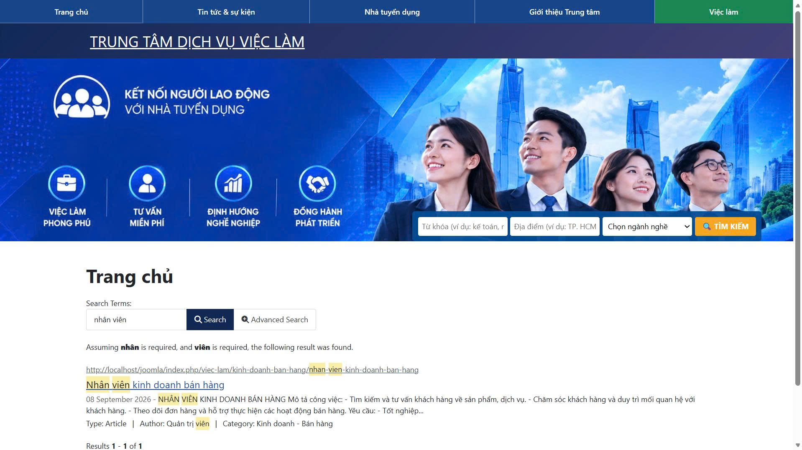

**Hình 4.2. Chức năng tìm kiếm và lọc việc làm theo ngành nghề**

Kết quả tìm kiếm được hiển thị dưới dạng danh sách. Người dùng có thể lựa chọn kết quả để xem thông tin chi tiết.

---

## 4.4. Chức năng lựa chọn ngành nghề

Website xây dựng 5 nhóm ngành nghề để hỗ trợ người dùng tìm kiếm việc làm:

- Kế toán - Kiểm toán.
- Kinh doanh - Bán hàng.
- Công nghệ thông tin.
- Hành chính - Nhân sự.
- Marketing - Truyền thông.

Người dùng có thể lựa chọn một ngành nghề để xem các nội dung việc làm tương ứng.

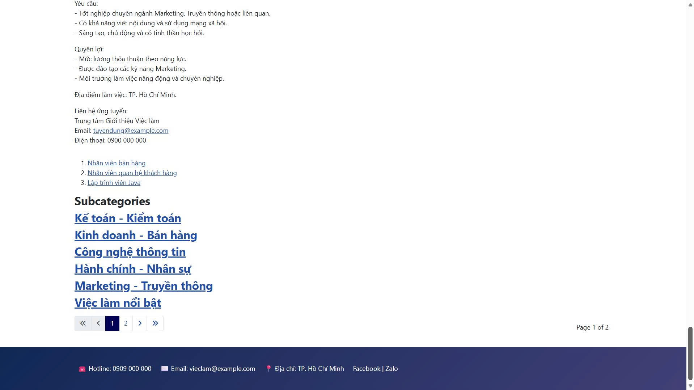

**Hình 4.3. Giao diện danh mục ngành nghề**

Việc phân chia ngành nghề giúp nội dung việc làm được tổ chức rõ ràng và hỗ trợ người dùng tìm kiếm theo lĩnh vực quan tâm.

---

## 4.5. Chức năng hiển thị thông tin việc làm

Website cung cấp danh sách các việc làm được xây dựng dưới dạng các bài viết Joomla.

Người dùng có thể truy cập mục **Việc làm** để xem danh sách các công việc đang được giới thiệu.

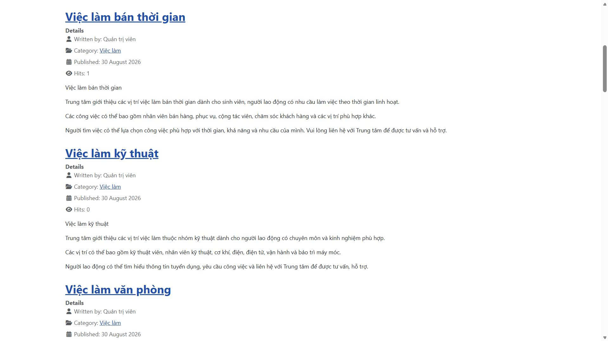

**Hình 4.4. Giao diện danh sách việc làm**

Mỗi việc làm được phân loại theo ngành nghề tương ứng.

Ví dụ:

**Nhân viên kế toán tổng hợp**

được phân loại vào:

**Kế toán - Kiểm toán**

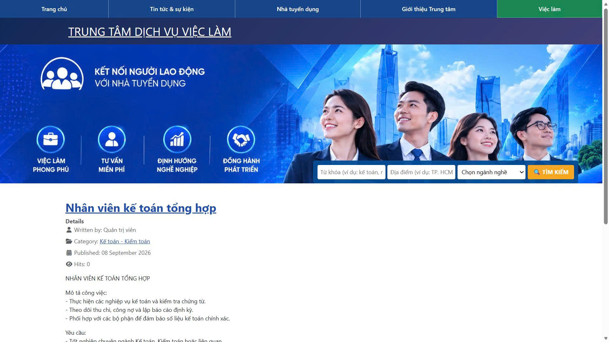

**Hình 4.5. Giao diện việc làm theo ngành nghề**

Khi người dùng lựa chọn một việc làm, Website hiển thị nội dung chi tiết.


**Hình 4.6. Giao diện chi tiết thông tin việc làm**

Thông tin chi tiết có thể bao gồm:

- Tên công việc.
- Nội dung tuyển dụng.
- Yêu cầu công việc.
- Thông tin liên quan đến vị trí.
- Thông tin liên hệ.

---

## 4.6. Chức năng quản lý nội dung

Nội dung Website được quản lý thông qua Joomla Administrator.

Quản trị viên có thể tạo và cập nhật các loại nội dung:

- Giới thiệu.
- Việc làm.
- Nhà tuyển dụng.
- Tin tức & sự kiện
- Việc làm

Các bài viết được phân loại bằng Categories nhằm giúp việc quản lý và hiển thị nội dung thuận tiện hơn.

Ví dụ, bài viết:

**Nhân viên kế toán tổng hợp**

được gán vào danh mục:

**Kế toán - Kiểm toán**.

Việc sử dụng Joomla giúp quản trị viên có thể cập nhật nội dung mà không cần chỉnh sửa trực tiếp toàn bộ mã nguồn Website.

---

## 4.7. Các giao diện chức năng khác

### 4.7.1. Giao diện Giới thiệu

Trang Giới thiệu cung cấp thông tin tổng quan về Trung tâm Giới thiệu việc làm.


**Hình 4.7. Giao diện trang Giới thiệu Trung tâm**

Nội dung được trình bày dưới dạng bài viết và được quản lý thông qua Joomla.

### 4.7.2. Giao diện Nhà tuyển dụng

Website cung cấp khu vực hiển thị thông tin các đơn vị tuyển dụng.

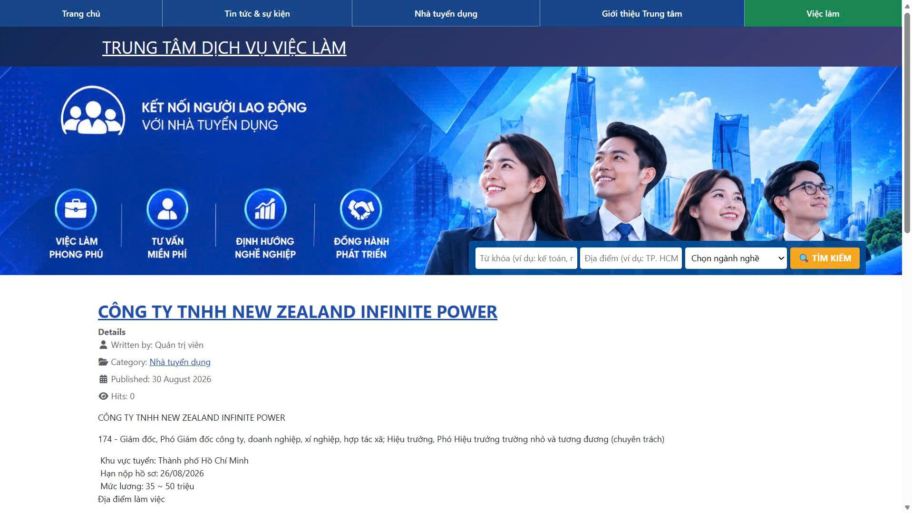

**Hình 4.8. Giao diện thông tin nhà tuyển dụng**

Nội dung có thể bao gồm:

- Tên doanh nghiệp.
- Thông tin tuyển dụng.
- Vị trí tuyển dụng.
- Yêu cầu.
- Thông tin liên hệ.

### 4.7.3. Giao diện Tin tức và sự kiện

Website có khu vực Tin tức và sự kiện để cung cấp các thông tin mới.


**Hình 4.9. Giao diện tin tức và sự kiện**

Các nội dung tin tức được quản lý dưới dạng bài viết Joomla.

### 4.7.4. Giao diện quản lý Module

Các thành phần giao diện Website được quản lý thông qua hệ thống Module của Joomla.

Các Module được sử dụng gồm:

- Menu chính.
- Banner.
- Thanh tìm kiếm.
- Việc làm nổi bật.
- Danh mục ngành nghề.
- Thông tin liên hệ.
- Đăng nhập.

Các Module được bố trí tại những vị trí phù hợp trên giao diện Website.

---

## 4.8. Kết quả kiểm thử

Sau khi hoàn thành quá trình xây dựng, Website được kiểm thử các chức năng chính.

### 4.8.1. Kiểm thử giao diện

Các thành phần giao diện được kiểm tra:

- Trang chủ.
- Menu.
- Banner.
- Thanh tìm kiếm.
- Danh mục ngành nghề.
- Danh sách việc làm.
- Footer.

Kết quả: **Đạt**.

### 4.8.2. Kiểm thử tìm kiếm

Từ khóa được sử dụng để kiểm tra:

`nhân viên`

Kết quả tìm kiếm được hiển thị theo nội dung đã lập chỉ mục trong Smart Search.

Kết quả: **Đạt**.

### 4.8.3. Kiểm thử lọc ngành nghề

Các ngành nghề được kiểm tra:

| STT | Ngành nghề | Kết quả |
|---:|---|---|
| 1 | Kế toán - Kiểm toán | Đạt |
| 2 | Kinh doanh - Bán hàng | Đạt |
| 3 | Công nghệ thông tin | Đạt |
| 4 | Hành chính - Nhân sự | Đạt |
| 5 | Marketing - Truyền thông | Đạt |

Kết quả: **Các bộ lọc hoạt động theo yêu cầu.**

### 4.8.4. Kiểm thử nội dung

Các nhóm nội dung được kiểm tra:

| Nội dung | Kết quả |
|---|---|
| Giới thiệu | Đạt |
| Việc làm | Đạt |
| Nhà tuyển dụng | Đạt |
| Tin tức | Đạt |
| Thông báo | Đạt |
| Liên hệ | Đạt |

### 4.8.5. Kiểm thử sao lưu và phục hồi

Cơ sở dữ liệu `joomla_db` được sao lưu thành tệp SQL.

Website cũng được sao lưu để phục vụ quá trình phục hồi.

Sau khi phục hồi, các nội dung và chức năng chính được kiểm tra lại.

Kết quả: **Đạt**.

---

## 4.9. Đánh giá hệ thống

Sau quá trình xây dựng và kiểm thử, Website đáp ứng các yêu cầu chính đã đặt ra trong phạm vi đề tài.

Hệ thống đã thực hiện được việc tổ chức nội dung giới thiệu Trung tâm, quản lý thông tin việc làm, phân loại ngành nghề, tìm kiếm và lọc việc làm, hiển thị thông tin nhà tuyển dụng và tin tức.

### 4.9.1. Ưu điểm

Các ưu điểm của hệ thống gồm:

- Sử dụng Joomla giúp việc quản lý nội dung thuận tiện.
- Giao diện Website được tổ chức theo các nhóm nội dung rõ ràng.
- Có menu điều hướng đến các khu vực chính.
- Có chức năng tìm kiếm việc làm.
- Có chức năng lọc việc làm theo ngành nghề.
- Nội dung việc làm được phân loại thành 5 nhóm ngành.
- Có thông tin chi tiết về việc làm.
- Có khu vực thông tin nhà tuyển dụng.
- Có khu vực tin tức và sự kiện.
- Có chức năng quản lý nội dung thông qua Joomla Administrator.
- Có thực hiện sao lưu và phục hồi Website, cơ sở dữ liệu.
- Mã nguồn và tài liệu được quản lý bằng Git và GitHub.

### 4.9.2. Hạn chế

Bên cạnh các kết quả đạt được, Website vẫn còn một số hạn chế:

- Website hiện được triển khai chủ yếu trên môi trường XAMPP cục bộ.
- Chưa xây dựng hệ thống tài khoản riêng cho nhà tuyển dụng để tự đăng tin.
- Chưa có chức năng ứng tuyển trực tuyến hoàn chỉnh.
- Chưa có hệ thống quản lý hồ sơ người tìm việc.
- Chức năng tìm kiếm mới tập trung vào các nội dung và ngành nghề đã xây dựng.
- Dữ liệu việc làm trong đồ án còn giới hạn nhằm phục vụ mục đích nghiên cứu và minh họa.
- Ngrok chỉ được sử dụng để hỗ trợ kiểm thử truy cập từ Internet, chưa thay thế cho môi trường máy chủ triển khai chính thức.

Những hạn chế trên là cơ sở để đề xuất các hướng phát triển tiếp theo được trình bày trong Chương 5.

# CHƯƠNG 5. KẾT LUẬN VÀ HƯỚNG PHÁT TRIỂN

## 5.1. Kết luận

Đồ án “Tìm hiểu CMS Joomla và thiết kế Website giới thiệu thông tin Trung tâm Giới thiệu việc làm” đã được thực hiện nhằm tìm hiểu hệ quản trị nội dung Joomla và vận dụng Joomla để xây dựng một Website giới thiệu thông tin về việc làm.

Trong quá trình thực hiện, đề tài đã tiến hành khảo sát một số Website trong lĩnh vực việc làm, phân tích cách tổ chức nội dung, giao diện, danh mục ngành nghề, thông tin việc làm và thông tin nhà tuyển dụng. Từ kết quả khảo sát, Website được xây dựng theo hướng tập trung vào việc cung cấp và tra cứu thông tin việc làm một cách rõ ràng, thuận tiện.

Website được triển khai trên môi trường máy chủ cục bộ XAMPP với Joomla 5.4.7, sử dụng giao diện Cassiopeia và chức năng Smart Search của Joomla. Nội dung Website được tổ chức thành các nhóm như Giới thiệu, Việc làm, Tin tức, Nhà tuyển dụng, Thông báo và Liên hệ.

Bên cạnh việc xây dựng giao diện và nội dung, đề tài cũng thực hiện các chức năng tìm kiếm, lựa chọn ngành nghề, hiển thị danh sách việc làm và xem chi tiết thông tin việc làm. Website được kiểm thử trên môi trường localhost và thực hiện sao lưu, phục hồi dữ liệu nhằm kiểm tra khả năng bảo toàn Website và cơ sở dữ liệu.

Qua quá trình thực hiện, đề tài giúp người thực hiện có thêm kiến thức về Joomla, quản trị Website, tổ chức nội dung, cơ sở dữ liệu, máy chủ cục bộ XAMPP cũng như quản lý mã nguồn bằng Git và GitHub.

## 5.2. Những kết quả đạt được

Sau quá trình nghiên cứu và thực hiện, đồ án đạt được các kết quả chính sau:

- Tìm hiểu được những kiến thức cơ bản về hệ quản trị nội dung Joomla.
- Khảo sát và tham khảo các Website trong lĩnh vực việc làm.
- Xây dựng được cấu trúc Website giới thiệu thông tin Trung tâm Giới thiệu việc làm.
- Cài đặt và cấu hình Joomla trên môi trường XAMPP.
- Sử dụng template Cassiopeia để xây dựng giao diện Website.
- Xây dựng các danh mục và bài viết phục vụ nội dung Website.
- Xây dựng nhóm ngành nghề gồm:
  - Kế toán - Kiểm toán.
  - Kinh doanh - Bán hàng.
  - Công nghệ thông tin.
  - Hành chính - Nhân sự.
  - Marketing - Truyền thông.
- Xây dựng chức năng tìm kiếm việc làm bằng Smart Search.
- Xây dựng chức năng lựa chọn và lọc việc làm theo ngành nghề.
- Hiển thị danh sách việc làm và thông tin chi tiết của từng việc làm.
- Xây dựng nội dung giới thiệu Trung tâm.
- Xây dựng nội dung thông tin nhà tuyển dụng.
- Xây dựng nội dung tin tức và thông báo.
- Thực hiện sao lưu cơ sở dữ liệu và Website.
- Thực hiện kiểm tra quá trình phục hồi Website và cơ sở dữ liệu.
- Quản lý mã nguồn và tài liệu đồ án trên GitHub.
- Thực hiện kiểm thử các chức năng chính của Website.

## 5.3. Những hạn chế

Bên cạnh những kết quả đạt được, Website vẫn còn một số hạn chế:

- Website hiện được triển khai chủ yếu trên môi trường máy chủ cục bộ XAMPP.
- Chức năng tìm kiếm mới tập trung vào từ khóa và nhóm ngành nghề, chưa xây dựng hệ thống tìm kiếm nâng cao theo nhiều tiêu chí.
- Chưa xây dựng chức năng cho nhà tuyển dụng tự đăng tin tuyển dụng trực tiếp trên Website.
- Chưa xây dựng tài khoản và phân quyền riêng cho người tìm việc, nhà tuyển dụng.
- Chưa xây dựng chức năng ứng tuyển trực tuyến.
- Chưa tích hợp hệ thống quản lý hồ sơ và CV của người tìm việc.
- Giao diện Website vẫn có thể tiếp tục hoàn thiện để tối ưu hơn trên nhiều kích thước màn hình.
- Chưa triển khai Website trên máy chủ Internet chính thức.
- Chưa tích hợp các dịch vụ bên ngoài phục vụ việc gửi thông báo hoặc xử lý hồ sơ ứng tuyển.

## 5.4. Hướng phát triển

Trong thời gian tới, Website có thể được phát triển theo các hướng sau:

- Hoàn thiện giao diện Website theo hướng hiện đại, trực quan và tối ưu cho thiết bị di động.
- Xây dựng tài khoản dành cho người tìm việc và nhà tuyển dụng.
- Cho phép nhà tuyển dụng đăng, chỉnh sửa và quản lý tin tuyển dụng trực tuyến.
- Xây dựng chức năng người tìm việc tạo và quản lý hồ sơ cá nhân.
- Bổ sung chức năng tạo, tải lên và quản lý CV.
- Xây dựng chức năng ứng tuyển trực tuyến.
- Phát triển chức năng tìm kiếm nâng cao theo nhiều tiêu chí như ngành nghề, địa điểm, mức lương và hình thức làm việc.
- Bổ sung chức năng quản lý trạng thái hồ sơ ứng tuyển.
- Xây dựng hệ thống thông báo cho người dùng khi có việc làm mới hoặc thay đổi trạng thái ứng tuyển.
- Tăng cường bảo mật và phân quyền người dùng.
- Tối ưu tốc độ tải trang và khả năng hoạt động trên nhiều thiết bị.
- Triển khai Website lên máy chủ Internet để người dùng có thể truy cập từ xa.
- Có thể nghiên cứu bổ sung các chức năng hỗ trợ đề xuất việc làm phù hợp với nhu cầu của người tìm việc.

# DANH MỤC TÀI LIỆU THAM KHẢO

[1]. Tài liệu hướng dẫn Joomla và tài liệu môn học.

[2]. Trung tâm Việc làm Bình Dương. Website:
https://vieclambinhduong.vercel.app

[3]. Trung tâm Dịch vụ việc làm Thành phố Hồ Chí Minh. Website:
http://vieclamhcm.com.vn

[4]. Sàn giao dịch việc làm Quốc gia. Website:
https://vieclam.gov.vn/

# PHỤ LỤC

## PHỤ LỤC A. MỘT SỐ ĐOẠN MÃ NGUỒN

### A.1. Mã HTML xây dựng thanh tìm kiếm

<div class="job-search-wrapper">
<form class="job-search-form" action="/joomla/index.php" method="get">

<input type="hidden" name="option" value="com_finder">
<input type="hidden" name="view" value="search">

<div class="search-field">
<input name="q" type="text"
placeholder="Từ khóa (ví dụ: kế toán, nhân viên...)">
</div>

<div class="search-field">
<input type="text"
placeholder="Địa điểm (ví dụ: TP. HCM, Hà Nội...)">
</div>

<div class="search-field">
<select name="f">
<option value="">Chọn ngành nghề</option>
<option value="1">Kế toán - Kiểm toán</option>
<option value="2">Kinh doanh - Bán hàng</option>
<option value="3">Công nghệ thông tin</option>
<option value="4">Hành chính - Nhân sự</option>
<option value="5">Marketing - Truyền thông</option>
</select>
</div>

<button class="btn-search-submit" type="submit">
TÌM KIẾM
</button>

</form>
</div>

### A.2. CSS thiết kế thanh tìm kiếm
.job-search-box {
    width: 100%;
    max-width: 1150px;
    margin: 25px auto;
    padding: 18px;
    background: #1769d1;
    border-radius: 12px;
}

.job-search-form {
    display: flex;
    flex-flow: row nowrap;
    align-items: center;
    gap: 12px;
    width: 100%;
}

.job-search-field {
    flex: 1 1 0;
    min-width: 0;
}

.job-search-field input,
.job-search-field select {
    width: 100%;
    height: 48px;
    padding: 0 15px;
    background: #fff;
    border: 1px solid #ddd;
    border-radius: 8px;
    font-size: 14px;
}

.job-search-button {
    width: 135px;
    height: 48px;
    background: #0b55b0;
    color: #fff;
    border: 1px solid #fff;
    border-radius: 8px;
    font-size: 14px;
    font-weight: bold;
}

### A.3. CSS hiển thị thanh tìm kiếm trên banner
.banner-search-overlay {
    position: absolute;
    left: 50%;
    transform: translateX(-50%);
    width: 100%;
    max-width: 1150px;
    z-index: 10;
}

### A.4. CSS responsive
@media (max-width: 850px) {
    .job-search-form {
        flex-wrap: wrap;
    }

    .job-search-field {
        flex: 1 1 45%;
    }

    .job-search-button {
        width: 100%;
    }
}

@media (max-width: 600px) {
    .job-search-field {
        flex: 1 1 100%;
    }

    .job-search-button {
        width: 100%;
    }
}

## PHỤ LỤC B. CẤU TRÚC CƠ SỞ DỮ LIỆU

### B.1. Thông tin cơ sở dữ liệu

Website được xây dựng và kiểm thử trên môi trường máy chủ cục bộ XAMPP. Cơ sở dữ liệu của Website được quản lý bằng MariaDB thông qua phpMyAdmin.

Thông tin cơ sở dữ liệu sử dụng trong quá trình thực hiện:

- Tên cơ sở dữ liệu: `joomla_db`
- Máy chủ cơ sở dữ liệu: `localhost`
- Hệ quản trị cơ sở dữ liệu: MariaDB
- Công cụ quản lý: phpMyAdmin
- Tiền tố bảng: `rjth_`
- Website sử dụng Joomla 5.4.7.

### B.2. Cấu trúc bảng dữ liệu

Sau khi cài đặt Joomla, hệ thống tự động tạo các bảng dữ liệu phục vụ cho việc quản lý nội dung, người dùng, menu, module, danh mục, bài viết và các thành phần khác của Website.

Các bảng trong cơ sở dữ liệu sử dụng tiền tố `rjth_`.

Một số nhóm bảng chính gồm:

| Nhóm dữ liệu | Chức năng |
|---|---|
| `rjth_content` | Lưu thông tin các bài viết |
| `rjth_categories` | Lưu thông tin các danh mục |
| `rjth_users` | Quản lý người dùng |
| `rjth_user_usergroup_map` | Liên kết người dùng với nhóm quyền |
| `rjth_menu` | Quản lý các mục menu |
| `rjth_modules` | Quản lý các module trên Website |
| `rjth_extensions` | Quản lý các thành phần mở rộng của Joomla |
| `rjth_finder_*` | Lưu dữ liệu phục vụ chức năng Smart Search |
| `rjth_assets` | Quản lý tài nguyên và quyền truy cập |
| `rjth_session` | Quản lý phiên làm việc của người dùng |

### B.3. Dữ liệu danh mục việc làm

Website tổ chức các bài viết việc làm theo các nhóm ngành nghề. Các nhóm ngành nghề được xây dựng gồm:

1. Kế toán - Kiểm toán.
2. Kinh doanh - Bán hàng.
3. Công nghệ thông tin.
4. Hành chính - Nhân sự.
5. Marketing - Truyền thông.

Mỗi bài viết việc làm được gán vào một danh mục tương ứng. Việc tổ chức bài viết theo danh mục giúp Website dễ quản lý và hỗ trợ chức năng tìm kiếm, lọc việc làm theo ngành nghề.

### B.4. Quan hệ giữa các thành phần dữ liệu

Cấu trúc dữ liệu của Website được tổ chức theo mô hình quản lý nội dung của Joomla:

```text
Danh mục
   │
   ├── Bài viết
   │      │
   │      ├── Thông tin việc làm
   │      ├── Tin tức
   │      ├── Thông báo
   │      └── Nội dung giới thiệu
   │
   └── Menu
          │
          ├── Trang chủ
          ├── Giới thiệu
          ├── Việc làm
          ├── Tin tức
          ├── Nhà tuyển dụng
          ├── Thông báo
          └── Liên hệ

```


### B.5. Smart Search
Joomla Smart Search sử dụng các bảng có tiền tố rjth_finder_ để lưu dữ liệu lập chỉ mục phục vụ tìm kiếm.
Sau khi nội dung Website được lập chỉ mục, người dùng có thể tìm kiếm thông tin việc làm bằng từ khóa. Website đồng thời hỗ trợ lựa chọn ngành nghề thông qua bộ lọc Smart Search.
Ví dụ:
Từ khóa: nhân viên
Ngành nghề: Kế toán - Kiểm toán

→ Kết quả:
Nhân viên kế toán tổng hợp

### B.6. Sao lưu và phục hồi cơ sở dữ liệu
Trong quá trình thực hiện đồ án, cơ sở dữ liệu joomla_db được sao lưu bằng phpMyAdmin thành tệp SQL.
Quy trình thực hiện gồm:

joomla_db
    ↓
Export
    ↓
Tệp joomla_db.sql
    ↓
Tạo cơ sở dữ liệu kiểm thử
    ↓
Import
    ↓
joomla_db_restore_test

Việc phục hồi cơ sở dữ liệu được thực hiện nhằm kiểm tra khả năng khôi phục dữ liệu trong trường hợp cần triển khai lại Website.

### B.7. Hình ảnh cấu trúc cơ sở dữ liệu

Hình ảnh cấu trúc cơ sở dữ liệu của Website được trình bày tại Hình C4 trong Phụ lục C.
Hình B1. Cấu trúc cơ sở dữ liệu joomla_db trên phpMyAdmin

## PHỤ LỤC C. HÌNH ẢNH QUÁ TRÌNH CÀI ĐẶT

Phụ lục C trình bày một số hình ảnh trong quá trình cài đặt, cấu hình và triển khai Website Joomla trên môi trường máy chủ cục bộ.

### C.1. Khởi động môi trường XAMPP

XAMPP được sử dụng để tạo môi trường máy chủ cục bộ cho Website. Apache được sử dụng làm Web Server và MariaDB được sử dụng để quản lý cơ sở dữ liệu.

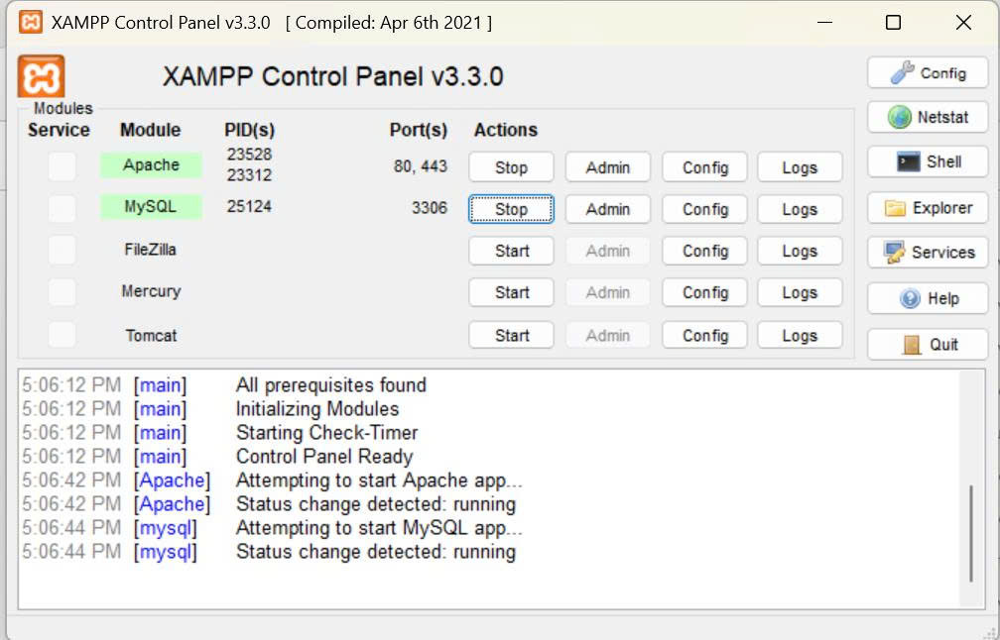

**Hình C1. Môi trường XAMPP với Apache và MySQL/MariaDB được khởi động**

### C.2. Website Joomla trên máy chủ cục bộ

Sau khi cài đặt và cấu hình hoàn tất, Website được truy cập thông qua địa chỉ máy chủ cục bộ:

`http://localhost/joomla/`

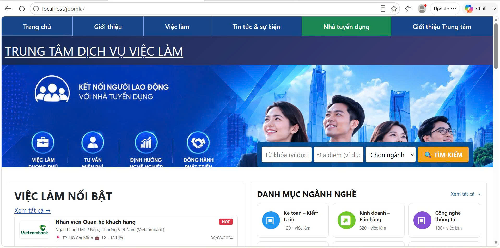

**Hình C2. Website Joomla được triển khai trên máy chủ cục bộ**

### C.3. Giao diện quản trị Joomla

Khu vực quản trị Joomla được sử dụng để quản lý bài viết, danh mục, menu, module, người dùng và các thành phần của Website.

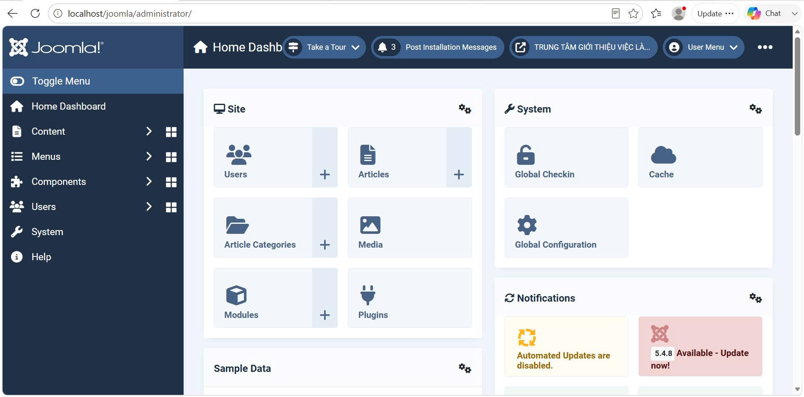

**Hình C3. Giao diện quản trị Joomla**

### C.4. Cấu trúc cơ sở dữ liệu

Cơ sở dữ liệu `joomla_db` được quản lý bằng phpMyAdmin. Sau khi cài đặt Joomla, hệ thống tạo các bảng dữ liệu với tiền tố `rjth_`.

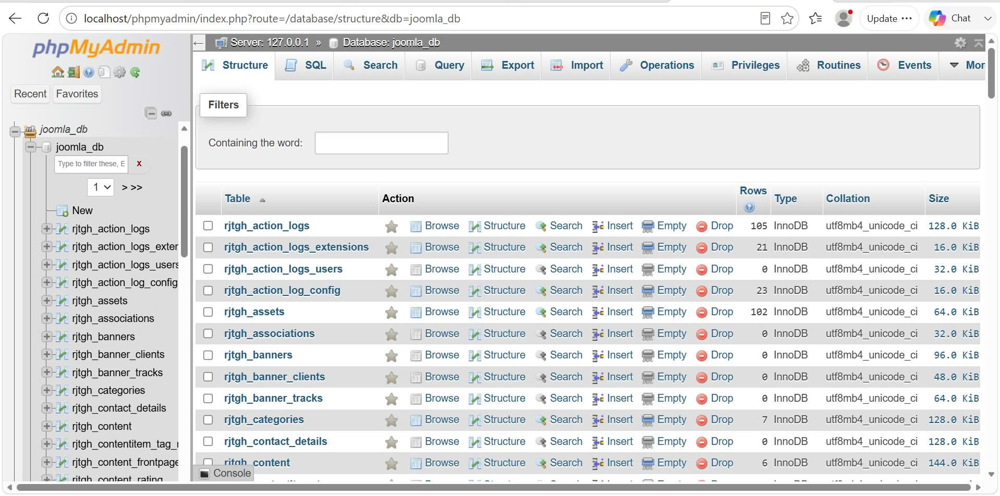

**Hình C4. Cấu trúc cơ sở dữ liệu của Website trên phpMyAdmin**

### C.5. Cấu trúc thư mục Website

Các tệp mã nguồn Joomla được lưu trữ trong thư mục:

`C:\xampp\htdocs\joomla`

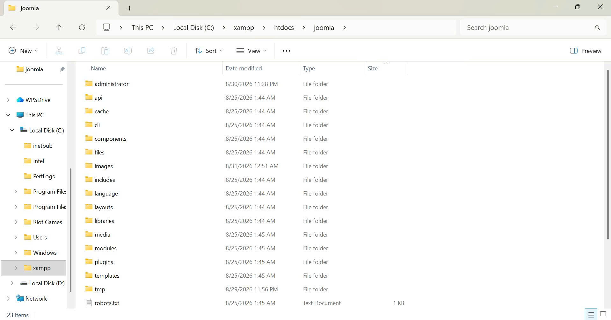

**Hình C5. Cấu trúc thư mục của Website Joomla**

### C.6. Template Cassiopeia

Website sử dụng template Cassiopeia của Joomla để xây dựng giao diện. Template được cấu hình và tùy chỉnh bằng CSS nhằm phù hợp với nội dung của đề tài.

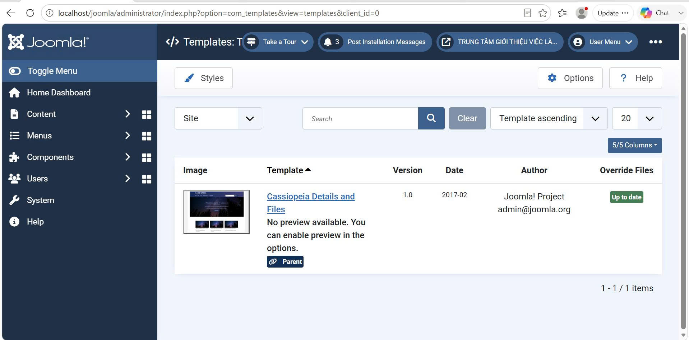

**Hình C6. Template Cassiopeia được sử dụng cho Website**

### C.7. Lập chỉ mục Smart Search

Smart Search được sử dụng để lập chỉ mục nội dung trên Website. Sau khi lập chỉ mục, các bài viết và danh mục có thể được tìm kiếm thông qua chức năng tìm kiếm của Joomla.

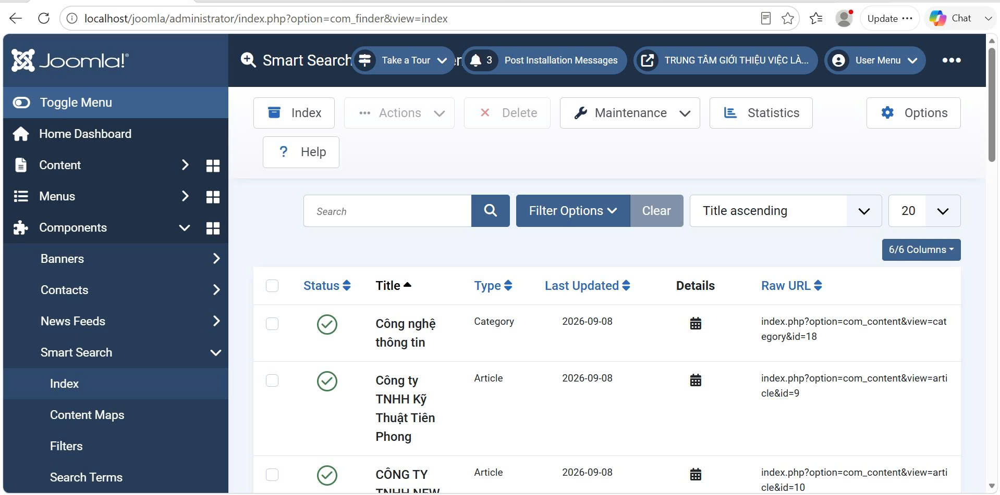

**Hình C7. Danh sách nội dung được lập chỉ mục trong Smart Search**

### C.8. Quản lý mã nguồn trên GitHub

Mã nguồn và tài liệu của đồ án được quản lý bằng Git và GitHub. Repository của đồ án được tổ chức thành các thư mục phục vụ cho mã nguồn, tài liệu, báo cáo và quá trình theo dõi tiến độ.

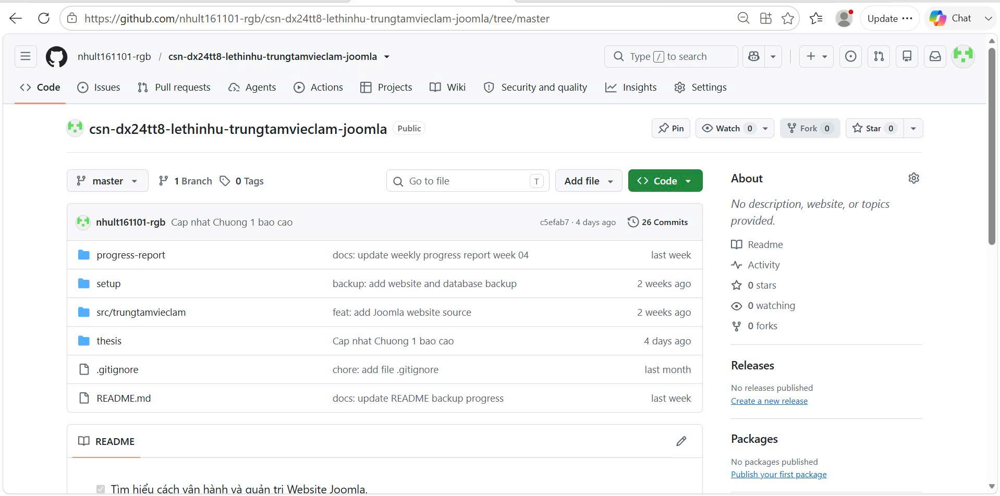

**Hình C8. Quản lý mã nguồn và tài liệu đồ án trên GitHub**

## PHỤ LỤC D. CÁC GIAO DIỆN CỦA HỆ THỐNG

Phụ lục D trình bày các giao diện chính của Website sau khi hoàn thành xây dựng và kiểm thử. Các hình ảnh thể hiện quá trình người dùng truy cập, tra cứu việc làm, lựa chọn ngành nghề và xem thông tin tuyển dụng trên Website.

### D.1. Giao diện trang chủ

Trang chủ là giao diện đầu tiên khi người dùng truy cập Website. Trang chủ hiển thị banner, menu chính, thanh tìm kiếm và các nội dung giới thiệu, việc làm nổi bật và thông tin liên quan.


**Hình D1. Giao diện trang chủ Website Trung tâm Giới thiệu việc làm**

### D.2. Giao diện trang Giới thiệu

Trang Giới thiệu cung cấp thông tin tổng quan về Trung tâm Giới thiệu việc làm, giúp người dùng tìm hiểu về đơn vị và các nội dung được cung cấp trên Website.


**Hình D2. Giao diện trang Giới thiệu Trung tâm**

### D.3. Giao diện danh sách việc làm

Trang danh sách việc làm hiển thị các bài viết việc làm được đăng trên Website. Người dùng có thể xem thông tin tổng quan và lựa chọn bài viết để xem chi tiết.


**Hình D3. Giao diện danh sách việc làm**

### D.4. Giao diện danh mục ngành nghề

Website phân chia việc làm thành các nhóm ngành nghề nhằm giúp người dùng dễ dàng lựa chọn lĩnh vực quan tâm.

Các nhóm ngành nghề được xây dựng gồm:

- Kế toán - Kiểm toán.
- Kinh doanh - Bán hàng.
- Công nghệ thông tin.
- Hành chính - Nhân sự.
- Marketing - Truyền thông.


**Hình D4. Giao diện danh mục ngành nghề**

### D.5. Giao diện việc làm theo ngành nghề

Khi người dùng lựa chọn một nhóm ngành nghề, Website hiển thị các bài viết thuộc danh mục tương ứng.

Ví dụ, danh mục **Kế toán - Kiểm toán** hiển thị bài viết “Nhân viên kế toán tổng hợp”.


**Hình D5. Giao diện việc làm theo ngành nghề**

### D.6. Chức năng tìm kiếm và lọc việc làm

Chức năng tìm kiếm sử dụng Smart Search của Joomla. Người dùng có thể nhập từ khóa và lựa chọn ngành nghề để thu hẹp kết quả tìm kiếm.

Ví dụ:

```text
Từ khóa: nhân viên
Ngành nghề: Kế toán - Kiểm toán
```

Kết quả tìm kiếm hiển thị bài viết phù hợp với điều kiện đã lựa chọn.
 
Hình D6. Chức năng tìm kiếm và lọc việc làm theo ngành nghề

### D.7. Giao diện chi tiết thông tin việc làm

Khi người dùng lựa chọn một công việc trong danh sách việc làm, hệ thống chuyển đến trang chi tiết của bài viết. Trang này cung cấp đầy đủ thông tin liên quan đến công việc tuyển dụng, giúp người dùng dễ dàng tìm hiểu trước khi lựa chọn.

Nội dung trang chi tiết bao gồm tên công việc, thông tin danh mục, thời gian đăng bài và nội dung mô tả công việc.

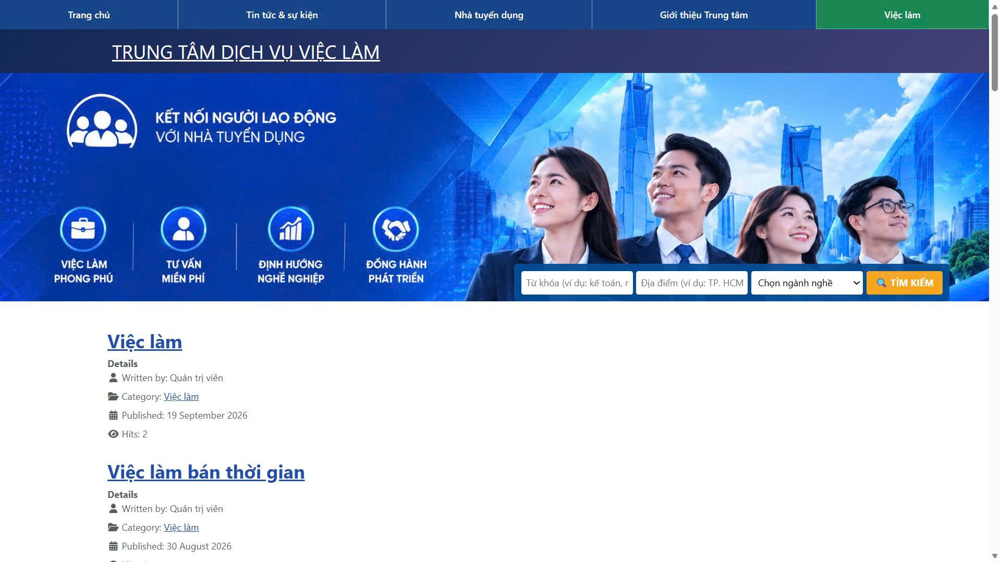

**Hình D7. Giao diện chi tiết thông tin việc làm**

### D.8. Giao diện thông tin nhà tuyển dụng

Website cung cấp trang thông tin nhà tuyển dụng nhằm giới thiệu thông tin của doanh nghiệp và các nội dung tuyển dụng. Người dùng có thể xem tên doanh nghiệp, thông tin tuyển dụng và các nội dung liên quan.


**Hình D8. Giao diện thông tin nhà tuyển dụng**

### D.9. Giao diện tin tức và sự kiện

Website cung cấp khu vực tin tức và sự kiện để đăng tải các thông tin liên quan đến hoạt động tuyển dụng và những nội dung được cập nhật trên Website.


**Hình D9. Giao diện tin tức và sự kiện**

### D.10. Thông tin liên hệ của Trung tâm

Thông tin liên hệ được bố trí tại khu vực cuối trang Website, giúp người dùng dễ dàng tìm thấy thông tin cần thiết khi có nhu cầu liên hệ với Trung tâm Giới thiệu việc làm.

Nội dung liên hệ gồm số điện thoại, địa chỉ, email và các kênh liên hệ trực tuyến. Khu vực này được duy trì trên các trang của Website nhằm tạo sự thuận tiện cho người tìm việc và nhà tuyển dụng trong quá trình sử dụng hệ thống.

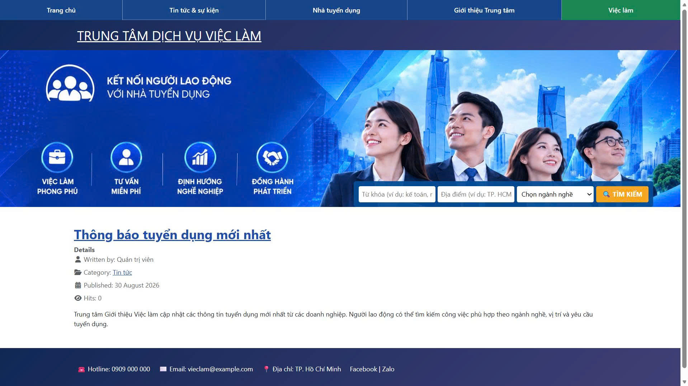

**Hình D10. Thông tin liên hệ của Trung tâm được hiển thị ở cuối trang Website**