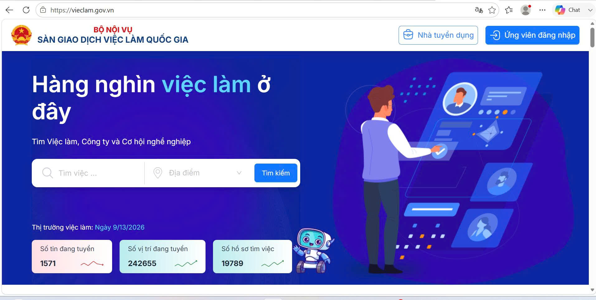
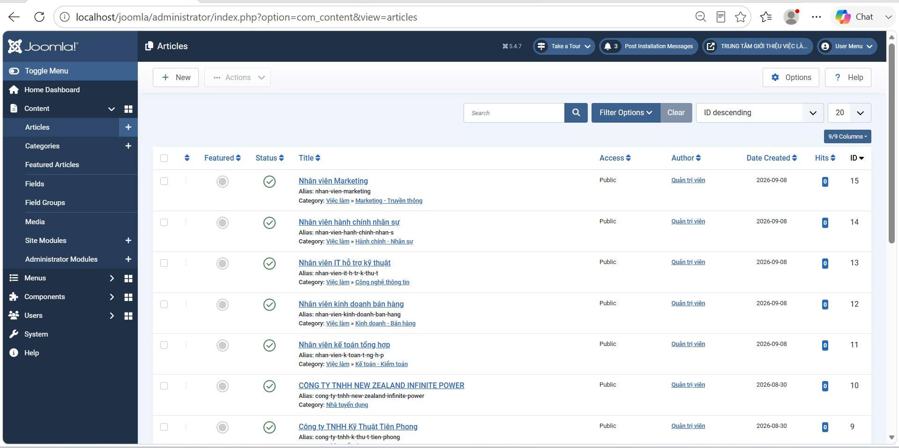

# ĐỒ ÁN THỰC TẬP CƠ SỞ NGÀNH

TÌM HIỂU JOOMLA VÀ THIẾT KẾ WEBSITE
GIỚI THIỆU THÔNG TIN TRUNG TÂM GIỚI THIỆU VIỆC LÀM
# LỜI MỞ ĐẦU
## LỜI CẢM ƠN

1. Lý do chọn đề tài
2. Mục đích nghiên cứu
3. Đối tượng nghiên cứu
4. Phạm vi nghiên cứu


# CHƯƠNG 1. TỔNG QUAN

## 1.1. Tổng quan về vấn đề nghiên cứu

## 1.2. Thực trạng nhu cầu cung cấp thông tin việc làm

## 1.3. Vấn đề cần giải quyết

## 1.4. Định hướng giải pháp

## 1.5. Kết luận chương


# CHƯƠNG 2. NGHIÊN CỨU LÝ THUYẾT

## 2.1. Tổng quan về CMS

## 2.2. Tổng quan về Joomla

## 2.3. Mô hình hoạt động của Joomla

## 2.4. Các thành phần chính của Joomla

### Article
### Category
### Menu
### Component
### Module
### Plugin
### Template

## 2.5. Cơ sở dữ liệu trong Joomla

## 2.6. XAMPP và môi trường localhost

## 2.7. Smart Search trong Joomla

## 2.8. Công cụ và phần mềm sử dụng

## 2.9. Kết luận chương


# CHƯƠNG 3. HIỆN THỰC HÓA NGHIÊN CỨU

## 3.1. Khảo sát các website tham khảo

## 3.2. Phân tích yêu cầu

## 3.3. Thiết kế cấu trúc website

## 3.4. Thiết kế hệ thống menu

## 3.5. Thiết kế phân loại ngành nghề

## 3.6. Thiết kế giao diện

## 3.7. Cài đặt Joomla trên localhost

## 3.8. Tạo và cấu hình cơ sở dữ liệu

## 3.9. Xây dựng và quản lý nội dung

## 3.10. Xây dựng chức năng tìm kiếm và lọc

## 3.11. Sao lưu cơ sở dữ liệu

## 3.12. Sao lưu và phục hồi website

## 3.13. Kiểm thử hệ thống

## 3.14. Kết luận chương


# CHƯƠNG 4. KẾT QUẢ NGHIÊN CỨU

## 4.1. Kết quả xây dựng website

## 4.2. Giao diện trang chủ

## 4.3. Hệ thống menu và điều hướng

## 4.4. Danh mục việc làm

## 4.5. Nội dung thông tin tuyển dụng

## 4.6. Chức năng tìm kiếm và lọc ngành nghề

## 4.7. Chức năng sao lưu và phục hồi

## 4.8. Kết quả kiểm thử

## 4.9. Đánh giá kết quả đạt được

## 4.10. Hạn chế


# CHƯƠNG 5. KẾT LUẬN VÀ HƯỚNG PHÁT TRIỂN

## 5.1. Kết luận

## 5.2. Những kết quả đạt được

## 5.3. Đóng góp của đề tài

## 5.4. Hướng phát triển


# DANH MỤC TÀI LIỆU THAM KHẢO

Chỉ đưa những tài liệu thực sự đã sử dụng hoặc trích dẫn.


# PHỤ LỤC

- Mã nguồn/cấu hình quan trọng
- Một số giao diện quản trị
- Quy trình cài đặt
- Quy trình backup/restore
- Các hình ảnh kiểm thử nếu cần

# MỞ ĐẦU

## 1. Lý do chọn đề tài

Trong bối cảnh nhu cầu tìm kiếm việc làm ngày càng tăng, việc cung cấp thông tin tuyển dụng một cách rõ ràng, đầy đủ và dễ tiếp cận là một yêu cầu quan trọng đối với các Trung tâm Giới thiệu việc làm. Website là một phương tiện phù hợp để cung cấp thông tin về Trung tâm, việc làm, nhà tuyển dụng, tin tức, thông báo và thông tin liên hệ đến người tìm việc.

Nếu thông tin được trình bày không có cấu trúc hoặc việc tìm kiếm nội dung chưa thuận tiện, người sử dụng sẽ gặp khó khăn trong quá trình tiếp cận thông tin. Vì vậy, việc xây dựng một website có cấu trúc nội dung rõ ràng, phân loại thông tin theo từng nhóm ngành nghề và hỗ trợ tìm kiếm là cần thiết.

Joomla là một hệ quản trị nội dung mã nguồn mở, hỗ trợ quản lý bài viết, phân loại nội dung, xây dựng menu và mở rộng chức năng thông qua các thành phần của hệ thống. Đây là nền tảng phù hợp để tìm hiểu cách xây dựng và quản trị một website giới thiệu thông tin.

Từ những lý do trên, đề tài **“TÌM HIỂU CMS JOOMLA VÀ THIẾT KẾ WEBSITE GIỚI THIỆU THÔNG TIN TRUNG TÂM GIỚI THIỆU VIỆC LÀM”** được thực hiện nhằm tìm hiểu Joomla và áp dụng nền tảng này để xây dựng một website giới thiệu thông tin việc làm trên môi trường máy chủ cục bộ.

## 2. Mục đích nghiên cứu

Đề tài được thực hiện với các mục đích chính:

- Tìm hiểu khái niệm và cách thức hoạt động của CMS Joomla.
- Tìm hiểu các thành phần cơ bản của Joomla như Article, Category, Menu, Module, Component, Plugin và Template.
- Khảo sát cách tổ chức nội dung trên một số website liên quan đến việc làm.
- Phân tích và xây dựng cấu trúc website giới thiệu thông tin Trung tâm Giới thiệu việc làm.
- Xây dựng và quản lý các nội dung về việc làm, nhà tuyển dụng, tin tức và thông báo.
- Phân loại việc làm theo các nhóm ngành nghề nhằm giúp người dùng dễ dàng tiếp cận thông tin.
- Xây dựng chức năng tìm kiếm và lọc thông tin việc làm.
- Thực hiện sao lưu và phục hồi cơ sở dữ liệu, mã nguồn website.
- Kiểm thử các chức năng cơ bản sau khi hoàn thiện website.

## 3. Đối tượng nghiên cứu

Đối tượng nghiên cứu của đề tài gồm:

- Hệ quản trị nội dung Joomla.
- Cách tổ chức và quản lý nội dung trong Joomla.
- Mối quan hệ giữa Article, Category và Menu.
- Template, Module, Component và Plugin trong Joomla.
- Chức năng Smart Search và lọc nội dung.
- Website giới thiệu thông tin Trung tâm Giới thiệu việc làm.
- Quy trình sao lưu và phục hồi website, cơ sở dữ liệu.

## 4. Phạm vi nghiên cứu

### 4.1. Phạm vi nội dung

Đề tài tập trung xây dựng website với các nhóm thông tin:

- Trang chủ.
- Giới thiệu.
- Việc làm.
- Tin tức.
- Nhà tuyển dụng.
- Thông báo.
- Liên hệ.

Trong nhóm **Việc làm**, nội dung được phân thành các nhóm ngành nghề:

1. Kế toán - Kiểm toán.
2. Kinh doanh - Bán hàng.
3. Công nghệ thông tin.
4. Hành chính - Nhân sự.
5. Marketing - Truyền thông.

### 4.2. Phạm vi kỹ thuật

Website được cài đặt và thử nghiệm trên môi trường máy chủ cục bộ sử dụng XAMPP, Apache, MariaDB và Joomla.

Đề tài tập trung vào việc xây dựng website giới thiệu và cung cấp thông tin, không phát triển thành một hệ thống tuyển dụng trực tuyến quy mô lớn. Các chức năng như tạo hồ sơ ứng viên, ứng tuyển trực tuyến, quản lý tuyển dụng chuyên sâu hoặc triển khai trên máy chủ Internet thực tế không thuộc phạm vi chính của đề tài.

### 4.3. Phạm vi sao lưu và phục hồi

Đề tài thực hiện:

- Sao lưu mã nguồn website.
- Sao lưu cơ sở dữ liệu.
- Phục hồi cơ sở dữ liệu.
- Phục hồi website từ dữ liệu đã sao lưu.
- Kiểm tra website sau quá trình phục hồi.

# CHƯƠNG 1. TỔNG QUAN

## 1.1. Tổng quan về vấn đề nghiên cứu

Thông tin việc làm bao gồm nhiều loại nội dung khác nhau như vị trí tuyển dụng, yêu cầu công việc, quyền lợi, thông tin nhà tuyển dụng và thông tin liên hệ. Nếu các nội dung này được tổ chức thành các nhóm rõ ràng, người tìm việc có thể dễ dàng tìm kiếm và tiếp cận thông tin phù hợp.

Website của Trung tâm Giới thiệu việc làm vì vậy cần đáp ứng hai nhóm nhu cầu chính: **cung cấp thông tin** và **hỗ trợ người dùng tìm kiếm thông tin**.

Trong đề tài, Joomla được lựa chọn làm nền tảng để quản lý nội dung. Các nội dung được tổ chức thông qua Article và Category, sau đó được đưa vào hệ thống Menu để người dùng truy cập. Chức năng Smart Search được sử dụng để hỗ trợ tìm kiếm và lọc thông tin việc làm.

## 1.2. Thực trạng nhu cầu cung cấp thông tin việc làm

Qua quá trình khảo sát các website liên quan đến việc làm, các nội dung thường được người dùng quan tâm gồm:

- Thông tin việc làm.
- Thông tin tuyển dụng.
- Thông tin nhà tuyển dụng.
- Tin tức và thông báo.
- Chức năng tìm kiếm.
- Cách tổ chức và điều hướng nội dung.

Kết quả khảo sát được sử dụng làm cơ sở để xác định các nhóm nội dung và chức năng cần thiết cho website của đề tài.

## 1.3. Vấn đề cần giải quyết

Từ yêu cầu của đề tài, website cần giải quyết các vấn đề:

- Tổ chức thông tin thành các nhóm nội dung rõ ràng.
- Xây dựng menu giúp người dùng dễ dàng điều hướng.
- Phân loại việc làm theo ngành nghề.
- Cung cấp thông tin tuyển dụng dưới dạng các bài viết.
- Hỗ trợ tìm kiếm thông tin.
- Hỗ trợ lọc việc làm theo nhóm ngành nghề.
- Đảm bảo dữ liệu có thể được sao lưu và phục hồi khi cần thiết.

## 1.4. Định hướng giải pháp

Để giải quyết các vấn đề trên, đề tài lựa chọn Joomla làm nền tảng xây dựng website.

Mô hình tổ chức nội dung được sử dụng theo hướng:

**Article → Category → Menu Item → Website**

Trong đó:

- **Article:** lưu trữ nội dung chi tiết.
- **Category:** phân nhóm các bài viết.
- **Menu Item:** tạo đường dẫn để người dùng truy cập nội dung.
- **Website:** hiển thị nội dung đến người sử dụng.

## 1.5. Kết luận chương

Chương 1 đã trình bày tổng quan vấn đề nghiên cứu, nhu cầu cung cấp thông tin việc làm và các vấn đề cần giải quyết. Trên cơ sở đó, đề tài lựa chọn Joomla để xây dựng website, tổ chức nội dung bằng Article và Category, điều hướng bằng Menu và hỗ trợ tìm kiếm, lọc thông tin việc làm.

# CHƯƠNG 2. NGHIÊN CỨU LÝ THUYẾT

## 2.1. Tổng quan về CMS

CMS (Content Management System) là hệ quản trị nội dung, được sử dụng để tạo, quản lý, chỉnh sửa và tổ chức nội dung của website.

CMS giúp người quản trị có thể quản lý nội dung thông qua giao diện quản trị thay vì phải xây dựng toàn bộ website bằng mã nguồn thủ công. Một CMS thường cung cấp các chức năng quản lý nội dung, người dùng, giao diện và các thành phần mở rộng.

Trong phạm vi đề tài, CMS được nghiên cứu nhằm làm cơ sở lựa chọn Joomla để xây dựng website giới thiệu thông tin Trung tâm Giới thiệu việc làm.

## 2.2. Tổng quan về Joomla

Joomla là một hệ quản trị nội dung mã nguồn mở được sử dụng để xây dựng và quản lý website. Joomla cung cấp hệ thống quản trị nội dung, quản lý người dùng, menu, giao diện và các phần mở rộng.

Các thành phần được sử dụng và nghiên cứu trong đề tài gồm:

- Article.
- Category.
- Menu.
- Component.
- Module.
- Plugin.
- Template.
- User và quyền truy cập.

Joomla cho phép tổ chức nội dung theo cấu trúc rõ ràng và hỗ trợ mở rộng chức năng tùy theo nhu cầu của website.

## 2.3. Mô hình hoạt động của Joomla

Joomla hoạt động dựa trên sự phối hợp giữa nội dung, phân loại, điều hướng và giao diện.

Mô hình cơ bản:

**Article → Category → Menu Item → Website**

Article chứa nội dung chi tiết. Category giúp phân loại các Article theo chủ đề. Menu Item tạo đường dẫn để người dùng truy cập nội dung. Template và Module hỗ trợ trình bày nội dung trên giao diện website.

## 2.4. Các thành phần chính của Joomla

### 2.4.1. Article

Article là đơn vị nội dung cơ bản trong Joomla. Article được sử dụng để tạo và quản lý các nội dung như bài giới thiệu, tin tức, thông tin việc làm, thông báo hoặc thông tin liên hệ.

Trong đề tài, Article được sử dụng để xây dựng nội dung cho các nhóm như Giới thiệu, Việc làm, Tin tức, Nhà tuyển dụng và Thông báo.

### 2.4.2. Category

Category được sử dụng để phân nhóm các Article có cùng chủ đề.

Trong website, Category **Việc làm** được sử dụng làm nhóm chính và được chia thành các nhóm ngành nghề:

- Kế toán - Kiểm toán.
- Kinh doanh - Bán hàng.
- Công nghệ thông tin.
- Hành chính - Nhân sự.
- Marketing - Truyền thông.

Việc phân loại giúp nội dung được tổ chức có hệ thống và thuận tiện cho việc tìm kiếm, quản lý.

### 2.4.3. Menu

Menu là thành phần giúp tổ chức hệ thống điều hướng của website.

Website gồm các mục chính:

- Trang chủ.
- Giới thiệu.
- Việc làm.
- Tin tức.
- Nhà tuyển dụng.
- Thông báo.
- Liên hệ.

Menu giúp người dùng truy cập nhanh đến các nhóm nội dung chính.

### 2.4.4. Component

Component là thành phần cung cấp các chức năng chính của Joomla. Mỗi Component có thể đảm nhiệm một nhóm chức năng riêng.

Trong đề tài, Component tìm kiếm được sử dụng để triển khai chức năng Smart Search.

### 2.4.5. Module

Module là thành phần dùng để hiển thị các khối nội dung hoặc chức năng tại những vị trí được xác định trên giao diện.

Trong website, Module được sử dụng cho các thành phần như menu, tìm kiếm, đăng nhập, thông tin liên hệ và các nội dung hỗ trợ.

### 2.4.6. Plugin

Plugin là thành phần mở rộng thực hiện các tác vụ khi Joomla xử lý các sự kiện của hệ thống.

Plugin giúp mở rộng hoặc bổ sung chức năng cho Joomla mà không cần thay đổi trực tiếp phần lõi của hệ thống.

### 2.4.7. Template

Template quy định cách trình bày giao diện của website.

Trong đề tài sử dụng template **Cassiopeia** của Joomla để xây dựng giao diện và bố trí các khu vực hiển thị nội dung.

## 2.5. Cơ sở dữ liệu trong Joomla

Joomla sử dụng cơ sở dữ liệu để lưu trữ các thông tin cần thiết cho website như bài viết, danh mục, menu, người dùng, cấu hình và các dữ liệu liên quan đến hệ thống.

Trong quá trình thực hiện đề tài, cơ sở dữ liệu được tạo và quản lý thông qua phpMyAdmin trên môi trường XAMPP.

Việc sao lưu cơ sở dữ liệu là cần thiết nhằm bảo vệ dữ liệu và hỗ trợ quá trình phục hồi website khi xảy ra sự cố.

## 2.6. XAMPP và môi trường máy chủ Web cục bộ

XAMPP là môi trường phát triển máy chủ cục bộ được sử dụng để chạy và kiểm thử website trên máy tính.

Trong đề tài, XAMPP cung cấp các thành phần:

- Apache: máy chủ Web.
- MariaDB: hệ quản trị cơ sở dữ liệu.
- PHP: môi trường thực thi Joomla.
- phpMyAdmin: công cụ quản lý cơ sở dữ liệu.

Website Joomla được cài đặt và kiểm thử trên môi trường localhost trước khi xem xét khả năng triển khai trên môi trường thực tế.

## 2.7. Smart Search

Smart Search là chức năng tìm kiếm của Joomla, cho phép lập chỉ mục nội dung để hỗ trợ tìm kiếm nhanh hơn.

Trong đề tài, Smart Search được sử dụng để tìm kiếm thông tin việc làm theo từ khóa. Website đồng thời xây dựng bộ lọc theo nhóm ngành nghề gồm:

- Kế toán - Kiểm toán.
- Kinh doanh - Bán hàng.
- Công nghệ thông tin.
- Hành chính - Nhân sự.
- Marketing - Truyền thông.

Chức năng này giúp người dùng thu hẹp phạm vi kết quả và tiếp cận thông tin việc làm phù hợp.

## 2.8. Công cụ và phần mềm sử dụng

Các công cụ và phần mềm được sử dụng trong quá trình thực hiện gồm:

| Công cụ/Phần mềm | Mục đích |
|---|---|
| Joomla | Xây dựng và quản lý website |
| XAMPP | Tạo môi trường máy chủ cục bộ |
| Apache | Chạy Web server |
| MariaDB | Lưu trữ cơ sở dữ liệu |
| phpMyAdmin | Quản lý cơ sở dữ liệu |
| Visual Studio Code | Chỉnh sửa mã nguồn và tài liệu |
| Git | Quản lý phiên bản |
| GitHub | Lưu trữ và quản lý mã nguồn |

## 2.9. Kết luận chương

Chương 2 đã trình bày các cơ sở lý thuyết liên quan đến CMS, Joomla, các thành phần chính của Joomla, cơ sở dữ liệu, môi trường XAMPP và Smart Search. Đây là cơ sở để tiến hành phân tích, thiết kế và hiện thực hóa website trong Chương 3.
# CHƯƠNG 3. HIỆN THỰC HÓA NGHIÊN CỨU

Chương này trình bày quá trình hiện thực hóa đề tài từ khảo sát, phân tích yêu cầu, thiết kế cấu trúc website, thiết kế giao diện đến cài đặt, cấu hình và xây dựng nội dung trên CMS Joomla. Bên cạnh đó, chương cũng trình bày quá trình xây dựng chức năng tìm kiếm và lọc việc làm, sao lưu và phục hồi cơ sở dữ liệu, phục hồi website và kiểm thử các chức năng đã xây dựng.

## 3.1. Khảo sát các Website tham khảo

Trước khi xây dựng website, đề tài tiến hành khảo sát một số website có nội dung liên quan đến giới thiệu việc làm và tuyển dụng. Việc khảo sát nhằm tìm hiểu cách tổ chức thông tin, bố cục giao diện, cách trình bày danh sách việc làm, thông tin nhà tuyển dụng, tin tức, thông báo và thông tin liên hệ.

Qua quá trình khảo sát, các nội dung thường được tổ chức thành các nhóm chính như: Trang chủ, Giới thiệu, Việc làm, Tin tức, Nhà tuyển dụng, Thông báo và Liên hệ. Các website tham khảo cũng chú trọng đến việc trình bày thông tin ngắn gọn, rõ ràng và giúp người dùng dễ dàng tìm kiếm nội dung.

Hình ảnh khảo sát website tham khảo được trình bày tại Hình 1.



**Hình 1. Giao diện Website tham khảo**

Từ kết quả khảo sát, đề tài lựa chọn hướng xây dựng website có giao diện đơn giản, dễ sử dụng và tập trung vào việc cung cấp thông tin việc làm, nhà tuyển dụng và các thông tin liên quan đến Trung tâm.

---

## 3.2. Phân tích yêu cầu Website

Dựa trên mục tiêu của đề tài và kết quả khảo sát, website được xây dựng với các nhóm yêu cầu chính như sau:

### 3.2.1. Yêu cầu về nội dung

Website cần cung cấp các nội dung:

- Giới thiệu về Trung tâm.
- Thông tin việc làm.
- Thông tin nhà tuyển dụng.
- Tin tức.
- Thông báo.
- Thông tin liên hệ.
- Phân loại việc làm theo ngành nghề.

### 3.2.2. Yêu cầu về chức năng

Website cần đáp ứng các chức năng:

- Hiển thị thông tin trên trang chủ.
- Điều hướng giữa các chuyên mục thông qua menu.
- Quản lý danh mục và bài viết.
- Tìm kiếm thông tin việc làm.
- Lọc việc làm theo ngành nghề.
- Quản lý và cập nhật nội dung từ trang quản trị Joomla.
- Sao lưu và phục hồi cơ sở dữ liệu.
- Sao lưu và phục hồi website.
- Kiểm thử các chức năng sau khi triển khai.

---

## 3.3. Thiết kế cấu trúc Website

Website được tổ chức theo mô hình kết hợp giữa **Menu – Category – Article** của Joomla.

Menu chính của website gồm:

- Trang chủ
- Giới thiệu
- Việc làm
- Tin tức
- Nhà tuyển dụng
- Thông báo
- Liên hệ

Trong đó, nhóm **Việc làm** được phân chia thành 5 nhóm ngành nghề:

1. Kế toán - Kiểm toán
2. Kinh doanh - Bán hàng
3. Công nghệ thông tin
4. Hành chính - Nhân sự
5. Marketing - Truyền thông

Việc phân chia thành các nhóm ngành giúp nội dung việc làm được tổ chức rõ ràng và hỗ trợ người dùng tìm kiếm thông tin thuận tiện hơn.

---

## 3.4. Xây dựng danh mục ngành nghề

Trong Joomla, các danh mục được sử dụng để tổ chức và phân loại bài viết. Đối với website, nhóm **Việc làm** được xây dựng thành danh mục chính và các danh mục con tương ứng với từng ngành nghề.

Các danh mục ngành nghề gồm:

| STT | Danh mục |
|---|---|
| 1 | Kế toán - Kiểm toán |
| 2 | Kinh doanh - Bán hàng |
| 3 | Công nghệ thông tin |
| 4 | Hành chính - Nhân sự |
| 5 | Marketing - Truyền thông |

Việc xây dựng danh mục giúp các bài viết việc làm được quản lý theo từng nhóm nội dung cụ thể.


**Hình 2. Danh mục ngành nghề được xây dựng trên Joomla**

---

## 3.5. Thiết kế giao diện Website

Website sử dụng template **Cassiopeia** của Joomla làm nền tảng giao diện. Giao diện được tùy chỉnh và sắp xếp các khu vực nội dung theo hướng đơn giản, dễ quan sát.

Bố cục chính của website gồm:

- Khu vực banner giới thiệu Trung tâm.
- Menu chính.
- Thanh tìm kiếm.
- Khu vực hiển thị nội dung.
- Khu vực thông tin việc làm nổi bật.
- Khu vực danh mục ngành nghề.
- Thông tin liên hệ và các khu vực hỗ trợ khác.

Trang chủ được thiết kế nhằm giúp người dùng nhanh chóng tiếp cận các nhóm nội dung chính của website.


**Hình 3. Giao diện trang chủ Website**

---

## 3.6. Cài đặt và cấu hình Joomla

Joomla được cài đặt trên môi trường máy chủ Web cục bộ thông qua XAMPP.

Các bước thực hiện gồm:

1. Cài đặt và khởi động XAMPP.
2. Khởi động Apache và MariaDB.
3. Tạo cơ sở dữ liệu cho Joomla trên phpMyAdmin.
4. Tiến hành cài đặt Joomla.
5. Cấu hình thông tin kết nối cơ sở dữ liệu.
6. Thiết lập tài khoản quản trị.
7. Truy cập trang quản trị Joomla.
8. Cấu hình template và các thành phần cần thiết cho website.

Website được triển khai tại môi trường localhost để thuận tiện cho quá trình phát triển, kiểm thử và chỉnh sửa.

Giao diện quản trị Joomla được sử dụng để quản lý danh mục, bài viết, menu, module và các chức năng của website.


**Hình 4. Giao diện quản trị Joomla**

---

## 3.7. Xây dựng và quản lý nội dung

Sau khi hoàn thành cấu trúc website, các nội dung được tạo và quản lý bằng hệ thống Article của Joomla.

Các bài viết được phân loại vào những nhóm nội dung phù hợp như:

- Giới thiệu Trung tâm.
- Việc làm.
- Nhà tuyển dụng.
- Tin tức.
- Thông báo.
- Liên hệ.

Đối với nhóm Việc làm, các bài viết được phân loại vào từng danh mục ngành nghề. Một số nội dung việc làm được xây dựng nhằm minh họa cho khả năng quản lý và hiển thị thông tin tuyển dụng của website.

Danh sách các bài viết việc làm được thể hiện tại Hình 5.



**Hình 5. Danh sách bài viết việc làm**

Việc sử dụng Category và Article giúp quá trình quản lý nội dung thuận tiện hơn. Khi cần cập nhật hoặc bổ sung việc làm mới, người quản trị có thể tạo bài viết và gán bài viết vào danh mục ngành nghề tương ứng.

---

## 3.8. Xây dựng chức năng tìm kiếm và lọc việc làm

Để hỗ trợ người dùng tìm kiếm thông tin việc làm, website sử dụng **Smart Search** của Joomla.

Thanh tìm kiếm được thiết kế gồm:

- Ô nhập từ khóa.
- Ô nhập địa điểm.
- Danh sách lựa chọn ngành nghề.
- Nút TÌM KIẾM.

Người dùng có thể nhập từ khóa như tên công việc hoặc vị trí tuyển dụng và lựa chọn ngành nghề cần tìm.

Website được thiết lập 5 nhóm ngành nghề để lọc:

- Kế toán - Kiểm toán.
- Kinh doanh - Bán hàng.
- Công nghệ thông tin.
- Hành chính - Nhân sự.
- Marketing - Truyền thông.

Sau khi thiết lập và lập chỉ mục dữ liệu cho Smart Search, chức năng tìm kiếm được kiểm thử với các từ khóa và nhóm ngành khác nhau.


**Hình 6. Chức năng tìm kiếm và lọc việc làm**

Kết quả kiểm thử cho thấy người dùng có thể tìm kiếm theo từ khóa và lọc kết quả theo ngành nghề. Ví dụ, khi tìm kiếm từ khóa **“kế toán”** và chọn ngành **“Kế toán - Kiểm toán”**, hệ thống trả về bài viết việc làm phù hợp.

---

## 3.9. Sao lưu cơ sở dữ liệu

Trong quá trình xây dựng website, việc sao lưu cơ sở dữ liệu được thực hiện nhằm đảm bảo dữ liệu có thể được phục hồi khi xảy ra lỗi hoặc mất dữ liệu.

Cơ sở dữ liệu của website được quản lý thông qua phpMyAdmin. Quá trình sao lưu được thực hiện bằng cách lựa chọn cơ sở dữ liệu đang sử dụng và xuất dữ liệu dưới dạng tệp SQL.

Tệp sao lưu chứa các bảng dữ liệu cần thiết phục vụ cho việc phục hồi cơ sở dữ liệu Joomla.


**Hình 7. Sao lưu cơ sở dữ liệu**

Sau khi sao lưu, tệp SQL được lưu trữ riêng để phục vụ cho quá trình kiểm tra khả năng phục hồi dữ liệu.

---

## 3.10. Phục hồi cơ sở dữ liệu

Để kiểm tra tính khả dụng của tệp sao lưu, cơ sở dữ liệu được phục hồi trên một cơ sở dữ liệu kiểm thử.

Quá trình thực hiện gồm:

1. Tạo cơ sở dữ liệu kiểm thử.
2. Chọn chức năng Import trong phpMyAdmin.
3. Chọn tệp cơ sở dữ liệu đã sao lưu.
4. Thực hiện quá trình Import.
5. Kiểm tra các bảng dữ liệu sau khi phục hồi.
6. Đối chiếu dữ liệu với cơ sở dữ liệu ban đầu.

Sau khi thực hiện, các bảng dữ liệu của Joomla được phục hồi vào cơ sở dữ liệu kiểm thử.


**Hình 8. Phục hồi cơ sở dữ liệu**

Kết quả cho thấy cơ sở dữ liệu có thể được phục hồi từ tệp SQL đã sao lưu và sử dụng cho mục đích kiểm thử website.

---

## 3.11. Sao lưu và phục hồi Website

Ngoài việc sao lưu cơ sở dữ liệu, đề tài còn thực hiện sao lưu các tệp mã nguồn và dữ liệu của website.

Các tệp của website được đóng gói thành tệp nén để lưu trữ. Khi cần phục hồi, tệp sao lưu được giải nén vào thư mục Web tương ứng và cấu hình lại thông tin kết nối cơ sở dữ liệu.

Quá trình phục hồi website gồm các bước chính:

1. Chuẩn bị tệp sao lưu website.
2. Giải nén tệp sao lưu.
3. Đặt mã nguồn vào thư mục máy chủ Web.
4. Chuẩn bị cơ sở dữ liệu phục hồi.
5. Cấu hình thông tin kết nối cơ sở dữ liệu.
6. Kiểm tra cấu hình Joomla.
7. Truy cập website trên localhost.
8. Kiểm tra giao diện và chức năng.


**Hình 9. Phục hồi Website**

Sau khi hoàn thành cấu hình, website phục hồi có thể được truy cập và kiểm tra trên môi trường localhost.

---

## 3.12. Kiểm thử Website

Sau khi hoàn thành quá trình xây dựng, website được kiểm thử nhằm kiểm tra khả năng hoạt động của các chức năng chính.

Các nội dung kiểm thử gồm:

| STT | Nội dung kiểm thử | Kết quả |
|---|---|---|
| 1 | Truy cập trang chủ | Đạt |
| 2 | Kiểm tra menu chính | Đạt |
| 3 | Kiểm tra trang Giới thiệu | Đạt |
| 4 | Kiểm tra danh sách việc làm | Đạt |
| 5 | Kiểm tra danh mục ngành nghề | Đạt |
| 6 | Tìm kiếm theo từ khóa | Đạt |
| 7 | Lọc việc làm theo ngành nghề | Đạt |
| 8 | Kiểm tra thông tin nhà tuyển dụng | Đạt |
| 9 | Kiểm tra tin tức và thông báo | Đạt |
| 10 | Kiểm tra trang Liên hệ | Đạt |
| 11 | Sao lưu cơ sở dữ liệu | Đạt |
| 12 | Phục hồi cơ sở dữ liệu | Đạt |
| 13 | Phục hồi website | Đạt |

Kết quả kiểm thử cho thấy các chức năng chính của website hoạt động phù hợp với phạm vi và mục tiêu của đề tài.

---

## 3.13. Quy trình hiện thực hóa tổng thể

Quá trình hiện thực hóa website được thực hiện theo trình tự:

**Khảo sát → Phân tích yêu cầu → Thiết kế cấu trúc → Thiết kế giao diện → Cài đặt Joomla → Xây dựng danh mục → Xây dựng bài viết → Xây dựng tìm kiếm/lọc → Sao lưu → Phục hồi → Kiểm thử.**

Quy trình này giúp việc xây dựng website được thực hiện theo từng bước và thuận tiện cho việc kiểm tra, chỉnh sửa trong quá trình phát triển.

---

## 3.14. Kết luận chương

Chương 3 đã trình bày quá trình hiện thực hóa đề tài từ khảo sát các website tham khảo, phân tích yêu cầu, thiết kế cấu trúc và giao diện đến cài đặt Joomla và xây dựng nội dung cho website.

Website đã được tổ chức thành các nhóm nội dung phù hợp với mục tiêu của đề tài, đồng thời xây dựng chức năng tìm kiếm và lọc việc làm theo ngành nghề. Bên cạnh đó, quá trình sao lưu và phục hồi cơ sở dữ liệu, website cũng được thực hiện nhằm kiểm tra khả năng bảo vệ và khôi phục dữ liệu.

Các chức năng chính sau khi xây dựng đã được kiểm thử trên môi trường localhost và đạt kết quả phù hợp với phạm vi của đề tài. Kết quả cụ thể của website sẽ được trình bày trong **Chương 4 – Kết quả nghiên cứu**.
# CHƯƠNG 4. KẾT QUẢ NGHIÊN CỨU

Sau quá trình nghiên cứu CMS Joomla, khảo sát website tham khảo, phân tích yêu cầu, thiết kế và triển khai trên môi trường máy chủ Web cục bộ, đề tài đã hoàn thành một website giới thiệu thông tin Trung tâm Giới thiệu việc làm. Website đáp ứng các nội dung và chức năng cơ bản trong phạm vi đề tài, đồng thời cho phép quản trị viên quản lý nội dung thông qua hệ thống quản trị Joomla.

## 4.1. Kết quả xây dựng Website

Website được xây dựng trên CMS Joomla và triển khai trên môi trường localhost thông qua XAMPP. Giao diện sử dụng template Cassiopeia và được tùy chỉnh để phù hợp với nội dung của Trung tâm Giới thiệu việc làm.

Website gồm các nhóm nội dung chính:

- Trang chủ.
- Giới thiệu.
- Việc làm.
- Tin tức.
- Nhà tuyển dụng.
- Thông báo.
- Liên hệ.

Trang chủ cung cấp các khu vực thông tin chính, giúp người dùng dễ dàng truy cập đến những nội dung cần thiết.

## 4.2. Kết quả giao diện trang chủ

Trang chủ được thiết kế với bố cục gồm banner giới thiệu, menu chính, thanh tìm kiếm và các khu vực hiển thị nội dung.

Menu chính được bố trí theo chiều ngang, gồm các mục:

**Trang chủ | Giới thiệu | Việc làm | Tin tức | Nhà tuyển dụng | Thông báo | Liên hệ**

Cách bố trí này giúp người dùng dễ dàng nhận biết và truy cập các chức năng, nội dung chính của website.

Giao diện trang chủ đã được xây dựng theo định hướng đơn giản, dễ quan sát và phù hợp với mục tiêu giới thiệu thông tin của Trung tâm.

## 4.3. Kết quả quản lý danh mục và bài viết

Hệ thống quản trị Joomla cho phép quản trị viên tạo, chỉnh sửa, phân loại và quản lý các bài viết trên website.

Đối với nhóm Việc làm, các bài viết được phân loại theo 5 nhóm ngành nghề:

1. Kế toán - Kiểm toán.
2. Kinh doanh - Bán hàng.
3. Công nghệ thông tin.
4. Hành chính - Nhân sự.
5. Marketing - Truyền thông.

Việc phân loại bài viết theo ngành nghề giúp nội dung việc làm được tổ chức rõ ràng và thuận tiện cho việc tìm kiếm.

Các bài viết được xây dựng nhằm cung cấp thông tin về vị trí tuyển dụng, nội dung công việc và các thông tin liên quan đến việc làm.

## 4.4. Kết quả chức năng tìm kiếm và lọc việc làm

Một trong những chức năng được xây dựng trong đề tài là tìm kiếm và lọc thông tin việc làm.

Website sử dụng Smart Search của Joomla để xử lý việc tìm kiếm nội dung. Người dùng có thể nhập từ khóa và lựa chọn ngành nghề để thu hẹp kết quả tìm kiếm.

Các nhóm ngành nghề được sử dụng trong chức năng lọc gồm:

- Kế toán - Kiểm toán.
- Kinh doanh - Bán hàng.
- Công nghệ thông tin.
- Hành chính - Nhân sự.
- Marketing - Truyền thông.

Chức năng đã được kiểm thử với nhiều từ khóa và từng nhóm ngành nghề. Kết quả cho thấy hệ thống có thể trả về các bài viết phù hợp với từ khóa và ngành nghề được lựa chọn.

Ví dụ, khi nhập từ khóa **“kế toán”** và lựa chọn ngành **“Kế toán - Kiểm toán”**, hệ thống hiển thị bài viết **“Nhân viên kế toán tổng hợp”** thuộc đúng nhóm ngành đã lựa chọn.

## 4.5. Kết quả quản lý thông tin Nhà tuyển dụng

Website có khu vực dành cho thông tin nhà tuyển dụng. Nội dung được xây dựng nhằm giới thiệu các thông tin liên quan đến đơn vị tuyển dụng và nhu cầu tuyển dụng.

Việc tổ chức riêng nhóm Nhà tuyển dụng giúp phân biệt thông tin doanh nghiệp với các bài viết việc làm, đồng thời giúp người dùng dễ dàng tìm hiểu thêm về đơn vị tuyển dụng.

## 4.6. Kết quả quản lý Tin tức và Thông báo

Hai nhóm nội dung Tin tức và Thông báo được xây dựng nhằm cung cấp các thông tin cần thiết cho người sử dụng website.

Nhóm Tin tức dùng để đăng tải các thông tin, hoạt động và nội dung liên quan đến lĩnh vực việc làm.

Nhóm Thông báo dùng để cung cấp các thông tin cần lưu ý hoặc các thông báo của Trung tâm.

Việc phân chia thành các nhóm nội dung riêng giúp website có cấu trúc rõ ràng và thuận tiện cho việc cập nhật thông tin.

## 4.7. Kết quả sao lưu và phục hồi

Đề tài đã thực hiện sao lưu cơ sở dữ liệu và các tệp của website nhằm kiểm tra khả năng phục hồi khi cần thiết.

Đối với cơ sở dữ liệu, dữ liệu được xuất thành tệp SQL và thực hiện phục hồi trên cơ sở dữ liệu kiểm thử.

Đối với website, các tệp được sao lưu và tiến hành phục hồi trên môi trường localhost. Sau khi cấu hình lại thông tin kết nối cơ sở dữ liệu, website phục hồi có thể được truy cập để kiểm tra.

Kết quả cho thấy quá trình sao lưu và phục hồi có thể thực hiện được, đáp ứng yêu cầu của đề tài.

## 4.8. Kết quả kiểm thử chức năng

Sau khi hoàn thành website, các chức năng chính được kiểm thử trên môi trường localhost.

| STT | Chức năng | Kết quả |
|---|---|---|
| 1 | Hiển thị trang chủ | Đạt |
| 2 | Điều hướng menu | Đạt |
| 3 | Hiển thị thông tin Giới thiệu | Đạt |
| 4 | Hiển thị danh sách việc làm | Đạt |
| 5 | Phân loại việc làm theo ngành nghề | Đạt |
| 6 | Tìm kiếm theo từ khóa | Đạt |
| 7 | Lọc việc làm theo ngành nghề | Đạt |
| 8 | Hiển thị thông tin Nhà tuyển dụng | Đạt |
| 9 | Hiển thị Tin tức | Đạt |
| 10 | Hiển thị Thông báo | Đạt |
| 11 | Hiển thị thông tin Liên hệ | Đạt |
| 12 | Sao lưu cơ sở dữ liệu | Đạt |
| 13 | Phục hồi cơ sở dữ liệu | Đạt |
| 14 | Phục hồi Website | Đạt |

Qua quá trình kiểm thử, các chức năng chính của website hoạt động phù hợp với yêu cầu và phạm vi đã đặt ra.

## 4.9. Đánh giá kết quả đạt được

### 4.9.1. Những kết quả đạt được

Đề tài đã đạt được các kết quả chính:

- Tìm hiểu được khái niệm và cách hoạt động của CMS.
- Tìm hiểu được các thành phần cơ bản của Joomla.
- Cài đặt và triển khai Joomla trên môi trường localhost.
- Xây dựng được cấu trúc website giới thiệu Trung tâm Giới thiệu việc làm.
- Xây dựng và quản lý các danh mục, bài viết trên Joomla.
- Phân loại việc làm thành 5 nhóm ngành nghề.
- Xây dựng giao diện website bằng template Cassiopeia.
- Xây dựng chức năng tìm kiếm và lọc việc làm bằng Smart Search.
- Thực hiện được sao lưu và phục hồi cơ sở dữ liệu.
- Thực hiện được sao lưu và phục hồi website.
- Kiểm thử các chức năng chính của website.
- Quản lý mã nguồn và tiến độ thực hiện đề tài bằng GitHub.

### 4.9.2. Những hạn chế

Bên cạnh những kết quả đạt được, website vẫn còn một số hạn chế:

- Website mới được triển khai trên môi trường localhost, chưa triển khai trên máy chủ Internet thực tế.
- Dữ liệu việc làm và thông tin nhà tuyển dụng chủ yếu phục vụ mục đích minh họa cho đề tài.
- Chức năng tìm kiếm và lọc mới tập trung vào từ khóa và nhóm ngành nghề.
- Chưa xây dựng hệ thống tài khoản riêng cho nhà tuyển dụng để tự đăng tin tuyển dụng.
- Chưa có cơ chế quản lý hồ sơ người tìm việc và ứng tuyển trực tuyến.
- Giao diện vẫn có thể tiếp tục cải thiện để tối ưu hơn trên nhiều kích thước màn hình.

## 4.10. Kết luận chương

Chương 4 đã trình bày các kết quả đạt được sau quá trình xây dựng và triển khai website giới thiệu thông tin Trung tâm Giới thiệu việc làm trên CMS Joomla.

Website đã đáp ứng được các chức năng chính trong phạm vi đề tài như quản lý nội dung, phân loại việc làm theo ngành nghề, tìm kiếm và lọc việc làm, quản lý thông tin nhà tuyển dụng, tin tức, thông báo và liên hệ. Ngoài ra, chức năng sao lưu và phục hồi cơ sở dữ liệu, website cũng đã được thực hiện và kiểm thử.

Kết quả đạt được là cơ sở để đánh giá mức độ hoàn thành đề tài và đề xuất các hướng phát triển trong **Chương 5 – Kết luận và hướng phát triển**.
# CHƯƠNG 5. KẾT LUẬN VÀ HƯỚNG PHÁT TRIỂN

## 5.1. Kết luận

Đề tài **“TÌM HIỂU CMS JOOMLA VÀ THIẾT KẾ WEBSITE GIỚI THIỆU THÔNG TIN TRUNG TÂM GIỚI THIỆU VIỆC LÀM”** đã được thực hiện nhằm tìm hiểu về hệ thống quản trị nội dung Joomla và vận dụng Joomla để xây dựng một website giới thiệu thông tin Trung tâm Giới thiệu việc làm.

Trong quá trình thực hiện, đề tài đã tìm hiểu các khái niệm cơ bản về CMS, Joomla, các thành phần trong Joomla và môi trường triển khai website trên XAMPP. Từ những kiến thức nghiên cứu, đề tài đã tiến hành phân tích yêu cầu, thiết kế cấu trúc, xây dựng giao diện và triển khai website trên môi trường máy chủ Web cục bộ.

Website đã xây dựng được các nhóm nội dung chính gồm Trang chủ, Giới thiệu, Việc làm, Tin tức, Nhà tuyển dụng, Thông báo và Liên hệ. Nội dung việc làm được phân loại thành 5 nhóm ngành nghề gồm Kế toán - Kiểm toán, Kinh doanh - Bán hàng, Công nghệ thông tin, Hành chính - Nhân sự và Marketing - Truyền thông.

Bên cạnh việc quản lý nội dung, website đã xây dựng chức năng tìm kiếm và lọc việc làm bằng Smart Search của Joomla. Chức năng được kiểm thử với các từ khóa và nhóm ngành nghề khác nhau, đáp ứng yêu cầu tìm kiếm thông tin trong phạm vi của đề tài.

Đề tài cũng đã thực hiện sao lưu và phục hồi cơ sở dữ liệu, sao lưu và phục hồi website trên môi trường kiểm thử. Qua đó, đề tài có thêm kinh nghiệm trong việc quản lý dữ liệu và xử lý quá trình phục hồi website khi cần thiết.

Nhìn chung, các mục tiêu chính của đề tài đã được thực hiện và website đáp ứng được phạm vi nghiên cứu đã đề ra.

## 5.2. Những đóng góp của đề tài

Đề tài đạt được một số kết quả và đóng góp chính:

- Củng cố kiến thức về hệ thống quản trị nội dung CMS.
- Tìm hiểu và vận dụng CMS Joomla vào xây dựng website.
- Xây dựng được một website giới thiệu thông tin Trung tâm Giới thiệu việc làm.
- Tổ chức nội dung website theo danh mục và bài viết.
- Xây dựng hệ thống phân loại việc làm theo ngành nghề.
- Xây dựng chức năng tìm kiếm và lọc việc làm.
- Thực hiện quy trình sao lưu và phục hồi cơ sở dữ liệu.
- Thực hiện quy trình sao lưu và phục hồi website.
- Rèn luyện kỹ năng triển khai và quản trị website trên môi trường localhost.
- Rèn luyện kỹ năng quản lý mã nguồn và tiến độ thực hiện đề tài thông qua GitHub.

## 5.3. Hướng phát triển

Trong thời gian tới, website có thể được tiếp tục phát triển theo các hướng sau:

### 5.3.1. Triển khai Website trên Internet

Đưa website từ môi trường localhost lên máy chủ Web thực tế để người dùng có thể truy cập thông qua Internet.

### 5.3.2. Phát triển hệ thống tài khoản

Xây dựng hệ thống tài khoản và phân quyền cho nhiều nhóm người dùng như quản trị viên, nhà tuyển dụng và người tìm việc.

### 5.3.3. Phát triển chức năng đăng tin tuyển dụng

Cho phép nhà tuyển dụng đăng và quản lý tin tuyển dụng trực tiếp trên website sau khi được xác thực và phê duyệt.

### 5.3.4. Phát triển chức năng ứng tuyển trực tuyến

Cho phép người tìm việc tạo hồ sơ cá nhân, cập nhật thông tin và gửi hồ sơ ứng tuyển vào các vị trí tuyển dụng phù hợp.

### 5.3.5. Cải thiện chức năng tìm kiếm

Mở rộng chức năng tìm kiếm và lọc với nhiều tiêu chí hơn như địa điểm, mức lương, hình thức làm việc, kinh nghiệm và thời gian đăng tuyển.

### 5.3.6. Cải thiện giao diện

Tiếp tục tối ưu giao diện theo hướng hiện đại, thân thiện và tương thích tốt hơn với các thiết bị như điện thoại, máy tính bảng và máy tính.

### 5.3.7. Tăng cường bảo mật và sao lưu

Xây dựng cơ chế sao lưu định kỳ, phân quyền quản trị và tăng cường các biện pháp bảo mật nhằm hạn chế nguy cơ mất dữ liệu hoặc truy cập trái phép.

## 5.4. Kết luận chương

Chương 5 đã tổng kết những kết quả đạt được của đề tài, những đóng góp trong quá trình nghiên cứu và xây dựng website. Website đã đáp ứng được các mục tiêu cơ bản đề ra và thể hiện khả năng ứng dụng Joomla vào việc xây dựng, quản lý một website giới thiệu thông tin Trung tâm Giới thiệu việc làm.

Trong tương lai, website có thể được mở rộng thêm nhiều chức năng nhằm hỗ trợ tốt hơn cho nhà tuyển dụng và người tìm việc, đồng thời nâng cao tính thực tế, khả năng bảo mật và khả năng triển khai trên môi trường Internet.
# DANH MỤC TÀI LIỆU THAM KHẢO

## Tài liệu trực tuyến

[1]. Joomla Documentation, *Technical Requirements*, Joomla Documentation.

[2]. Joomla Documentation, *Smart Search: Search Filters*, Joomla Documentation.

[3]. Joomla Documentation, *Smart Search: New or Edit Filter*, Joomla Documentation.

[4]. Joomla Documentation, *Menu Item: Search*, Joomla Documentation.

[5]. Joomla User Manual, *Smart Search Quickstart Guide*, Joomla Documentation.

[6]. Apache Friends, *XAMPP – Apache + MariaDB + PHP + Perl*, tài liệu XAMPP.

[7]. GitHub Documentation, *GitHub Documentation*, tài liệu hướng dẫn quản lý mã nguồn và repository.

## Tài liệu tham khảo phục vụ khảo sát

[8]. Các website Trung tâm Giới thiệu việc làm và website tuyển dụng được sử dụng để khảo sát cách tổ chức nội dung, giao diện và trình bày thông tin việc làm trong quá trình thực hiện đề tài.

[9]. Tài liệu hướng dẫn Joomla và tài liệu môn học.

[10]. Trung tâm Dịch vụ việc làm Đồng Nai. Website: http://vieclamdongnai.gov.vn

[11]. Trung tâm Dịch vụ việc làm Thành phố Hồ Chí Minh. Website: http://vieclamhcm.com.vn

[12]. Sàn giao dịch việc làm Quốc gia. Website: https://vieclam.gov.vn/

# PHỤ LỤC

## PHỤ LỤC A. CẤU TRÚC WEBSITE

Website được xây dựng với cấu trúc nội dung chính như sau:

```text
TRANG CHỦ
│
├── GIỚI THIỆU
│
├── VIỆC LÀM
│   ├── Kế toán - Kiểm toán
│   ├── Kinh doanh - Bán hàng
│   ├── Công nghệ thông tin
│   ├── Hành chính - Nhân sự
│   └── Marketing - Truyền thông
│
├── TIN TỨC
│
├── NHÀ TUYỂN DỤNG
│
├── THÔNG BÁO
│
└── LIÊN HỆ

## PHỤ LỤC B. MÔI TRƯỜNG TRIỂN KHAI

Website được xây dựng và kiểm thử trên môi trường máy chủ Web cục bộ bằng XAMPP.

Các thành phần sử dụng gồm:

| Thành phần | Công cụ |
|---|---|
| Hệ quản trị nội dung | Joomla 5.4.7 |
| Web Server | Apache |
| Cơ sở dữ liệu | MariaDB |
| Quản lý cơ sở dữ liệu | phpMyAdmin |
| Môi trường máy chủ | XAMPP |
| Template | Cassiopeia |
| Chức năng tìm kiếm | Smart Search |
| Quản lý mã nguồn | Git và GitHub |

Website được cài đặt và chạy trên môi trường localhost để phục vụ quá trình xây dựng, chỉnh sửa và kiểm thử.

Địa chỉ website trong quá trình phát triển:

`http://localhost/joomla/`

Trang quản trị Joomla:

`http://localhost/joomla/administrator/`

## PHỤ LỤC C. CÁC NHÓM NGÀNH NGHỀ

Website xây dựng 5 nhóm ngành nghề chính:

1. **Kế toán - Kiểm toán**
2. **Kinh doanh - Bán hàng**
3. **Công nghệ thông tin**
4. **Hành chính - Nhân sự**
5. **Marketing - Truyền thông**

Các nhóm ngành nghề được xây dựng dưới dạng danh mục con của nhóm **Việc làm** trong Joomla.

Việc phân loại việc làm theo từng nhóm ngành giúp nội dung được tổ chức rõ ràng, thuận tiện cho việc quản lý bài viết và hỗ trợ người dùng tìm kiếm, lọc thông tin việc làm theo ngành nghề.

## PHỤ LỤC D. CHỨC NĂNG TÌM KIẾM VÀ LỌC VIỆC LÀM

Website sử dụng chức năng **Smart Search** của Joomla để hỗ trợ người dùng tìm kiếm thông tin việc làm.

Thanh tìm kiếm gồm các thành phần:

- Ô nhập từ khóa.
- Ô nhập địa điểm.
- Danh sách lựa chọn ngành nghề.
- Nút **TÌM KIẾM**.

Người dùng có thể nhập từ khóa liên quan đến vị trí việc làm và lựa chọn ngành nghề cần tìm.

Các nhóm ngành nghề được sử dụng trong chức năng lọc gồm:

1. Kế toán - Kiểm toán.
2. Kinh doanh - Bán hàng.
3. Công nghệ thông tin.
4. Hành chính - Nhân sự.
5. Marketing - Truyền thông.

Sau khi nhập từ khóa và lựa chọn ngành nghề, hệ thống thực hiện tìm kiếm và hiển thị các bài viết phù hợp.

Chức năng này giúp người dùng nhanh chóng tìm được thông tin việc làm theo nhu cầu và nhóm ngành nghề quan tâm.