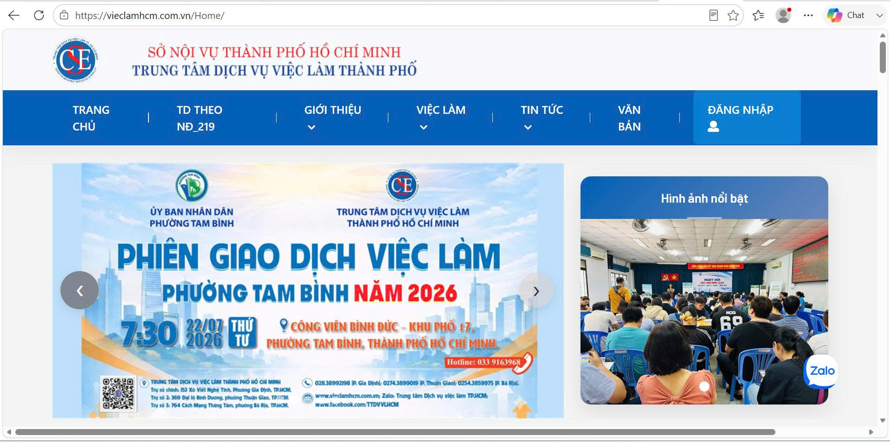
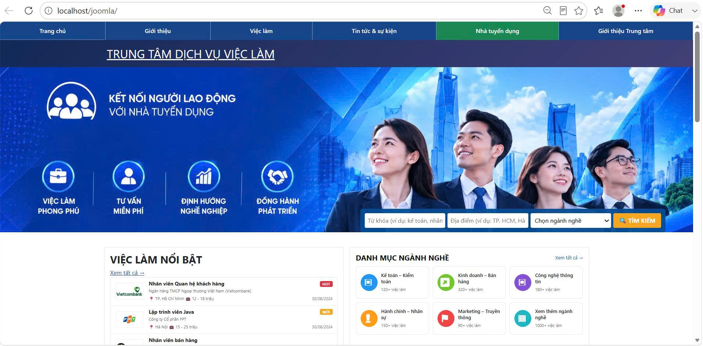
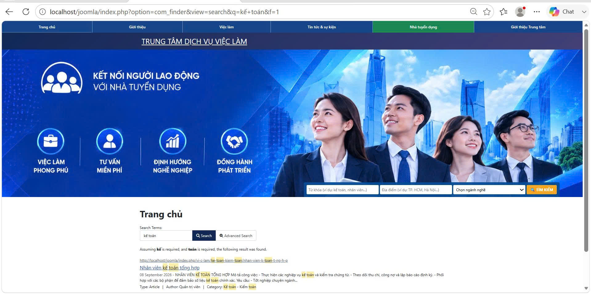
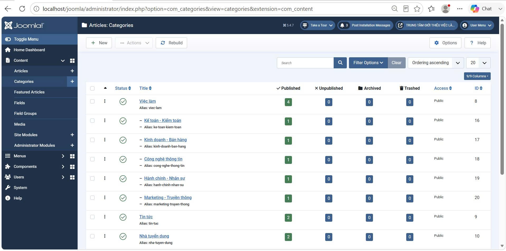
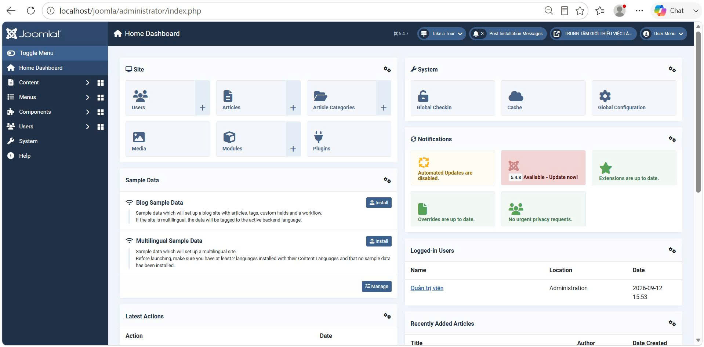
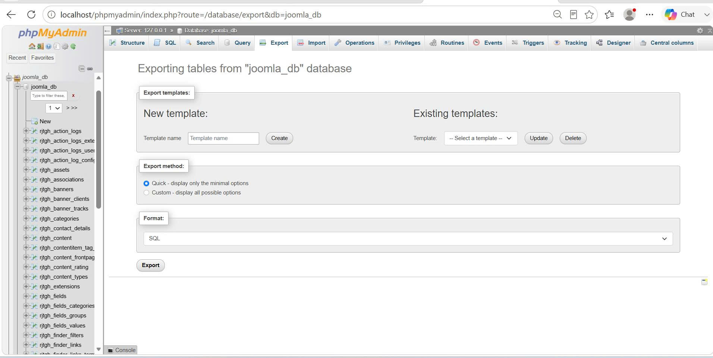
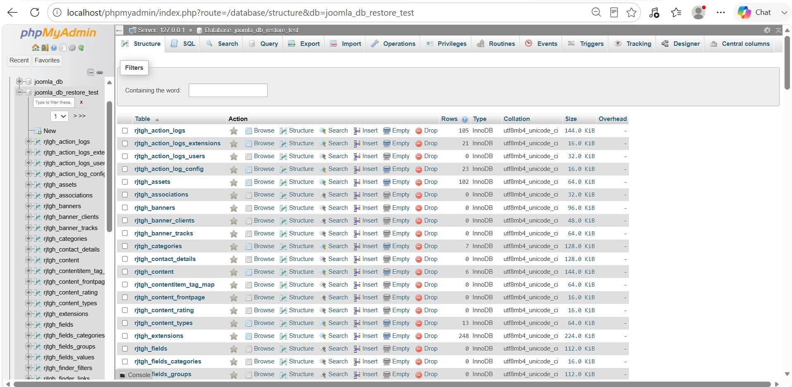
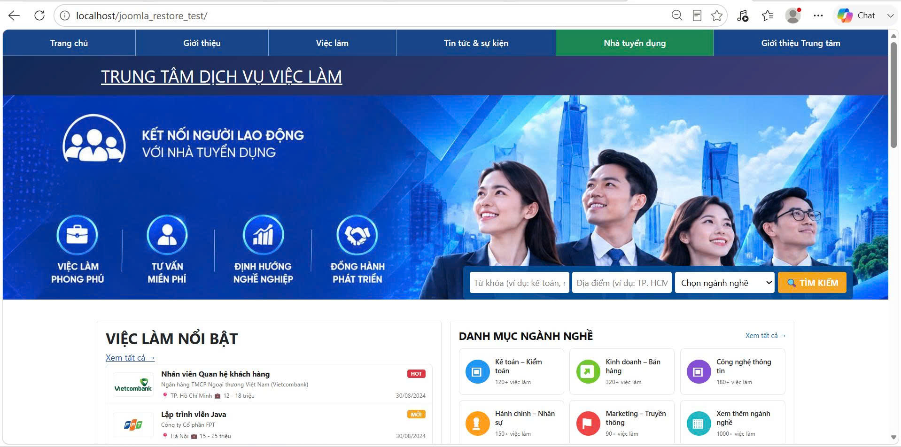

# ĐỒ ÁN THỰC TẬP CƠ SỞ NGÀNH

TÌM HIỂU JOOMLA VÀ THIẾT KẾ WEBSITE
GIỚI THIỆU THÔNG TIN TRUNG TÂM GIỚI THIỆU VIỆC LÀM
# LỜI MỞ ĐẦU

## Lý do chọn đề tài
## Mục đích nghiên cứu
## Đối tượng nghiên cứu
## Phạm vi nghiên cứu
## Phương pháp nghiên cứu
## Bố cục đồ án

# CHƯƠNG 1. TỔNG QUAN

## 1.1. Tổng quan về lĩnh vực việc làm

## 1.2. Khảo sát và tham khảo các Website Trung tâm Giới thiệu việc làm
### 1.2.1. Website tham khảo 1
### 1.2.2. Website tham khảo 2
### 1.2.3. Website tham khảo 3
### 1.2.4. Nhận xét và đánh giá các Website tham khảo

## 1.3. Thực trạng tra cứu và tìm kiếm việc làm

## 1.4. Tổng quan về Trung tâm Giới thiệu việc làm

## 1.5. Phát biểu bài toán

## 1.6. Mục tiêu của hệ thống

## 1.7. Yêu cầu của hệ thống
### 1.7.1. Yêu cầu chức năng
### 1.7.2. Yêu cầu phi chức năng

## 1.8. Định hướng giải quyết

# CHƯƠNG 2. NGHIÊN CỨU LÝ THUYẾT

## 2.1. Cơ sở lý thuyết về hệ thống thông tin
## 2.2. Tổng quan về website
## 2.3. Hệ quản trị nội dung Joomla
## 2.4. Ngôn ngữ HTML, CSS, JavaScript
## 2.5. PHP và cơ sở dữ liệu
## 2.6. XAMPP và môi trường máy chủ cục bộ
## 2.7. Git và GitHub
## 2.8. Ngrok và triển khai truy cập từ Internet
## 2.9. Các công cụ sử dụng trong quá trình thực hiện
## 2.10. Kết luận chương

# CHƯƠNG 3. HIỆN THỰC HÓA NGHIÊN CỨU

## 3.1. Phân tích yêu cầu hệ thống
## 3.2. Phân tích đối tượng sử dụng
## 3.3. Phân tích chức năng
## 3.4. Thiết kế hệ thống

### 3.4.1. Sơ đồ Use Case
### 3.4.2. Sơ đồ hoạt động
### 3.4.3. Sơ đồ kiến trúc hệ thống
### 3.4.4. Thiết kế cơ sở dữ liệu
## 3.5. Thiết kế giao diện
## 3.6. Cài đặt Joomla
## 3.7. Xây dựng và cấu hình website
## 3.8. Xây dựng các chức năng chính
## 3.9. Cấu hình môi trường XAMPP
## 3.10. Đưa website lên GitHub
## 3.11. Cấu hình truy cập website thông qua Ngrok
## 3.12. Kiểm thử hệ thống
# CHƯƠNG 4. KẾT QUẢ NGHIÊN CỨU

## 4.1. Kết quả xây dựng hệ thống
## 4.2. Giao diện trang chủ
## 4.3. Chức năng tìm kiếm việc làm
## 4.4. Chức năng lựa chọn ngành nghề
## 4.5. Chức năng hiển thị thông tin việc làm
## 4.6. Chức năng quản lý nội dung
## 4.7. Các giao diện chức năng khác
## 4.8. Kết quả kiểm thử
## 4.9. Đánh giá hệ thống

### 4.9.1. Ưu điểm
### 4.9.2. Hạn chế
# CHƯƠNG 5. KẾT LUẬN VÀ HƯỚNG PHÁT TRIỂN

## 5.1. Kết luận
## 5.2. Những kết quả đạt được
## 5.3. Những hạn chế
## 5.4. Hướng phát triển

# DANH MỤC TÀI LIỆU THAM KHẢO
# PHỤ LỤC
## Phụ lục A: Một số đoạn mã nguồn
## Phụ lục B: Cấu trúc cơ sở dữ liệu
## Phụ lục C: Hình ảnh quá trình cài đặt
## Phụ lục D: Các giao diện của hệ thống

- Mã nguồn/cấu hình quan trọng
- Một số giao diện quản trị
- Quy trình cài đặt
- Quy trình backup/restore
- Các hình ảnh kiểm thử nếu cần

# MỞ ĐẦU

## 1. Lý do chọn đề tài

Trong bối cảnh nhu cầu tìm kiếm việc làm ngày càng tăng, việc cung cấp thông tin tuyển dụng một cách rõ ràng, đầy đủ và dễ tiếp cận là một yêu cầu quan trọng đối với các Trung tâm Giới thiệu việc làm. Website là một phương tiện phù hợp để cung cấp thông tin về Trung tâm, việc làm, nhà tuyển dụng, tin tức, thông báo và thông tin liên hệ đến người tìm việc.

Nếu thông tin được trình bày không có cấu trúc hoặc việc tìm kiếm nội dung chưa thuận tiện, người sử dụng sẽ gặp khó khăn trong quá trình tiếp cận thông tin. Vì vậy, việc xây dựng một website có cấu trúc nội dung rõ ràng, phân loại thông tin theo từng nhóm ngành nghề và hỗ trợ tìm kiếm là cần thiết.

Joomla là một hệ quản trị nội dung mã nguồn mở, hỗ trợ quản lý bài viết, phân loại nội dung, xây dựng menu và mở rộng chức năng thông qua các thành phần của hệ thống. Đây là nền tảng phù hợp để tìm hiểu cách xây dựng và quản trị một website giới thiệu thông tin.

Từ những lý do trên, đề tài **“TÌM HIỂU CMS JOOMLA VÀ THIẾT KẾ WEBSITE GIỚI THIỆU THÔNG TIN TRUNG TÂM GIỚI THIỆU VIỆC LÀM”** được thực hiện nhằm tìm hiểu Joomla và áp dụng nền tảng này để xây dựng một website giới thiệu thông tin việc làm trên môi trường máy chủ cục bộ.

## 2. Mục đích nghiên cứu

Đề tài được thực hiện với các mục đích chính:

- Tìm hiểu khái niệm và cách thức hoạt động của CMS Joomla.
- Tìm hiểu các thành phần cơ bản của Joomla như Article, Category, Menu, Module, Component, Plugin và Template.
- Khảo sát cách tổ chức nội dung trên một số website liên quan đến việc làm.
- Phân tích và xây dựng cấu trúc website giới thiệu thông tin Trung tâm Giới thiệu việc làm.
- Xây dựng và quản lý các nội dung về việc làm, nhà tuyển dụng, tin tức và thông báo.
- Phân loại việc làm theo các nhóm ngành nghề nhằm giúp người dùng dễ dàng tiếp cận thông tin.
- Xây dựng chức năng tìm kiếm và lọc thông tin việc làm.
- Thực hiện sao lưu và phục hồi cơ sở dữ liệu, mã nguồn website.
- Kiểm thử các chức năng cơ bản sau khi hoàn thiện website.

## 3. Đối tượng nghiên cứu

Đối tượng nghiên cứu của đề tài gồm:

- Hệ quản trị nội dung Joomla.
- Cách tổ chức và quản lý nội dung trong Joomla.
- Mối quan hệ giữa Article, Category và Menu.
- Template, Module, Component và Plugin trong Joomla.
- Chức năng Smart Search và lọc nội dung.
- Website giới thiệu thông tin Trung tâm Giới thiệu việc làm.
- Quy trình sao lưu và phục hồi website, cơ sở dữ liệu.

## 4. Phạm vi nghiên cứu

### 4.1. Phạm vi nội dung

Đề tài tập trung xây dựng website với các nhóm thông tin:

- Trang chủ.
- Giới thiệu.
- Việc làm.
- Tin tức.
- Nhà tuyển dụng.
- Thông báo.
- Liên hệ.

Trong nhóm **Việc làm**, nội dung được phân thành các nhóm ngành nghề:

1. Kế toán - Kiểm toán.
2. Kinh doanh - Bán hàng.
3. Công nghệ thông tin.
4. Hành chính - Nhân sự.
5. Marketing - Truyền thông.

### 4.2. Phạm vi kỹ thuật

Website được cài đặt và thử nghiệm trên môi trường máy chủ cục bộ sử dụng XAMPP, Apache, MariaDB và Joomla.

Đề tài tập trung vào việc xây dựng website giới thiệu và cung cấp thông tin, không phát triển thành một hệ thống tuyển dụng trực tuyến quy mô lớn. Các chức năng như tạo hồ sơ ứng viên, ứng tuyển trực tuyến, quản lý tuyển dụng chuyên sâu hoặc triển khai trên máy chủ Internet thực tế không thuộc phạm vi chính của đề tài.

### 4.3. Phạm vi sao lưu và phục hồi

Đề tài thực hiện:

- Sao lưu mã nguồn website.
- Sao lưu cơ sở dữ liệu.
- Phục hồi cơ sở dữ liệu.
- Phục hồi website từ dữ liệu đã sao lưu.
- Kiểm tra website sau quá trình phục hồi.

## 5. Phương pháp nghiên cứu

Đề tài sử dụng kết hợp các phương pháp:

Nghiên cứu tài liệu: tìm hiểu tài liệu về Joomla, CMS, website, cơ sở dữ liệu, XAMPP, Git, GitHub và các công cụ liên quan.

Khảo sát: tham khảo các website dịch vụ việc làm để tìm hiểu cách tổ chức thông tin, giao diện, menu, việc làm, nhà tuyển dụng và thông báo. Báo cáo cũ đã ghi nhận việc khảo sát các nguồn như Trung tâm Dịch vụ Việc làm Đồng Nai, Trung tâm Dịch vụ việc làm Thành phố Hồ Chí Minh và Sàn giao dịch việc làm Quốc gia.

Phân tích: xác định đối tượng sử dụng, yêu cầu chức năng, yêu cầu phi chức năng và cấu trúc nội dung của website.

Thiết kế: thiết kế cấu trúc website, menu, phân loại ngành nghề, giao diện và cơ sở dữ liệu.

Thực nghiệm: cài đặt Joomla trên XAMPP, tạo cơ sở dữ liệu, xây dựng nội dung, cấu hình giao diện và chức năng tìm kiếm.

Kiểm thử: kiểm tra website từ phía người dùng và khu vực quản trị, kiểm tra các chức năng chính, sao lưu và phục hồi.

Đánh giá: tổng hợp kết quả đạt được, xác định hạn chế và đề xuất hướng phát triển.

## 6.Bố cục đồ án

Đồ án được tổ chức thành năm chương chính:

Chương 1 – Tổng quan: trình bày tổng quan lĩnh vực việc làm, thực trạng tra cứu thông tin, bài toán, mục tiêu và yêu cầu của hệ thống.
Chương 2 – Nghiên cứu lý thuyết: trình bày các cơ sở lý thuyết và công nghệ được sử dụng trong đề tài.
Chương 3 – Hiện thực hóa nghiên cứu: trình bày quá trình phân tích, thiết kế, cài đặt và xây dựng website.
Chương 4 – Kết quả nghiên cứu: trình bày sản phẩm thực tế, giao diện, các chức năng và kết quả kiểm thử.
Chương 5 – Kết luận và hướng phát triển: tổng kết kết quả đạt được, hạn chế và đề xuất hướng phát triển trong tương lai.

# CHƯƠNG 1. TỔNG QUAN

## 1.1. Tổng quan về lĩnh vực việc làm

Việc làm là một trong những vấn đề quan trọng đối với người lao động và doanh nghiệp. Đối với người lao động, việc tìm kiếm một công việc phù hợp với trình độ, kỹ năng, kinh nghiệm và nhu cầu cá nhân có ý nghĩa quan trọng trong quá trình học tập, phát triển nghề nghiệp và ổn định cuộc sống. Đối với doanh nghiệp, tuyển dụng lao động phù hợp là yếu tố cần thiết để duy trì và phát triển hoạt động sản xuất, kinh doanh.

Cùng với sự phát triển của công nghệ thông tin, việc cung cấp và tra cứu thông tin việc làm ngày càng được thực hiện trên môi trường trực tuyến. Website trở thành một kênh cung cấp thông tin thuận tiện, giúp người lao động có thể tìm hiểu các vị trí tuyển dụng, ngành nghề, yêu cầu công việc và thông tin của nhà tuyển dụng.

Bên cạnh đó, các Trung tâm Dịch vụ Việc làm đóng vai trò hỗ trợ kết nối giữa người lao động và người sử dụng lao động. Các trung tâm thường cung cấp nhiều thông tin liên quan đến việc làm, tuyển dụng, tư vấn nghề nghiệp, thị trường lao động và các hoạt động hỗ trợ người lao động.

Do đó, việc xây dựng một website có khả năng tổ chức và cung cấp thông tin việc làm một cách rõ ràng, thuận tiện là cần thiết. Đây cũng là cơ sở để đề tài lựa chọn nghiên cứu Joomla và áp dụng Joomla vào xây dựng website giới thiệu thông tin Trung tâm Dịch vụ Việc làm.

## 1.2. Khảo sát và tham khảo các Website Trung tâm Giới thiệu việc làm

Để có cơ sở xây dựng giao diện và nội dung cho website, đề tài tiến hành khảo sát một số website liên quan đến lĩnh vực dịch vụ việc làm.

Các website được lựa chọn tham khảo gồm:

Trung tâm Dịch vụ việc làm Đồng Nai.
Trung tâm Dịch vụ việc làm Thành phố Hồ Chí Minh.
Sàn giao dịch việc làm Quốc gia.

Việc khảo sát tập trung vào cách tổ chức thông tin, giao diện, menu, cách trình bày việc làm, thông tin nhà tuyển dụng, tin tức, thông báo và chức năng tìm kiếm.

### 1.2.1. Website tham khảo 1
Trung tâm Dịch vụ việc làm Đồng Nai

Website tham khảo:

Trung tâm Dịch vụ việc làm Đồng Nai

Website cung cấp các nhóm thông tin liên quan đến việc làm, thị trường lao động, nhà tuyển dụng và người tìm việc. Trang việc làm cho phép hiển thị các tin tuyển dụng cùng những thông tin liên quan đến vị trí tuyển dụng.

Qua khảo sát, website có cách tổ chức nội dung tương đối rõ ràng, trong đó thông tin việc làm được đặt ở vị trí dễ tiếp cận. Ngoài nội dung tuyển dụng, website còn cung cấp các thông tin về hoạt động của Trung tâm, thông báo và hỗ trợ người lao động.

Đây là một trong những cơ sở tham khảo để xây dựng cấu trúc nội dung và cách tổ chức thông tin cho website của đề tài.

### 1.2.2. Website tham khảo 2
Trung tâm Dịch vụ việc làm Thành phố Hồ Chí Minh

Website tham khảo:

Trung tâm Dịch vụ việc làm Thành phố Hồ Chí Minh

**Hình 9. Giao diện Website tham khảo**

Website cung cấp nhiều nội dung liên quan đến hoạt động của Trung tâm, trong đó có thông tin việc làm, tin tức, thông báo và các nội dung hỗ trợ người lao động. Trang tìm kiếm việc làm cho phép người dùng xem danh sách các vị trí tuyển dụng và thực hiện tra cứu thông tin.

Qua khảo sát, website có sự phân chia các nhóm thông tin tương đối rõ ràng. Các tin tuyển dụng được trình bày với những thông tin cơ bản như vị trí, doanh nghiệp, mức lương và thời gian đăng tuyển.

Website là cơ sở để tham khảo cách trình bày danh sách việc làm và tổ chức các nhóm nội dung trên website của đề tài.

### 1.2.3. Website tham khảo 3
Sàn giao dịch việc làm Quốc gia

Website tham khảo:

Sàn giao dịch việc làm Quốc gia

Sàn giao dịch việc làm Quốc gia hướng đến việc kết nối cung – cầu lao động trên phạm vi rộng, đồng thời cung cấp các dịch vụ và thông tin liên quan đến việc làm. Theo quy định hoạt động được công bố, sàn có sự tham gia của người lao động, doanh nghiệp/người sử dụng lao động, Trung tâm Dịch vụ việc làm và các đơn vị liên quan.

Qua khảo sát, có thể nhận thấy việc tổ chức thông tin việc làm cần chú trọng đến khả năng tìm kiếm, phân loại và cung cấp thông tin rõ ràng cho người lao động và nhà tuyển dụng.

Website này được sử dụng làm nguồn tham khảo về cách tổ chức thông tin và định hướng phát triển chức năng tra cứu việc làm.

### 1.2.4. Nhận xét và đánh giá các Website tham khảo

Qua quá trình khảo sát ba website, đề tài nhận thấy các website trong lĩnh vực việc làm đều tập trung vào việc cung cấp thông tin tuyển dụng, hỗ trợ người tìm việc và cung cấp các thông tin liên quan đến hoạt động của Trung tâm.

Một số đặc điểm được lựa chọn để tham khảo gồm:

Có trang chủ cung cấp các thông tin nổi bật.
Có menu điều hướng đến các nhóm nội dung chính.
Có khu vực hiển thị thông tin việc làm.
Có thông tin liên quan đến nhà tuyển dụng.
Có tin tức và thông báo.
Có thông tin liên hệ.
Có chức năng hỗ trợ tìm kiếm và tra cứu việc làm.
Nội dung được tổ chức thành các nhóm để người dùng dễ tiếp cận.

Từ kết quả khảo sát, đề tài lựa chọn xây dựng website theo hướng đơn giản, dễ sử dụng và tập trung vào tra cứu thông tin việc làm. Website được tổ chức thành các nhóm nội dung gồm Giới thiệu, Việc làm, Tin tức, Nhà tuyển dụng, Thông báo và Liên hệ.

Đối với nội dung việc làm, đề tài xây dựng thêm các nhóm ngành nghề gồm:

Kế toán - Kiểm toán.
Kinh doanh - Bán hàng.
Công nghệ thông tin.
Hành chính - Nhân sự.
Marketing - Truyền thông.

Hình ảnh khảo sát website tham khảo được trình bày tại Hình 1.

Hình 1. Giao diện Website tham khảo

# 1.3. Thực trạng tra cứu và tìm kiếm việc làm

Hiện nay, người lao động có thể tìm kiếm thông tin việc làm thông qua nhiều hình thức như giới thiệu trực tiếp, mạng xã hội, các website tuyển dụng hoặc website của các Trung tâm Dịch vụ Việc làm.

Tuy nhiên, khi số lượng thông tin tuyển dụng tăng lên, việc tìm kiếm thủ công có thể mất nhiều thời gian. Người dùng có thể phải xem qua nhiều tin tuyển dụng trước khi tìm được công việc phù hợp.

Một số vấn đề thường gặp trong quá trình tra cứu gồm:

Thông tin việc làm được phân bố ở nhiều nguồn khác nhau.
Số lượng tin tuyển dụng lớn gây khó khăn khi tìm kiếm.
Người dùng cần xác định đúng ngành nghề quan tâm.
Thông tin giữa các tin tuyển dụng có thể khác nhau về cách trình bày.
Việc tìm kiếm thủ công chưa thuận tiện khi người dùng có nhu cầu tìm một vị trí cụ thể.

Từ thực trạng trên, website cần có chức năng tìm kiếm và phân loại thông tin việc làm. Trong đề tài, chức năng Smart Search của Joomla được sử dụng để hỗ trợ tìm kiếm theo từ khóa. Đồng thời, hệ thống xây dựng các nhóm ngành nghề để hỗ trợ người dùng thu hẹp phạm vi tra cứu.

# 1.4. Tổng quan về Trung tâm Giới thiệu việc làm

Trung tâm Dịch vụ Việc làm là đơn vị thực hiện các hoạt động hỗ trợ việc làm và kết nối người lao động với người sử dụng lao động.

Các hoạt động có thể bao gồm:

Cung cấp thông tin việc làm.
Hỗ trợ người lao động tìm kiếm việc làm.
Hỗ trợ doanh nghiệp tìm kiếm lao động.
Cung cấp thông tin thị trường lao động.
Tư vấn việc làm và nghề nghiệp.
Cung cấp các thông tin, thông báo liên quan đến hoạt động của Trung tâm.

Website của Trung tâm đóng vai trò là kênh cung cấp thông tin trực tuyến. Thông qua website, người dùng có thể tìm hiểu thông tin về Trung tâm, việc làm, nhà tuyển dụng, tin tức, thông báo và các thông tin liên hệ.

Trong phạm vi đề tài, hệ thống được xây dựng theo hướng website giới thiệu và hỗ trợ tra cứu thông tin việc làm, không phát triển thành một sàn giao dịch việc làm trực tuyến hoàn chỉnh.

# 1.5. Phát biểu bài toán

Xuất phát từ nhu cầu cung cấp và tra cứu thông tin việc làm trên môi trường trực tuyến, bài toán đặt ra là xây dựng một website giới thiệu thông tin Trung tâm Dịch vụ Việc làm có khả năng tổ chức và hiển thị các nội dung liên quan đến việc làm một cách rõ ràng.

Hệ thống cần cho phép người dùng truy cập website để:

Tìm hiểu thông tin về Trung tâm.
Xem các tin tuyển dụng.
Tìm kiếm việc làm theo từ khóa.
Lựa chọn nhóm ngành nghề.
Xem thông tin chi tiết việc làm.
Xem thông tin nhà tuyển dụng.
Xem tin tức và thông báo.
Xem thông tin liên hệ.

Đối với quản trị viên, hệ thống cần cung cấp công cụ quản lý nội dung để cập nhật các bài viết, danh mục, menu và các thành phần của website.

Để giải quyết bài toán trên, đề tài lựa chọn Joomla làm hệ quản trị nội dung, kết hợp với Smart Search, cơ sở dữ liệu và môi trường XAMPP để xây dựng và kiểm thử website.

# 1.6. Mục tiêu của hệ thống

Mục tiêu chính của đề tài là nghiên cứu CMS Joomla và áp dụng Joomla để xây dựng website giới thiệu thông tin Trung tâm Dịch vụ Việc làm.

Các mục tiêu cụ thể gồm:

Tìm hiểu cách cài đặt và vận hành Joomla.
Xây dựng cấu trúc website phù hợp với lĩnh vực việc làm.
Xây dựng giao diện website đơn giản và dễ sử dụng.
Xây dựng các nhóm nội dung về việc làm.
Phân loại việc làm theo ngành nghề.
Xây dựng chức năng tìm kiếm việc làm.
Xây dựng chức năng lựa chọn ngành nghề.
Quản lý nội dung thông qua Joomla.
Thực hiện sao lưu và phục hồi website, cơ sở dữ liệu.
Sử dụng Git và GitHub để quản lý mã nguồn và tài liệu.
Thử nghiệm khả năng truy cập website thông qua Ngrok.
## 1.7. Yêu cầu của hệ thống
### 1.7.1. Yêu cầu chức năng

Hệ thống cần đáp ứng các chức năng chính sau:

Đối với người dùng
Xem trang chủ.
Xem thông tin giới thiệu.
Xem danh sách việc làm.
Tìm kiếm việc làm theo từ khóa.
Lựa chọn ngành nghề.
Xem chi tiết việc làm.
Xem thông tin nhà tuyển dụng.
Xem tin tức.
Xem thông báo.
Xem thông tin liên hệ.
Đối với quản trị viên
Đăng nhập khu vực quản trị.
Thêm, sửa và xóa bài viết.
Quản lý danh mục.
Quản lý menu.
Quản lý module.
Quản lý nội dung việc làm.
Quản lý thông tin nhà tuyển dụng.
Quản lý tin tức và thông báo.
Sao lưu cơ sở dữ liệu.
Phục hồi cơ sở dữ liệu.
Sao lưu và phục hồi website.
### 1.7.2. Yêu cầu phi chức năng

Bên cạnh các chức năng chính, hệ thống cần đáp ứng một số yêu cầu phi chức năng:

Tính dễ sử dụng

Giao diện cần có bố cục rõ ràng, menu dễ nhận biết và các chức năng tìm kiếm dễ tiếp cận.

Tính ổn định

Website cần hoạt động ổn định trong môi trường XAMPP và hạn chế lỗi trong quá trình sử dụng.

Tính bảo trì

Việc sử dụng Joomla giúp quản trị viên có thể cập nhật nội dung thông qua giao diện quản trị mà không cần thay đổi toàn bộ hệ thống.

Tính mở rộng

Hệ thống cần có khả năng bổ sung thêm bài viết, danh mục, ngành nghề và các chức năng mới trong tương lai.

Tính quản lý

Dữ liệu cần được tổ chức có hệ thống, đồng thời hỗ trợ sao lưu và phục hồi khi cần thiết.

Tính tương thích

Website cần có khả năng hiển thị và hoạt động trên các trình duyệt Web phổ biến.

## 1.8. Định hướng giải quyết

Để thực hiện các yêu cầu trên, đề tài lựa chọn Joomla làm nền tảng xây dựng website.

Quá trình thực hiện được định hướng theo các bước:

Khảo sát → Phân tích yêu cầu → Thiết kế hệ thống → Cài đặt Joomla → Xây dựng nội dung → Cấu hình chức năng → Kiểm thử → Đánh giá

Cụ thể:

Khảo sát các website trong lĩnh vực việc làm để xác định cách tổ chức nội dung và giao diện.
Phân tích nhu cầu của người dùng và quản trị viên.
Xây dựng cấu trúc website gồm các menu và nhóm nội dung.
Cài đặt Joomla 5.4.7 trên môi trường XAMPP.
Tạo các danh mục và bài viết phục vụ website.
Xây dựng 5 nhóm ngành nghề cho nội dung việc làm.
Cấu hình Smart Search để hỗ trợ tìm kiếm.
Xây dựng thanh tìm kiếm và chức năng lựa chọn ngành nghề.
Kiểm thử các chức năng của website.
Thực hiện sao lưu và phục hồi website, cơ sở dữ liệu.
Sử dụng Git/GitHub để quản lý mã nguồn và tài liệu.
Thử nghiệm truy cập website từ Internet thông qua Ngrok.

Qua định hướng trên, đề tài tập trung xây dựng một website có quy mô phù hợp với phạm vi nghiên cứu, đáp ứng nhu cầu giới thiệu Trung tâm và hỗ trợ người dùng tra cứu thông tin việc làm.

# CHƯƠNG 2. NGHIÊN CỨU LÝ THUYẾT

## 2.1. Cơ sở lý thuyết về hệ thống thông tin

Hệ thống thông tin là một tập hợp các thành phần có mối quan hệ với nhau nhằm thu thập, xử lý, lưu trữ và cung cấp thông tin phục vụ cho một mục đích nhất định. Một hệ thống thông tin thông thường bao gồm dữ liệu, con người, phần mềm, phần cứng và các quy trình xử lý.

Trong phạm vi đề tài, website Trung tâm Dịch vụ Việc làm được xem là một hệ thống thông tin trên nền tảng Web. Hệ thống có nhiệm vụ tổ chức và cung cấp các thông tin liên quan đến việc làm, ngành nghề, nhà tuyển dụng, tin tức, thông báo và thông tin liên hệ của trung tâm.

Quy trình xử lý thông tin của hệ thống có thể được mô tả khái quát như sau:

Dữ liệu → Lưu trữ → Xử lý → Hiển thị thông tin → Người dùng tra cứu

Trong đó, dữ liệu được quản lý thông qua cơ sở dữ liệu của Joomla. Người quản trị cập nhật nội dung thông qua giao diện quản trị, sau đó thông tin được hiển thị trên website để người dùng có thể truy cập và tra cứu.

## 2.2. Tổng quan về website

Website là một hệ thống các trang thông tin được liên kết với nhau và được cung cấp thông qua mạng Internet hoặc mạng nội bộ. Người dùng có thể truy cập website bằng trình duyệt Web thông qua một địa chỉ xác định.

Một website thường bao gồm các thành phần cơ bản:

Giao diện: phần người dùng trực tiếp quan sát và tương tác.
Nội dung: các thông tin được cung cấp trên website.
Chức năng: các thao tác như tìm kiếm, xem thông tin, đăng nhập hoặc quản lý nội dung.
Máy chủ Web: môi trường thực hiện và cung cấp website.
Cơ sở dữ liệu: nơi lưu trữ dữ liệu của hệ thống.

Đối với đề tài này, website được xây dựng nhằm giới thiệu Trung tâm Dịch vụ Việc làm và hỗ trợ người dùng tra cứu thông tin việc làm. Website có các nhóm nội dung chính như giới thiệu, việc làm, tin tức, nhà tuyển dụng, thông báo và liên hệ.

Website được xây dựng theo mô hình quản trị nội dung, giúp người quản trị có thể cập nhật thông tin mà không cần trực tiếp chỉnh sửa toàn bộ mã nguồn.

## 2.3. Hệ quản trị nội dung Joomla

Joomla là một hệ quản trị nội dung mã nguồn mở (Content Management System – CMS), được sử dụng để xây dựng và quản lý các website. Joomla cung cấp giao diện quản trị giúp người dùng có thể tạo, chỉnh sửa và tổ chức nội dung trên website.

Một số thành phần quan trọng của Joomla gồm:

Articles: dùng để tạo và quản lý các bài viết.
Categories: dùng để phân loại và tổ chức bài viết.
Menus: tạo hệ thống điều hướng cho website.
Modules: hiển thị các thành phần nội dung tại các vị trí khác nhau trên giao diện.
Templates: quy định bố cục và giao diện của website.
Components: cung cấp các chức năng chính của hệ thống.

Trong đề tài, Joomla được sử dụng làm nền tảng chính để xây dựng website Trung tâm Dịch vụ Việc làm. Nội dung việc làm được tổ chức theo các nhóm ngành nghề như:

Kế toán - Kiểm toán.
Kinh doanh - Bán hàng.
Công nghệ thông tin.
Hành chính - Nhân sự.
Marketing - Truyền thông.

Việc sử dụng Joomla giúp quá trình xây dựng website thuận tiện hơn, đồng thời hỗ trợ quản lý nội dung thông qua giao diện quản trị.

### 2.3.1. Articles và Categories

Trong Joomla, Article là đơn vị nội dung cơ bản được sử dụng để lưu trữ và hiển thị thông tin. Các bài viết có thể được phân loại thông qua Category.

Trong website của đề tài, mỗi tin tuyển dụng được xây dựng dưới dạng một bài viết. Các bài viết được phân loại theo nhóm ngành nghề nhằm giúp người dùng dễ dàng tìm kiếm và tra cứu.

### 2.3.2. Menus và Modules

Menu được sử dụng để xây dựng hệ thống điều hướng của website. Website của đề tài gồm các mục chính như:

Trang chủ.
Giới thiệu.
Việc làm.
Tin tức.
Nhà tuyển dụng.
Thông báo.
Liên hệ.

Module được sử dụng để hiển thị các thành phần bổ sung trên website, chẳng hạn như thanh tìm kiếm, thông tin liên hệ, đăng nhập hoặc danh mục ngành nghề.

### 2.3.3. Smart Search

Joomla cung cấp chức năng Smart Search nhằm hỗ trợ tìm kiếm nội dung trên website. Smart Search cho phép lập chỉ mục nội dung và hỗ trợ tìm kiếm theo từ khóa.

Trong đề tài, Smart Search được sử dụng để xây dựng chức năng tìm kiếm việc làm. Người dùng có thể nhập từ khóa như “kế toán”, “nhân viên” hoặc lựa chọn nhóm ngành nghề để thu hẹp kết quả tìm kiếm.

## 2.4. Ngôn ngữ HTML, CSS, JavaScript
### 2.4.1. HTML

HTML (HyperText Markup Language) là ngôn ngữ đánh dấu được sử dụng để xây dựng cấu trúc của trang Web.

HTML giúp xác định các thành phần trên trang như:

Tiêu đề.
Đoạn văn bản.
Hình ảnh.
Liên kết.
Biểu mẫu.
Nút chức năng.
Danh sách.

Trong đề tài, HTML được sử dụng thông qua hệ thống Joomla để xây dựng và tùy chỉnh các thành phần giao diện của website.

### 2.4.2. CSS

CSS (Cascading Style Sheets) được sử dụng để định dạng và trình bày giao diện của website. CSS cho phép thay đổi màu sắc, kích thước chữ, khoảng cách, bố cục và cách hiển thị các thành phần.

Trong website của đề tài, CSS được sử dụng để điều chỉnh giao diện theo hướng đơn giản, dễ sử dụng và phù hợp với website giới thiệu việc làm.

### 2.4.3. JavaScript

JavaScript là ngôn ngữ lập trình được sử dụng để tạo các tương tác và xử lý phía trình duyệt.

JavaScript có thể được sử dụng để xử lý các thao tác như kiểm tra dữ liệu biểu mẫu, thay đổi nội dung hiển thị và tạo các tương tác trên giao diện.

Trong phạm vi đề tài, JavaScript chủ yếu đóng vai trò hỗ trợ các thành phần giao diện và chức năng Web do Joomla cung cấp.

## 2.5. PHP và cơ sở dữ liệu
### 2.5.1. PHP

PHP (Hypertext Preprocessor) là ngôn ngữ lập trình phía máy chủ, thường được sử dụng để phát triển các ứng dụng Web.

Joomla được xây dựng trên nền tảng PHP. Khi người dùng truy cập website, máy chủ thực hiện mã PHP, xử lý yêu cầu và tạo nội dung HTML để gửi về trình duyệt.

Trong đề tài, PHP được cung cấp và xử lý thông qua Joomla nên người thực hiện không cần xây dựng toàn bộ hệ thống từ đầu bằng PHP.

### 2.5.2. Cơ sở dữ liệu

Cơ sở dữ liệu được sử dụng để lưu trữ thông tin của hệ thống. Đối với website Joomla, cơ sở dữ liệu lưu trữ các thông tin như bài viết, danh mục, menu, cấu hình, tài khoản và các dữ liệu liên quan.

Trong quá trình thực hiện đề tài, cơ sở dữ liệu joomla_db được sử dụng để lưu trữ dữ liệu của website. Hệ thống sử dụng MariaDB và được quản lý thông qua phpMyAdmin.

Việc sử dụng cơ sở dữ liệu giúp dữ liệu được lưu trữ có tổ chức, đồng thời hỗ trợ sao lưu và phục hồi khi cần thiết.

## 2.6. XAMPP và môi trường máy chủ cục bộ

XAMPP là một môi trường phát triển Web cục bộ, tích hợp các thành phần cần thiết để chạy ứng dụng Web trên máy tính cá nhân.

Trong quá trình thực hiện đề tài, XAMPP được sử dụng để cung cấp môi trường chạy Joomla. Các thành phần chính gồm:

Apache: máy chủ Web.
MariaDB: hệ quản trị cơ sở dữ liệu.
PHP: môi trường thực thi mã PHP.
phpMyAdmin: công cụ quản lý cơ sở dữ liệu thông qua trình duyệt.

Website được cài đặt tại máy tính cá nhân và truy cập thông qua địa chỉ:

http://localhost/joomla/

Khu vực quản trị Joomla được truy cập thông qua:

http://localhost/joomla/administrator/

Môi trường sử dụng trong quá trình thực hiện gồm Joomla 5.4.7, PHP 8.1.25, Apache và MariaDB.

## 2.7. Git và GitHub
### 2.7.1. Git

Git là hệ thống quản lý phiên bản phân tán, cho phép theo dõi các thay đổi của mã nguồn và tài liệu trong quá trình phát triển.

Trong đề tài, Git được sử dụng để:

Theo dõi thay đổi của dự án.
Tạo các phiên bản của mã nguồn.
Ghi lại quá trình thực hiện.
Quản lý các lần cập nhật.
Hỗ trợ khôi phục phiên bản khi cần thiết.
### 2.7.2. GitHub

GitHub là nền tảng lưu trữ và quản lý các dự án sử dụng Git. GitHub được sử dụng trong đề tài để lưu trữ mã nguồn website, báo cáo và các tài liệu liên quan.

Việc sử dụng GitHub giúp quá trình quản lý dự án được thuận tiện hơn và có thể theo dõi lịch sử cập nhật của dự án.

Ngoài mã nguồn Joomla, dự án còn quản lý các tài liệu như báo cáo và báo cáo tiến độ theo từng tuần.

## 2.8. Ngrok và triển khai truy cập từ Internet

Ngrok là công cụ hỗ trợ tạo đường hầm kết nối từ Internet đến một dịch vụ đang chạy trên máy tính cục bộ.

Trong quá trình thực hiện đề tài, website được chạy trên XAMPP với địa chỉ localhost. Khi cần kiểm tra khả năng truy cập từ bên ngoài mạng cục bộ, Ngrok có thể được sử dụng để chuyển tiếp yêu cầu từ một địa chỉ truy cập bên ngoài đến máy chủ Web đang chạy trên máy tính.

Mô hình triển khai có thể khái quát:

Người dùng → Ngrok → Máy tính cá nhân → Apache/XAMPP → Joomla → Cơ sở dữ liệu

Việc sử dụng Ngrok giúp phục vụ mục đích kiểm tra khả năng truy cập website từ Internet trong quá trình nghiên cứu và thử nghiệm.

## 2.9. Các công cụ sử dụng trong quá trình thực hiện

Trong quá trình xây dựng website, một số công cụ được sử dụng gồm:

Công cụ	Mục đích sử dụng
Joomla 5.4.7	Xây dựng và quản lý website
XAMPP	Tạo môi trường máy chủ Web cục bộ
Apache	Cung cấp dịch vụ Web
MariaDB	Lưu trữ dữ liệu
phpMyAdmin	Quản lý cơ sở dữ liệu
HTML/CSS/JavaScript	Tùy chỉnh và xây dựng giao diện
Git	Quản lý phiên bản
GitHub	Lưu trữ và quản lý dự án
Ngrok	Kiểm tra truy cập website từ Internet
Trình duyệt Web	Kiểm tra và sử dụng website

Các công cụ trên được kết hợp trong quá trình nghiên cứu, cài đặt, xây dựng, kiểm thử và quản lý website.

## 2.10. Kết luận chương

Chương 2 đã trình bày các cơ sở lý thuyết và công nghệ được sử dụng trong đề tài. Nội dung tập trung vào hệ thống thông tin, website, hệ quản trị nội dung Joomla, HTML, CSS, JavaScript, PHP, cơ sở dữ liệu, XAMPP, Git, GitHub và Ngrok.

Trên cơ sở các kiến thức lý thuyết đã nghiên cứu, chương tiếp theo sẽ tiến hành phân tích yêu cầu, xác định đối tượng sử dụng, phân tích chức năng và thiết kế hệ thống website Trung tâm Dịch vụ Việc làm.

# CHƯƠNG 3. HIỆN THỰC HÓA NGHIÊN CỨU
## 3.1. Phân tích yêu cầu hệ thống

Dựa trên mục tiêu của đề tài, hệ thống được xây dựng nhằm giới thiệu thông tin về Trung tâm Dịch vụ Việc làm và hỗ trợ người dùng tra cứu các thông tin việc làm trên website.

Hệ thống cần đáp ứng các yêu cầu chính:

Hiển thị thông tin giới thiệu về Trung tâm.
Hiển thị danh sách việc làm.
Phân loại việc làm theo ngành nghề.
Cho phép người dùng tìm kiếm việc làm theo từ khóa.
Hỗ trợ lựa chọn ngành nghề để lọc kết quả.
Hiển thị thông tin nhà tuyển dụng.
Hiển thị tin tức và thông báo.
Cung cấp thông tin liên hệ.
Cho phép quản trị viên quản lý nội dung website.
Hỗ trợ sao lưu và phục hồi dữ liệu phục vụ quá trình quản lý hệ thống.

Website được xây dựng trên Joomla nhằm tận dụng các chức năng quản lý nội dung có sẵn, đồng thời kết hợp tùy chỉnh giao diện và chức năng tìm kiếm phù hợp với phạm vi đề tài.

## 3.2. Phân tích đối tượng sử dụng

Hệ thống gồm hai nhóm đối tượng sử dụng chính:

### 3.2.1. Người dùng

Người dùng là những người truy cập website để tìm hiểu thông tin và tra cứu việc làm.

Các chức năng chính của người dùng:

Xem trang chủ.
Xem thông tin giới thiệu Trung tâm.
Xem danh sách việc làm.
Xem chi tiết thông tin việc làm.
Tìm kiếm việc làm.
Lựa chọn ngành nghề.
Xem thông tin nhà tuyển dụng.
Xem tin tức và thông báo.
Xem thông tin liên hệ.
### 3.2.2. Quản trị viên

Quản trị viên là người chịu trách nhiệm quản lý và cập nhật nội dung website thông qua giao diện quản trị Joomla.

Các chức năng chính:

Quản lý bài viết.
Quản lý danh mục.
Quản lý menu.
Quản lý module.
Cập nhật thông tin việc làm.
Cập nhật thông tin nhà tuyển dụng.
Quản lý tin tức và thông báo.
Quản lý cấu hình website.
Sao lưu và phục hồi dữ liệu khi cần thiết.
## 3.3. Phân tích chức năng

Các chức năng của hệ thống được phân thành hai nhóm chính: chức năng dành cho người dùng và chức năng dành cho quản trị viên.

### 3.3.1. Chức năng phía người dùng

Trang chủ: Hiển thị thông tin tổng quan, banner và các nội dung nổi bật của website.

Giới thiệu: Cung cấp thông tin về Trung tâm Dịch vụ Việc làm.

Việc làm: Hiển thị các tin tuyển dụng được đăng trên website.

Tìm kiếm việc làm: Cho phép nhập từ khóa để tìm kiếm các bài viết việc làm.

Lựa chọn ngành nghề: Cho phép người dùng lựa chọn nhóm ngành nghề để giới hạn kết quả tìm kiếm.

Website hiện tổ chức việc làm thành 5 nhóm ngành:

Kế toán - Kiểm toán.
Kinh doanh - Bán hàng.
Công nghệ thông tin.
Hành chính - Nhân sự.
Marketing - Truyền thông.

Tin tức: Hiển thị các tin tức liên quan.

Nhà tuyển dụng: Hiển thị thông tin của các nhà tuyển dụng.

Thông báo: Cung cấp các thông báo của Trung tâm.

Liên hệ: Hiển thị thông tin liên hệ của Trung tâm.

### 3.3.2. Chức năng phía quản trị

Quản trị viên đăng nhập vào khu vực quản trị Joomla để thực hiện các thao tác quản lý.

Các chức năng gồm:

Quản lý bài viết.
Quản lý danh mục.
Quản lý menu.
Quản lý module.
Quản lý nội dung việc làm.
Quản lý thông tin nhà tuyển dụng.
Quản lý tin tức và thông báo.
Quản lý người dùng.
Quản lý cấu hình website.
Sao lưu và phục hồi website, cơ sở dữ liệu.
## 3.4. Thiết kế hệ thống
### 3.4.1. Sơ đồ Use Case

Sơ đồ Use Case mô tả mối quan hệ giữa các đối tượng sử dụng và các chức năng của hệ thống.

Hai tác nhân chính của hệ thống là Người dùng và Quản trị viên.

Người dùng

Người dùng có thể:

Truy cập trang chủ.
Xem giới thiệu.
Xem việc làm.
Tìm kiếm việc làm.
Lọc việc làm theo ngành nghề.
Xem thông tin nhà tuyển dụng.
Xem tin tức.
Xem thông báo.
Xem thông tin liên hệ.
Quản trị viên

Quản trị viên có thể:

Đăng nhập hệ thống quản trị.
Quản lý bài viết.
Quản lý danh mục.
Quản lý menu.
Quản lý module.
Quản lý người dùng.
Quản lý cấu hình.
Sao lưu và phục hồi hệ thống.

Lưu ý: Sơ đồ Use Case có thể được xây dựng thành hình minh họa trong báo cáo sau khi hoàn thiện phần sơ đồ.

### 3.4.2. Sơ đồ hoạt động

Quy trình tìm kiếm việc làm của hệ thống được mô tả như sau:

Bước 1: Người dùng truy cập website.

Bước 2: Người dùng nhập từ khóa cần tìm kiếm.

Bước 3: Người dùng có thể lựa chọn ngành nghề.

Bước 4: Hệ thống tiếp nhận yêu cầu tìm kiếm.

Bước 5: Smart Search thực hiện tìm kiếm trong nội dung đã được lập chỉ mục.

Bước 6: Hệ thống trả về danh sách kết quả phù hợp.

Bước 7: Người dùng lựa chọn bài viết để xem thông tin chi tiết.

Quy trình tổng quát:

Truy cập website → Nhập từ khóa → Chọn ngành nghề → Tìm kiếm → Hiển thị kết quả → Xem chi tiết việc làm

### 3.4.3. Sơ đồ kiến trúc hệ thống

Hệ thống được xây dựng theo mô hình Web, gồm các thành phần chính:

Người dùng

↓

Trình duyệt Web

↓

Apache – XAMPP

↓

Joomla 5.4.7

↓

MariaDB – Cơ sở dữ liệu joomla_db

Người dùng gửi yêu cầu thông qua trình duyệt. Apache tiếp nhận yêu cầu và chuyển đến Joomla xử lý. Joomla truy xuất dữ liệu cần thiết từ cơ sở dữ liệu MariaDB, sau đó tạo nội dung và trả kết quả về trình duyệt.

Trong trường hợp kiểm tra truy cập từ Internet thông qua Ngrok, mô hình có thể mở rộng:

Người dùng Internet → Ngrok → Apache/XAMPP → Joomla → MariaDB

### 3.4.4. Thiết kế cơ sở dữ liệu

Website sử dụng cơ sở dữ liệu joomla_db để lưu trữ dữ liệu của Joomla.

Cơ sở dữ liệu chứa nhiều bảng phục vụ cho các thành phần khác nhau của hệ thống như bài viết, danh mục, menu, người dùng, cấu hình và chức năng tìm kiếm.

Các bài viết việc làm được tổ chức theo hệ thống danh mục. Trong phạm vi đề tài, nhóm danh mục việc làm gồm:

Kế toán - Kiểm toán.
Kinh doanh - Bán hàng.
Công nghệ thông tin.
Hành chính - Nhân sự.
Marketing - Truyền thông.

Joomla sử dụng tiền tố bảng rjth_ trong cơ sở dữ liệu của website.

Việc sử dụng cơ sở dữ liệu giúp dữ liệu được tổ chức tập trung và hỗ trợ các thao tác sao lưu, phục hồi trong quá trình quản lý website.

## 3.5. Thiết kế giao diện

Giao diện website được thiết kế theo hướng đơn giản, dễ sử dụng và tập trung vào việc cung cấp thông tin việc làm.

Bố cục chính của website gồm:

Banner: hiển thị hình ảnh giới thiệu Trung tâm.
Menu chính: cung cấp các liên kết đến các khu vực của website.
Thanh tìm kiếm: hỗ trợ người dùng tìm kiếm việc làm.
Khu vực nội dung: hiển thị bài viết và thông tin chính.
Thanh bên: hiển thị các module hỗ trợ như việc làm nổi bật, danh mục ngành nghề và đăng nhập.
Thông tin liên hệ: cung cấp thông tin liên hệ của Trung tâm.

Menu chính của website gồm:

Trang chủ | Giới thiệu | Việc làm | Tin tức | Nhà tuyển dụng | Thông báo | Liên hệ

Giao diện được xây dựng dựa trên template Cassiopeia của Joomla và có tùy chỉnh để phù hợp với nội dung của đề tài.

## 3.6. Cài đặt Joomla

Joomla được cài đặt trong môi trường máy chủ cục bộ XAMPP.

Các bước thực hiện gồm:

Bước 1: Chuẩn bị XAMPP

Khởi động các dịch vụ cần thiết:

Apache.
MySQL/MariaDB.
Bước 2: Tạo cơ sở dữ liệu

Tạo cơ sở dữ liệu:

joomla_db

Thông qua phpMyAdmin.

Bước 3: Cài đặt Joomla

Mã nguồn Joomla được đặt trong thư mục:

C:\xampp\htdocs\joomla

Sau đó thực hiện quá trình cài đặt Joomla thông qua trình duyệt.

Bước 4: Cấu hình cơ sở dữ liệu

Các thông tin kết nối được cấu hình để Joomla sử dụng cơ sở dữ liệu joomla_db.

Bước 5: Truy cập website

Sau khi cài đặt hoàn tất, website được truy cập tại:

http://localhost/joomla/

Khu vực quản trị:

http://localhost/joomla/administrator/

Phiên bản Joomla được sử dụng trong hệ thống là Joomla 5.4.7.

## 3.7. Xây dựng và cấu hình website

Sau khi cài đặt Joomla, tiến hành xây dựng nội dung và cấu trúc website.

Các công việc thực hiện gồm:

### 3.7.1. Xây dựng danh mục

Tạo các nhóm nội dung phục vụ website như:

Việc làm.
Tin tức.
Nhà tuyển dụng.
Giới thiệu.
Thông báo.
Liên hệ.

Trong nhóm Việc làm, tạo 5 danh mục ngành nghề:

Kế toán - Kiểm toán.
Kinh doanh - Bán hàng.
Công nghệ thông tin.
Hành chính - Nhân sự.
Marketing - Truyền thông.
### 3.7.2. Xây dựng bài viết

Các bài viết được tạo để cung cấp nội dung cho website, bao gồm:

Thông tin giới thiệu Trung tâm.
Tin tuyển dụng.
Thông tin nhà tuyển dụng.
Tin tức.
Thông báo.
Thông tin liên hệ.
### 3.7.3. Xây dựng menu

Menu chính được cấu hình để người dùng có thể truy cập nhanh đến các nội dung chính của website.

### 3.7.4. Cấu hình module

Các module được sử dụng để bố trí các thành phần trên giao diện như:

Banner.
Thanh tìm kiếm.
Menu chính.
Giới thiệu Trung tâm.
Việc làm nổi bật.
Danh mục ngành nghề.
Thông tin liên hệ.
Đăng nhập.
## 3.8. Xây dựng các chức năng chính
### 3.8.1. Chức năng tìm kiếm việc làm

Chức năng tìm kiếm được xây dựng bằng Smart Search của Joomla.

Người dùng nhập từ khóa vào thanh tìm kiếm, ví dụ:

Nhân viên.
Kế toán.
Kinh doanh.
Marketing.

Hệ thống sẽ tìm kiếm trong nội dung đã được lập chỉ mục và hiển thị các kết quả phù hợp.

### 3.8.2. Chức năng lựa chọn ngành nghề

Bên cạnh từ khóa, người dùng có thể lựa chọn nhóm ngành nghề.

Năm nhóm ngành được sử dụng gồm:

STT	Ngành nghề
1	Kế toán - Kiểm toán
2	Kinh doanh - Bán hàng
3	Công nghệ thông tin
4	Hành chính - Nhân sự
5	Marketing - Truyền thông

Chức năng này giúp giảm số lượng kết quả và hỗ trợ người dùng nhanh chóng tìm được nhóm việc làm phù hợp.

### 3.8.3. Chức năng hiển thị việc làm

Các tin tuyển dụng được tạo dưới dạng bài viết Joomla và phân loại theo danh mục ngành nghề.

Khi người dùng chọn một tin tuyển dụng, hệ thống hiển thị nội dung chi tiết của bài viết.

### 3.8.4. Chức năng quản lý nội dung

Quản trị viên sử dụng khu vực quản trị Joomla để thêm, chỉnh sửa, xóa và phân loại nội dung.

Việc quản lý tập trung giúp nội dung website có thể được cập nhật mà không cần xây dựng lại toàn bộ website.

## 3.9. Cấu hình môi trường XAMPP

Môi trường triển khai cục bộ sử dụng XAMPP với các thành phần:

Apache 2.4.58.
MariaDB 10.4.32.
PHP 8.1.25.
phpMyAdmin.

Website được đặt trong thư mục:

C:\xampp\htdocs\joomla

Apache chịu trách nhiệm cung cấp website thông qua địa chỉ localhost, trong khi MariaDB đảm nhiệm việc lưu trữ dữ liệu.

phpMyAdmin được sử dụng để kiểm tra, quản lý, sao lưu và phục hồi cơ sở dữ liệu.

## 3.10. Đưa website lên GitHub

Git được sử dụng để quản lý mã nguồn và tài liệu trong quá trình thực hiện.

Quy trình cập nhật dự án gồm:

Thay đổi dữ liệu → Git add → Git commit → Git push → GitHub

Mã nguồn và tài liệu của đề tài được quản lý trên repository GitHub của dự án.

Ngoài mã nguồn website, repository còn chứa:

Báo cáo.
Báo cáo tiến độ theo tuần.
Tài liệu hướng dẫn.
Các thành phần phục vụ quá trình thực hiện dự án.

Việc sử dụng GitHub giúp theo dõi lịch sử thay đổi và quản lý các phiên bản của dự án.

## 3.11. Cấu hình truy cập website thông qua Ngrok

Ngrok được sử dụng để thử nghiệm khả năng truy cập website đang chạy trên máy tính cục bộ từ bên ngoài.

Website ban đầu chỉ có thể truy cập thông qua:

http://localhost/joomla/

Khi sử dụng Ngrok, yêu cầu từ Internet được chuyển tiếp về máy tính đang chạy Apache.

Mô hình:

Internet → Ngrok → Apache → Joomla

Việc sử dụng Ngrok chủ yếu phục vụ mục đích kiểm tra và trình diễn website trong quá trình phát triển. Do địa chỉ Ngrok có thể thay đổi theo mỗi phiên chạy, báo cáo không cố định một địa chỉ công khai nếu chưa có URL triển khai chính thức.

## 3.12. Kiểm thử hệ thống

Sau khi hoàn thành các chức năng chính, website được tiến hành kiểm thử trên môi trường XAMPP.

Các nội dung kiểm thử gồm:

STT	Nội dung kiểm thử	Kết quả mong đợi
1	Truy cập trang chủ	Hiển thị đúng giao diện
2	Mở trang Giới thiệu	Hiển thị thông tin Trung tâm
3	Mở trang Việc làm	Hiển thị danh sách việc làm
4	Tìm kiếm bằng từ khóa	Hiển thị kết quả phù hợp
5	Lọc Kế toán - Kiểm toán	Hiển thị việc làm thuộc nhóm ngành
6	Lọc Kinh doanh - Bán hàng	Hiển thị việc làm thuộc nhóm ngành
7	Lọc Công nghệ thông tin	Hiển thị việc làm thuộc nhóm ngành
8	Lọc Hành chính - Nhân sự	Hiển thị việc làm thuộc nhóm ngành
9	Lọc Marketing - Truyền thông	Hiển thị việc làm thuộc nhóm ngành
10	Xem chi tiết việc làm	Hiển thị đầy đủ nội dung
11	Mở Tin tức	Hiển thị danh sách tin tức
12	Mở Nhà tuyển dụng	Hiển thị thông tin nhà tuyển dụng
13	Mở Thông báo	Hiển thị thông báo
14	Mở Liên hệ	Hiển thị thông tin liên hệ
15	Kiểm tra khu vực quản trị	Quản trị viên đăng nhập và quản lý được nội dung
16	Kiểm tra sao lưu CSDL	Tạo được file sao lưu
17	Kiểm tra phục hồi CSDL	Dữ liệu được phục hồi
18	Kiểm tra phục hồi website	Website hoạt động sau phục hồi

Kết quả kiểm thử cho thấy các chức năng chính của website hoạt động phù hợp với phạm vi đề tài. Chức năng tìm kiếm bằng Smart Search và lựa chọn 5 nhóm ngành nghề đã được kiểm tra trên website.

Qua quá trình hiện thực hóa, hệ thống đã hình thành được một website giới thiệu Trung tâm Dịch vụ Việc làm với cấu trúc nội dung, giao diện và các chức năng cơ bản đáp ứng mục tiêu nghiên cứu.
# CHƯƠNG 4. KẾT QUẢ NGHIÊN CỨU
## 4.1. Kết quả xây dựng hệ thống

Sau quá trình nghiên cứu và hiện thực hóa, đề tài đã xây dựng được website Trung tâm Dịch vụ Việc làm trên nền tảng Joomla 5.4.7 trong môi trường XAMPP.

Website đáp ứng các nội dung và chức năng chính của đề tài, bao gồm:

Xây dựng giao diện website giới thiệu Trung tâm.
Xây dựng hệ thống menu điều hướng.
Xây dựng các nhóm nội dung về việc làm, tin tức, nhà tuyển dụng và thông báo.
Phân loại việc làm theo 5 nhóm ngành nghề.
Xây dựng chức năng tìm kiếm việc làm bằng Smart Search.
Xây dựng chức năng lựa chọn ngành nghề để lọc kết quả.
Quản lý nội dung thông qua giao diện quản trị Joomla.
Thực hiện sao lưu và phục hồi cơ sở dữ liệu.
Thực hiện sao lưu và phục hồi website.
Quản lý mã nguồn và tài liệu bằng Git/GitHub.
Kiểm tra khả năng truy cập website thông qua Ngrok.

Website được triển khai thử nghiệm trên máy chủ cục bộ với địa chỉ:

http://localhost/joomla/

## 4.2. Giao diện trang chủ

Trang chủ là giao diện đầu tiên người dùng nhìn thấy khi truy cập website.

Giao diện trang chủ được thiết kế gồm các thành phần chính:

Banner giới thiệu Trung tâm.
Menu chính.
Thanh tìm kiếm việc làm.
Khu vực giới thiệu Trung tâm.
Danh sách việc làm nổi bật.
Danh mục ngành nghề.
Thông tin liên hệ.
Khu vực đăng nhập.

Menu chính của website gồm:

Trang chủ | Giới thiệu | Việc làm | Tin tức | Nhà tuyển dụng | Thông báo | Liên hệ

Giao diện được xây dựng dựa trên template Cassiopeia của Joomla và được tùy chỉnh để phù hợp với nội dung của website.

**Hình 4.1. Giao diện trang chủ website**

## 4.3. Chức năng tìm kiếm việc làm

Chức năng tìm kiếm là một trong những chức năng quan trọng của website.

Người dùng có thể nhập từ khóa vào thanh tìm kiếm để tìm các thông tin việc làm được đăng trên website. Một số từ khóa có thể sử dụng như:

“nhân viên”
“kế toán”
“kinh doanh”
“marketing”

Hệ thống sử dụng Smart Search của Joomla để lập chỉ mục và tìm kiếm nội dung.

Khi người dùng nhập từ khóa, hệ thống thực hiện tìm kiếm trong nội dung đã được lập chỉ mục và hiển thị các kết quả phù hợp.

Ví dụ, khi tìm kiếm từ khóa “nhân viên”, hệ thống trả về các bài viết có nội dung phù hợp với từ khóa.

**Hình 4.2. Chức năng tìm kiếm và lọc ngành nghề**

Kết quả kiểm tra cho thấy chức năng tìm kiếm hoạt động đúng với nội dung đã xây dựng.

## 4.4. Chức năng lựa chọn ngành nghề

Website cung cấp chức năng lựa chọn ngành nghề nhằm giúp người dùng thu hẹp phạm vi tìm kiếm việc làm.

Hệ thống hiện có 5 nhóm ngành nghề:

STT	Nhóm ngành nghề
1	Kế toán - Kiểm toán
2	Kinh doanh - Bán hàng
3	Công nghệ thông tin
4	Hành chính - Nhân sự
5	Marketing - Truyền thông

Người dùng có thể lựa chọn một ngành nghề và thực hiện tìm kiếm. Hệ thống sẽ hiển thị các kết quả thuộc nhóm ngành đã lựa chọn.

Ví dụ, khi chọn Kế toán - Kiểm toán và tìm kiếm từ khóa “kế toán”, hệ thống trả về bài viết “Nhân viên kế toán tổng hợp” thuộc đúng danh mục.

Chức năng này giúp người dùng tìm kiếm thông tin việc làm nhanh hơn và hạn chế số lượng kết quả không liên quan.

**Hình 4.3. Danh mục các nhóm ngành nghề**

## 4.5. Chức năng hiển thị thông tin việc làm

Thông tin việc làm được xây dựng dưới dạng các bài viết trong Joomla.

Mỗi bài viết được phân loại vào một nhóm ngành nghề tương ứng. Người dùng có thể xem danh sách việc làm và lựa chọn một bài viết để xem thông tin chi tiết.

Nội dung bài viết việc làm có thể bao gồm:

Tên vị trí tuyển dụng.
Ngành nghề.
Mô tả công việc.
Yêu cầu đối với ứng viên.
Thông tin liên quan đến vị trí tuyển dụng.
Thông tin nhà tuyển dụng.

Việc tổ chức thông tin dưới dạng bài viết giúp quản trị viên dễ dàng cập nhật nội dung tuyển dụng.

Hình 4.4. Danh sách bài viết việc làm

Chèn ảnh hinh-04-danh-sach-bai-viet-viec-lam.png tại đây.

## 4.6. Chức năng quản lý nội dung

Joomla cung cấp khu vực quản trị giúp người quản trị thực hiện các thao tác quản lý website.

Thông qua giao diện quản trị, người quản trị có thể:

Tạo bài viết mới.
Chỉnh sửa bài viết.
Xóa bài viết.
Phân loại bài viết.
Quản lý danh mục.
Quản lý menu.
Quản lý module.
Cấu hình website.

Trong đề tài, các bài viết về việc làm được quản lý thông qua hệ thống Articles và Categories của Joomla.

Các nhóm ngành nghề được xây dựng thành các danh mục con của nhóm Việc làm, giúp nội dung được tổ chức rõ ràng và thuận tiện cho chức năng tìm kiếm.

**Hình 4.5. Giao diện quản trị Joomla**

Có thể sử dụng ảnh hinh-03-danh-muc-nganh-nghe.png nếu cần minh họa thêm.

## 4.7. Các giao diện chức năng khác

Ngoài trang chủ và chức năng tìm kiếm việc làm, website còn xây dựng các giao diện phục vụ những nội dung khác.

### 4.7.1. Giao diện Giới thiệu

Trang Giới thiệu cung cấp các thông tin cơ bản về Trung tâm Dịch vụ Việc làm.

### 4.7.2. Giao diện Tin tức

Trang Tin tức hiển thị các bài viết và thông tin liên quan được cập nhật trên website.

### 4.7.3. Giao diện Nhà tuyển dụng

Trang Nhà tuyển dụng cung cấp thông tin liên quan đến các đơn vị tuyển dụng được giới thiệu trên website.

### 4.7.4. Giao diện Thông báo

Trang Thông báo dùng để cung cấp các thông tin và thông báo cần thiết đến người truy cập.

### 4.7.5. Giao diện Liên hệ

Trang Liên hệ cung cấp thông tin để người dùng có thể liên hệ với Trung tâm.

Các giao diện trên được tổ chức thông qua hệ thống menu của Joomla, giúp người dùng dễ dàng chuyển đổi giữa các nội dung.

## 4.8. Kết quả kiểm thử

Sau khi hoàn thành hệ thống, các chức năng chính được kiểm tra trên môi trường XAMPP.

STT	Chức năng	Kết quả
1	Truy cập trang chủ	Đạt
2	Xem Giới thiệu	Đạt
3	Xem danh sách việc làm	Đạt
4	Tìm kiếm bằng từ khóa	Đạt
5	Lọc Kế toán - Kiểm toán	Đạt
6	Lọc Kinh doanh - Bán hàng	Đạt
7	Lọc Công nghệ thông tin	Đạt
8	Lọc Hành chính - Nhân sự	Đạt
9	Lọc Marketing - Truyền thông	Đạt
10	Xem chi tiết việc làm	Đạt
11	Xem Tin tức	Đạt
12	Xem Nhà tuyển dụng	Đạt
13	Xem Thông báo	Đạt
14	Xem Liên hệ	Đạt
15	Quản lý nội dung Joomla	Đạt
16	Sao lưu cơ sở dữ liệu	Đạt
17	Phục hồi cơ sở dữ liệu	Đạt
18	Phục hồi website	Đạt
19	Quản lý mã nguồn bằng Git/GitHub	Đạt
20	Kiểm tra truy cập thông qua Ngrok	Đạt

Kết quả kiểm thử cho thấy các chức năng chính của hệ thống hoạt động phù hợp với yêu cầu đặt ra.

Đặc biệt, chức năng tìm kiếm và lọc theo 5 nhóm ngành nghề đã được kiểm tra thực tế và cho kết quả phù hợp với nội dung đã xây dựng.

**Hình 4.6. Sao lưu cơ sở dữ liệu**

**Hình 4.7. Phục hồi cơ sở dữ liệu**

**Hình 4.8. Phục hồi website**

## 4.9. Đánh giá hệ thống
### 4.9.1. Ưu điểm

Sau quá trình xây dựng và kiểm thử, hệ thống đạt được một số ưu điểm:

Giao diện website tương đối đơn giản, dễ sử dụng.
Nội dung được tổ chức thành các nhóm rõ ràng.
Có hệ thống menu giúp người dùng dễ dàng điều hướng.
Có chức năng tìm kiếm việc làm.
Có chức năng lựa chọn và lọc theo ngành nghề.
Việc làm được phân loại thành 5 nhóm ngành nghề.
Nội dung được quản lý tập trung thông qua Joomla.
Có khả năng sao lưu và phục hồi website, cơ sở dữ liệu.
Sử dụng Git và GitHub giúp quản lý mã nguồn và quá trình phát triển.
Website có thể chạy trên môi trường XAMPP mà không cần máy chủ Web thực tế.
### 4.9.2. Hạn chế

Bên cạnh những kết quả đạt được, hệ thống vẫn còn một số hạn chế:

Website chủ yếu phục vụ mục đích giới thiệu và tra cứu thông tin, chưa phải một sàn giao dịch việc làm hoàn chỉnh.
Chưa xây dựng chức năng đăng ký ứng tuyển trực tuyến hoàn chỉnh.
Chưa có hệ thống tài khoản riêng cho nhà tuyển dụng và người tìm việc.
Chưa hỗ trợ nhà tuyển dụng tự đăng tin tuyển dụng trực tiếp.
Chức năng tìm kiếm mới tập trung vào nội dung được quản lý trong Joomla.
Dữ liệu việc làm trong hệ thống còn giới hạn do phạm vi của đề tài.
Website hiện được triển khai chủ yếu trong môi trường máy chủ cục bộ.
Ngrok chỉ phục vụ mục đích thử nghiệm truy cập từ Internet, chưa phải hình thức triển khai website chính thức.

Nhìn chung, các hạn chế trên phù hợp với phạm vi của đề tài. Hệ thống tập trung vào việc nghiên cứu Joomla và xây dựng website giới thiệu, tra cứu thông tin việc làm ở mức cơ bản.
# CHƯƠNG 5. KẾT LUẬN VÀ HƯỚNG PHÁT TRIỂN
## 5.1. Kết luận

Đề tài “TÌM HIỂU CMS JOOMLA VÀ THIẾT KẾ WEBSITE GIỚI THIỆU THÔNG TIN TRUNG TÂM GIỚI THIỆU VIỆC LÀM” đã tập trung nghiên cứu hệ quản trị nội dung Joomla và áp dụng Joomla để xây dựng website giới thiệu thông tin Trung tâm Dịch vụ Việc làm.

Trong quá trình thực hiện, đề tài đã tìm hiểu các kiến thức liên quan đến hệ thống thông tin, website, CMS Joomla, HTML, CSS, JavaScript, PHP, cơ sở dữ liệu, XAMPP, Git, GitHub và Ngrok. Trên cơ sở đó, website được cài đặt và triển khai thử nghiệm trong môi trường máy chủ cục bộ.

Website đã xây dựng được các nội dung chính gồm giới thiệu Trung tâm, việc làm, tin tức, nhà tuyển dụng, thông báo và liên hệ. Bên cạnh đó, chức năng tìm kiếm việc làm bằng Smart Search và lựa chọn ngành nghề cũng được xây dựng và kiểm thử.

Kết quả thực hiện cho thấy Joomla phù hợp với việc xây dựng các website có nội dung được cập nhật và quản lý thường xuyên. Việc sử dụng CMS giúp giảm thời gian phát triển và thuận tiện cho quá trình quản trị nội dung.

## 5.2. Những kết quả đạt được

Sau quá trình nghiên cứu và thực hiện, đề tài đạt được các kết quả chính sau:

Về nghiên cứu lý thuyết
Tìm hiểu được khái niệm và vai trò của hệ thống thông tin.
Tìm hiểu tổng quan về website và mô hình hoạt động của website.
Nghiên cứu hệ quản trị nội dung Joomla.
Tìm hiểu vai trò của HTML, CSS và JavaScript trong xây dựng giao diện Web.
Tìm hiểu PHP và cơ sở dữ liệu trong hệ thống Joomla.
Tìm hiểu môi trường máy chủ cục bộ XAMPP.
Tìm hiểu Git và GitHub trong quản lý mã nguồn.
Tìm hiểu Ngrok và khả năng truy cập website từ Internet.
Về xây dựng hệ thống

Website đã được xây dựng trên Joomla 5.4.7 với các thành phần chính:

Trang chủ.
Trang Giới thiệu.
Trang Việc làm.
Trang Tin tức.
Trang Nhà tuyển dụng.
Trang Thông báo.
Trang Liên hệ.

Các bài viết việc làm được phân loại thành 5 nhóm ngành nghề:

Kế toán - Kiểm toán.
Kinh doanh - Bán hàng.
Công nghệ thông tin.
Hành chính - Nhân sự.
Marketing - Truyền thông.
Về chức năng

Hệ thống đã thực hiện được:

Hiển thị thông tin việc làm.
Tìm kiếm việc làm theo từ khóa.
Lựa chọn ngành nghề.
Lọc kết quả tìm kiếm theo nhóm ngành.
Xem thông tin chi tiết việc làm.
Quản lý nội dung thông qua Joomla.
Quản lý danh mục và bài viết.
Sao lưu cơ sở dữ liệu.
Phục hồi cơ sở dữ liệu.
Sao lưu và phục hồi website.
Quản lý mã nguồn và tài liệu bằng Git/GitHub.
Về kiểm thử

Các chức năng chính của website đã được kiểm tra trên môi trường XAMPP. Kết quả kiểm thử cho thấy các chức năng cơ bản hoạt động phù hợp với yêu cầu của đề tài.

Đặc biệt, chức năng tìm kiếm và lọc theo 5 nhóm ngành nghề đã được kiểm tra thực tế và cho kết quả phù hợp với nội dung được xây dựng.

## 5.3. Những hạn chế

Bên cạnh những kết quả đạt được, đề tài vẫn còn một số hạn chế:

Hệ thống mới tập trung vào giới thiệu và tra cứu thông tin việc làm, chưa phát triển thành một hệ thống tuyển dụng trực tuyến hoàn chỉnh.
Chưa xây dựng chức năng ứng tuyển trực tuyến đầy đủ.
Chưa có hệ thống tài khoản riêng dành cho người tìm việc và nhà tuyển dụng.
Nhà tuyển dụng chưa thể tự đăng và quản lý tin tuyển dụng trên hệ thống.
Chức năng tìm kiếm còn phụ thuộc vào nội dung được quản lý và lập chỉ mục trong Joomla.
Số lượng dữ liệu việc làm trong hệ thống còn hạn chế.
Website hiện chủ yếu được triển khai và kiểm thử trong môi trường XAMPP trên máy tính cá nhân.
Ngrok mới được sử dụng phục vụ mục đích thử nghiệm truy cập từ Internet, chưa thay thế cho môi trường máy chủ triển khai chính thức.
Giao diện vẫn có thể tiếp tục cải thiện về tính trực quan và khả năng tương thích trên nhiều thiết bị.

Những hạn chế trên chủ yếu xuất phát từ thời gian thực hiện và phạm vi nghiên cứu của đề tài.

## 5.4. Hướng phát triển

Trong thời gian tới, hệ thống có thể được tiếp tục phát triển theo các hướng sau:

### 5.4.1. Phát triển chức năng người dùng

Xây dựng hệ thống tài khoản dành cho người tìm việc, cho phép:

Đăng ký và đăng nhập.
Cập nhật thông tin cá nhân.
Tạo hồ sơ tìm việc.
Quản lý thông tin cá nhân.
Lưu các việc làm quan tâm.
Gửi yêu cầu ứng tuyển trực tuyến.
### 5.4.2. Phát triển chức năng dành cho nhà tuyển dụng

Có thể xây dựng khu vực dành riêng cho nhà tuyển dụng để:

Đăng ký tài khoản.
Cập nhật thông tin doanh nghiệp.
Đăng tin tuyển dụng.
Chỉnh sửa và quản lý tin tuyển dụng.
Theo dõi danh sách ứng viên.
Quản lý các tin tuyển dụng đã đăng.
### 5.4.3. Cải thiện chức năng tìm kiếm

Có thể mở rộng chức năng tìm kiếm với nhiều tiêu chí hơn như:

Địa điểm làm việc.
Mức lương.
Hình thức làm việc.
Kinh nghiệm.
Trình độ.
Thời gian đăng tin.

Việc bổ sung nhiều tiêu chí sẽ giúp người tìm việc nhanh chóng xác định được những công việc phù hợp với nhu cầu.

### 5.4.4. Cải thiện giao diện

Tiếp tục hoàn thiện giao diện theo hướng:

Tương thích tốt với máy tính, máy tính bảng và điện thoại.
Bố cục trực quan hơn.
Cải thiện cách hiển thị tin tuyển dụng.
Bổ sung các thành phần hỗ trợ người dùng.
Tối ưu tốc độ tải trang.
5.4.5. Triển khai trên máy chủ thực tế

Sau khi hoàn thiện hệ thống, website có thể được triển khai lên máy chủ Web thực tế thay cho môi trường localhost. Khi đó, website có thể sử dụng tên miền riêng và cho phép người dùng truy cập ổn định thông qua Internet.

### 5.4.6. Mở rộng và quản lý dữ liệu

Có thể bổ sung số lượng việc làm, nhà tuyển dụng và tin tức để hệ thống có dữ liệu phong phú hơn. Đồng thời, có thể xây dựng cơ chế sao lưu tự động và tăng cường bảo mật dữ liệu.

## Kết luận chương

Chương 5 đã tổng kết quá trình thực hiện đề tài, những kết quả đạt được và các hạn chế còn tồn tại. Website đã đáp ứng được mục tiêu chính là nghiên cứu Joomla và xây dựng một website giới thiệu, cung cấp và hỗ trợ tra cứu thông tin việc làm.

Trong tương lai, hệ thống có thể tiếp tục phát triển theo hướng trở thành một nền tảng tuyển dụng trực tuyến với tài khoản người tìm việc, tài khoản nhà tuyển dụng, đăng tuyển, ứng tuyển và tìm kiếm việc làm nâng cao.