*(Mẫu trang bìa – in trên bìa cứng, chữ nhũ vàng)*

**ĐẠI HỌC TRÀ VINH**

**TRƯỜNG KỸ THUẬT VÀ CÔNG NGHỆ**

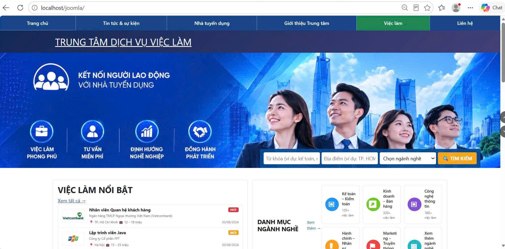

**ĐỒ ÁN THỰC TẬP CƠ SỞ NGÀNH**

**TÌM HIỂU CMS JOOMLA VÀ THIẾT KẾ WEBSITE**

**GIỚI THIỆU THÔNG TIN TRUNG TÂM GIỚI THIỆU VIỆC LÀM**

> Giảng viên hướng dẫn: **ThS. NGUYỄN HOÀNG DUY THIỆN**
>
> Sinh viên thực hiện: **LÊ THỊ NHƯ**
>
> Mã số sinh viên: **170124876**
>
> Lớp: **DX24TT8**
>
> Khóa: **DX24**
>
> Học phần: **Thực tập đồ án cơ sở ngành (220265)**

**Vĩnh Long, tháng 9 năm 2026**

*(Mẫu trang lót – in giấy thường)*

**ĐẠI HỌC TRÀ VINH**

**KHOA KỸ THUẬT VÀ CÔNG NGHỆ**

**ĐỒ ÁN THỰC TẬP CƠ SỞ NGÀNH**

**TÌM HIỂU CMS JOOMLA VÀ THIẾT KẾ WEBSITE**

**GIỚI THIỆU THÔNG TIN TRUNG TÂM GIỚI THIỆU VIỆC LÀM**

> Giảng viên hướng dẫn: **ThS. NGUYỄN HOÀNG DUY THIỆN**
>
> Sinh viên thực hiện: **LÊ THỊ NHƯ**
>
> Mã số sinh viên: **170124876**
>
> Lớp: **DX24TT8**
>
> Khóa: **DX24**
>
> Học phần: **Thực tập đồ án cơ sở ngành (220265)**

**Vĩnh Long, tháng 9 năm 2026**

**LỜI MỞ ĐẦU**

Internet đã làm thay đổi cách người lao động tiếp cận thông tin tuyển
dụng. Thay vì phụ thuộc vào thông báo giấy hoặc nhiều nguồn rời rạc, một
website tập trung cho phép người dùng tra cứu cơ hội việc làm, đọc thông
tin doanh nghiệp và theo dõi tin tức của Trung tâm ở cùng một địa chỉ.
Từ nhu cầu đó, đề tài lựa chọn xây dựng website giới thiệu thông tin
Trung tâm Giới thiệu việc làm, trong đó trọng tâm là tổ chức nội dung
khoa học và hỗ trợ tra cứu thuận tiện.

Đề tài sử dụng Joomla làm nền tảng quản trị nội dung. Joomla cung cấp
sẵn Article, Category, Menu, Module, Template, người dùng và Smart
Search, nhờ đó sinh viên không phải xây dựng lại toàn bộ trang quản trị
từ đầu. Thời gian thực hiện được tập trung vào phân tích cấu trúc
website, nhập dữ liệu minh họa, cấu hình menu/module, tùy chỉnh
Cassiopeia bằng user.css, xây dựng luồng tìm kiếm và kiểm thử.

Website chạy trên máy cá nhân bằng XAMPP với Apache, PHP và MariaDB. Nội
dung gồm Giới thiệu, Việc làm, năm nhóm ngành, Tin tức & sự kiện, Nhà
tuyển dụng, Thông báo và Liên hệ. Thanh tìm kiếm có từ khóa, địa điểm,
lựa chọn ngành và nút TÌM KIẾM; trong phiên bản hiện tại, từ khóa và
ngành là phần xử lý chính, còn ô địa điểm mới thiên về giao diện và được
xác định là hướng hoàn thiện.

Phạm vi đồ án được giới hạn rõ: đây là website thông tin, chưa phải sàn
tuyển dụng hoàn chỉnh. Hệ thống chưa có ứng tuyển trực tuyến, chưa quản
lý CV, chưa có tài khoản nhà tuyển dụng tự đăng tin và chưa triển khai
lên hosting chính thức. Giới hạn này giúp báo cáo phản ánh đúng sản phẩm
thực tế, tránh mô tả những chức năng chưa được xây dựng.

Phương pháp thực hiện gồm nghiên cứu tài liệu, khảo sát một số cổng việc
làm, phân tích yêu cầu, thực nghiệm cài đặt, cấu hình Joomla, kiểm thử
và đánh giá. Báo cáo được tổ chức thành năm chương: tổng quan; cơ sở lý
thuyết; phân tích, thiết kế và hiện thực; kết quả và đánh giá; kết luận
và hướng phát triển. Ngoài ra có phụ lục về CSS, cơ sở dữ liệu, cài đặt,
kiểm thử và tiến độ.

Mục tiêu cuối cùng không chỉ là tạo một giao diện có thể mở bằng
localhost mà là hoàn thiện một quy trình tương đối đầy đủ: xác định phạm
vi, tổ chức dữ liệu, cấu hình CMS, tùy chỉnh giao diện, lập chỉ mục tìm
kiếm, sao lưu/phục hồi và quản lý mã nguồn bằng Git/GitHub. Đây là nền
tảng để sản phẩm tiếp tục được mở rộng sau học phần.

**LỜI CẢM ƠN**

Em xin chân thành cảm ơn Ban Giám hiệu Đại học Trà Vinh, Trường Kỹ thuật
và Công nghệ cùng quý thầy cô đã tạo điều kiện học tập và cung cấp nền
tảng kiến thức để em thực hiện học phần Thực tập đồ án cơ sở ngành.

Em xin gửi lời cảm ơn sâu sắc đến ThS. Nguyễn Hoàng Duy Thiện, giảng
viên hướng dẫn, đã định hướng nội dung, góp ý phạm vi và hỗ trợ em trong
quá trình hoàn thiện sản phẩm cũng như báo cáo. Những góp ý giúp em nhận
thức rõ sự cần thiết của việc liên kết giữa yêu cầu, thiết kế, hiện thực
và kiểm thử.

Do thời gian và kinh nghiệm còn hạn chế, báo cáo khó tránh khỏi thiếu
sót. Em kính mong nhận được ý kiến góp ý của quý thầy cô để tiếp tục
hoàn thiện kỹ năng phân tích, triển khai và trình bày tài liệu kỹ thuật.
Em xin trân trọng cảm ơn.

*Vĩnh Long, tháng 9 năm 2026*

**Sinh viên thực hiện  
Lê Thị Như**

**NHẬN XÉT**

*(Của cơ quan thực tập, nếu có)*

............................................................................................................................................................

............................................................................................................................................................

............................................................................................................................................................

............................................................................................................................................................

............................................................................................................................................................

............................................................................................................................................................

............................................................................................................................................................

............................................................................................................................................................

............................................................................................................................................................

............................................................................................................................................................

............................................................................................................................................................

............................................................................................................................................................

............................................................................................................................................................

............................................................................................................................................................

Đại diện cơ quan thực tập  
(ký và ghi rõ họ tên)

**NHẬN XÉT**

*(Của giảng viên hướng dẫn trong đồ án của sinh viên)*

............................................................................................................................................................

............................................................................................................................................................

............................................................................................................................................................

............................................................................................................................................................

............................................................................................................................................................

............................................................................................................................................................

............................................................................................................................................................

............................................................................................................................................................

............................................................................................................................................................

............................................................................................................................................................

............................................................................................................................................................

............................................................................................................................................................

............................................................................................................................................................

............................................................................................................................................................

Giảng viên hướng dẫn  
(ký và ghi rõ họ tên)

**BẢN NHẬN XÉT ĐỒ ÁN THỰC TẬP CƠ SỞ NGÀNH**

*(Của giảng viên hướng dẫn)*

Họ và tên sinh viên: LÊ THỊ NHƯ MSSV: 170124876

Ngành: .............................................................
Khóa: DX24

Tên đồ án: Tìm hiểu CMS Joomla và thiết kế Website giới thiệu thông tin
Trung tâm Giới thiệu việc làm

Họ và tên Giáo viên hướng dẫn: ThS. Nguyễn Hoàng Duy Thiện

Chức danh: ........................................................ Học
vị: Thạc sĩ

**NHẬN XÉT**

**1. Nội dung đồ án**

............................................................................................................................................................

............................................................................................................................................................

............................................................................................................................................................

............................................................................................................................................................

............................................................................................................................................................

............................................................................................................................................................

............................................................................................................................................................

**2. Ưu điểm**

............................................................................................................................................................

............................................................................................................................................................

............................................................................................................................................................

............................................................................................................................................................

**3. Khuyết điểm**

............................................................................................................................................................

............................................................................................................................................................

............................................................................................................................................................

............................................................................................................................................................

**4. Điểm mới đồ án**

............................................................................................................................................................

............................................................................................................................................................

............................................................................................................................................................

............................................................................................................................................................

............................................................................................................................................................

**5. Giá trị thực trên đồ án**

............................................................................................................................................................

............................................................................................................................................................

............................................................................................................................................................

............................................................................................................................................................

............................................................................................................................................................

**7. Đề nghị sửa chữa bổ sung**

............................................................................................................................................................

............................................................................................................................................................

............................................................................................................................................................

............................................................................................................................................................

............................................................................................................................................................

**8. Đánh giá**

............................................................................................................................................................

............................................................................................................................................................

............................................................................................................................................................

............................................................................................................................................................

Vĩnh Long, ngày ...... tháng ...... năm 2026  
Giảng viên hướng dẫn  
(Ký và ghi rõ họ tên)

**NHẬN XÉT**

*(Của giảng viên chấm trong đồ án của sinh viên)*

............................................................................................................................................................

............................................................................................................................................................

............................................................................................................................................................

............................................................................................................................................................

............................................................................................................................................................

............................................................................................................................................................

............................................................................................................................................................

............................................................................................................................................................

............................................................................................................................................................

............................................................................................................................................................

............................................................................................................................................................

............................................................................................................................................................

............................................................................................................................................................

............................................................................................................................................................

............................................................................................................................................................

Giảng viên chấm  
(ký và ghi rõ họ tên)

**BẢN NHẬN XÉT ĐỒ ÁN THỰC TẬP CƠ SỞ NGÀNH**

*(Của cán bộ chấm đồ án)*

Họ và tên người nhận xét:
......................................................................................................................

Chức danh:
.............................................................. Học vị:
...................................................

Chuyên ngành:
........................................................................................................................................

Cơ quan công tác:
...................................................................................................................................

Tên sinh viên: LÊ THỊ NHƯ

Tên đề tài: Tìm hiểu CMS Joomla và thiết kế Website giới thiệu thông tin
Trung tâm Giới thiệu việc làm

**I. Ý KIẾN NHẬN XÉT**

**1. Nội dung**

............................................................................................................................................................

............................................................................................................................................................

............................................................................................................................................................

............................................................................................................................................................

............................................................................................................................................................

............................................................................................................................................................

............................................................................................................................................................

**2. Điểm mới các kết quả của đồ án**

............................................................................................................................................................

............................................................................................................................................................

............................................................................................................................................................

............................................................................................................................................................

**3. Ứng dụng thực tế**

............................................................................................................................................................

............................................................................................................................................................

............................................................................................................................................................

............................................................................................................................................................

**II. CÁC VẤN ĐỀ CẦN LÀM RÕ**

*(Các câu hỏi của giáo viên phản biện)*

............................................................................................................................................................

............................................................................................................................................................

............................................................................................................................................................

............................................................................................................................................................

............................................................................................................................................................

............................................................................................................................................................

............................................................................................................................................................

............................................................................................................................................................

............................................................................................................................................................

............................................................................................................................................................

............................................................................................................................................................

............................................................................................................................................................

**III. KẾT LUẬN**

*(Ghi rõ đồng ý hay không đồng ý cho bảo vệ đồ án)*

............................................................................................................................................................

............................................................................................................................................................

............................................................................................................................................................

............................................................................................................................................................

............................................................................................................................................................

Vĩnh Long, ngày ...... tháng ...... năm 2026  
Người nhận xét  
(Ký và ghi rõ họ tên)

**MỤC LỤC**

**CHƯƠNG 1. TỔNG QUAN ĐỀ TÀI 1**

> 1.1. Bối cảnh và lý do chọn đề tài 1
>
> 1.2. Khảo sát các website tham khảo 2
>
> 1.3. Thực trạng và vấn đề cần giải quyết 3
>
> 1.4. Vai trò của Trung tâm Giới thiệu việc làm 4
>
> 1.5. Phát biểu bài toán 5
>
> 1.6. Mục tiêu đề tài 5
>
> 1.7. Yêu cầu chức năng và phi chức năng 6
>
> 1.8. Định hướng thực hiện 8
>
> 1.9. Kết luận chương 9

**CHƯƠNG 2. CƠ SỞ LÝ THUYẾT VÀ CÔNG NGHỆ 10**

> 2.1. Hệ thống thông tin 10
>
> 2.2. Website và kiến trúc Web 10
>
> 2.3. Joomla CMS 11
>
> 2.4. HTML, CSS và JavaScript 12
>
> 2.5. PHP và MariaDB 13
>
> 2.6. XAMPP 14
>
> 2.7. Git và GitHub 15
>
> 2.8. Bộ công cụ sử dụng 16
>
> 2.9. Sao lưu và an toàn dữ liệu 17
>
> 2.10. Kết luận chương 18

**CHƯƠNG 3. PHÂN TÍCH, THIẾT KẾ VÀ HIỆN THỰC HỆ THỐNG 19**

> 3.1. Phân tích yêu cầu 19
>
> 3.2. Tác nhân và phạm vi hệ thống 20
>
> 3.3. Mô hình use case tổng quát 21
>
> 3.4. Đặc tả các use case chính 23
>
> 3.5. Quy trình tìm kiếm việc làm 24
>
> 3.6. Kiến trúc hệ thống 26
>
> 3.7. Thiết kế dữ liệu Joomla 27
>
> 3.8. Thiết kế cấu trúc nội dung 29
>
> 3.9. Thiết kế giao diện 30
>
> 3.10. Cài đặt môi trường 32
>
> 3.11. Cấu hình Joomla 33
>
> 3.12. Tùy chỉnh Cassiopeia 34
>
> 3.13. Cấu hình Smart Search 35
>
> 3.14. Quy trình quản trị nội dung 36
>
> 3.15. Sao lưu và phục hồi 37
>
> 3.16. Quản lý phiên bản bằng Git/GitHub 37
>
> 3.17. Thiết kế kiểm thử 38
>
> 3.18. Kết luận chương 40

**CHƯƠNG 4. KẾT QUẢ THỰC HIỆN VÀ ĐÁNH GIÁ 42**

> 4.1. Môi trường chạy thử 42
>
> 4.2. Kết quả trang chủ 43
>
> 4.3. Kết quả điều hướng và giới thiệu 44
>
> 4.4. Kết quả nhóm việc làm 45
>
> 4.5. Kết quả danh mục ngành nghề 46
>
> 4.6. Kết quả tìm kiếm và lọc 47
>
> 4.7. Kết quả nhà tuyển dụng 48
>
> 4.8. Tin tức, thông báo và liên hệ 49
>
> 4.9. Kết quả khu vực quản trị 50
>
> 4.10. Kết quả kiểm thử 50
>
> 4.11. Khả năng sử dụng 52
>
> 4.12. Mức độ đạt mục tiêu 52
>
> 4.13. Ưu điểm và hạn chế 54
>
> 4.14. Kết luận chương 55

**CHƯƠNG 5. KẾT LUẬN VÀ HƯỚNG PHÁT TRIỂN 56**

> 5.1. Kết quả đạt được 56
>
> 5.2. Giá trị của đồ án 57
>
> 5.3. Hạn chế 57
>
> 5.4. Hướng phát triển 58
>
> 5.5. Kinh nghiệm rút ra 60

**DANH MỤC TÀI LIỆU THAM KHẢO 61**

**PHỤ LỤC 62**

**DANH MỤC CÁC BẢNG, SƠ ĐỒ, HÌNH**

Hình 1.1. Luồng tổng quát người dùng tiếp cận thông tin việc làm 2

Bảng 1.1. Tổng hợp website tham khảo 3

Hình 1.2. Cấu trúc nội dung tổng quát của website 3

Bảng 1.2. Chức năng phía khách truy cập 7

Bảng 1.3. Chức năng phía quản trị viên 7

Hình 1.3. Quy trình kiểm thử lặp trong quá trình thực hiện 8

Hình 2.1. Mối quan hệ giữa trình duyệt, Joomla, giao diện và dữ liệu 12

Hình 2.2. Cơ chế lập chỉ mục và truy vấn Smart Search 12

Hình 2.3. Các thành phần môi trường XAMPP trong đồ án 15

Hình 2.4. Quy trình quản lý phiên bản bằng Git/GitHub 16

Bảng 2.1. Công nghệ và công cụ sử dụng 17

Bảng 3.1. Phân nhóm yêu cầu của hệ thống 20

Hình 3.1. Sơ đồ use case tổng quát của hệ thống 22

Bảng 3.2. Đặc tả rút gọn các use case chính 23

Hình 3.2. Sơ đồ hoạt động tìm kiếm việc làm 25

Hình 3.3. Kiến trúc bốn lớp của website 27

Bảng 3.3. Các bảng Joomla được sử dụng trong phân tích 28

Hình 3.4. Quan hệ logic giữa các bảng nội dung Joomla 28

Bảng 3.4. Thiết kế menu chính 29

Bảng 3.5. Năm nhóm ngành nghề 30

Hình 3.5. Sơ đồ bố cục trang chủ dự kiến 31

Bảng 3.6. Các module chính trên trang chủ 31

Hình 3.6. Sơ đồ triển khai website trên môi trường local 33

Bảng 3.7. Thông số môi trường triển khai local 33

Hình 3.7. Quy trình quản trị và công bố một bài viết 36

Hình 3.8. Quy trình sao lưu và phục hồi website 37

Hình 3.9. Quy trình cập nhật mã nguồn lên GitHub 38

Hình 3.10. Chu trình thực hiện test case 39

Bảng 3.8. Bộ test case chức năng và vận hành 39

Bảng 4.1. Môi trường kiểm thử 42

Hình 4.1. Giao diện trang chủ website Trung tâm việc làm 44

Bảng 4.2. Một số dữ liệu việc làm minh họa 46

Bảng 4.3. Kết quả kiểm thử năm nhóm ngành 47

Bảng 4.4. Dữ liệu nhà tuyển dụng minh họa 48

Bảng 4.5. Kết quả 16 test case 51

Bảng 4.6. Đối chiếu mục tiêu và kết quả 53

Bảng 4.7. Tổng hợp ưu điểm và hạn chế 54

Bảng 5.1. Đề xuất lộ trình phát triển 59

Bảng PL.B.1. Thông tin database bàn giao 65

Bảng PL.C.1. Các bước cài đặt/phục hồi nhanh 66

Bảng PL.D.1. Kết quả kiểm thử chi tiết 67

Bảng PL.E.1. Tiến độ thực hiện theo tuần 69

**KÍ HIỆU CÁC CỤM TỪ VIẾT TẮT**

**Bảng 0.1. Danh sách các cụm từ viết tắt**

| **STT** | **Viết tắt** | **Diễn giải**                                    |
|---------|--------------|--------------------------------------------------|
| 1       | CMS          | Content Management System – Hệ quản trị nội dung |
| 2       | CSDL         | Cơ sở dữ liệu                                    |
| 3       | DB           | Database                                         |
| 4       | HTML         | HyperText Markup Language                        |
| 5       | CSS          | Cascading Style Sheets                           |
| 6       | JS           | JavaScript                                       |
| 7       | PHP          | PHP: Hypertext Preprocessor                      |
| 8       | SQL          | Structured Query Language                        |
| 9       | UI           | User Interface – Giao diện người dùng            |
| 10      | UX           | User Experience – Trải nghiệm người dùng         |
| 11      | ACL          | Access Control List                              |
| 12      | NTD          | Nhà tuyển dụng                                   |
| 13      | NLĐ          | Người lao động                                   |
| 14      | URL          | Uniform Resource Locator                         |
| 15      | HTTP         | HyperText Transfer Protocol                      |
| 16      | Git          | Hệ thống quản lý phiên bản phân tán              |

*Nguồn: Sinh viên tổng hợp.*

# CHƯƠNG 1. TỔNG QUAN ĐỀ TÀI

Chương 1 làm rõ bối cảnh, phạm vi và mục tiêu của đề tài. Nội dung được
xây dựng theo hướng đi từ nhu cầu tra cứu việc làm đến cách lựa chọn
Joomla, khảo sát website tham khảo, xác định bài toán, chức năng và định
hướng triển khai. Việc xác định đúng phạm vi là cơ sở để các chương kỹ
thuật không mô tả vượt quá những gì website thực tế đã làm được.

## 1.1. Bối cảnh và lý do chọn đề tài

Thông tin việc làm có đặc điểm thay đổi thường xuyên, người dùng cần
tiếp cận nhanh và đơn vị quản lý cần một công cụ cập nhật thuận tiện.
Website vì vậy là lựa chọn phù hợp để tập trung dữ liệu và tạo kênh tra
cứu thống nhất.

Trước hết, Người lao động thường quan tâm đồng thời đến tên vị trí, địa
điểm, yêu cầu, mức thu nhập, quyền lợi và cách liên hệ. Nếu thông tin
nằm ở nhiều nguồn rời rạc, quá trình so sánh và tìm lại nội dung trở nên
khó khăn. Một cổng thông tin tập trung giúp giảm số bước tra cứu và tạo
ra điểm truy cập thống nhất cho các nhóm nội dung liên quan. Điều này
giúp nội dung trong báo cáo có thể đối chiếu trực tiếp với website thay
vì chỉ dừng ở mô tả lý thuyết.

Bên cạnh đó, Đối với Trung tâm Giới thiệu việc làm, website không chỉ
dùng để đăng tin tuyển dụng mà còn thể hiện thông tin đơn vị, dịch vụ hỗ
trợ, tin tức, thông báo và kênh liên hệ. Vì vậy cấu trúc trang phải phản
ánh được cả vai trò giới thiệu tổ chức lẫn vai trò cung cấp dữ liệu việc
làm. Cách tổ chức như vậy phù hợp với quy mô đồ án và vẫn giữ khả năng
mở rộng khi dữ liệu tăng lên.

Về mặt triển khai, Nội dung tuyển dụng có vòng đời ngắn và cần cập nhật
thường xuyên, trong khi giao diện tổng thể ít thay đổi. Việc sửa HTML
thủ công cho mỗi tin sẽ khó duy trì khi số bài tăng. CMS cho phép tách
nội dung khỏi mã giao diện, giúp quản trị viên cập nhật bài viết bằng
trình biên tập thay vì phụ thuộc vào người viết mã. Đây cũng là cơ sở để
xác định test case và đánh giá kết quả ở chương sau.

Từ góc độ quản trị, Joomla được chọn vì đã có Article, Category, Menu,
Module, Template và Smart Search. Đây là đúng các thành phần cần cho bài
toán thông tin của đề tài. Sinh viên có thể tập trung vào tổ chức nội
dung, cấu hình, tùy chỉnh và kiểm thử thay vì xây dựng lại toàn bộ trang
quản trị. Nhờ đó, trách nhiệm của từng thành phần được tách rõ, thuận
lợi cho bảo trì và xử lý lỗi.

Đối với người sử dụng, Đề tài chạy trên localhost bằng XAMPP nên phù hợp
cho học tập, kiểm thử và bàn giao trong phạm vi môn học. Việc chưa triển
khai hosting chính thức được xem là giới hạn của phiên bản, không ảnh
hưởng đến mục tiêu tìm hiểu CMS và xây dựng website thông tin. Điểm quan
trọng là chức năng được mô tả đúng mức đã hiện thực, không gán thêm
nghiệp vụ chưa có trong sản phẩm.

Như vậy, lý do chọn đề tài xuất phát từ cả nhu cầu thực tế của việc công
bố thông tin việc làm và mục tiêu học tập về CMS, Web server, cơ sở dữ
liệu, giao diện và quản lý phiên bản.

**Hình 1.1. Luồng tổng quát người dùng tiếp cận thông tin việc làm***  
Nguồn: Sinh viên thực hiện.*

## 1.2. Khảo sát các website tham khảo

Việc khảo sát các website tham khảo nhằm rút ra nguyên tắc tổ chức nội
dung chứ không sao chép toàn bộ giao diện hay nghiệp vụ. Bốn nguồn được
xem xét gồm Việc làm Bình Dương, Trung tâm Dịch vụ việc làm Đồng Nai,
Trung tâm Dịch vụ việc làm TP.HCM và Sàn giao dịch việc làm Quốc gia.

Trước hết, Website Việc làm Bình Dương cho thấy tầm quan trọng của việc
đặt nội dung tuyển dụng và công cụ tìm kiếm ở vị trí dễ quan sát. Danh
sách việc làm cần có thông tin tóm tắt để người dùng quét nhanh trước
khi mở chi tiết. Đồ án kế thừa nguyên tắc này thông qua khu “Việc làm
nổi bật” và thanh tìm kiếm trên trang chủ. Điều này giúp nội dung trong
báo cáo có thể đối chiếu trực tiếp với website thay vì chỉ dừng ở mô tả
lý thuyết.

Bên cạnh đó, Website của Trung tâm Dịch vụ việc làm Đồng Nai gợi ý cách
tổ chức một cổng thông tin của đơn vị: bên cạnh tuyển dụng còn có giới
thiệu, tin tức, thông báo và liên hệ. Đây là cơ sở để đề tài tách nội
dung thành các Category khác nhau thay vì gom mọi bài vào một danh sách.
Cách tổ chức như vậy phù hợp với quy mô đồ án và vẫn giữ khả năng mở
rộng khi dữ liệu tăng lên.

Về mặt triển khai, Website Trung tâm Dịch vụ việc làm TP.HCM là nguồn
tham khảo cho cấu trúc menu ngắn gọn và khu vực nhà tuyển dụng. Trong
sản phẩm, menu chính được giới hạn ở các nhãn quen thuộc để người dùng
có thể dự đoán nội dung trước khi nhấp. Đây cũng là cơ sở để xác định
test case và đánh giá kết quả ở chương sau.

Từ góc độ quản trị, Sàn giao dịch việc làm Quốc gia cho thấy nhu cầu tìm
theo từ khóa và tiêu chí phân loại khi lượng tin tăng lớn. Đồ án không
tái tạo các chức năng nghiệp vụ phức tạp của sàn nhưng áp dụng tư duy
tìm kiếm và nhóm ngành bằng Smart Search cùng năm Category nghề nghiệp.
Nhờ đó, trách nhiệm của từng thành phần được tách rõ, thuận lợi cho bảo
trì và xử lý lỗi.

Đối với người sử dụng, Điểm chung giữa các website là nội dung việc làm
phải dễ tiếp cận, có phân nhóm và có công cụ tra cứu. Các quan sát này
được chuyển hóa thành bảy mục menu, năm nhóm ngành và khu tìm kiếm của
website Joomla. Điểm quan trọng là chức năng được mô tả đúng mức đã hiện
thực, không gán thêm nghiệp vụ chưa có trong sản phẩm.

Kết quả khảo sát được dùng như đầu vào thiết kế. Mọi chức năng cuối cùng
vẫn được giới hạn theo sản phẩm thực tế: website thông tin, chưa có ứng
tuyển trực tuyến và tài khoản doanh nghiệp tự phục vụ.

**Bảng 1.1. Tổng hợp website tham khảo**

| **STT** | **Nguồn tham khảo**   | **Điểm quan sát**            | **Áp dụng trong đồ án**                |
|---------|-----------------------|------------------------------|----------------------------------------|
| 1       | Việc làm Bình Dương   | Danh sách việc làm, tìm kiếm | Việc làm nổi bật và thanh tìm kiếm     |
| 2       | DVVL Đồng Nai         | Cổng thông tin đơn vị        | Tách nhóm giới thiệu, tin tức, liên hệ |
| 3       | DVVL TP.HCM           | Menu và khu NTD              | Bảy mục điều hướng chính               |
| 4       | Sàn việc làm Quốc gia | Tra cứu và phân loại         | Từ khóa + nhóm ngành                   |

*Nguồn: Sinh viên tổng hợp từ nội dung đồ án.*

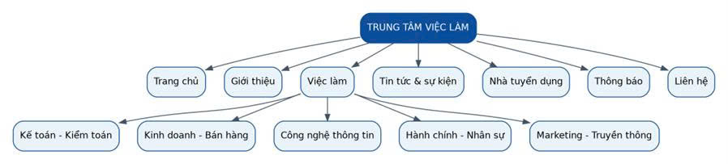

**Hình 1.2. Cấu trúc nội dung tổng quát của website***  
Nguồn: Sinh viên thực hiện.*

## 1.3. Thực trạng và vấn đề cần giải quyết

Từ kết quả khảo sát có thể xác định ba nhóm vấn đề chính: tổ chức nội
dung, khả năng tra cứu và khả năng quản trị/bàn giao. Mỗi nhóm cần được
giải quyết ở mức phù hợp với phạm vi một đồ án cơ sở ngành.

Trước hết, Nếu việc làm chỉ được đăng liên tục dưới dạng danh sách,
người dùng phải duyệt nhiều trang để tìm đúng nhóm nghề. Việc thiết lập
Category và module ngành giúp tạo thêm lối vào cho người dùng ngoài việc
duyệt tuần tự. Điều này giúp nội dung trong báo cáo có thể đối chiếu
trực tiếp với website thay vì chỉ dừng ở mô tả lý thuyết.

Bên cạnh đó, Khi số bài tăng, tìm kiếm theo từ khóa trở thành yêu cầu
cần thiết. Joomla có Smart Search nhưng chức năng này chỉ hiệu quả khi
nội dung được xuất bản và index đúng. Đề tài vì vậy đưa bước lập chỉ mục
và kiểm thử từ khóa vào quy trình hiện thực, không xem tìm kiếm chỉ là
một ô giao diện. Cách tổ chức như vậy phù hợp với quy mô đồ án và vẫn
giữ khả năng mở rộng khi dữ liệu tăng lên.

Về mặt triển khai, Người quản trị cần có thể sửa bài, menu và module mà
không trực tiếp thay đổi cơ sở dữ liệu. Joomla Administrator được dùng
làm giao diện quản trị chính; phpMyAdmin chỉ phục vụ tạo database, kiểm
tra và sao lưu/phục hồi. Đây cũng là cơ sở để xác định test case và đánh
giá kết quả ở chương sau.

Từ góc độ quản trị, Website Joomla gồm cả file và dữ liệu trong
database; chỉ copy thư mục mã nguồn là chưa đủ để bàn giao. Quy trình
backup phải có hai thành phần: source và joomla_db.sql, sau đó cần thử
phục hồi để xác nhận bộ sao lưu có giá trị. Nhờ đó, trách nhiệm của từng
thành phần được tách rõ, thuận lợi cho bảo trì và xử lý lỗi.

Đối với người sử dụng, Ô địa điểm hiện có trên giao diện nhưng chưa phải
bộ lọc dữ liệu độc lập. Báo cáo ghi nhận đúng thực trạng này và đưa việc
chuẩn hóa địa điểm bằng custom field vào hướng phát triển. Điểm quan
trọng là chức năng được mô tả đúng mức đã hiện thực, không gán thêm
nghiệp vụ chưa có trong sản phẩm.

Những vấn đề trên tạo thành phạm vi giải quyết của hệ thống và là cơ sở
cho yêu cầu chức năng, phi chức năng cũng như bộ test case ở các chương
sau.

## 1.4. Vai trò của Trung tâm Giới thiệu việc làm

Trong mô hình đồ án, Trung tâm là chủ thể quản lý và công bố nội dung;
khách truy cập là người đọc và tra cứu. Cách xác định này giúp giới hạn
rõ tác nhân và tránh đưa vào những vai trò chưa tồn tại.

Trước hết, Trung tâm được mô tả như cầu nối giữa người lao động và nhà
tuyển dụng, cung cấp tin tuyển dụng, thông tin dịch vụ và định hướng
nghề nghiệp. Trang chủ vì vậy phải thể hiện được thông điệp kết nối chứ
không chỉ là danh sách bài viết. Điều này giúp nội dung trong báo cáo có
thể đối chiếu trực tiếp với website thay vì chỉ dừng ở mô tả lý thuyết.

Bên cạnh đó, Bốn ô dịch vụ gồm nhiều việc làm phù hợp, kết nối nhà tuyển
dụng, hỗ trợ đăng tuyển và cơ hội phát triển/định hướng nghề nghiệp. Các
ô này có chức năng truyền tải giá trị của Trung tâm và dẫn dắt người
dùng đến nội dung phù hợp. Cách tổ chức như vậy phù hợp với quy mô đồ án
và vẫn giữ khả năng mở rộng khi dữ liệu tăng lên.

Về mặt triển khai, Nhà tuyển dụng trong phiên bản hiện tại là nhóm nội
dung, không phải một loại tài khoản được quyền tự đăng tin. Mọi thông
tin doanh nghiệp đều do quản trị viên tạo bằng Article, phù hợp với mô
hình công bố một chiều. Đây cũng là cơ sở để xác định test case và đánh
giá kết quả ở chương sau.

Từ góc độ quản trị, Khách truy cập không cần đăng nhập để xem việc làm,
tin tức hoặc liên hệ. Việc giảm bước xác thực phù hợp với mục tiêu tra
cứu thông tin công khai và giúp giao diện đơn giản. Nhờ đó, trách nhiệm
của từng thành phần được tách rõ, thuận lợi cho bảo trì và xử lý lỗi.

Đối với người sử dụng, Quản trị viên là tác nhân duy nhất có quyền cập
nhật cấu trúc và nội dung website. Điều này giúp use case và phân quyền
trong báo cáo phản ánh đúng chức năng đã hiện thực. Điểm quan trọng là
chức năng được mô tả đúng mức đã hiện thực, không gán thêm nghiệp vụ
chưa có trong sản phẩm.

Vai trò của Trung tâm quyết định cấu trúc thông tin, ngôn ngữ giao diện
và cách phân chia trách nhiệm giữa front-end với khu vực Administrator.

## 1.5. Phát biểu bài toán

Bài toán được phát biểu theo hướng một hệ thống quản trị nội dung có
chức năng tra cứu, không phải một nền tảng tuyển dụng giao dịch hai
chiều.

Trước hết, Đầu vào của hệ thống là các bài giới thiệu, việc làm, tin
tức, thông báo, dữ liệu nhà tuyển dụng, danh mục và cấu hình giao diện.
Những dữ liệu này được quản trị viên tạo hoặc cập nhật trong Joomla
Administrator và lưu vào MariaDB. Điều này giúp nội dung trong báo cáo
có thể đối chiếu trực tiếp với website thay vì chỉ dừng ở mô tả lý
thuyết.

Bên cạnh đó, Joomla chịu trách nhiệm xử lý nội dung, menu, module và
Smart Search; Cassiopeia cùng user.css đảm nhiệm lớp trình bày. Sự phân
tách này giúp thay đổi nội dung không làm thay đổi toàn bộ giao diện và
ngược lại. Cách tổ chức như vậy phù hợp với quy mô đồ án và vẫn giữ khả
năng mở rộng khi dữ liệu tăng lên.

Về mặt triển khai, Đầu ra là website cho phép người dùng xem, duyệt theo
nhóm và tìm kiếm bài viết. Kết quả tìm kiếm dẫn người dùng đến Article
chi tiết để đọc mô tả, yêu cầu, quyền lợi hoặc thông tin liên hệ. Đây
cũng là cơ sở để xác định test case và đánh giá kết quả ở chương sau.

Từ góc độ quản trị, Mức độ đúng của hệ thống được đánh giá bằng khả năng
hiển thị đúng nội dung, điều hướng đúng, tìm kiếm được, và có thể sao
lưu/phục hồi. Bộ test case do đó bao gồm cả front-end lẫn cơ sở dữ liệu
và quá trình bàn giao. Nhờ đó, trách nhiệm của từng thành phần được tách
rõ, thuận lợi cho bảo trì và xử lý lỗi.

Đối với người sử dụng, Các chức năng ứng tuyển trực tuyến, quản lý CV và
doanh nghiệp tự đăng tin không nằm trong đầu ra hiện tại. Chúng chỉ được
đề xuất như hướng phát triển để tránh tạo sự không nhất quán giữa báo
cáo và sản phẩm. Điểm quan trọng là chức năng được mô tả đúng mức đã
hiện thực, không gán thêm nghiệp vụ chưa có trong sản phẩm.

Phát biểu bài toán này được dùng xuyên suốt trong phân tích use case và
đánh giá mức độ hoàn thành.

| **Bài toán cốt lõi:** Xây dựng website giới thiệu thông tin Trung tâm Giới thiệu việc làm bằng Joomla, tổ chức nội dung theo danh mục, hỗ trợ tìm kiếm theo từ khóa/nhóm ngành và cho phép quản trị viên cập nhật, sao lưu, phục hồi hệ thống trên môi trường local. |
|----------------------------------------------------------------------------------------------------------------------------------------------------------------------------------------------------------------------------------------------------------------------|

## 1.6. Mục tiêu đề tài

Mục tiêu được chia thành mục tiêu về công nghệ, nội dung, giao diện, tra
cứu và khả năng bàn giao.

Trước hết, Tìm hiểu Joomla 5.4.7 và cách phối hợp Article, Category,
Menu, Module, Template, Smart Search. Đây là mục tiêu học tập trung tâm
của đề tài. Điều này giúp nội dung trong báo cáo có thể đối chiếu trực
tiếp với website thay vì chỉ dừng ở mô tả lý thuyết.

Bên cạnh đó, Xây dựng website có cấu trúc bảy mục điều hướng chính và
năm nhóm ngành nghề. Cấu trúc này phải được thể hiện đồng thời ở
front-end và trong cách quản trị nội dung. Cách tổ chức như vậy phù hợp
với quy mô đồ án và vẫn giữ khả năng mở rộng khi dữ liệu tăng lên.

Về mặt triển khai, Tùy chỉnh Cassiopeia bằng user.css với màu xanh
dương, xanh lá và cam. Giao diện cần có nhận diện riêng nhưng vẫn giữ bố
cục rõ ràng, không lạm dụng hiệu ứng. Đây cũng là cơ sở để xác định test
case và đánh giá kết quả ở chương sau.

Từ góc độ quản trị, Cấu hình Smart Search và kiểm thử với từ khóa điển
hình như “nhân viên”. Tìm kiếm phải dựa trên nội dung đã index, không
chỉ là trường nhập liệu minh họa. Nhờ đó, trách nhiệm của từng thành
phần được tách rõ, thuận lợi cho bảo trì và xử lý lỗi.

Đối với người sử dụng, Thực hiện backup source, export/import joomla_db
và quản lý mã nguồn trên GitHub. Các hạng mục này bảo đảm sản phẩm có
thể tái tạo và theo dõi tiến độ. Điểm quan trọng là chức năng được mô tả
đúng mức đã hiện thực, không gán thêm nghiệp vụ chưa có trong sản phẩm.

Mỗi mục tiêu sẽ được đối chiếu lại ở Chương 4 để xác định trạng thái đạt
được hoặc ngoài phạm vi.

> • Tìm hiểu và vận dụng Joomla CMS.
>
> • Tạo website thông tin Trung tâm việc làm.
>
> • Tổ chức 5 nhóm ngành và nội dung tuyển dụng.
>
> • Tích hợp Smart Search.
>
> • Tùy chỉnh giao diện Cassiopeia.
>
> • Sao lưu/phục hồi source và database.
>
> • Quản lý phiên bản bằng Git/GitHub.

## 1.7. Yêu cầu chức năng và phi chức năng

Yêu cầu được tách theo hai tác nhân và nhóm yêu cầu chất lượng. Việc
tách này giúp kiểm tra được chức năng nào dành cho khách truy cập và
chức năng nào thuộc khu vực quản trị.

Trước hết, Khách truy cập cần xem trang chủ, giới thiệu, việc làm, nhóm
ngành, nhà tuyển dụng, tin tức, thông báo và liên hệ. Các chức năng đọc
đều không yêu cầu đăng nhập, phù hợp với tính chất thông tin công khai.
Điều này giúp nội dung trong báo cáo có thể đối chiếu trực tiếp với
website thay vì chỉ dừng ở mô tả lý thuyết.

Bên cạnh đó, Khách truy cập cần tìm kiếm theo từ khóa và sử dụng lựa
chọn ngành để thu hẹp nội dung. Smart Search và cấu trúc Category là hai
cơ chế chính hỗ trợ tra cứu. Cách tổ chức như vậy phù hợp với quy mô đồ
án và vẫn giữ khả năng mở rộng khi dữ liệu tăng lên.

Về mặt triển khai, Quản trị viên cần đăng nhập /administrator và quản lý
Article, Category, Menu, Module, Template, Smart Search. Đây là các thao
tác vận hành website thường xuyên, trong đó nội dung được ưu tiên chỉnh
qua giao diện quản trị. Đây cũng là cơ sở để xác định test case và đánh
giá kết quả ở chương sau.

Từ góc độ quản trị, Quản trị viên cần backup source và database, đồng
thời có khả năng phục hồi. Yêu cầu này phục vụ bàn giao và giảm nguy cơ
mất sản phẩm khi môi trường local gặp sự cố. Nhờ đó, trách nhiệm của
từng thành phần được tách rõ, thuận lợi cho bảo trì và xử lý lỗi.

Đối với người sử dụng, Phi chức năng gồm tính dễ đọc, ổn định trên
Edge/Chrome, tiếng Việt hiển thị đúng, cấu trúc dễ bảo trì và không công
bố secret. Các tiêu chí này định hướng cách thiết kế CSS, tổ chức file
và trình bày cấu hình trong báo cáo. Điểm quan trọng là chức năng được
mô tả đúng mức đã hiện thực, không gán thêm nghiệp vụ chưa có trong sản
phẩm.

Bảng yêu cầu sau là cơ sở để xây dựng use case và test case.

**Bảng 1.2. Chức năng phía khách truy cập**

| **STT** | **Chức năng**      | **Mô tả**                                           |
|---------|--------------------|-----------------------------------------------------|
| 1       | Xem trang chủ      | Banner, tìm kiếm, việc nổi bật, ngành nghề, liên hệ |
| 2       | Xem giới thiệu     | Thông tin Trung tâm                                 |
| 3       | Xem việc làm       | Danh sách Article tuyển dụng                        |
| 4       | Xem theo ngành     | 5 nhóm ngành nghề                                   |
| 5       | Tìm kiếm           | Smart Search theo từ khóa                           |
| 6       | Lọc ngành          | Thu hẹp theo nhóm đã cấu hình                       |
| 7       | Xem chi tiết       | Mô tả, yêu cầu, quyền lợi                           |
| 8       | Xem nhà tuyển dụng | Bài doanh nghiệp                                    |
| 9       | Tin tức/Thông báo  | Nội dung cập nhật                                   |
| 10      | Liên hệ            | Hotline, email, địa chỉ                             |

*Nguồn: Sinh viên tổng hợp từ nội dung đồ án.*

**Bảng 1.3. Chức năng phía quản trị viên**

| **STT** | **Chức năng**         | **Nơi thao tác**          |
|---------|-----------------------|---------------------------|
| 1       | Đăng nhập quản trị    | /administrator            |
| 2       | Quản lý bài viết      | Content → Articles        |
| 3       | Quản lý danh mục      | Content → Categories      |
| 4       | Quản lý menu          | Menus                     |
| 5       | Quản lý module        | Site Modules              |
| 6       | Tùy chỉnh template    | Cassiopeia + user.css     |
| 7       | Smart Search          | Components → Smart Search |
| 8       | Backup/restore source | Thư mục mã nguồn          |
| 9       | Backup/restore DB     | phpMyAdmin Export/Import  |

*Nguồn: Sinh viên tổng hợp từ nội dung đồ án.*

## 1.8. Định hướng thực hiện

Quy trình triển khai được sắp theo thứ tự từ khảo sát đến kiểm thử để
hạn chế việc thiết kế giao diện khi chưa có mô hình nội dung.

Trước hết, Bước đầu là khảo sát các website việc làm và chốt menu, nhóm
ngành, loại nội dung cần có. Kết quả giúp định hình sitemap và tránh
thay đổi Category nhiều lần về sau. Điều này giúp nội dung trong báo cáo
có thể đối chiếu trực tiếp với website thay vì chỉ dừng ở mô tả lý
thuyết.

Bên cạnh đó, Tiếp theo là cài XAMPP, tạo joomla_db và cài Joomla trong
htdocs. Môi trường local tạo điều kiện thử nghiệm nhanh mà không phụ
thuộc hosting. Cách tổ chức như vậy phù hợp với quy mô đồ án và vẫn giữ
khả năng mở rộng khi dữ liệu tăng lên.

Về mặt triển khai, Sau khi có Joomla, quản trị viên tạo Category,
Article, Menu và Module, rồi tùy chỉnh Cassiopeia. Cách đi từ dữ liệu
tới giao diện giúp các khối trang chủ có nguồn nội dung rõ ràng. Đây
cũng là cơ sở để xác định test case và đánh giá kết quả ở chương sau.

Từ góc độ quản trị, Smart Search được cấu hình khi đã có dữ liệu để
index; sau mỗi thay đổi lớn cần kiểm tra lại kết quả. Việc này giúp tìm
kiếm được kiểm chứng bằng nội dung thật thay vì chỉ cấu hình trên lý
thuyết. Nhờ đó, trách nhiệm của từng thành phần được tách rõ, thuận lợi
cho bảo trì và xử lý lỗi.

Đối với người sử dụng, Giai đoạn cuối gồm test case, backup/restore và
GitHub. Sản phẩm chỉ được xem là hoàn thiện khi có thể chạy lại và tái
tạo từ bộ bàn giao. Điểm quan trọng là chức năng được mô tả đúng mức đã
hiện thực, không gán thêm nghiệp vụ chưa có trong sản phẩm.

Định hướng này cũng phản ánh tiến độ thực hiện theo tuần được trình bày
ở phụ lục.

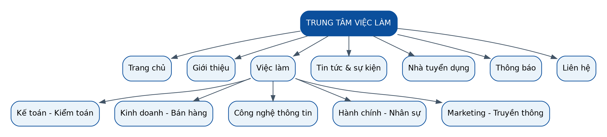

**Hình 1.3. Quy trình kiểm thử lặp trong quá trình thực hiện***  
Nguồn: Sinh viên thực hiện.*

## 1.9. Kết luận chương

Chương 1 đã xác định rõ phạm vi và các yêu cầu cần đạt. Điểm quan trọng
là website được định nghĩa như một cổng thông tin việc làm có quản trị
nội dung và tìm kiếm, không phải sàn tuyển dụng đầy đủ.

Trước hết, Cấu trúc bảy menu và năm nhóm ngành được hình thành từ khảo
sát và yêu cầu thực tế. Đây là đầu vào trực tiếp cho việc tạo Category,
Menu và Module trong Joomla. Điều này giúp nội dung trong báo cáo có thể
đối chiếu trực tiếp với website thay vì chỉ dừng ở mô tả lý thuyết.

Bên cạnh đó, Hai tác nhân chính là khách truy cập và quản trị viên đã
được xác định. Việc này giúp các use case ở Chương 3 không xuất hiện vai
trò ngoài phạm vi. Cách tổ chức như vậy phù hợp với quy mô đồ án và vẫn
giữ khả năng mở rộng khi dữ liệu tăng lên.

Về mặt triển khai, Smart Search, backup/restore và GitHub được coi là
hạng mục kỹ thuật bắt buộc chứ không chỉ là phần phụ. Những nội dung này
làm rõ chiều sâu của đồ án CMS. Đây cũng là cơ sở để xác định test case
và đánh giá kết quả ở chương sau.

Từ góc độ quản trị, Các hạn chế như chưa có ứng tuyển và chưa có filter
địa điểm thật đã được ghi nhận từ đầu. Nhờ đó phần đánh giá sau này có
tiêu chí rõ ràng và minh bạch. Nhờ đó, trách nhiệm của từng thành phần
được tách rõ, thuận lợi cho bảo trì và xử lý lỗi.

Chương 2 tiếp tục trình bày nền tảng lý thuyết và công nghệ được sử dụng
trực tiếp để hiện thực những yêu cầu trên.

# CHƯƠNG 2. CƠ SỞ LÝ THUYẾT VÀ CÔNG NGHỆ

Chương 2 trình bày kiến thức nền ở mức gắn với sản phẩm. Mỗi công nghệ
đều được giải thích thông qua vai trò thực tế trong website, trong đó
Joomla là trọng tâm, XAMPP cung cấp môi trường chạy, MariaDB lưu dữ
liệu, Cassiopeia và user.css tạo lớp giao diện, Git/GitHub hỗ trợ quản
lý phiên bản.

## 2.1. Hệ thống thông tin

Website Trung tâm việc làm có thể được nhìn như một hệ thống thông tin
nhỏ gồm con người, dữ liệu, phần mềm, quy trình và hạ tầng.

Trước hết, Con người gồm khách truy cập và quản trị viên. Hai nhóm có
nhu cầu khác nhau: một bên đọc/tra cứu, một bên tạo/cập nhật nội dung.
Việc xác định đúng đối tượng giúp cấu trúc chức năng và phân quyền không
bị mở rộng không cần thiết. Điều này giúp nội dung trong báo cáo có thể
đối chiếu trực tiếp với website thay vì chỉ dừng ở mô tả lý thuyết.

Bên cạnh đó, Dữ liệu gồm Article, Category, Menu, Module, người dùng và
chỉ mục Smart Search. Phần lớn dữ liệu nghiệp vụ được lưu trong MariaDB,
còn media và file giao diện nằm trong thư mục mã nguồn. Cách tổ chức như
vậy phù hợp với quy mô đồ án và vẫn giữ khả năng mở rộng khi dữ liệu
tăng lên.

Về mặt triển khai, Phần mềm chính là Joomla, phối hợp với Apache và PHP
để xử lý request. Joomla đóng vai trò lớp ứng dụng, còn template tạo kết
quả hiển thị trên trình duyệt. Đây cũng là cơ sở để xác định test case
và đánh giá kết quả ở chương sau.

Từ góc độ quản trị, Quy trình gồm tạo bài, gán danh mục, xuất bản,
index, tìm kiếm, sao lưu và phục hồi. Một thay đổi nội dung chỉ thực sự
hoàn tất khi được kiểm tra lại trên front-end và, nếu cần, cập nhật chỉ
mục tìm kiếm. Nhờ đó, trách nhiệm của từng thành phần được tách rõ,
thuận lợi cho bảo trì và xử lý lỗi.

Đối với người sử dụng, Hạ tầng hiện tại là máy cá nhân chạy XAMPP. Đây
là môi trường thích hợp cho học tập nhưng khác với production, nơi cần
domain, HTTPS, giám sát và backup tự động. Điểm quan trọng là chức năng
được mô tả đúng mức đã hiện thực, không gán thêm nghiệp vụ chưa có trong
sản phẩm.

Cách nhìn hệ thống thông tin giúp giải thích website như một chuỗi thành
phần liên kết thay vì chỉ là những trang giao diện độc lập.

## 2.2. Website và kiến trúc Web

Website động tạo nội dung dựa trên dữ liệu và mã phía server. Trong đồ
án, trình duyệt gửi request đến localhost, Apache/PHP chạy Joomla,
Joomla đọc MariaDB và trả về HTML.

Trước hết, URL http://localhost/joomla/ là điểm truy cập front-end, còn
/administrator/ là khu vực quản trị. Việc tách hai không gian giúp người
dùng thường không nhìn thấy các thao tác biên tập. Điều này giúp nội
dung trong báo cáo có thể đối chiếu trực tiếp với website thay vì chỉ
dừng ở mô tả lý thuyết.

Bên cạnh đó, Apache nhận yêu cầu HTTP và chuyển cho PHP thực thi Joomla.
Nếu Apache dừng, website không truy cập được; nếu MariaDB dừng, Joomla
không đọc được dữ liệu. Cách tổ chức như vậy phù hợp với quy mô đồ án và
vẫn giữ khả năng mở rộng khi dữ liệu tăng lên.

Về mặt triển khai, Joomla quyết định component, menu item và layout cần
sử dụng cho từng request. Do đó cùng một Article có thể được tiếp cận từ
category, menu hoặc kết quả Smart Search. Đây cũng là cơ sở để xác định
test case và đánh giá kết quả ở chương sau.

Từ góc độ quản trị, Template Cassiopeia bao bọc kết quả nội dung bằng bố
cục và style. user.css cho phép điều chỉnh giao diện mà không sửa trực
tiếp logic xử lý của CMS. Nhờ đó, trách nhiệm của từng thành phần được
tách rõ, thuận lợi cho bảo trì và xử lý lỗi.

Đối với người sử dụng, Mô hình local tương tự Web thật ở luồng
request/response nhưng không phản ánh tải mạng Internet. Các kết quả
hiệu năng trong báo cáo vì vậy chỉ nên hiểu ở quy mô môi trường kiểm
thử. Điểm quan trọng là chức năng được mô tả đúng mức đã hiện thực,
không gán thêm nghiệp vụ chưa có trong sản phẩm.

Kiến trúc Web là cơ sở để Chương 3 mô tả kiến trúc bốn lớp và mô hình
triển khai local.

## 2.3. Joomla CMS

Joomla 5.4.7 là nền tảng trung tâm của đồ án. Điểm quan trọng không chỉ
là khái niệm CMS mà là cách các thành phần của Joomla được ánh xạ vào
nội dung Trung tâm việc làm.

Trước hết, Article là đơn vị nội dung cơ bản cho tin việc làm, bài giới
thiệu, tin tức, thông báo và thông tin nhà tuyển dụng. Mỗi bài có tiêu
đề, nội dung, trạng thái và Category, vì vậy có thể quản trị độc lập.
Điều này giúp nội dung trong báo cáo có thể đối chiếu trực tiếp với
website thay vì chỉ dừng ở mô tả lý thuyết.

Bên cạnh đó, Category dùng để nhóm nội dung. Các nhóm chính gồm Giới
thiệu, Việc làm, Tin tức, Nhà tuyển dụng, Thông báo, Liên hệ và năm nhóm
ngành. Cấu trúc Category tốt giúp menu, module và tìm kiếm hoạt động
nhất quán. Cách tổ chức như vậy phù hợp với quy mô đồ án và vẫn giữ khả
năng mở rộng khi dữ liệu tăng lên.

Về mặt triển khai, Menu là cơ chế điều hướng, có thể trỏ đến Article,
Category Blog/List hoặc component như Smart Search. Quản trị viên có thể
thay đổi thứ tự và đích menu mà không chỉnh HTML thủ công. Đây cũng là
cơ sở để xác định test case và đánh giá kết quả ở chương sau.

Từ góc độ quản trị, Module là khối nội dung gắn vào vị trí template.
Trang chủ sử dụng module cho banner, header, việc làm nổi bật, ngành
nghề, dịch vụ và liên hệ. Module tạo khả năng bố trí lại trang chủ mà
vẫn tái sử dụng nội dung và template. Nhờ đó, trách nhiệm của từng thành
phần được tách rõ, thuận lợi cho bảo trì và xử lý lỗi.

Đối với người sử dụng, Cassiopeia là template nền; user.css chứa các
thay đổi màu, hover, nút, footer và bố cục phụ. Việc tách CSS tùy chỉnh
giúp giảm nguy cơ mất thay đổi khi cập nhật template. Điểm quan trọng là
chức năng được mô tả đúng mức đã hiện thực, không gán thêm nghiệp vụ
chưa có trong sản phẩm.

Khi đối chiếu với phạm vi đề tài, Smart Search (com_finder) lập chỉ mục
nội dung vào các bảng \#\_\_finder\_\* rồi xử lý truy vấn. Bài viết mới
cần Published và được index thì mới có khả năng xuất hiện đúng trong kết
quả. Cách tiếp cận này ưu tiên tính nhất quán, khả năng kiểm tra và khả
năng bàn giao hệ thống.

Trước hết, Joomla có hệ thống user và ACL nhưng phạm vi chỉ sử dụng quản
trị viên và khách truy cập. Không tạo thêm vai trò nhà tuyển dụng/ứng
viên vì sản phẩm chưa có các workflow tương ứng. Điều này giúp nội dung
trong báo cáo có thể đối chiếu trực tiếp với website thay vì chỉ dừng ở
mô tả lý thuyết.

Việc sử dụng Joomla giúp đề tài tập trung vào cấu hình và tổ chức một hệ
thống nội dung thực tế, đồng thời vẫn cho phép tiếp cận cơ sở dữ liệu,
template và cơ chế tìm kiếm.

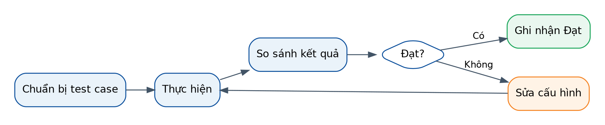

**Hình 2.1. Mối quan hệ giữa trình duyệt, Joomla, giao diện và dữ
liệu***  
Nguồn: Sinh viên thực hiện.*

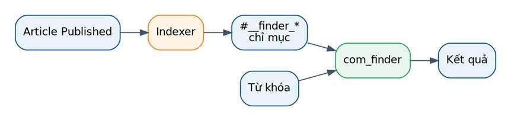

**Hình 2.2. Cơ chế lập chỉ mục và truy vấn Smart Search***  
Nguồn: Sinh viên thực hiện.*

## 2.4. HTML, CSS và JavaScript

Ba công nghệ front-end được dùng ở mức hỗ trợ Joomla và tùy chỉnh giao
diện, không thay thế CMS.

Trước hết, HTML tạo cấu trúc cho Custom Module, form tìm kiếm và nội
dung hiển thị. Các thẻ cần được tổ chức đủ rõ để CSS có thể áp dụng ổn
định và nội dung dễ bảo trì. Điều này giúp nội dung trong báo cáo có thể
đối chiếu trực tiếp với website thay vì chỉ dừng ở mô tả lý thuyết.

Bên cạnh đó, CSS quyết định màu sắc, kích thước, khoảng cách, viền và
cách sắp xếp khối. user.css là nơi tập trung các quy tắc riêng của
website thay vì thay đổi trực tiếp file lõi Cassiopeia. Cách tổ chức như
vậy phù hợp với quy mô đồ án và vẫn giữ khả năng mở rộng khi dữ liệu
tăng lên.

Về mặt triển khai, Bộ màu \#0b4f9c, \#18a558 và \#f58220 được dùng cho
nền chính, trạng thái tương tác và nút hành động. Việc lặp lại màu có
chủ đích tạo nhận diện và phân cấp thị giác cho trang. Đây cũng là cơ sở
để xác định test case và đánh giá kết quả ở chương sau.

Từ góc độ quản trị, JavaScript được sử dụng ở mức hỗ trợ tương tác hoặc
xử lý nhỏ trên giao diện. Đồ án không phải ứng dụng SPA nên logic nghiệp
vụ không đặt trong JavaScript phía trình duyệt. Nhờ đó, trách nhiệm của
từng thành phần được tách rõ, thuận lợi cho bảo trì và xử lý lỗi.

Đối với người sử dụng, Responsive cần dựa trên bố cục linh hoạt và media
query. Phiên bản hiện tại ưu tiên desktop, còn tối ưu điện thoại được
đưa vào hướng phát triển. Điểm quan trọng là chức năng được mô tả đúng
mức đã hiện thực, không gán thêm nghiệp vụ chưa có trong sản phẩm.

Trong mô hình CMS, HTML/CSS/JavaScript nên được xem là lớp trình bày
phối hợp với output do Joomla sinh ra.

## 2.5. PHP và MariaDB

PHP là môi trường thực thi phía server của Joomla, còn MariaDB lưu phần
lớn dữ liệu cấu hình và nội dung.

Trước hết, PHP 8.1.25 được sử dụng trong môi trường dự án. Joomla chạy
trên PHP để xử lý request, gọi extension và tạo HTML. Thông tin phiên
bản được ghi rõ để việc tái tạo môi trường dễ đối chiếu. Điều này giúp
nội dung trong báo cáo có thể đối chiếu trực tiếp với website thay vì
chỉ dừng ở mô tả lý thuyết.

Bên cạnh đó, MariaDB 10.4.32 lưu database joomla_db. Article, Category,
Menu, Module và tài khoản không chỉ nằm trong file source mà được lưu
thành bản ghi. Cách tổ chức như vậy phù hợp với quy mô đồ án và vẫn giữ
khả năng mở rộng khi dữ liệu tăng lên.

Về mặt triển khai, Tiền tố bảng được thống nhất trong báo cáo là
rjtgh\_. Khi mô tả tổng quát, ký hiệu \#\_\_ được dùng để tránh phụ
thuộc tiền tố, ví dụ \#\_\_content. Đây cũng là cơ sở để xác định test
case và đánh giá kết quả ở chương sau.

Từ góc độ quản trị, phpMyAdmin cung cấp giao diện tạo database, xem
bảng, Export và Import. Công cụ này chủ yếu phục vụ quản trị kỹ thuật,
không dùng thay cho Joomla Administrator khi biên tập bài. Nhờ đó, trách
nhiệm của từng thành phần được tách rõ, thuận lợi cho bảo trì và xử lý
lỗi.

Đối với người sử dụng, Source và database phải được sao lưu cùng nhau.
Đây là hệ quả trực tiếp của kiến trúc website động: thiếu một trong hai
thì bản phục hồi có thể không đầy đủ. Điểm quan trọng là chức năng được
mô tả đúng mức đã hiện thực, không gán thêm nghiệp vụ chưa có trong sản
phẩm.

Việc hiểu vai trò PHP/MariaDB giúp giải thích nhiều lỗi cài đặt, đặc
biệt lỗi kết nối database và tình trạng website có file nhưng thiếu nội
dung.

## 2.6. XAMPP

XAMPP cung cấp môi trường phát triển local tích hợp Apache, PHP, MariaDB
và phpMyAdmin.

Trước hết, Apache phải ở trạng thái Running trước khi truy cập
localhost. Đây là bước kiểm tra đầu tiên khi trình duyệt không kết nối
được website. Điều này giúp nội dung trong báo cáo có thể đối chiếu trực
tiếp với website thay vì chỉ dừng ở mô tả lý thuyết.

Bên cạnh đó, MariaDB/MySQL service phải chạy để Joomla đọc joomla_db.
Nếu dịch vụ dừng, website có thể hiển thị lỗi database dù source không
thay đổi. Cách tổ chức như vậy phù hợp với quy mô đồ án và vẫn giữ khả
năng mở rộng khi dữ liệu tăng lên.

Về mặt triển khai, Mã nguồn được đặt dưới C:\xampp\htdocs\joomla hoặc
thư mục tương đương. Đường dẫn này tương ứng với URL localhost/joomla/
trong quá trình kiểm thử. Đây cũng là cơ sở để xác định test case và
đánh giá kết quả ở chương sau.

Từ góc độ quản trị, phpMyAdmin chạy dưới localhost/phpmyadmin và hỗ trợ
Export/Import SQL. Nhờ đó quá trình backup database có thể thực hiện
bằng giao diện mà không cần dòng lệnh. Nhờ đó, trách nhiệm của từng
thành phần được tách rõ, thuận lợi cho bảo trì và xử lý lỗi.

Đối với người sử dụng, XAMPP thích hợp cho học tập nhưng không được xem
là cấu hình production. Khi đưa lên Internet cần môi trường server được
harden, HTTPS, backup và quyền truy cập phù hợp. Điểm quan trọng là chức
năng được mô tả đúng mức đã hiện thực, không gán thêm nghiệp vụ chưa có
trong sản phẩm.

XAMPP giúp toàn bộ vòng cài đặt, kiểm thử và phục hồi diễn ra trên một
máy, phù hợp với phạm vi học phần.

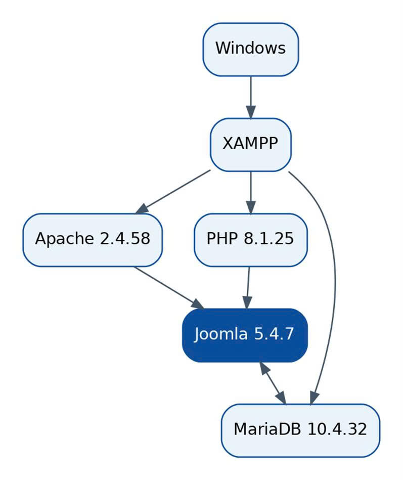

**Hình 2.3. Các thành phần môi trường XAMPP trong đồ án***  
Nguồn: Sinh viên thực hiện.*

## 2.7. Git và GitHub

Git/GitHub được dùng để theo dõi thay đổi của mã nguồn và tài liệu, đồng
thời tạo một kênh lưu trữ phiên bản ngoài thư mục làm việc chính.

Trước hết, Repository có tên
csn-dx24tt8-lethinhu-trungtamvieclam-joomla. Tên repository phản ánh
lớp, sinh viên và chủ đề, giúp nhận diện rõ khi bàn giao. Điều này giúp
nội dung trong báo cáo có thể đối chiếu trực tiếp với website thay vì
chỉ dừng ở mô tả lý thuyết.

Bên cạnh đó, Các thư mục progress-report, setup, src/trungtamvieclam và
thesis tách tiến độ, hướng dẫn cài, source và báo cáo. Cấu trúc này giảm
tình trạng file kỹ thuật và tài liệu nằm lẫn nhau. Cách tổ chức như vậy
phù hợp với quy mô đồ án và vẫn giữ khả năng mở rộng khi dữ liệu tăng
lên.

Về mặt triển khai, Quy trình lệnh gồm git init, git add -A, git commit,
git remote add origin và git push. Mỗi commit nên tương ứng một mốc thay
đổi có ý nghĩa để lịch sử dễ theo dõi. Đây cũng là cơ sở để xác định
test case và đánh giá kết quả ở chương sau.

Từ góc độ quản trị, Git không thay thế backup database. Nội dung Joomla
nằm trong MariaDB nên vẫn cần file SQL riêng dù source đã được push. Nhờ
đó, trách nhiệm của từng thành phần được tách rõ, thuận lợi cho bảo trì
và xử lý lỗi.

Đối với người sử dụng, Trước khi đưa code lên GitHub cần kiểm tra
configuration.php và file nhạy cảm. Mật khẩu, secret key và thông tin
xác thực không được đưa vào báo cáo hoặc repository công khai. Điểm quan
trọng là chức năng được mô tả đúng mức đã hiện thực, không gán thêm
nghiệp vụ chưa có trong sản phẩm.

Quản lý phiên bản bổ sung tính truy vết cho đồ án và hỗ trợ khôi phục
các file đã thay đổi trong quá trình phát triển.

**Hình 2.4. Quy trình quản lý phiên bản bằng Git/GitHub***  
Nguồn: Sinh viên thực hiện.*

## 2.8. Bộ công cụ sử dụng

Bộ công cụ được lựa chọn theo nguyên tắc đủ cho cài đặt, phát triển,
kiểm thử và tài liệu, tránh đưa thêm framework không cần thiết.

Trước hết, Joomla 5.4.7, Cassiopeia và Smart Search tạo bộ ba CMS – giao
diện – tra cứu. Đây là phần lõi trực tiếp quyết định chức năng người
dùng và quản trị. Điều này giúp nội dung trong báo cáo có thể đối chiếu
trực tiếp với website thay vì chỉ dừng ở mô tả lý thuyết.

Bên cạnh đó, Apache 2.4.58, PHP 8.1.25 và MariaDB 10.4.32 tạo nền tảng
chạy local qua XAMPP. Các phiên bản được ghi trong báo cáo để thuận tiện
tái tạo và đối chiếu lỗi. Cách tổ chức như vậy phù hợp với quy mô đồ án
và vẫn giữ khả năng mở rộng khi dữ liệu tăng lên.

Về mặt triển khai, Visual Studio Code hỗ trợ chỉnh CSS, Markdown và các
file tài liệu. Các thay đổi ở user.css được thực hiện bằng editor thay
vì giao diện Joomla khi cần kiểm soát chi tiết. Đây cũng là cơ sở để xác
định test case và đánh giá kết quả ở chương sau.

Từ góc độ quản trị, Edge/Chrome được dùng để kiểm thử giao diện. Kiểm
tra trên hơn một trình duyệt giúp phát hiện sớm lỗi CSS hoặc layout. Nhờ
đó, trách nhiệm của từng thành phần được tách rõ, thuận lợi cho bảo trì
và xử lý lỗi.

Đối với người sử dụng, Ngrok chỉ dùng thử truy cập từ Internet trong
thời gian ngắn. Công cụ này không được mô tả như hosting chính thức và
không thay thế triển khai production. Điểm quan trọng là chức năng được
mô tả đúng mức đã hiện thực, không gán thêm nghiệp vụ chưa có trong sản
phẩm.

Bảng công nghệ giúp liên kết mỗi công cụ với một vai trò cụ thể trong
quy trình đồ án.

**Bảng 2.1. Công nghệ và công cụ sử dụng**

| **STT** | **Công cụ/công nghệ**     | **Vai trò**         |
|---------|---------------------------|---------------------|
| 1       | Joomla 5.4.7              | CMS                 |
| 2       | Cassiopeia                | Template nền        |
| 3       | Smart Search / com_finder | Tìm kiếm            |
| 4       | XAMPP                     | Môi trường local    |
| 5       | Apache 2.4.58             | Web server          |
| 6       | PHP 8.1.25                | Runtime             |
| 7       | MariaDB 10.4.32           | Cơ sở dữ liệu       |
| 8       | phpMyAdmin                | Quản trị DB/backup  |
| 9       | HTML/CSS/JavaScript       | Tùy chỉnh giao diện |
| 10      | Visual Studio Code        | Editor              |
| 11      | Git + GitHub              | Quản lý phiên bản   |
| 12      | Edge/Chrome               | Kiểm thử            |
| 13      | Ngrok                     | Truy cập thử        |

*Nguồn: Sinh viên tổng hợp từ nội dung đồ án.*

## 2.9. Sao lưu và an toàn dữ liệu

Sao lưu được xem như một phần của thiết kế hệ thống vì website Joomla
phụ thuộc đồng thời vào source và database.

Trước hết, Backup mã nguồn bằng cách sao chép toàn bộ thư mục website.
Bản sao phải giữ template, media, file tùy chỉnh và cấu trúc extension
cần thiết. Điều này giúp nội dung trong báo cáo có thể đối chiếu trực
tiếp với website thay vì chỉ dừng ở mô tả lý thuyết.

Bên cạnh đó, Backup database bằng phpMyAdmin Export ra joomla_db.sql.
File SQL chứa nội dung và cấu hình lưu trong các bảng Joomla. Cách tổ
chức như vậy phù hợp với quy mô đồ án và vẫn giữ khả năng mở rộng khi dữ
liệu tăng lên.

Về mặt triển khai, Phục hồi gồm copy source, tạo/import database và kiểm
tra configuration.php. Sau đó phải kiểm tra trang chủ, menu, bài viết và
Smart Search để xác nhận phục hồi thành công. Đây cũng là cơ sở để xác
định test case và đánh giá kết quả ở chương sau.

Từ góc độ quản trị, GitHub hỗ trợ lịch sử file nhưng không tự lưu trạng
thái MariaDB. Việc phân biệt version control và backup tránh hiểu nhầm
rằng push code là đủ để bàn giao. Nhờ đó, trách nhiệm của từng thành
phần được tách rõ, thuận lợi cho bảo trì và xử lý lỗi.

Đối với người sử dụng, Thông tin bí mật trong configuration.php không
được công bố. Báo cáo chỉ nêu host, database và prefix cần cho mô tả kỹ
thuật, không ghi password hoặc secret. Điểm quan trọng là chức năng được
mô tả đúng mức đã hiện thực, không gán thêm nghiệp vụ chưa có trong sản
phẩm.

Quy trình backup/restore được kiểm thử ở Chương 4 và được đưa thành
checklist ở phụ lục.

## 2.10. Kết luận chương

Các công nghệ đã trình bày tạo thành một hệ sinh thái thống nhất cho
website: XAMPP cung cấp server, Joomla quản trị nội dung, MariaDB lưu dữ
liệu, Cassiopeia trình bày giao diện, Smart Search tra cứu và Git/GitHub
quản lý phiên bản.

Trước hết, Joomla là thành phần trọng tâm và được giải thích theo đúng
các chức năng dùng trong sản phẩm. Điều này giúp phần lý thuyết có liên
hệ trực tiếp với hiện thực ở Chương 3. Điều này giúp nội dung trong báo
cáo có thể đối chiếu trực tiếp với website thay vì chỉ dừng ở mô tả lý
thuyết.

Bên cạnh đó, Cơ sở dữ liệu và backup được xem như thành phần bắt buộc
của website động. Nhờ đó báo cáo không chỉ tập trung vào giao diện. Cách
tổ chức như vậy phù hợp với quy mô đồ án và vẫn giữ khả năng mở rộng khi
dữ liệu tăng lên.

Về mặt triển khai, Các giới hạn của môi trường local và Ngrok đã được
nêu rõ. Phần đánh giá sau này sẽ không suy rộng kết quả kiểm thử thành
khả năng production. Đây cũng là cơ sở để xác định test case và đánh giá
kết quả ở chương sau.

Từ góc độ quản trị, Tùy chỉnh front-end được giới hạn ở HTML/CSS/JS hỗ
trợ CMS. Không có framework ứng dụng khác, vì vậy kiến trúc giữ được sự
đơn giản phù hợp đề tài. Nhờ đó, trách nhiệm của từng thành phần được
tách rõ, thuận lợi cho bảo trì và xử lý lỗi.

Chương 3 sử dụng nền tảng này để mô tả cụ thể yêu cầu, use case, dữ
liệu, giao diện và các bước hiện thực.

# CHƯƠNG 3. PHÂN TÍCH, THIẾT KẾ VÀ HIỆN THỰC HỆ THỐNG

Chương 3 trình bày quá trình chuyển các yêu cầu của website Trung tâm
Giới thiệu việc làm thành cấu trúc Joomla có thể vận hành trên XAMPP.
Nội dung bao gồm phạm vi tác nhân, use case, luồng tìm kiếm, kiến trúc,
dữ liệu, cấu trúc nội dung, giao diện, cài đặt, cấu hình Smart Search,
quy trình quản trị, sao lưu và kiểm thử. Các mô tả chỉ phản ánh những
chức năng đã có trong sản phẩm, không bổ sung nghiệp vụ ứng tuyển trực
tuyến hoặc quản lý hồ sơ chưa được triển khai.

## 3.1. Phân tích yêu cầu

Yêu cầu được phân tích theo hai nhóm: yêu cầu chức năng mô tả những thao
tác website phải hỗ trợ và yêu cầu phi chức năng mô tả cách hệ thống cần
vận hành trong môi trường học tập. Cách phân tách này giúp tránh việc
đánh đồng giao diện đẹp với khả năng đáp ứng nghiệp vụ.

Trước hết, Nhóm chức năng dành cho khách truy cập tập trung vào xem nội
dung, tìm kiếm và lọc ngành. Người dùng không bắt buộc phải đăng nhập để
tiếp cận các thông tin công khai. Đây là lựa chọn phù hợp với một
website giới thiệu thông tin vì giảm rào cản tiếp cận và không tạo thêm
quy trình tài khoản không cần thiết. Điều này giúp nội dung trong báo
cáo có thể đối chiếu trực tiếp với website thay vì chỉ dừng ở mô tả lý
thuyết.

Bên cạnh đó, Nhóm chức năng dành cho quản trị viên gồm đăng nhập khu
Administrator, quản lý Article, Category, Menu, Module, template và
Smart Search. Các chức năng này tận dụng thành phần lõi Joomla để bảo
đảm quản trị nội dung tập trung và nhất quán. Cách tổ chức như vậy phù
hợp với quy mô đồ án và vẫn giữ khả năng mở rộng khi dữ liệu tăng lên.

Về mặt triển khai, Dữ liệu phải thể hiện đủ các nhóm Giới thiệu, Việc
làm, Tin tức, Nhà tuyển dụng, Thông báo, Liên hệ và năm ngành nghề đã
xác định. Yêu cầu này giúp nội dung demo có tính hệ thống thay vì chỉ có
một vài bài viết đơn lẻ. Đây cũng là cơ sở để xác định test case và đánh
giá kết quả ở chương sau.

Từ góc độ quản trị, Website phải chạy ổn định trên localhost với Apache,
PHP và MariaDB trong XAMPP. Môi trường local được chọn để phù hợp điều
kiện học phần và cho phép cài đặt lại trên máy khác theo hướng dẫn bàn
giao. Nhờ đó, trách nhiệm của từng thành phần được tách rõ, thuận lợi
cho bảo trì và xử lý lỗi.

Đối với người sử dụng, Giao diện cần sử dụng màu xanh chủ đạo, xanh lá
cho trạng thái tương tác và cam cho điểm nhấn, đồng thời giữ phong cách
phù hợp website việc làm. Yêu cầu thẩm mỹ được gắn với cấu trúc nội
dung, ưu tiên khả năng đọc, điều hướng và nhận diện thay vì hiệu ứng
phức tạp. Điểm quan trọng là chức năng được mô tả đúng mức đã hiện thực,
không gán thêm nghiệp vụ chưa có trong sản phẩm.

Khi đối chiếu với phạm vi đề tài, Hệ thống phải có quy trình sao lưu và
phục hồi cả source lẫn database. Đây là yêu cầu vận hành quan trọng vì
dữ liệu Joomla nằm trong MariaDB chứ không chỉ trong thư mục mã nguồn.
Cách tiếp cận này ưu tiên tính nhất quán, khả năng kiểm tra và khả năng
bàn giao hệ thống.

Kết quả phân tích yêu cầu được sử dụng để lập use case, thiết kế cấu
trúc Category/Menu/Module và xây dựng bảng kiểm thử ở cuối chương.

**Bảng 3.1. Phân nhóm yêu cầu của hệ thống**

| **Nhóm**       | **Yêu cầu tiêu biểu**                              | **Tiêu chí kiểm tra**                            |
|----------------|----------------------------------------------------|--------------------------------------------------|
| Khách truy cập | Xem trang, tìm từ khóa, lọc ngành, xem chi tiết    | Điều hướng đúng và hiển thị nội dung phù hợp     |
| Quản trị viên  | Quản lý Article/Category/Menu/Module, Smart Search | Thao tác được trong Administrator                |
| Giao diện      | Màu nhận diện, bố cục rõ, nội dung dễ đọc          | Hiển thị ổn định trên trình duyệt thử nghiệm     |
| Dữ liệu        | joomla_db, nội dung theo nhóm                      | Bảng dữ liệu và bài viết tồn tại, truy xuất được |
| Vận hành       | Backup/restore source và SQL                       | Khôi phục site và kiểm tra lại chức năng         |

*Nguồn: Sinh viên tổng hợp từ nội dung đồ án.*

## 3.2. Tác nhân và phạm vi hệ thống

Hệ thống có hai tác nhân chính là khách truy cập và quản trị viên. Việc
xác định đúng tác nhân giúp thiết kế use case đơn giản, đúng với trạng
thái hiện tại của website và tránh thêm vai trò mà sản phẩm chưa hỗ trợ.

Trước hết, Khách truy cập đại diện cho người lao động hoặc người quan
tâm đến thông tin của Trung tâm. Tác nhân này được quyền xem các trang
công khai, duyệt việc làm, tra cứu và mở bài chi tiết. Khách không có
quyền sửa nội dung và không cần tạo tài khoản trong phạm vi đồ án. Điều
này giúp nội dung trong báo cáo có thể đối chiếu trực tiếp với website
thay vì chỉ dừng ở mô tả lý thuyết.

Bên cạnh đó, Quản trị viên là người chịu trách nhiệm cập nhật nội dung
và cấu hình website. Quản trị viên đăng nhập tại /administrator và sử
dụng giao diện Joomla thay vì chỉnh trực tiếp dữ liệu SQL cho nghiệp vụ
hằng ngày. Cách tổ chức như vậy phù hợp với quy mô đồ án và vẫn giữ khả
năng mở rộng khi dữ liệu tăng lên.

Về mặt triển khai, Nhà tuyển dụng xuất hiện dưới dạng nội dung được giới
thiệu trên website chứ chưa phải một tác nhân phần mềm độc lập. Vì chưa
có tài khoản doanh nghiệp tự đăng tin nên không xây use case “Nhà tuyển
dụng đăng tuyển”. Đây cũng là cơ sở để xác định test case và đánh giá
kết quả ở chương sau.

Từ góc độ quản trị, Ứng viên cũng chưa được mô hình hóa thành tài khoản
có hồ sơ hoặc CV. Người tìm việc trong phiên bản này được xem là khách
truy cập sử dụng chức năng tra cứu công khai. Nhờ đó, trách nhiệm của
từng thành phần được tách rõ, thuận lợi cho bảo trì và xử lý lỗi.

Đối với người sử dụng, Các thành phần kỹ thuật như MariaDB, Apache hay
Smart Search là hệ thống hỗ trợ, không phải tác nhân con người. Chúng
được trình bày trong sơ đồ kiến trúc và luồng xử lý thay vì đặt ngang
hàng với người dùng. Điểm quan trọng là chức năng được mô tả đúng mức đã
hiện thực, không gán thêm nghiệp vụ chưa có trong sản phẩm.

Khi đối chiếu với phạm vi đề tài, Phạm vi kết thúc tại chức năng cung
cấp và tra cứu thông tin. Thanh địa điểm hiện mới mang ý nghĩa giao
diện; không mô tả như một bộ lọc độc lập đã hoàn thiện. Cách tiếp cận
này ưu tiên tính nhất quán, khả năng kiểm tra và khả năng bàn giao hệ
thống.

Cách mô hình hóa hai tác nhân giúp đồ án có biên giới rõ và tạo cơ sở
trực tiếp cho sơ đồ use case tổng quát.

| **Ranh giới nghiệp vụ:** Website là kênh thông tin của Trung tâm. Phiên bản hiện tại chưa phải sàn tuyển dụng trực tuyến đầy đủ: không có nộp CV, theo dõi trạng thái hồ sơ, tài khoản nhà tuyển dụng tự đăng tin hoặc quy trình phê duyệt tuyển dụng nhiều bước. |
|-------------------------------------------------------------------------------------------------------------------------------------------------------------------------------------------------------------------------------------------------------------------|

## 3.3. Mô hình use case tổng quát

Use case tổng quát biểu diễn những mục tiêu mà hai tác nhân có thể thực
hiện thông qua hệ thống. Sơ đồ được rút gọn theo nhóm chức năng để dễ
đọc, sau đó các trường hợp sử dụng quan trọng được đặc tả ở mục kế tiếp.

Trước hết, Khách truy cập có thể xem trang chủ, xem nội dung theo menu,
duyệt danh sách việc làm, chọn nhóm ngành và tìm kiếm. Các use case này
phản ánh đường đi chính từ trang chủ đến bài viết chi tiết. Điều này
giúp nội dung trong báo cáo có thể đối chiếu trực tiếp với website thay
vì chỉ dừng ở mô tả lý thuyết.

Bên cạnh đó, Khách truy cập có thể xem thông tin nhà tuyển dụng, tin
tức, thông báo và liên hệ. Đây là nhóm nội dung bổ trợ giúp website thể
hiện vai trò của một cổng thông tin Trung tâm thay vì chỉ là danh sách
việc làm. Cách tổ chức như vậy phù hợp với quy mô đồ án và vẫn giữ khả
năng mở rộng khi dữ liệu tăng lên.

Về mặt triển khai, Quản trị viên quản lý Article và Category để duy trì
dữ liệu. Article là đơn vị nội dung còn Category tạo cấu trúc phân loại
cho menu, module và tìm kiếm. Đây cũng là cơ sở để xác định test case và
đánh giá kết quả ở chương sau.

Từ góc độ quản trị, Quản trị viên quản lý Menu và Module để kiểm soát
điều hướng và bố cục. Việc thay đổi vị trí nội dung có thể thực hiện
trong Joomla Administrator mà không sửa lại toàn bộ template. Nhờ đó,
trách nhiệm của từng thành phần được tách rõ, thuận lợi cho bảo trì và
xử lý lỗi.

Đối với người sử dụng, Quản trị viên vận hành Smart Search, lập chỉ mục
khi cần và kiểm tra kết quả. Khả năng tìm kiếm phụ thuộc vào nội dung đã
publish và trạng thái index. Điểm quan trọng là chức năng được mô tả
đúng mức đã hiện thực, không gán thêm nghiệp vụ chưa có trong sản phẩm.

Khi đối chiếu với phạm vi đề tài, Quản trị viên thực hiện backup/restore
ở cấp source và database. Use case vận hành này giúp sản phẩm có khả
năng bàn giao và khôi phục khi chuyển môi trường. Cách tiếp cận này ưu
tiên tính nhất quán, khả năng kiểm tra và khả năng bàn giao hệ thống.

Sơ đồ use case dưới đây cố ý không có use case ứng tuyển, đăng CV hoặc
doanh nghiệp tự đăng tin vì các chức năng này nằm ngoài phạm vi.

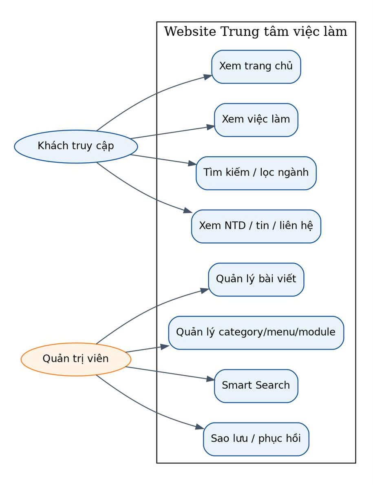

**Hình 3.1. Sơ đồ use case tổng quát của hệ thống***  
Nguồn: Sinh viên thực hiện.*

## 3.4. Đặc tả các use case chính

Sau sơ đồ tổng quát, các use case quan trọng được mô tả bằng mục tiêu,
tiền điều kiện, luồng chính và kết quả. Cách đặc tả này giúp chuyển yêu
cầu thành các bước có thể kiểm thử.

Trước hết, Use case “Xem danh sách việc làm” bắt đầu khi khách chọn mục
Việc làm. Joomla nhận yêu cầu menu và tải layout Category tương ứng. Kết
quả là danh sách bài việc làm được hiển thị với tiêu đề và thông tin tóm
tắt để người dùng tiếp tục chọn bài chi tiết. Điều này giúp nội dung
trong báo cáo có thể đối chiếu trực tiếp với website thay vì chỉ dừng ở
mô tả lý thuyết.

Bên cạnh đó, Use case “Tìm kiếm” bắt đầu khi người dùng nhập từ khóa, có
thể chọn ngành rồi nhấn TÌM KIẾM. Hệ thống chuyển truy vấn đến Smart
Search, đọc chỉ mục và trả danh sách phù hợp hoặc thông báo không có kết
quả. Cách tổ chức như vậy phù hợp với quy mô đồ án và vẫn giữ khả năng
mở rộng khi dữ liệu tăng lên.

Về mặt triển khai, Use case “Xem chi tiết việc làm” bắt đầu từ một item
trong danh sách hoặc kết quả tìm kiếm. Trang Article trình bày tên vị
trí, mô tả công việc, yêu cầu, quyền lợi và thông tin liên hệ/thời hạn
khi có. Đây cũng là cơ sở để xác định test case và đánh giá kết quả ở
chương sau.

Từ góc độ quản trị, Use case “Quản lý bài viết” yêu cầu quản trị viên đã
đăng nhập. Người quản trị có thể tạo mới hoặc sửa Article, gán Category
và trạng thái Published. Sau khi lưu, bài được hiển thị theo cấu hình
menu/module và có thể được Smart Search lập chỉ mục. Nhờ đó, trách nhiệm
của từng thành phần được tách rõ, thuận lợi cho bảo trì và xử lý lỗi.

Đối với người sử dụng, Use case “Sao lưu cơ sở dữ liệu” được thực hiện
qua phpMyAdmin Export. Kết quả là file SQL có thể dùng để Import khi
phục hồi hoặc chuyển hệ thống sang một máy khác. Điểm quan trọng là chức
năng được mô tả đúng mức đã hiện thực, không gán thêm nghiệp vụ chưa có
trong sản phẩm.

Khi đối chiếu với phạm vi đề tài, Use case “Phục hồi website” kết hợp
copy source, tạo/import database và điều chỉnh configuration.php khi
cần. Bước cuối là kiểm tra trang chủ, menu, bài viết và tìm kiếm để xác
nhận dữ liệu đồng bộ với mã nguồn. Cách tiếp cận này ưu tiên tính nhất
quán, khả năng kiểm tra và khả năng bàn giao hệ thống.

Bảng đặc tả rút gọn được sử dụng như một tài liệu đối chiếu trong kiểm
thử chức năng.

**Bảng 3.2. Đặc tả rút gọn các use case chính**

| **Use case**       | **Tác nhân** | **Tiền điều kiện**      | **Luồng/kết quả chính**                             |
|--------------------|--------------|-------------------------|-----------------------------------------------------|
| Xem việc làm       | Khách        | Website hoạt động       | Chọn Việc làm → Joomla tải category → xem danh sách |
| Tìm kiếm/lọc ngành | Khách        | Nội dung đã index       | Nhập từ khóa/chọn ngành → com_finder → kết quả      |
| Xem chi tiết       | Khách        | Có bài Published        | Chọn tiêu đề → hiển thị Article chi tiết            |
| Quản lý bài viết   | Quản trị     | Đăng nhập Administrator | Tạo/sửa → Category → Published → Save               |
| Quản lý cấu trúc   | Quản trị     | Có quyền quản trị       | Điều chỉnh Category/Menu/Module                     |
| Backup/restore     | Quản trị     | Có source và quyền DB   | Copy source + Export/Import SQL → kiểm tra site     |

*Nguồn: Sinh viên tổng hợp từ nội dung đồ án.*

## 3.5. Quy trình tìm kiếm việc làm

Tìm kiếm là chức năng tương tác rõ nhất của website nên được mô hình hóa
riêng bằng sơ đồ hoạt động. Quy trình bắt đầu từ giao diện trang chủ và
kết thúc khi người dùng xem bài chi tiết hoặc nhận thông báo không tìm
thấy.

Trước hết, Người dùng nhập từ khóa như “nhân viên”, “kế toán” hoặc tên
vị trí. Từ khóa là đầu vào chính của Smart Search và được xử lý dựa trên
nội dung đã lập chỉ mục. Điều này giúp nội dung trong báo cáo có thể đối
chiếu trực tiếp với website thay vì chỉ dừng ở mô tả lý thuyết.

Bên cạnh đó, Người dùng có thể chọn một trong năm nhóm ngành để thu hẹp
phạm vi. Việc phân ngành làm giảm lượng kết quả không liên quan khi số
bài tăng và đồng thời tạo cấu trúc dễ kiểm tra. Cách tổ chức như vậy phù
hợp với quy mô đồ án và vẫn giữ khả năng mở rộng khi dữ liệu tăng lên.

Về mặt triển khai, Nút TÌM KIẾM gửi yêu cầu đến component com_finder.
Component không quét thủ công toàn bộ HTML mà dựa vào chỉ mục được
Joomla xây dựng. Đây cũng là cơ sở để xác định test case và đánh giá kết
quả ở chương sau.

Từ góc độ quản trị, Nếu có kết quả, hệ thống hiển thị danh sách phù hợp
để người dùng chọn bài chi tiết. Luồng này nối trực tiếp công cụ tra cứu
với Article, vì vậy nội dung bài viết phải có tiêu đề và mô tả rõ. Nhờ
đó, trách nhiệm của từng thành phần được tách rõ, thuận lợi cho bảo trì
và xử lý lỗi.

Đối với người sử dụng, Nếu không có kết quả, hệ thống hiển thị trạng
thái không tìm thấy thay vì dẫn đến một trang trống. Thông báo trạng
thái giúp người dùng hiểu truy vấn đã được xử lý và có thể thử từ khóa
khác. Điểm quan trọng là chức năng được mô tả đúng mức đã hiện thực,
không gán thêm nghiệp vụ chưa có trong sản phẩm.

Khi đối chiếu với phạm vi đề tài, Ô địa điểm được giữ trong giao diện để
hoàn thiện bố cục tìm kiếm nhưng chưa được xem như tiêu chí lọc độc lập
đã hoàn thiện. Báo cáo ghi nhận giới hạn này để kết quả kiểm thử không
vượt quá chức năng thực tế. Cách tiếp cận này ưu tiên tính nhất quán,
khả năng kiểm tra và khả năng bàn giao hệ thống.

Luồng hoạt động là cơ sở cho test case tìm từ khóa “nhân viên” kết hợp
nhóm “Kế toán - Kiểm toán”.

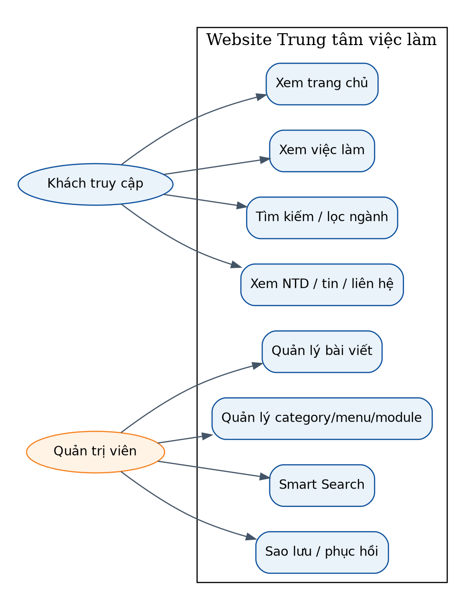

**Hình 3.2. Sơ đồ hoạt động tìm kiếm việc làm***  
Nguồn: Sinh viên thực hiện.*

## 3.6. Kiến trúc hệ thống

Kiến trúc được mô tả theo bốn lớp để làm rõ đường đi của một yêu cầu từ
trình duyệt tới dữ liệu. Cách nhìn theo lớp phù hợp với việc giải thích
hệ thống CMS mà không cần đi sâu vào mã nguồn framework bên trong
Joomla.

Trước hết, Lớp người dùng là trình duyệt Edge hoặc Chrome, nơi khách
truy cập và quản trị viên tương tác với website. Mọi thao tác bắt đầu
bằng HTTP request đến Apache trong XAMPP. Điều này giúp nội dung trong
báo cáo có thể đối chiếu trực tiếp với website thay vì chỉ dừng ở mô tả
lý thuyết.

Bên cạnh đó, Lớp giao diện gồm Cassiopeia, HTML, CSS và JavaScript. Lớp
này quyết định cách module, menu, bài viết và form tìm kiếm được trình
bày trên màn hình. Cách tổ chức như vậy phù hợp với quy mô đồ án và vẫn
giữ khả năng mở rộng khi dữ liệu tăng lên.

Về mặt triển khai, Lớp Joomla cung cấp Articles, Categories, Menus,
Modules và Smart Search. Đây là lớp xử lý nội dung và cấu hình, đóng vai
trò trung gian giữa giao diện với database. Đây cũng là cơ sở để xác
định test case và đánh giá kết quả ở chương sau.

Từ góc độ quản trị, Lớp dữ liệu và môi trường gồm MariaDB, Apache và
PHP. MariaDB lưu dữ liệu, PHP thực thi ứng dụng còn Apache tiếp nhận và
trả kết quả HTTP. Nhờ đó, trách nhiệm của từng thành phần được tách rõ,
thuận lợi cho bảo trì và xử lý lỗi.

Đối với người sử dụng, Các lớp không hoàn toàn tách biệt vật lý trong
XAMPP nhưng được phân tách về trách nhiệm. Mô hình này giúp xác định vị
trí lỗi: giao diện, cấu hình CMS, database hay dịch vụ server. Điểm quan
trọng là chức năng được mô tả đúng mức đã hiện thực, không gán thêm
nghiệp vụ chưa có trong sản phẩm.

Khi đối chiếu với phạm vi đề tài, Khi triển khai trên máy khác, cả
source, cấu hình dịch vụ và database đều phải tương thích. Do đó phần
hướng dẫn cài đặt và backup được xem là một phần của kiến trúc triển
khai. Cách tiếp cận này ưu tiên tính nhất quán, khả năng kiểm tra và khả
năng bàn giao hệ thống.

Kiến trúc bốn lớp cũng giúp giải thích vì sao thay đổi bài viết có thể
thực hiện trong Administrator mà không cần sửa trực tiếp HTML của từng
trang.

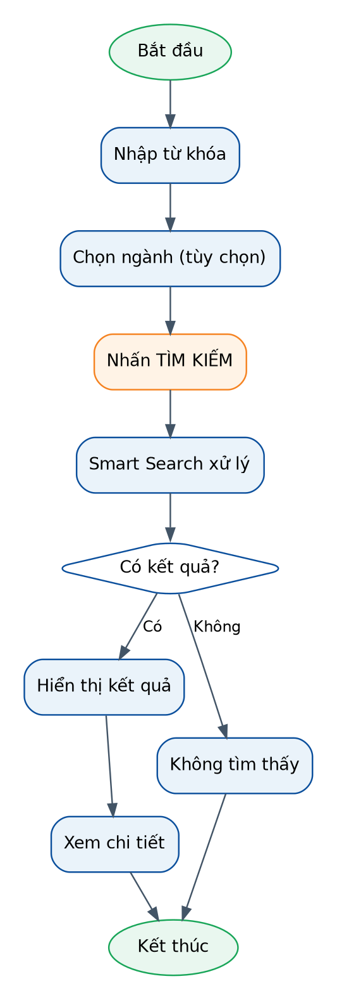

**Hình 3.3. Kiến trúc bốn lớp của website***  
Nguồn: Sinh viên thực hiện.*

## 3.7. Thiết kế dữ liệu Joomla

Đồ án sử dụng mô hình dữ liệu có sẵn của Joomla thay vì tự tạo một
schema tuyển dụng riêng. Vì mục tiêu là website thông tin, việc ánh xạ
nội dung vào các bảng lõi giúp tận dụng đầy đủ cơ chế Article, Category,
Menu, Module và Smart Search.

Trước hết, Bảng \#\_\_content lưu các Article như tin việc làm, giới
thiệu, tin tức, thông báo và nội dung nhà tuyển dụng. Các trường tiêu
đề, alias, category, trạng thái và nội dung là cơ sở để Joomla tạo trang
chi tiết. Điều này giúp nội dung trong báo cáo có thể đối chiếu trực
tiếp với website thay vì chỉ dừng ở mô tả lý thuyết.

Bên cạnh đó, Bảng \#\_\_categories lưu cây danh mục. Các Category giúp
tách nhóm nội dung lớn và năm nhóm ngành, từ đó menu và bộ lọc có thể
tham chiếu nhất quán. Cách tổ chức như vậy phù hợp với quy mô đồ án và
vẫn giữ khả năng mở rộng khi dữ liệu tăng lên.

Về mặt triển khai, Bảng \#\_\_menu lưu cấu trúc điều hướng và đích của
từng menu item. Menu có thể trỏ tới Article, Category Blog/List hoặc
component mà không cần hard-code đường dẫn trong template. Đây cũng là
cơ sở để xác định test case và đánh giá kết quả ở chương sau.

Từ góc độ quản trị, Bảng \#\_\_modules lưu cấu hình module và vị trí
hiển thị. Banner, nội dung giới thiệu, việc làm nổi bật và liên hệ có
thể được bố trí theo vùng của Cassiopeia. Nhờ đó, trách nhiệm của từng
thành phần được tách rõ, thuận lợi cho bảo trì và xử lý lỗi.

Đối với người sử dụng, Các bảng \#\_\_finder\_\* lưu chỉ mục phục vụ
Smart Search. Kết quả tìm kiếm phụ thuộc trạng thái index nên quá trình
quản trị phải bao gồm kiểm tra chỉ mục. Điểm quan trọng là chức năng
được mô tả đúng mức đã hiện thực, không gán thêm nghiệp vụ chưa có trong
sản phẩm.

Khi đối chiếu với phạm vi đề tài, Các bảng \#\_\_users, \#\_\_assets và
\#\_\_session hỗ trợ tài khoản, quyền và phiên đăng nhập. Trong phạm vi
này, chúng chủ yếu phục vụ khu Administrator, chưa triển khai hệ thống
tài khoản ứng viên/nhà tuyển dụng. Cách tiếp cận này ưu tiên tính nhất
quán, khả năng kiểm tra và khả năng bàn giao hệ thống.

Tiền tố vật lý được thống nhất trong báo cáo là rjtgh\_, còn ký hiệu
\#\_\_ được dùng khi mô tả chung theo chuẩn Joomla.

**Bảng 3.3. Các bảng Joomla được sử dụng trong phân tích**

| **Bảng logic**   | **Vai trò**         | **Dữ liệu liên quan trong đề tài**             |
|------------------|---------------------|------------------------------------------------|
| \#\_\_content    | Lưu Article         | Việc làm, tin, giới thiệu, NTD, thông báo      |
| \#\_\_categories | Lưu Category        | Nhóm nội dung và 5 ngành                       |
| \#\_\_menu       | Lưu menu item       | 7 mục điều hướng chính                         |
| \#\_\_modules    | Lưu cấu hình module | Banner, search, việc nổi bật, dịch vụ, liên hệ |
| \#\_\_extensions | Extension/component | Joomla core và Smart Search                    |
| \#\_\_assets     | ACL/tài nguyên      | Quyền truy cập quản trị                        |
| \#\_\_finder\_\* | Chỉ mục tìm kiếm    | Nội dung đã index                              |
| \#\_\_session    | Phiên làm việc      | Phiên đăng nhập                                |

*Nguồn: Sinh viên tổng hợp từ nội dung đồ án.*

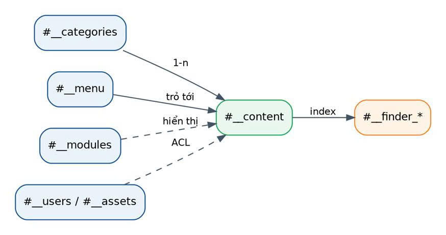

**Hình 3.4. Quan hệ logic giữa các bảng nội dung Joomla***  
Nguồn: Sinh viên thực hiện.*

## 3.8. Thiết kế cấu trúc nội dung

Cấu trúc nội dung được thiết kế theo nguyên tắc người dùng nhìn thấy tên
mục dễ hiểu, còn phía quản trị ánh xạ mỗi mục vào Category, Article hoặc
Module tương ứng. Hai cấp quan trọng nhất là menu chính và năm nhóm
ngành nghề.

Trước hết, Menu Trang chủ dẫn người dùng tới landing page tổng hợp
banner, tìm kiếm, việc nổi bật, ngành nghề và liên hệ. Trang này đóng
vai trò điểm bắt đầu của hầu hết luồng sử dụng. Điều này giúp nội dung
trong báo cáo có thể đối chiếu trực tiếp với website thay vì chỉ dừng ở
mô tả lý thuyết.

Bên cạnh đó, Giới thiệu/“Giới thiệu Trung tâm” chứa bài mô tả vai trò,
dịch vụ và phương châm kết nối. Nhóm này giúp người dùng hiểu website
thuộc Trung tâm và không nhầm với một trang rao vặt việc làm. Cách tổ
chức như vậy phù hợp với quy mô đồ án và vẫn giữ khả năng mở rộng khi dữ
liệu tăng lên.

Về mặt triển khai, Việc làm là nhóm nội dung chính, có các bài về văn
phòng, kinh doanh, bán hàng, kỹ thuật, phổ thông và bán thời gian. Nội
dung đa dạng đủ để kiểm tra hiển thị danh sách, chi tiết và tìm kiếm.
Đây cũng là cơ sở để xác định test case và đánh giá kết quả ở chương
sau.

Từ góc độ quản trị, Tin tức & sự kiện, Nhà tuyển dụng, Thông báo và Liên
hệ là các lối vào độc lập trên menu. Việc tách rõ giúp cấu trúc điều
hướng nhất quán và giảm số lần người dùng phải quay lại trang chủ. Nhờ
đó, trách nhiệm của từng thành phần được tách rõ, thuận lợi cho bảo trì
và xử lý lỗi.

Đối với người sử dụng, Năm nhóm ngành gồm Kế toán - Kiểm toán, Kinh
doanh - Bán hàng, Công nghệ thông tin, Hành chính - Nhân sự và
Marketing - Truyền thông. Đây là các nhóm được sử dụng cho module danh
mục và logic lọc/tra cứu trong phạm vi demo. Điểm quan trọng là chức
năng được mô tả đúng mức đã hiện thực, không gán thêm nghiệp vụ chưa có
trong sản phẩm.

Khi đối chiếu với phạm vi đề tài, Tên Category và tên hiển thị nên được
viết nhất quán về dấu, viết hoa và dấu gạch nối. Tính nhất quán giúp
quản trị viên tránh tạo các nhóm gần giống nhau gây phân tán dữ liệu.
Cách tiếp cận này ưu tiên tính nhất quán, khả năng kiểm tra và khả năng
bàn giao hệ thống.

Cấu trúc này cân bằng giữa số lượng mục đủ để phản ánh nghiệp vụ và độ
đơn giản phù hợp một website thông tin.

**Bảng 3.4. Thiết kế menu chính**

| **STT** | **Mục menu**         | **Loại nội dung/đích** | **Mục đích**            |
|---------|----------------------|------------------------|-------------------------|
| 1       | Trang chủ            | Home/default           | Tổng hợp nội dung       |
| 2       | Giới thiệu Trung tâm | Article/Category       | Giới thiệu đơn vị       |
| 3       | Việc làm             | Category Blog/List     | Duyệt tin tuyển dụng    |
| 4       | Tin tức & sự kiện    | Category               | Tin và hoạt động        |
| 5       | Nhà tuyển dụng       | Category               | Thông tin doanh nghiệp  |
| 6       | Thông báo            | Category               | Thông tin cập nhật      |
| 7       | Liên hệ              | Article/Custom         | Hotline, email, địa chỉ |

*Nguồn: Sinh viên tổng hợp từ nội dung đồ án.*

**Bảng 3.5. Năm nhóm ngành nghề**

| **STT** | **Nhóm ngành**           | **Cách sử dụng**      |
|---------|--------------------------|-----------------------|
| 1       | Kế toán - Kiểm toán      | Lọc/danh mục việc làm |
| 2       | Kinh doanh - Bán hàng    | Lọc/danh mục việc làm |
| 3       | Công nghệ thông tin      | Lọc/danh mục việc làm |
| 4       | Hành chính - Nhân sự     | Lọc/danh mục việc làm |
| 5       | Marketing - Truyền thông | Lọc/danh mục việc làm |

*Nguồn: Sinh viên tổng hợp từ nội dung đồ án.*

## 3.9. Thiết kế giao diện

Giao diện được phát triển trên Cassiopeia và tùy chỉnh bằng user.css.
Thiết kế hướng đến cảm giác của một cổng việc làm: màu xanh tạo nền tin
cậy, xanh lá làm trạng thái tương tác và màu cam thu hút tại nút tìm
kiếm.

Trước hết, Vùng trên cùng chứa menu ngang với các nhãn chức năng chính.
Menu được đặt trên nền xanh đậm, chữ trắng để tạo phân cấp rõ và giúp
người dùng xác định ngay cấu trúc site. Điều này giúp nội dung trong báo
cáo có thể đối chiếu trực tiếp với website thay vì chỉ dừng ở mô tả lý
thuyết.

Bên cạnh đó, Bên dưới là tiêu đề Trung tâm và banner lớn mang thông điệp
kết nối người lao động với nhà tuyển dụng. Banner vừa tạo nhận diện vừa
cung cấp ngữ cảnh trước khi người dùng đi vào danh sách việc làm. Cách
tổ chức như vậy phù hợp với quy mô đồ án và vẫn giữ khả năng mở rộng khi
dữ liệu tăng lên.

Về mặt triển khai, Thanh tìm kiếm được bố trí sát banner, gồm từ khóa,
địa điểm, ngành nghề và nút TÌM KIẾM. Việc đặt công cụ tra cứu ở vùng
đầu trang giảm thời gian người dùng phải tìm chức năng chính. Đây cũng
là cơ sở để xác định test case và đánh giá kết quả ở chương sau.

Từ góc độ quản trị, Khu vực nội dung chia thành “Việc làm nổi bật” và
“Danh mục ngành nghề”. Hai khối hỗ trợ hai cách khám phá: xem gợi ý có
sẵn hoặc chủ động đi theo nhóm nghề. Nhờ đó, trách nhiệm của từng thành
phần được tách rõ, thuận lợi cho bảo trì và xử lý lỗi.

Đối với người sử dụng, Các module giới thiệu, dịch vụ và liên hệ hoàn
thiện phần còn lại của trang chủ. Nội dung được chia thành khối ngắn
giúp trang dễ quét và có thể quản lý độc lập trong Joomla. Điểm quan
trọng là chức năng được mô tả đúng mức đã hiện thực, không gán thêm
nghiệp vụ chưa có trong sản phẩm.

Khi đối chiếu với phạm vi đề tài, user.css được dùng để chỉnh màu,
hover, khoảng cách, button và footer. Tách phần tùy chỉnh khỏi file lõi
template giúp thay đổi dễ kiểm soát hơn và hạn chế rủi ro khi cập nhật.
Cách tiếp cận này ưu tiên tính nhất quán, khả năng kiểm tra và khả năng
bàn giao hệ thống.

Bố cục được mô hình hóa trước bằng sơ đồ khối và được đối chiếu với ảnh
kết quả ở Chương 4.

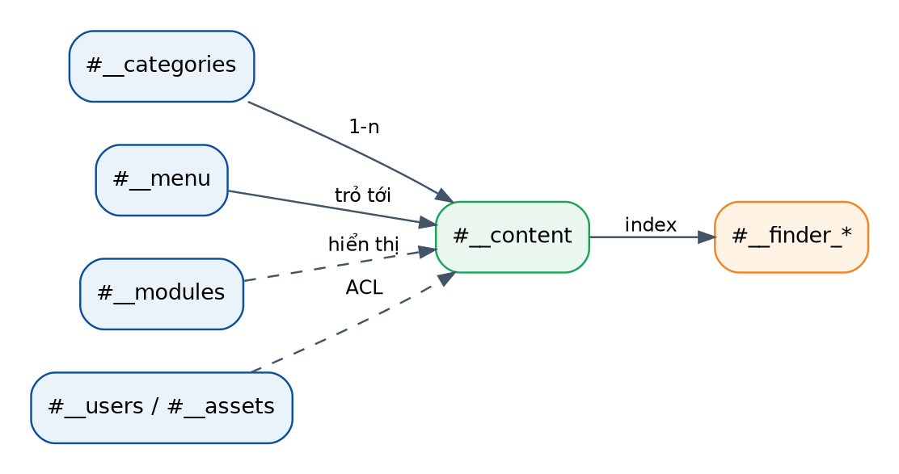

**Hình 3.5. Sơ đồ bố cục trang chủ dự kiến***  
Nguồn: Sinh viên thực hiện.*

**Bảng 3.6. Các module chính trên trang chủ**

| **Module**                | **Loại**                | **Vai trò**                   |
|---------------------------|-------------------------|-------------------------------|
| Menu chính                | mod_menu                | Điều hướng                    |
| Banner Trung tâm          | mod_custom              | Ảnh/banner và thông điệp      |
| Header Trung tâm việc làm | mod_custom              | Tiêu đề site                  |
| Thanh tìm kiếm            | mod_custom / mod_finder | Nhập từ khóa, địa điểm, ngành |
| Việc làm nổi bật          | mod_custom              | Hiển thị việc làm minh họa    |
| Danh mục ngành nghề       | mod_custom              | 5 nhóm ngành                  |
| Giới thiệu Trung tâm      | mod_custom              | Giới thiệu ngắn               |
| Dịch vụ việc làm          | mod_custom              | 4 ô dịch vụ                   |
| Thông tin liên hệ         | mod_custom              | Hotline, email, địa chỉ       |
| Đăng nhập                 | mod_login               | Form tài khoản khi cần        |
| Breadcrumbs               | mod_breadcrumbs         | Đường dẫn trang               |

*Nguồn: Sinh viên tổng hợp từ nội dung đồ án.*

## 3.10. Cài đặt môi trường

Quá trình cài đặt được thiết kế sao cho có thể lặp lại trên một máy
Windows mới. Trình tự tập trung vào XAMPP, database, source, wizard
Joomla và kiểm tra Administrator.

Trước hết, Bước 1 là cài XAMPP và khởi động Apache cùng MySQL/MariaDB.
Nếu một dịch vụ không chạy cần xử lý xung đột cổng hoặc quyền trước khi
tiếp tục. Điều này giúp nội dung trong báo cáo có thể đối chiếu trực
tiếp với website thay vì chỉ dừng ở mô tả lý thuyết.

Bên cạnh đó, Bước 2 mở phpMyAdmin và tạo database joomla_db với bộ mã
phù hợp. Database phải tồn tại trước khi Joomla có thể tạo các bảng ứng
dụng. Cách tổ chức như vậy phù hợp với quy mô đồ án và vẫn giữ khả năng
mở rộng khi dữ liệu tăng lên.

Về mặt triển khai, Bước 3 copy source vào C:\xampp\htdocs\joomla hoặc
thư mục trungtamvieclam tương đương. Tên thư mục quyết định URL local
nên cần thống nhất với hướng dẫn sử dụng. Đây cũng là cơ sở để xác định
test case và đánh giá kết quả ở chương sau.

Từ góc độ quản trị, Bước 4 truy cập http://localhost/joomla/ để chạy
wizard cài đặt. Wizard thu thập tên site và thông tin kết nối database,
sau đó tạo cấu trúc Joomla. Nhờ đó, trách nhiệm của từng thành phần được
tách rõ, thuận lợi cho bảo trì và xử lý lỗi.

Đối với người sử dụng, Bước 5 cấu hình host localhost, user root và
database joomla_db, đồng thời không đưa mật khẩu hoặc secret vào báo
cáo. Sau khi cài thành công cần đối chiếu configuration.php và prefix
bảng thực tế. Điểm quan trọng là chức năng được mô tả đúng mức đã hiện
thực, không gán thêm nghiệp vụ chưa có trong sản phẩm.

Khi đối chiếu với phạm vi đề tài, Bước 6 đăng nhập Administrator để cấu
hình template, nội dung, menu, module và tìm kiếm. Mọi thay đổi quan
trọng được kiểm tra lại ở front-end sau khi lưu. Cách tiếp cận này ưu
tiên tính nhất quán, khả năng kiểm tra và khả năng bàn giao hệ thống.

Các bước được viết thành quy trình để hỗ trợ cả cài mới lẫn phục hồi từ
source và SQL backup.

**Hình 3.6. Sơ đồ triển khai website trên môi trường local***  
Nguồn: Sinh viên thực hiện.*

**Bảng 3.7. Thông số môi trường triển khai local**

| **Thành phần**            | **Giá trị**                            |
|---------------------------|----------------------------------------|
| Website                   | http://localhost/joomla/               |
| Quản trị                  | http://localhost/joomla/administrator/ |
| phpMyAdmin                | http://localhost/phpmyadmin/           |
| Database                  | joomla_db                              |
| Host                      | localhost                              |
| User DB                   | root                                   |
| Prefix dùng trong báo cáo | rjtgh\_                                |
| Editor                    | TinyMCE                                |

*Nguồn: Sinh viên tổng hợp từ nội dung đồ án.*

## 3.11. Cấu hình Joomla

Sau khi cài đặt nền tảng, công việc chính là cấu hình Joomla để phản ánh
đúng mô hình nội dung Trung tâm việc làm. Các cấu hình được thực hiện
chủ yếu qua Administrator thay vì can thiệp database trực tiếp.

Trước hết, Tên site được đặt là “Trung tâm việc làm” và ngôn ngữ hiển
thị được giữ nhất quán với nội dung tiếng Việt. Tên site xuất hiện ở
nhiều vị trí nên phải phù hợp với banner và tiêu đề trang. Điều này giúp
nội dung trong báo cáo có thể đối chiếu trực tiếp với website thay vì
chỉ dừng ở mô tả lý thuyết.

Bên cạnh đó, Các Category gốc được tạo trước khi nhập lượng lớn Article.
Việc chuẩn bị cây danh mục giúp hạn chế tình trạng bài viết không được
phân loại hoặc phải sửa hàng loạt về sau. Cách tổ chức như vậy phù hợp
với quy mô đồ án và vẫn giữ khả năng mở rộng khi dữ liệu tăng lên.

Về mặt triển khai, Các Article mẫu được tạo theo cấu trúc tên vị trí, mô
tả, yêu cầu, quyền lợi và liên hệ/thời hạn. Mẫu cấu trúc giúp tin việc
làm có cách đọc nhất quán và dễ index theo từ khóa. Đây cũng là cơ sở để
xác định test case và đánh giá kết quả ở chương sau.

Từ góc độ quản trị, Menu item được tạo sau khi Category/Article đã ổn
định. Cách làm này giảm lỗi menu trỏ nhầm hoặc trỏ vào nội dung chưa có.
Nhờ đó, trách nhiệm của từng thành phần được tách rõ, thuận lợi cho bảo
trì và xử lý lỗi.

Đối với người sử dụng, Các Module được gắn vào vị trí Cassiopeia phù hợp
và cấu hình điều kiện hiển thị theo trang. Việc kiểm soát vị trí module
quyết định bố cục trang chủ và tránh hiển thị trùng ở trang con. Điểm
quan trọng là chức năng được mô tả đúng mức đã hiện thực, không gán thêm
nghiệp vụ chưa có trong sản phẩm.

Khi đối chiếu với phạm vi đề tài, Editor TinyMCE được dùng cho thao tác
biên tập nội dung thông thường. Quản trị viên không cần biết HTML cho
mỗi lần cập nhật, phù hợp mục tiêu của CMS. Cách tiếp cận này ưu tiên
tính nhất quán, khả năng kiểm tra và khả năng bàn giao hệ thống.

Sau mỗi nhóm cấu hình, website được làm mới ở front-end để kiểm tra tiêu
đề, đường dẫn, trạng thái Published và vị trí hiển thị.

## 3.12. Tùy chỉnh Cassiopeia

Cassiopeia được chọn làm template nền vì có sẵn trong Joomla và đủ linh
hoạt cho phạm vi đồ án. Phần tùy chỉnh tập trung vào màu sắc, menu,
button, card, khoảng cách và footer thông qua file user.css.

Trước hết, Màu xanh \#0b4f9c được sử dụng cho các vùng chính như menu,
header hoặc điểm nhấn lớn. Màu này tạo cảm giác thống nhất và phù hợp
với hình ảnh một cổng thông tin dịch vụ. Điều này giúp nội dung trong
báo cáo có thể đối chiếu trực tiếp với website thay vì chỉ dừng ở mô tả
lý thuyết.

Bên cạnh đó, Màu xanh lá \#18a558 được dùng cho hover hoặc trạng thái
cần phân biệt với nền xanh. Việc giới hạn số màu tránh giao diện bị rối
nhưng vẫn tạo phản hồi thị giác khi tương tác. Cách tổ chức như vậy phù
hợp với quy mô đồ án và vẫn giữ khả năng mở rộng khi dữ liệu tăng lên.

Về mặt triển khai, Màu cam \#f58220 được dành cho nút TÌM KIẾM và các
điểm kêu gọi hành động. Tương phản với nền xanh giúp nút chính nổi bật
mà không cần hiệu ứng mạnh. Đây cũng là cơ sở để xác định test case và
đánh giá kết quả ở chương sau.

Từ góc độ quản trị, CSS điều chỉnh khoảng cách, border, shadow nhẹ và
kích thước chữ để các card và module có nhịp điệu đồng đều. Các giá trị
được ưu tiên cho khả năng đọc, đặc biệt ở khối việc làm nổi bật và ngành
nghề. Nhờ đó, trách nhiệm của từng thành phần được tách rõ, thuận lợi
cho bảo trì và xử lý lỗi.

Đối với người sử dụng, Các selector được đặt trong
templates/cassiopeia/user.css. Tách file tùy chỉnh giúp dễ tìm, sao lưu
và bàn giao; đồng thời hạn chế chỉnh trực tiếp file template lõi. Điểm
quan trọng là chức năng được mô tả đúng mức đã hiện thực, không gán thêm
nghiệp vụ chưa có trong sản phẩm.

Khi đối chiếu với phạm vi đề tài, Responsive được kiểm tra ở mức bố cục
cơ bản, nhưng phiên bản hiện tại vẫn tối ưu mạnh hơn cho desktop. Nâng
cấp trải nghiệm trên điện thoại được ghi rõ trong hướng phát triển thay
vì khẳng định đã hoàn thiện. Cách tiếp cận này ưu tiên tính nhất quán,
khả năng kiểm tra và khả năng bàn giao hệ thống.

Phụ lục A cung cấp các đoạn CSS minh họa cho màu nhận diện, menu, nút
tìm kiếm và responsive cơ bản.

| **Nguyên tắc chỉnh template:** Ưu tiên override bằng user.css và cấu hình module. Không sửa sâu các file lõi Joomla/Cassiopeia nếu không cần thiết, nhằm giảm rủi ro mất thay đổi khi cập nhật. |
|-------------------------------------------------------------------------------------------------------------------------------------------------------------------------------------------------|

## 3.13. Cấu hình Smart Search

Smart Search là thành phần lõi thực hiện tra cứu theo từ khóa. Việc cấu
hình không chỉ gồm đặt module/form trên giao diện mà còn phải bảo đảm
nội dung được lập chỉ mục và truy vấn trả về đúng Article.

Trước hết, Component sử dụng là com_finder và có hệ thống index riêng.
Điều này khác với việc chỉ dùng trình duyệt để tìm chữ đang hiển thị
trên một trang. Điều này giúp nội dung trong báo cáo có thể đối chiếu
trực tiếp với website thay vì chỉ dừng ở mô tả lý thuyết.

Bên cạnh đó, Các Article cần ở trạng thái Published và thuộc Category
phù hợp trước khi index. Nội dung chưa công bố hoặc cấu hình sai có thể
không xuất hiện trong kết quả dù tồn tại trong database. Cách tổ chức
như vậy phù hợp với quy mô đồ án và vẫn giữ khả năng mở rộng khi dữ liệu
tăng lên.

Về mặt triển khai, Quản trị viên có thể mở Components → Smart Search để
theo dõi và chạy lập chỉ mục. Sau khi thay đổi lớn về dữ liệu, bước kiểm
tra index giúp giảm lỗi “có bài nhưng tìm không thấy”. Đây cũng là cơ sở
để xác định test case và đánh giá kết quả ở chương sau.

Từ góc độ quản trị, Form tìm kiếm trên trang chủ chuyển từ khóa tới
Smart Search; lựa chọn ngành được dùng như tiêu chí hỗ trợ trong cấu
trúc hiện tại. Luồng được kiểm thử bằng từ khóa cụ thể thay vì chỉ xác
nhận form có hiển thị. Nhờ đó, trách nhiệm của từng thành phần được tách
rõ, thuận lợi cho bảo trì và xử lý lỗi.

Đối với người sử dụng, Kết quả phải cho phép mở Article chi tiết. Mục
tiêu cuối không phải chỉ hiện danh sách từ khóa mà là giúp người dùng đi
đến nội dung tuyển dụng đầy đủ. Điểm quan trọng là chức năng được mô tả
đúng mức đã hiện thực, không gán thêm nghiệp vụ chưa có trong sản phẩm.

Khi đối chiếu với phạm vi đề tài, Ô địa điểm hiện chưa có logic lọc độc
lập hoàn chỉnh. Giới hạn này được ghi nhận để không nhầm giữa một
control giao diện và chức năng nghiệp vụ đã hiện thực. Cách tiếp cận này
ưu tiên tính nhất quán, khả năng kiểm tra và khả năng bàn giao hệ thống.

Smart Search thể hiện rõ lợi ích của CMS: nội dung do quản trị viên nhập
có thể được tái sử dụng cho tra cứu mà không xây dựng lại công cụ tìm
kiếm từ đầu.

## 3.14. Quy trình quản trị nội dung

Quy trình quản trị được chuẩn hóa nhằm giảm lỗi khi cập nhật tin. Thay
vì chỉnh database trực tiếp, quản trị viên sử dụng Joomla Administrator
và kiểm tra kết quả ở front-end.

Trước hết, Quản trị viên truy cập /administrator và đăng nhập bằng tài
khoản có quyền phù hợp. Khu vực quản trị tách biệt với trang công khai
và chỉ người được cấp quyền mới có thể thay đổi nội dung. Điều này giúp
nội dung trong báo cáo có thể đối chiếu trực tiếp với website thay vì
chỉ dừng ở mô tả lý thuyết.

Bên cạnh đó, Tại Content → Articles, quản trị viên chọn tạo mới hoặc sửa
bài hiện có. Tiêu đề cần ngắn gọn, mô tả rõ vị trí để vừa dễ đọc vừa hỗ
trợ tìm kiếm. Cách tổ chức như vậy phù hợp với quy mô đồ án và vẫn giữ
khả năng mở rộng khi dữ liệu tăng lên.

Về mặt triển khai, Bài được gán Category tương ứng, ví dụ Việc làm hoặc
một nhóm ngành, sau đó đặt trạng thái Published. Gán đúng Category quyết
định bài xuất hiện ở đâu trong menu, module và bộ lọc. Đây cũng là cơ sở
để xác định test case và đánh giá kết quả ở chương sau.

Từ góc độ quản trị, Sau khi Save/Save & Close, quản trị viên cập nhật
chỉ mục khi cần. Bước này đặc biệt quan trọng khi kiểm tra Smart Search
sau một đợt nhập dữ liệu. Nhờ đó, trách nhiệm của từng thành phần được
tách rõ, thuận lợi cho bảo trì và xử lý lỗi.

Đối với người sử dụng, Front-end được mở lại để kiểm tra tiêu đề, định
dạng, menu và kết quả tìm kiếm. Việc kiểm tra khép kín giúp phát hiện
lỗi bố cục hoặc phân loại ngay sau khi biên tập. Điểm quan trọng là chức
năng được mô tả đúng mức đã hiện thực, không gán thêm nghiệp vụ chưa có
trong sản phẩm.

Khi đối chiếu với phạm vi đề tài, Các thay đổi lớn về CSS/source được
commit lên Git để có lịch sử. Nội dung database vẫn được sao lưu riêng
bằng Export SQL theo lịch bàn giao. Cách tiếp cận này ưu tiên tính nhất
quán, khả năng kiểm tra và khả năng bàn giao hệ thống.

Quy trình này phù hợp với một website có một quản trị viên chính và có
thể mở rộng thành workflow phê duyệt trong tương lai.

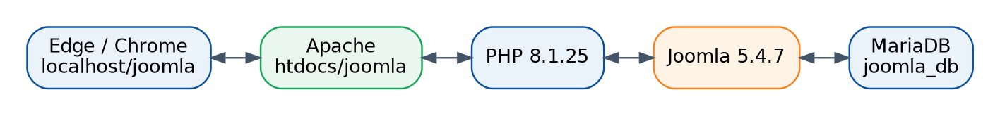

**Hình 3.7. Quy trình quản trị và công bố một bài viết***  
Nguồn: Sinh viên thực hiện.*

## 3.15. Sao lưu và phục hồi

Sao lưu được thiết kế theo nguyên tắc tách hai thành phần: mã nguồn và
cơ sở dữ liệu. Chỉ sao chép thư mục Joomla sẽ không bảo toàn đầy đủ nội
dung, còn chỉ lưu SQL sẽ thiếu template, media và file tùy chỉnh.

Trước hết, Backup source bằng cách sao chép toàn bộ thư mục website dưới
htdocs. Bản sao chứa mã Joomla, template, media và user.css – các thành
phần cần thiết để dựng lại giao diện. Điều này giúp nội dung trong báo
cáo có thể đối chiếu trực tiếp với website thay vì chỉ dừng ở mô tả lý
thuyết.

Bên cạnh đó, Backup database bằng phpMyAdmin → Export và lưu thành
setup/joomla_db.sql hoặc file tương đương. Bản SQL lưu dữ liệu Article,
Category, Menu, Module, user và các cấu hình nằm trong database. Cách tổ
chức như vậy phù hợp với quy mô đồ án và vẫn giữ khả năng mở rộng khi dữ
liệu tăng lên.

Về mặt triển khai, Phục hồi source bằng cách copy lại thư mục vào
htdocs. Tên thư mục cần được đối chiếu với URL local dự kiến để tránh
nhầm đường dẫn. Đây cũng là cơ sở để xác định test case và đánh giá kết
quả ở chương sau.

Từ góc độ quản trị, Phục hồi database bằng cách tạo database và Import
file SQL. Sau Import phải kiểm tra prefix bảng và thông tin kết nối
trong configuration.php. Nhờ đó, trách nhiệm của từng thành phần được
tách rõ, thuận lợi cho bảo trì và xử lý lỗi.

Đối với người sử dụng, Kiểm tra cuối gồm trang chủ, menu, bài viết,
module và Smart Search. Một bản import thành công về mặt kỹ thuật vẫn
chưa đủ nếu giao diện hoặc search chưa hoạt động đúng. Điểm quan trọng
là chức năng được mô tả đúng mức đã hiện thực, không gán thêm nghiệp vụ
chưa có trong sản phẩm.

Khi đối chiếu với phạm vi đề tài, Thông tin nhạy cảm không được đưa vào
báo cáo hoặc GitHub. Backup cần được quản lý cẩn thận vì file
configuration và database có thể chứa dữ liệu cấu hình nội bộ. Cách tiếp
cận này ưu tiên tính nhất quán, khả năng kiểm tra và khả năng bàn giao
hệ thống.

Quy trình backup/restore được đưa vào test case riêng nhằm chứng minh
khả năng bàn giao thay vì chỉ mô tả lý thuyết.

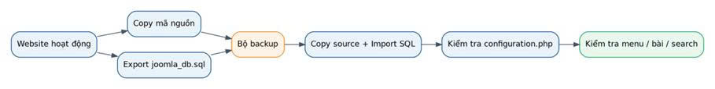

**Hình 3.8. Quy trình sao lưu và phục hồi website***  
Nguồn: Sinh viên thực hiện.*

## 3.16. Quản lý phiên bản bằng Git/GitHub

Git được áp dụng cho mã nguồn và tài liệu nhằm theo dõi thay đổi trong
suốt quá trình thực hiện. Repository được tổ chức thành các thư mục chức
năng thay vì đặt tất cả file ở một mức.

Trước hết, progress-report lưu báo cáo tuần, setup lưu hướng dẫn cài và
SQL, src/trungtamvieclam lưu source, thesis lưu tài liệu báo cáo. Cấu
trúc thư mục giúp người tiếp nhận nhanh chóng xác định loại tài nguyên
cần tìm. Điều này giúp nội dung trong báo cáo có thể đối chiếu trực tiếp
với website thay vì chỉ dừng ở mô tả lý thuyết.

Bên cạnh đó, Lệnh git init khởi tạo repository local, git add -A đưa
thay đổi vào staging và git commit tạo mốc phiên bản. Commit message nên
mô tả nội dung thay đổi để lịch sử có giá trị truy vết. Cách tổ chức như
vậy phù hợp với quy mô đồ án và vẫn giữ khả năng mở rộng khi dữ liệu
tăng lên.

Về mặt triển khai, git remote add origin liên kết repository local với
GitHub và git push -u origin master đưa lịch sử lên remote. GitHub đóng
vai trò lưu trữ phiên bản và hỗ trợ kiểm tra tiến độ bên ngoài máy phát
triển. Đây cũng là cơ sở để xác định test case và đánh giá kết quả ở
chương sau.

Từ góc độ quản trị, File database SQL có thể được quản lý như một bản
backup có kiểm soát nếu không chứa thông tin nhạy cảm. Tuy nhiên
database đang chạy không tự được Git đồng bộ, vì vậy vẫn cần quy trình
Export riêng. Nhờ đó, trách nhiệm của từng thành phần được tách rõ,
thuận lợi cho bảo trì và xử lý lỗi.

Đối với người sử dụng, configuration.php và các secret cần được kiểm tra
trước khi commit/push. Nguyên tắc này giúp tránh công bố password, token
hoặc khóa bí mật. Điểm quan trọng là chức năng được mô tả đúng mức đã
hiện thực, không gán thêm nghiệp vụ chưa có trong sản phẩm.

Khi đối chiếu với phạm vi đề tài, Khi hoàn thiện báo cáo, commit cuối
nên đi kèm trạng thái sản phẩm đã kiểm thử. Điều này tạo một mốc bàn
giao rõ ràng và thuận tiện đối chiếu với tài liệu. Cách tiếp cận này ưu
tiên tính nhất quán, khả năng kiểm tra và khả năng bàn giao hệ thống.

Git/GitHub bổ sung tính quản trị kỹ thuật cho đồ án và không được nhầm
với hosting website production.

**Hình 3.9. Quy trình cập nhật mã nguồn lên GitHub***  
Nguồn: Sinh viên thực hiện.*

## 3.17. Thiết kế kiểm thử

Kiểm thử được xây dựng theo các chức năng có thể quan sát từ sản phẩm và
các thao tác vận hành quan trọng. Mỗi test case có đầu vào hoặc hành
động cụ thể, kết quả mong đợi và trạng thái đánh giá.

Trước hết, Nhóm kiểm thử giao diện xác nhận trang chủ, banner, module và
menu hiển thị đúng. Đây là bước cơ bản để bảo đảm người dùng có thể tiếp
cận các chức năng khác. Điều này giúp nội dung trong báo cáo có thể đối
chiếu trực tiếp với website thay vì chỉ dừng ở mô tả lý thuyết.

Bên cạnh đó, Nhóm kiểm thử nội dung xác nhận Giới thiệu, Việc làm, Nhà
tuyển dụng, Tin tức, Thông báo và Liên hệ mở đúng. Việc kiểm tra theo
menu phát hiện nhanh lỗi liên kết hoặc Category chưa publish. Cách tổ
chức như vậy phù hợp với quy mô đồ án và vẫn giữ khả năng mở rộng khi dữ
liệu tăng lên.

Về mặt triển khai, Nhóm kiểm thử tra cứu sử dụng từ khóa “nhân viên” và
lần lượt kiểm tra năm ngành. Test bằng dữ liệu cụ thể đáng tin cậy hơn
việc chỉ quan sát rằng form tìm kiếm tồn tại. Đây cũng là cơ sở để xác
định test case và đánh giá kết quả ở chương sau.

Từ góc độ quản trị, Nhóm kiểm thử database kiểm tra sự hiện diện của các
bảng, Export và Import SQL. Đây là bằng chứng cho khả năng sao lưu và
phục hồi dữ liệu. Nhờ đó, trách nhiệm của từng thành phần được tách rõ,
thuận lợi cho bảo trì và xử lý lỗi.

Đối với người sử dụng, Nhóm kiểm thử source kiểm tra sao lưu và phục hồi
thư mục website. Sau phục hồi cần chạy website và đối chiếu các module
thay vì chỉ kiểm tra file đã copy. Điểm quan trọng là chức năng được mô
tả đúng mức đã hiện thực, không gán thêm nghiệp vụ chưa có trong sản
phẩm.

Khi đối chiếu với phạm vi đề tài, Kết quả “Đạt” chỉ được ghi khi hành vi
thực tế phù hợp đầu ra mong đợi. Các giới hạn như địa điểm chưa lọc độc
lập vẫn được giữ trong phần hạn chế thay vì bỏ qua. Cách tiếp cận này ưu
tiên tính nhất quán, khả năng kiểm tra và khả năng bàn giao hệ thống.

Bảng dưới đây là bộ test case được sử dụng ở Chương 4 để tổng hợp kết
quả thực hiện.

**Hình 3.10. Chu trình thực hiện test case***  
Nguồn: Sinh viên thực hiện.*

**Bảng 3.8. Bộ test case chức năng và vận hành**

| **STT** | **Nội dung**               | **Thao tác**         | **Kết quả mong đợi**       |
|---------|----------------------------|----------------------|----------------------------|
| 1       | Trang chủ (banner, module) | Mở localhost/joomla/ | Các khối chính hiển thị    |
| 2       | Menu chính                 | Nhấp từng mục        | Đi đúng nội dung           |
| 3       | Trang Giới thiệu           | Mở Giới thiệu        | Hiển thị bài giới thiệu    |
| 4       | Danh sách việc làm         | Mở Việc làm          | Hiển thị danh sách         |
| 5       | Danh mục 5 ngành           | Mở khu ngành         | Đủ 5 nhóm                  |
| 6       | Tìm kiếm “nhân viên”       | Nhập từ khóa và tìm  | Có kết quả phù hợp         |
| 7       | Lọc từng ngành             | Chọn mỗi ngành       | Kết quả theo nhóm          |
| 8       | Chi tiết việc làm          | Mở một bài           | Đủ nội dung chi tiết       |
| 9       | Nhà tuyển dụng             | Mở menu NTD          | Hiển thị bài doanh nghiệp  |
| 10      | Tin tức & sự kiện          | Mở menu Tin tức      | Hiển thị nội dung          |
| 11      | Liên hệ/footer             | Cuộn/ mở Liên hệ     | Có hotline/email/địa chỉ   |
| 12      | Kiểm tra bảng CSDL         | Mở phpMyAdmin        | Có bảng Joomla             |
| 13      | Export CSDL                | Export joomla_db     | Tạo file SQL               |
| 14      | Import/phục hồi CSDL       | Import SQL vào DB    | Dữ liệu được phục hồi      |
| 15      | Sao lưu thư mục            | Copy source          | Có bản sao đầy đủ          |
| 16      | Phục hồi website           | Copy source + DB     | Site chạy và nội dung đúng |

*Nguồn: Sinh viên tổng hợp từ nội dung đồ án.*

## 3.18. Kết luận chương

Chương 3 đã mô tả toàn bộ chuỗi từ yêu cầu đến hiện thực: xác định hai
tác nhân, mô hình hóa use case, thiết kế tìm kiếm, kiến trúc, dữ liệu,
nội dung, giao diện, cài đặt, cấu hình và kiểm thử.

Trước hết, Use case được giới hạn đúng vào chức năng website thông tin.
Nhờ vậy mô hình không chứa các quy trình ứng tuyển hoặc quản lý CV chưa
có trong sản phẩm. Điều này giúp nội dung trong báo cáo có thể đối chiếu
trực tiếp với website thay vì chỉ dừng ở mô tả lý thuyết.

Bên cạnh đó, Joomla cung cấp phần lớn cấu trúc nghiệp vụ thông qua
Article, Category, Menu, Module và Smart Search. Công việc phát triển
tập trung vào tổ chức và cấu hình hơn là xây framework quản trị mới.
Cách tổ chức như vậy phù hợp với quy mô đồ án và vẫn giữ khả năng mở
rộng khi dữ liệu tăng lên.

Về mặt triển khai, Thiết kế dữ liệu sử dụng các bảng lõi Joomla với
database joomla_db. Điều này giúp bảo đảm tương thích với CMS và giảm
rủi ro tự tạo schema không cần thiết. Đây cũng là cơ sở để xác định test
case và đánh giá kết quả ở chương sau.

Từ góc độ quản trị, Giao diện được tùy chỉnh trên Cassiopeia bằng
user.css và module. Cách làm cho phép giữ được tính dễ bảo trì trong khi
vẫn tạo nhận diện riêng cho website. Nhờ đó, trách nhiệm của từng thành
phần được tách rõ, thuận lợi cho bảo trì và xử lý lỗi.

Đối với người sử dụng, Backup/restore và Git/GitHub được đưa vào cùng
quy trình hiện thực. Đồ án vì vậy có thêm khả năng bàn giao và truy vết
thay đổi, không chỉ dừng ở chạy demo trên máy phát triển. Điểm quan
trọng là chức năng được mô tả đúng mức đã hiện thực, không gán thêm
nghiệp vụ chưa có trong sản phẩm.

Khi đối chiếu với phạm vi đề tài, Bộ test case đã được chuẩn bị để đánh
giá kết quả theo từng nhóm chức năng. Chương 4 sẽ đối chiếu trực tiếp
sản phẩm chạy thực tế với các tiêu chí này. Cách tiếp cận này ưu tiên
tính nhất quán, khả năng kiểm tra và khả năng bàn giao hệ thống.

Trên nền tảng thiết kế đã trình bày, chương tiếp theo tập trung vào giao
diện hoàn thành, kết quả thử nghiệm và mức độ đáp ứng mục tiêu.

# CHƯƠNG 4. KẾT QUẢ THỰC HIỆN VÀ ĐÁNH GIÁ

Chương 4 trình bày kết quả website sau khi cấu hình và tùy chỉnh, đồng
thời đánh giá dựa trên bộ test case của Chương 3. Các hình ảnh và bảng
biểu tập trung vào những gì người dùng và quản trị viên có thể quan sát.
Những chức năng chưa được triển khai được nêu rõ trong phần hạn chế,
không suy diễn thành kết quả đã đạt.

## 4.1. Môi trường chạy thử

Website được kiểm thử trên máy cá nhân trong môi trường XAMPP. Việc ghi
rõ phiên bản giúp kết quả có khả năng lặp lại và làm cơ sở khi xử lý
khác biệt ở một máy khác.

Trước hết, Joomla sử dụng phiên bản 5.4.7 và template Cassiopeia. Đây là
nền tảng trực tiếp tạo cấu trúc nội dung và giao diện site. Điều này
giúp nội dung trong báo cáo có thể đối chiếu trực tiếp với website thay
vì chỉ dừng ở mô tả lý thuyết.

Bên cạnh đó, Apache 2.4.58 và PHP 8.1.25 cung cấp web server và runtime.
Hai thành phần phải hoạt động đồng thời để request localhost được Joomla
xử lý. Cách tổ chức như vậy phù hợp với quy mô đồ án và vẫn giữ khả năng
mở rộng khi dữ liệu tăng lên.

Về mặt triển khai, MariaDB 10.4.32 lưu database joomla_db. Việc kiểm thử
dữ liệu được thực hiện thông qua cả Joomla Administrator và phpMyAdmin.
Đây cũng là cơ sở để xác định test case và đánh giá kết quả ở chương
sau.

Từ góc độ quản trị, Edge/Chrome được dùng để quan sát front-end, còn
Visual Studio Code được dùng khi cần chỉnh user.css hoặc tài liệu. Tách
editor với trình duyệt tạo vòng lặp chỉnh sửa – làm mới – kiểm tra rõ
ràng. Nhờ đó, trách nhiệm của từng thành phần được tách rõ, thuận lợi
cho bảo trì và xử lý lỗi.

Đối với người sử dụng, Ngrok chỉ được xem là công cụ thử truy cập tạm
thời từ Internet. Kết quả không được dùng để khẳng định website đã triển
khai production hoặc có độ sẵn sàng của hosting thật. Điểm quan trọng là
chức năng được mô tả đúng mức đã hiện thực, không gán thêm nghiệp vụ
chưa có trong sản phẩm.

Khi đối chiếu với phạm vi đề tài, Địa chỉ chính là
http://localhost/joomla/ và khu quản trị là /administrator/. Việc dùng
URL cố định trong quá trình test giúp các bước và ảnh minh họa dễ đối
chiếu. Cách tiếp cận này ưu tiên tính nhất quán, khả năng kiểm tra và
khả năng bàn giao hệ thống.

Kết quả trong chương này vì vậy đại diện cho môi trường local đã xác
định, không phải đánh giá tải lớn hay bảo mật production.

**Bảng 4.1. Môi trường kiểm thử**

| **Thành phần** | **Phiên bản/giá trị**       | **Mục đích**          |
|----------------|-----------------------------|-----------------------|
| Joomla         | 5.4.7                       | CMS                   |
| Cassiopeia     | Template mặc định tùy chỉnh | Giao diện             |
| Apache         | 2.4.58                      | Web server            |
| PHP            | 8.1.25                      | Runtime               |
| MariaDB        | 10.4.32                     | Database              |
| Database       | joomla_db                   | Lưu nội dung/cấu hình |
| Trình duyệt    | Edge / Chrome               | Kiểm thử front-end    |
| Môi trường     | XAMPP local                 | Chạy website          |

*Nguồn: Sinh viên tổng hợp từ nội dung đồ án.*

## 4.2. Kết quả trang chủ

Trang chủ là phần thể hiện rõ nhất kết quả tích hợp giữa menu, Custom
Module, Cassiopeia và CSS. Ảnh chụp thực tế cho thấy giao diện sử dụng
tông xanh, banner tuyển dụng, thanh tìm kiếm và các khối nội dung chính.

Trước hết, Menu ngang nằm ở đầu trang với các mục Trang chủ, Tin tức &
sự kiện, Nhà tuyển dụng, Giới thiệu Trung tâm, Việc làm và Liên hệ. Mục
đang được chọn được phân biệt bằng nền xanh lá, giúp người dùng nhận
biết trạng thái điều hướng. Điều này giúp nội dung trong báo cáo có thể
đối chiếu trực tiếp với website thay vì chỉ dừng ở mô tả lý thuyết.

Bên cạnh đó, Tiêu đề “TRUNG TÂM DỊCH VỤ VIỆC LÀM” được đặt ở khu vực
đầu, phía dưới menu. Vị trí này làm rõ nhận diện site trước khi người
dùng đi vào nội dung tuyển dụng. Cách tổ chức như vậy phù hợp với quy mô
đồ án và vẫn giữ khả năng mở rộng khi dữ liệu tăng lên.

Về mặt triển khai, Banner lớn truyền tải thông điệp “KẾT NỐI NGƯỜI LAO
ĐỘNG VỚI NHÀ TUYỂN DỤNG” và sử dụng hình ảnh người lao động. Banner phù
hợp với mục tiêu giới thiệu và tạo điểm nhìn chính trên màn hình
desktop. Đây cũng là cơ sở để xác định test case và đánh giá kết quả ở
chương sau.

Từ góc độ quản trị, Bốn giá trị “Việc làm phong phú”, “Tư vấn miễn phí”,
“Định hướng nghề nghiệp”, “Đồng hành phát triển” được trình bày bằng
icon. Các thông điệp ngắn giúp người dùng hiểu nhanh vai trò của Trung
tâm. Nhờ đó, trách nhiệm của từng thành phần được tách rõ, thuận lợi cho
bảo trì và xử lý lỗi.

Đối với người sử dụng, Thanh tìm kiếm gồm ô từ khóa, địa điểm, chọn
ngành nghề và nút TÌM KIẾM màu cam. Công cụ chính được đặt ngay trên
banner, giảm quãng đường thao tác cho người muốn tra cứu. Điểm quan
trọng là chức năng được mô tả đúng mức đã hiện thực, không gán thêm
nghiệp vụ chưa có trong sản phẩm.

Khi đối chiếu với phạm vi đề tài, Bên dưới banner có khu “VIỆC LÀM NỔI
BẬT” và “DANH MỤC NGÀNH NGHỀ”. Cách chia hai cột hỗ trợ đồng thời người
dùng muốn xem gợi ý và người muốn duyệt theo nhóm. Cách tiếp cận này ưu
tiên tính nhất quán, khả năng kiểm tra và khả năng bàn giao hệ thống.

Ảnh dưới đây là screenshot thực tế do người thực hiện cung cấp, được sử
dụng làm bằng chứng trực quan cho kết quả trang chủ.

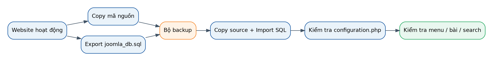

**Hình 4.1. Giao diện trang chủ website Trung tâm việc làm***  
Nguồn: Ảnh chụp website thực tế do sinh viên cung cấp.*

## 4.3. Kết quả điều hướng và giới thiệu

Hệ thống điều hướng đã được tổ chức theo các nhóm nội dung mà người dùng
có thể dự đoán trước. Thay vì buộc người dùng quay lại trang chủ sau mỗi
lần xem, menu chính được duy trì nhất quán trên các trang.

Trước hết, Trang chủ đóng vai trò điểm tổng hợp và là đích mặc định khi
truy cập site. Từ đây người dùng có thể đi tới việc làm, nhà tuyển dụng,
tin tức hoặc liên hệ chỉ với một lần chọn menu. Điều này giúp nội dung
trong báo cáo có thể đối chiếu trực tiếp với website thay vì chỉ dừng ở
mô tả lý thuyết.

Bên cạnh đó, Trang Giới thiệu Trung tâm trình bày vai trò kết nối người
lao động và doanh nghiệp, dịch vụ tư vấn và định hướng nghề nghiệp. Nội
dung này tạo ngữ cảnh tổ chức cho toàn bộ website. Cách tổ chức như vậy
phù hợp với quy mô đồ án và vẫn giữ khả năng mở rộng khi dữ liệu tăng
lên.

Về mặt triển khai, Tên menu được viết ngắn, quen thuộc và hạn chế dùng
thuật ngữ kỹ thuật Joomla. Người dùng không cần biết Article hoặc
Category để hiểu cách điều hướng. Đây cũng là cơ sở để xác định test
case và đánh giá kết quả ở chương sau.

Từ góc độ quản trị, Breadcrumbs có thể hiển thị đường dẫn ở trang con
khi được bật. Thành phần này hỗ trợ định vị khi người dùng đi sâu vào
bài viết hoặc category. Nhờ đó, trách nhiệm của từng thành phần được
tách rõ, thuận lợi cho bảo trì và xử lý lỗi.

Đối với người sử dụng, Các menu item được quản trị trong Joomla
Administrator. Thay đổi nhãn hoặc thứ tự không đòi hỏi sửa HTML của từng
trang. Điểm quan trọng là chức năng được mô tả đúng mức đã hiện thực,
không gán thêm nghiệp vụ chưa có trong sản phẩm.

Khi đối chiếu với phạm vi đề tài, Kết quả kiểm tra các mục chính đều mở
được nội dung tương ứng. Không ghi nhận liên kết chính bị lỗi trong bộ
test case đã thực hiện. Cách tiếp cận này ưu tiên tính nhất quán, khả
năng kiểm tra và khả năng bàn giao hệ thống.

Kết quả điều hướng đáp ứng mục tiêu của một website thông tin quy mô
nhỏ: cấu trúc rõ, số cấp không sâu và nội dung được nhóm theo chức năng.

## 4.4. Kết quả nhóm việc làm

Nhóm Việc làm được xây dựng bằng Article và Category để quản trị viên có
thể cập nhật tin mà không thay đổi cấu trúc giao diện. Dữ liệu minh họa
bao phủ nhiều kiểu công việc nhằm phục vụ kiểm thử danh sách và tìm
kiếm.

Trước hết, Bài “Tuyển dụng việc làm” có thể đóng vai trò nội dung tổng
hợp các vị trí văn phòng, kinh doanh, bán hàng và kỹ thuật. Bài tổng hợp
giúp website có một điểm giới thiệu nhanh bên cạnh các Article chi tiết.
Điều này giúp nội dung trong báo cáo có thể đối chiếu trực tiếp với
website thay vì chỉ dừng ở mô tả lý thuyết.

Bên cạnh đó, Bài “Nhân viên văn phòng” mô tả hành chính, hồ sơ, nhập
liệu; yêu cầu có thể gồm THPT và kỹ năng Word/Excel. Nội dung được viết
theo cấu trúc công việc – yêu cầu – quyền lợi để dễ đọc và dễ index.
Cách tổ chức như vậy phù hợp với quy mô đồ án và vẫn giữ khả năng mở
rộng khi dữ liệu tăng lên.

Về mặt triển khai, Bài “Nhân viên kinh doanh” tập trung vào tư vấn khách
hàng, giới thiệu dịch vụ và chăm sóc khách hàng. Từ khóa chức danh và
nghiệp vụ tạo dữ liệu phù hợp cho Smart Search. Đây cũng là cơ sở để xác
định test case và đánh giá kết quả ở chương sau.

Từ góc độ quản trị, Các bài bán hàng, kỹ thuật, phổ thông và bán thời
gian mở rộng phạm vi dữ liệu. Nhiều kiểu nội dung giúp kiểm tra Category
và truy vấn từ khóa trong điều kiện gần thực tế hơn. Nhờ đó, trách nhiệm
của từng thành phần được tách rõ, thuận lợi cho bảo trì và xử lý lỗi.

Đối với người sử dụng, Khu việc làm nổi bật trên trang chủ sử dụng ví dụ
Vietcombank, FPT và Thế Giới Di Động. Card tóm tắt vị trí, địa điểm và
mức lương giúp người dùng đánh giá nhanh trước khi mở chi tiết. Điểm
quan trọng là chức năng được mô tả đúng mức đã hiện thực, không gán thêm
nghiệp vụ chưa có trong sản phẩm.

Khi đối chiếu với phạm vi đề tài, Hệ thống chưa có nút ứng tuyển tạo hồ
sơ trong database. Thông tin liên hệ/thời hạn là điểm kết thúc nghiệp vụ
của tin trong phiên bản hiện tại. Cách tiếp cận này ưu tiên tính nhất
quán, khả năng kiểm tra và khả năng bàn giao hệ thống.

Kết quả này phù hợp với phát biểu bài toán: quản trị, phân loại và công
bố thông tin việc làm chứ chưa quản lý quy trình tuyển dụng đầu cuối.

**Bảng 4.2. Một số dữ liệu việc làm minh họa**

| **Vị trí**                   | **Đơn vị/nhóm**    | **Địa điểm** | **Mức lương/thông tin**    |
|------------------------------|--------------------|--------------|----------------------------|
| Nhân viên Quan hệ khách hàng | Vietcombank        | TP.HCM       | 12–18 triệu                |
| Lập trình viên Java          | FPT                | Hà Nội       | 15–25 triệu                |
| Nhân viên bán hàng           | Thế Giới Di Động   | TP.HCM       | 8–12 triệu                 |
| Nhân viên văn phòng          | Việc làm văn phòng | Theo tin     | Hành chính/hồ sơ/nhập liệu |
| Nhân viên kỹ thuật           | Việc làm kỹ thuật  | Theo tin     | Bảo trì/hỗ trợ kỹ thuật    |

*Nguồn: Sinh viên tổng hợp từ nội dung đồ án.*

## 4.5. Kết quả danh mục ngành nghề

Năm nhóm ngành được đưa lên giao diện để tạo một lối duyệt song song với
thanh tìm kiếm. Mỗi nhóm được quản trị như một cấu trúc nội dung có thể
liên kết tới bài viết phù hợp.

Trước hết, Kế toán - Kiểm toán đại diện cho nhóm công việc tài chính, kế
toán và kiểm soát số liệu. Tên nhóm đủ cụ thể để người dùng nhận biết
ngay loại nội dung mong muốn. Điều này giúp nội dung trong báo cáo có
thể đối chiếu trực tiếp với website thay vì chỉ dừng ở mô tả lý thuyết.

Bên cạnh đó, Kinh doanh - Bán hàng tập hợp các vị trí tư vấn, phát triển
khách hàng và bán hàng. Đây là nhóm có thể chứa nhiều bài nên việc phân
loại giúp giảm danh sách hỗn hợp. Cách tổ chức như vậy phù hợp với quy
mô đồ án và vẫn giữ khả năng mở rộng khi dữ liệu tăng lên.

Về mặt triển khai, Công nghệ thông tin bao gồm các vị trí lập trình, kỹ
thuật hoặc hỗ trợ CNTT. Dữ liệu minh họa có thể dùng để kiểm tra truy
vấn như “Java” hoặc “kỹ thuật”. Đây cũng là cơ sở để xác định test case
và đánh giá kết quả ở chương sau.

Từ góc độ quản trị, Hành chính - Nhân sự dành cho công việc văn phòng,
hồ sơ và hỗ trợ nhân sự. Nhóm này tạo thêm cách tiếp cận ngoài từ khóa
chung “nhân viên”. Nhờ đó, trách nhiệm của từng thành phần được tách rõ,
thuận lợi cho bảo trì và xử lý lỗi.

Đối với người sử dụng, Marketing - Truyền thông chứa nội dung liên quan
tiếp thị, thương hiệu và truyền thông. Việc có đủ năm nhóm là một tiêu
chí riêng trong test case. Điểm quan trọng là chức năng được mô tả đúng
mức đã hiện thực, không gán thêm nghiệp vụ chưa có trong sản phẩm.

Khi đối chiếu với phạm vi đề tài, Kết quả kiểm thử từng nhóm đều ở trạng
thái Đạt. Điều này cho thấy cấu trúc category và liên kết hiển thị hoạt
động theo thiết kế. Cách tiếp cận này ưu tiên tính nhất quán, khả năng
kiểm tra và khả năng bàn giao hệ thống.

Phân ngành hiện ở mức cố định năm nhóm, đủ cho dữ liệu demo; khi mở rộng
thực tế có thể bổ sung cây ngành nhiều cấp.

**Bảng 4.3. Kết quả kiểm thử năm nhóm ngành**

| **STT** | **Ngành**                | **Kết quả** |
|---------|--------------------------|-------------|
| 1       | Kế toán - Kiểm toán      | Đạt         |
| 2       | Kinh doanh - Bán hàng    | Đạt         |
| 3       | Công nghệ thông tin      | Đạt         |
| 4       | Hành chính - Nhân sự     | Đạt         |
| 5       | Marketing - Truyền thông | Đạt         |

*Nguồn: Sinh viên tổng hợp từ nội dung đồ án.*

## 4.6. Kết quả tìm kiếm và lọc

Chức năng tìm kiếm đã được kiểm tra theo đúng luồng Smart Search: nhập
từ khóa, chọn ngành khi cần, gửi truy vấn và mở kết quả chi tiết. Việc
đánh giá tập trung vào từ khóa/ngành, không coi địa điểm là bộ lọc độc
lập đã hoàn thiện.

Trước hết, Với từ khóa “nhân viên”, Smart Search có thể trả về các
Article chứa tiêu đề hoặc nội dung phù hợp. Kết quả cho thấy chỉ mục đã
nhận nội dung việc làm và kết nối được với trang chi tiết. Điều này giúp
nội dung trong báo cáo có thể đối chiếu trực tiếp với website thay vì
chỉ dừng ở mô tả lý thuyết.

Bên cạnh đó, Khi kết hợp nhóm Kế toán - Kiểm toán, phạm vi kết quả được
thu hẹp theo cấu trúc ngành đang sử dụng. Ví dụ mong đợi có thể là bài
nhân viên kế toán tổng hợp hoặc nội dung tương đương trong dữ liệu hiện
tại. Cách tổ chức như vậy phù hợp với quy mô đồ án và vẫn giữ khả năng
mở rộng khi dữ liệu tăng lên.

Về mặt triển khai, Các nhóm ngành khác được kiểm tra lần lượt để phát
hiện Category chưa liên kết hoặc bài chưa publish. Bảng kết quả riêng ở
mục 4.5 cho thấy cả năm nhóm đều đạt. Đây cũng là cơ sở để xác định test
case và đánh giá kết quả ở chương sau.

Từ góc độ quản trị, Trường hợp không có từ khóa phù hợp được xử lý bằng
trạng thái không tìm thấy. Điều này giúp người dùng có phản hồi thay vì
hiểu nhầm website không hoạt động. Nhờ đó, trách nhiệm của từng thành
phần được tách rõ, thuận lợi cho bảo trì và xử lý lỗi.

Đối với người sử dụng, Việc cập nhật Article cần đi kèm kiểm tra index
nếu bài mới không xuất hiện. Quy trình quản trị đã đưa bước Smart Search
vào sau khi công bố nội dung. Điểm quan trọng là chức năng được mô tả
đúng mức đã hiện thực, không gán thêm nghiệp vụ chưa có trong sản phẩm.

Khi đối chiếu với phạm vi đề tài, Ô địa điểm trên form hiện chủ yếu phục
vụ bố cục. Hướng phát triển sẽ chuyển trường này thành metadata/field có
thể lọc thật cùng mức lương và hình thức làm việc. Cách tiếp cận này ưu
tiên tính nhất quán, khả năng kiểm tra và khả năng bàn giao hệ thống.

Kết quả tìm kiếm đáp ứng yêu cầu cốt lõi của đề tài: tra cứu nội dung
việc làm theo từ khóa và hỗ trợ thu hẹp theo nhóm nghề.

| **Ví dụ kiểm thử:** Nhập từ khóa “nhân viên”, chọn nhóm “Kế toán - Kiểm toán”, nhấn TÌM KIẾM; Smart Search xử lý trên chỉ mục và trả Article phù hợp nếu dữ liệu đã Published/indexed. Sau đó chọn tiêu đề để mở chi tiết. |
|----------------------------------------------------------------------------------------------------------------------------------------------------------------------------------------------------------------------------|

## 4.7. Kết quả nhà tuyển dụng

Nhóm Nhà tuyển dụng được triển khai dưới dạng Article/Category nhằm cung
cấp thông tin doanh nghiệp và nhu cầu tuyển dụng. Do chưa có tài khoản
doanh nghiệp, nội dung được quản trị viên của site nhập và cập nhật.

Trước hết, Công ty TNHH Kỹ Thuật Tiên Phong được dùng làm dữ liệu minh
họa cho doanh nghiệp dịch vụ và thương mại. Bài có thể chứa địa chỉ, nhu
cầu tuyển nhân viên văn phòng/kinh doanh và thời hạn nộp hồ sơ. Điều này
giúp nội dung trong báo cáo có thể đối chiếu trực tiếp với website thay
vì chỉ dừng ở mô tả lý thuyết.

Bên cạnh đó, Công ty TNHH New Zealand Infinite Power minh họa vị trí cấp
quản lý tại TP.HCM. Thông tin mức lương 35–50 triệu và mô tả chiến lược
thương hiệu/marketing tạo nội dung phong phú cho tra cứu. Cách tổ chức
như vậy phù hợp với quy mô đồ án và vẫn giữ khả năng mở rộng khi dữ liệu
tăng lên.

Về mặt triển khai, Mỗi doanh nghiệp được trình bày bằng bài viết thay vì
một hồ sơ doanh nghiệp có bảng dữ liệu riêng. Cách này phù hợp phạm vi
CMS thông tin nhưng giới hạn khả năng lọc doanh nghiệp theo thuộc tính.
Đây cũng là cơ sở để xác định test case và đánh giá kết quả ở chương
sau.

Từ góc độ quản trị, Nhà tuyển dụng chưa thể tự đăng, sửa hoặc ẩn tin.
Quản trị viên chịu trách nhiệm công bố nội dung và kiểm tra trước khi
hiển thị. Nhờ đó, trách nhiệm của từng thành phần được tách rõ, thuận
lợi cho bảo trì và xử lý lỗi.

Đối với người sử dụng, Trang doanh nghiệp được truy cập qua menu Nhà
tuyển dụng. Điều này tạo một kênh riêng giúp người dùng tìm hiểu nguồn
tuyển dụng mà không phải duyệt toàn bộ tin việc làm. Điểm quan trọng là
chức năng được mô tả đúng mức đã hiện thực, không gán thêm nghiệp vụ
chưa có trong sản phẩm.

Khi đối chiếu với phạm vi đề tài, Nếu phát triển tiếp, có thể chuyển
doanh nghiệp thành tài khoản/role riêng kèm workflow đăng tin. Đó là mở
rộng nghiệp vụ chứ không được tính vào kết quả phiên bản hiện tại. Cách
tiếp cận này ưu tiên tính nhất quán, khả năng kiểm tra và khả năng bàn
giao hệ thống.

Nhóm Nhà tuyển dụng vì vậy đáp ứng vai trò “giới thiệu thông tin doanh
nghiệp” trong cổng thông tin, chưa phải cổng tự phục vụ của doanh
nghiệp.

**Bảng 4.4. Dữ liệu nhà tuyển dụng minh họa**

| **Nhà tuyển dụng**                      | **Thông tin chính**                           | **Nhu cầu/vị trí**                                                   |
|-----------------------------------------|-----------------------------------------------|----------------------------------------------------------------------|
| Công ty TNHH Kỹ Thuật Tiên Phong        | 437/33 Hoàng Văn Thụ, P. Tân Sơn Nhất, TP.HCM | Nhân viên văn phòng, Kinh doanh; thời hạn 01–05/09/2026              |
| Công ty TNHH New Zealand Infinite Power | TP.HCM; dữ liệu minh họa                      | Giám đốc/Phó Giám đốc; 35–50 triệu; chiến lược thương hiệu/marketing |

*Nguồn: Sinh viên tổng hợp từ nội dung đồ án.*

## 4.8. Tin tức, thông báo và liên hệ

Ngoài tuyển dụng, website đã tổ chức các nhóm nội dung bổ trợ để thể
hiện đầy đủ vai trò thông tin của Trung tâm. Các nhóm này sử dụng cùng
cơ chế Article/Category nên quản trị viên có thể cập nhật thống nhất.

Trước hết, Tin tức & sự kiện dùng để đăng các hoạt động, nội dung hướng
nghiệp hoặc thông tin liên quan thị trường lao động. Việc tách khỏi việc
làm giúp người dùng không nhầm bài tin với một vị trí tuyển dụng. Điều
này giúp nội dung trong báo cáo có thể đối chiếu trực tiếp với website
thay vì chỉ dừng ở mô tả lý thuyết.

Bên cạnh đó, Thông báo dùng cho nội dung cần phổ biến theo thời điểm, ví
dụ thông báo tuyển dụng mới nhất. Nhóm riêng giúp quản trị viên tạo một
kênh cập nhật ngắn hạn mà không làm rối danh sách tin tức. Cách tổ chức
như vậy phù hợp với quy mô đồ án và vẫn giữ khả năng mở rộng khi dữ liệu
tăng lên.

Về mặt triển khai, Trang Liên hệ và footer cung cấp hotline 0909 000
000, email minh họa vieclam@example.com và địa chỉ TP. Hồ Chí Minh. Các
kênh Facebook/Zalo có thể được đưa vào module để tạo điểm liên hệ trực
tiếp. Đây cũng là cơ sở để xác định test case và đánh giá kết quả ở
chương sau.

Từ góc độ quản trị, Email cấu hình site nhult161101@tvu-onschool.edu.vn
là thông tin kỹ thuật khác với email minh họa hiển thị công khai. Báo
cáo phân biệt hai giá trị để tránh nhầm dữ liệu cấu hình và dữ liệu giao
diện. Nhờ đó, trách nhiệm của từng thành phần được tách rõ, thuận lợi
cho bảo trì và xử lý lỗi.

Đối với người sử dụng, Các module liên hệ có thể tái sử dụng ở footer
trên nhiều trang. Một lần cập nhật module có thể thay đổi thông tin hiển
thị đồng loạt theo cấu hình. Điểm quan trọng là chức năng được mô tả
đúng mức đã hiện thực, không gán thêm nghiệp vụ chưa có trong sản phẩm.

Khi đối chiếu với phạm vi đề tài, Kết quả kiểm thử Tin tức, Liên
hệ/footer và các nội dung liên quan đều đạt trong bộ test case. Đây là
bằng chứng website không chỉ hoàn thành phần banner mà có đủ các nhánh
thông tin đã xác định. Cách tiếp cận này ưu tiên tính nhất quán, khả
năng kiểm tra và khả năng bàn giao hệ thống.

Các nhóm bổ trợ làm hoàn chỉnh cấu trúc cổng thông tin và tạo nền để mở
rộng nội dung khi website được đưa vào sử dụng thực tế.

## 4.9. Kết quả khu vực quản trị

Khu Administrator là phần chứng minh lợi ích chính của việc dùng CMS.
Quản trị viên có thể thay đổi phần lớn nội dung và cấu trúc site thông
qua giao diện quản trị thay vì chỉnh file HTML thủ công.

Trước hết, Content → Articles cho phép tạo, sửa, publish/unpublish bài
viết. Tin việc làm, giới thiệu, tin tức và doanh nghiệp đều có thể được
cập nhật bằng cùng một quy trình. Điều này giúp nội dung trong báo cáo
có thể đối chiếu trực tiếp với website thay vì chỉ dừng ở mô tả lý
thuyết.

Bên cạnh đó, Content → Categories cho phép duy trì cây danh mục. Khi cần
thêm nhóm nội dung, quản trị viên có thể cấu hình mà không phải thay đổi
database thủ công. Cách tổ chức như vậy phù hợp với quy mô đồ án và vẫn
giữ khả năng mở rộng khi dữ liệu tăng lên.

Về mặt triển khai, Menus quản lý điều hướng và đích menu item. Thứ tự
menu có thể thay đổi độc lập với nội dung Article. Đây cũng là cơ sở để
xác định test case và đánh giá kết quả ở chương sau.

Từ góc độ quản trị, Site Modules quản lý banner, Custom HTML, login và
breadcrumbs. Đây là nơi kiểm soát nội dung khối và vị trí hiển thị theo
template. Nhờ đó, trách nhiệm của từng thành phần được tách rõ, thuận
lợi cho bảo trì và xử lý lỗi.

Đối với người sử dụng, Components → Smart Search hỗ trợ theo dõi chỉ
mục. Quản trị viên có thể chủ động xử lý trường hợp bài mới chưa xuất
hiện trong kết quả. Điểm quan trọng là chức năng được mô tả đúng mức đã
hiện thực, không gán thêm nghiệp vụ chưa có trong sản phẩm.

Khi đối chiếu với phạm vi đề tài, Các thay đổi CSS nâng cao vẫn được
thực hiện trong user.css. Cách kết hợp UI quản trị với file tùy chỉnh
cho phép vừa thân thiện với người dùng nội dung vừa đủ linh hoạt về
thiết kế. Cách tiếp cận này ưu tiên tính nhất quán, khả năng kiểm tra và
khả năng bàn giao hệ thống.

Khu quản trị đáp ứng đúng mục tiêu “không phải lập trình hệ thống quản
trị từ đầu” và là điểm khác biệt cốt lõi so với một website HTML tĩnh.

## 4.10. Kết quả kiểm thử

Bộ 16 test case đã được thực hiện trên website local sau khi hoàn thiện
nội dung và cấu hình. Kết quả tổng hợp cho thấy các hạng mục trong phạm
vi đều ở trạng thái Đạt.

Trước hết, Trang chủ, menu, Giới thiệu và danh sách Việc làm hiển thị
đúng. Các đường đi cơ bản cho khách truy cập hoạt động liên tục từ trang
đầu tới nội dung. Điều này giúp nội dung trong báo cáo có thể đối chiếu
trực tiếp với website thay vì chỉ dừng ở mô tả lý thuyết.

Bên cạnh đó, Năm nhóm ngành và chức năng tìm kiếm từ khóa “nhân viên”
được kiểm tra. Nhóm tra cứu đáp ứng yêu cầu chính về khả năng tìm/lọc
nội dung. Cách tổ chức như vậy phù hợp với quy mô đồ án và vẫn giữ khả
năng mở rộng khi dữ liệu tăng lên.

Về mặt triển khai, Chi tiết việc làm, Nhà tuyển dụng, Tin tức & sự kiện
và Liên hệ/footer đều được mở và đối chiếu. Các nhánh nội dung phụ không
bị bỏ sót trong quá trình nghiệm thu. Đây cũng là cơ sở để xác định test
case và đánh giá kết quả ở chương sau.

Từ góc độ quản trị, Database được kiểm tra bằng phpMyAdmin; Export và
Import đều được thực hiện. Kết quả xác nhận có thể tạo bản backup và
phục hồi dữ liệu Joomla. Nhờ đó, trách nhiệm của từng thành phần được
tách rõ, thuận lợi cho bảo trì và xử lý lỗi.

Đối với người sử dụng, Thư mục website được sao lưu và dùng trong kịch
bản phục hồi. Sau phục hồi, các trang và chức năng chính được kiểm tra
lại để tránh đánh giá chỉ dựa trên việc copy file. Điểm quan trọng là
chức năng được mô tả đúng mức đã hiện thực, không gán thêm nghiệp vụ
chưa có trong sản phẩm.

Khi đối chiếu với phạm vi đề tài, Không có test case ứng tuyển online
hoặc tài khoản nhà tuyển dụng. Đây là chủ ý vì các chức năng đó không
thuộc phạm vi sản phẩm hiện tại. Cách tiếp cận này ưu tiên tính nhất
quán, khả năng kiểm tra và khả năng bàn giao hệ thống.

Kết quả 16/16 test case Đạt chỉ phản ánh các tiêu chí chức năng/vận hành
đã xác định; không đồng nghĩa website đã được kiểm thử tải lớn, bảo mật
chuyên sâu hoặc production.

**Bảng 4.5. Kết quả 16 test case**

| **STT** | **Nội dung**               | **Kết quả** |
|---------|----------------------------|-------------|
| 1       | Trang chủ (banner, module) | Đạt         |
| 2       | Menu chính                 | Đạt         |
| 3       | Trang Giới thiệu           | Đạt         |
| 4       | Danh sách việc làm         | Đạt         |
| 5       | Danh mục 5 ngành           | Đạt         |
| 6       | Tìm kiếm “nhân viên”       | Đạt         |
| 7       | Lọc từng ngành             | Đạt         |
| 8       | Chi tiết việc làm          | Đạt         |
| 9       | Nhà tuyển dụng             | Đạt         |
| 10      | Tin tức & sự kiện          | Đạt         |
| 11      | Liên hệ/footer             | Đạt         |
| 12      | Kiểm tra bảng CSDL         | Đạt         |
| 13      | Export CSDL                | Đạt         |
| 14      | Import/phục hồi CSDL       | Đạt         |
| 15      | Sao lưu thư mục            | Đạt         |
| 16      | Phục hồi website           | Đạt         |

*Nguồn: Sinh viên tổng hợp từ nội dung đồ án.*

## 4.11. Khả năng sử dụng

Đánh giá khả năng sử dụng được thực hiện theo quan sát giao diện và số
bước hoàn thành các tác vụ cơ bản. Đây là đánh giá định tính trong phạm
vi đồ án, chưa phải nghiên cứu UX với mẫu người dùng lớn.

Trước hết, Menu chính luôn ở vùng đầu và sử dụng nhãn quen thuộc. Người
dùng mới có thể suy đoán nơi tìm việc làm, tin tức hoặc liên hệ mà không
cần hướng dẫn kỹ thuật. Điều này giúp nội dung trong báo cáo có thể đối
chiếu trực tiếp với website thay vì chỉ dừng ở mô tả lý thuyết.

Bên cạnh đó, Thanh tìm kiếm được đặt ngay trên banner. Tác vụ tra cứu
không bị ẩn sâu trong menu và có nút hành động tương phản cao. Cách tổ
chức như vậy phù hợp với quy mô đồ án và vẫn giữ khả năng mở rộng khi dữ
liệu tăng lên.

Về mặt triển khai, Các card ngành nghề và việc làm nổi bật tạo thêm lối
điều hướng trực quan. Người dùng có thể bắt đầu từ danh mục thay vì phải
biết chính xác từ khóa. Đây cũng là cơ sở để xác định test case và đánh
giá kết quả ở chương sau.

Từ góc độ quản trị, Màu xanh–xanh lá–cam được sử dụng nhất quán. Sự nhất
quán giúp phân biệt nền chính, trạng thái và hành động mà không cần quá
nhiều màu. Nhờ đó, trách nhiệm của từng thành phần được tách rõ, thuận
lợi cho bảo trì và xử lý lỗi.

Đối với người sử dụng, Nội dung Article theo mẫu mô tả – yêu cầu – quyền
lợi giúp người đọc quét thông tin. Cấu trúc nội dung là một phần của UX,
không chỉ CSS và hình ảnh. Điểm quan trọng là chức năng được mô tả đúng
mức đã hiện thực, không gán thêm nghiệp vụ chưa có trong sản phẩm.

Khi đối chiếu với phạm vi đề tài, Phiên bản desktop đạt mức trình bày
tốt hơn mobile. Đây là giới hạn cần ưu tiên khi phát triển responsive
trong phiên bản tiếp theo. Cách tiếp cận này ưu tiên tính nhất quán, khả
năng kiểm tra và khả năng bàn giao hệ thống.

Nhìn chung, giao diện đáp ứng mức sử dụng của một cổng thông tin demo và
vẫn còn không gian cải thiện về mobile, accessibility và search nâng
cao.

## 4.12. Mức độ đạt mục tiêu

Mức độ hoàn thành được đối chiếu trực tiếp với các mục tiêu đã nêu ở
Chương 1. Cách đánh giá theo từng mục tiêu giúp tránh kết luận chung
chung rằng website “hoàn thành” mà không chỉ ra cụ thể phần nào đã làm
được.

Trước hết, Mục tiêu tìm hiểu và áp dụng Joomla đạt thông qua Article,
Category, Menu, Module, Cassiopeia và Smart Search. Các thành phần được
sử dụng trong sản phẩm chứ không chỉ mô tả ở phần lý thuyết. Điều này
giúp nội dung trong báo cáo có thể đối chiếu trực tiếp với website thay
vì chỉ dừng ở mô tả lý thuyết.

Bên cạnh đó, Mục tiêu xây dựng cấu trúc Trung tâm đạt với các nhóm Giới
thiệu, Việc làm, Nhà tuyển dụng, Tin tức, Thông báo và Liên hệ. Cấu trúc
phù hợp với cổng thông tin và có dữ liệu minh họa để kiểm tra. Cách tổ
chức như vậy phù hợp với quy mô đồ án và vẫn giữ khả năng mở rộng khi dữ
liệu tăng lên.

Về mặt triển khai, Mục tiêu tra cứu đạt ở mức từ khóa và nhóm ngành. Ô
địa điểm chưa phải bộ lọc độc lập hoàn chỉnh nên chỉ được tính là phần
giao diện trong phiên bản này. Đây cũng là cơ sở để xác định test case
và đánh giá kết quả ở chương sau.

Từ góc độ quản trị, Mục tiêu tùy chỉnh giao diện đạt thông qua
Cassiopeia và user.css với bộ màu đã xác định. Ảnh trang chủ cho thấy
kết quả có nhận diện riêng thay vì giữ nguyên hoàn toàn template mặc
định. Nhờ đó, trách nhiệm của từng thành phần được tách rõ, thuận lợi
cho bảo trì và xử lý lỗi.

Đối với người sử dụng, Mục tiêu vận hành đạt thông qua XAMPP,
backup/restore và GitHub. Sản phẩm có hướng dẫn để cài lại và lưu phiên
bản, phù hợp yêu cầu bàn giao học phần. Điểm quan trọng là chức năng
được mô tả đúng mức đã hiện thực, không gán thêm nghiệp vụ chưa có trong
sản phẩm.

Khi đối chiếu với phạm vi đề tài, Các mục tiêu mở rộng như ứng tuyển
online, tài khoản NTD, CV và hosting không được xem là đã đạt. Chúng
được chuyển sang phần hạn chế và hướng phát triển để giữ tính trung thực
của báo cáo. Cách tiếp cận này ưu tiên tính nhất quán, khả năng kiểm tra
và khả năng bàn giao hệ thống.

Bảng đối chiếu cho thấy phạm vi cốt lõi của đề tài đã được đáp ứng, còn
các chức năng của một sàn tuyển dụng đầy đủ chưa nằm trong phiên bản
hiện tại.

**Bảng 4.6. Đối chiếu mục tiêu và kết quả**

| **Mục tiêu**                    | **Kết quả**                                             | **Mức đáp ứng**   |
|---------------------------------|---------------------------------------------------------|-------------------|
| Tìm hiểu Joomla CMS             | Dùng Article/Category/Menu/Module/Template/Smart Search | Đạt               |
| Xây website thông tin Trung tâm | Có các nhóm nội dung chính                              | Đạt               |
| Tìm kiếm và phân ngành          | Từ khóa + 5 nhóm ngành                                  | Đạt trong phạm vi |
| Tùy chỉnh giao diện             | Cassiopeia + user.css + bộ màu                          | Đạt               |
| Backup/restore                  | Source + SQL                                            | Đạt               |
| Quản lý phiên bản               | Git/GitHub repository                                   | Đạt               |
| Ứng tuyển/NTD tự đăng           | Chưa triển khai                                         | Ngoài phạm vi     |
| Hosting production              | Chưa triển khai                                         | Ngoài phạm vi     |

*Nguồn: Sinh viên tổng hợp từ nội dung đồ án.*

## 4.13. Ưu điểm và hạn chế

Kết quả cần được nhìn nhận đồng thời ở cả mặt đạt được và giới hạn. Việc
nêu rõ hạn chế giúp xác định đúng giá trị của phiên bản và tạo cơ sở
thực tế cho hướng phát triển.

Trước hết, Ưu điểm nổi bật là quản trị nội dung bằng Joomla, nên
đăng/sửa tin không yêu cầu chỉnh mã nguồn cho mỗi Article. Điều này giảm
phụ thuộc vào người lập trình trong công việc cập nhật hằng ngày. Điều
này giúp nội dung trong báo cáo có thể đối chiếu trực tiếp với website
thay vì chỉ dừng ở mô tả lý thuyết.

Bên cạnh đó, Cấu trúc menu và Category rõ, có năm nhóm ngành và Smart
Search. Người dùng có nhiều cách tiếp cận nội dung hơn một danh sách
tuyến tính. Cách tổ chức như vậy phù hợp với quy mô đồ án và vẫn giữ khả
năng mở rộng khi dữ liệu tăng lên.

Về mặt triển khai, Giao diện Cassiopeia đã được thay đổi bộ màu và bố
cục để phù hợp chủ đề việc làm. Sản phẩm có nhận diện riêng nhưng vẫn
giữ nền tảng dễ bảo trì của template mặc định. Đây cũng là cơ sở để xác
định test case và đánh giá kết quả ở chương sau.

Từ góc độ quản trị, Có quy trình backup/restore và GitHub. Hai cơ chế
này tăng khả năng bàn giao, phục hồi và truy vết thay đổi. Nhờ đó, trách
nhiệm của từng thành phần được tách rõ, thuận lợi cho bảo trì và xử lý
lỗi.

Đối với người sử dụng, Hạn chế lớn là website chỉ chạy XAMPP local, chưa
có hosting và cấu hình bảo mật production. Do đó chưa thể đánh giá độ
sẵn sàng 24/7, HTTPS, hiệu năng hoặc vận hành thực tế ngoài máy thử
nghiệm. Điểm quan trọng là chức năng được mô tả đúng mức đã hiện thực,
không gán thêm nghiệp vụ chưa có trong sản phẩm.

Khi đối chiếu với phạm vi đề tài, Nhà tuyển dụng chưa tự đăng tin; người
tìm việc chưa có tài khoản, CV hay ứng tuyển online. Website mới giải
quyết tầng thông tin chứ chưa quản lý vòng đời tuyển dụng. Cách tiếp cận
này ưu tiên tính nhất quán, khả năng kiểm tra và khả năng bàn giao hệ
thống.

Trước hết, Tìm kiếm chủ yếu dựa trên từ khóa và ngành; địa điểm mới ở
mức giao diện, dữ liệu minh họa còn ít. Khi dữ liệu lớn hơn cần mô hình
thuộc tính có cấu trúc cho địa điểm, lương và hình thức làm việc. Điều
này giúp nội dung trong báo cáo có thể đối chiếu trực tiếp với website
thay vì chỉ dừng ở mô tả lý thuyết.

Những hạn chế trên không phủ nhận kết quả đã đạt mà xác định đúng ranh
giới của một đồ án tìm hiểu CMS và xây dựng website thông tin.

**Bảng 4.7. Tổng hợp ưu điểm và hạn chế**

| **Nhóm** | **Nội dung**                                                                                                                  |
|----------|-------------------------------------------------------------------------------------------------------------------------------|
| Ưu điểm  | Quản trị bằng Joomla; menu/category rõ; Smart Search; 5 ngành; giao diện tùy chỉnh; backup/restore; GitHub.                   |
| Hạn chế  | Local XAMPP; chưa ứng tuyển online; chưa tài khoản NTD/CV; địa điểm chưa lọc độc lập; dữ liệu demo; Ngrok không phải hosting. |

*Nguồn: Sinh viên tổng hợp từ nội dung đồ án.*

## 4.14. Kết luận chương

Qua quá trình chạy thử và kiểm thử, website đã đáp ứng các yêu cầu trong
phạm vi đồ án: giới thiệu Trung tâm, đăng và phân loại việc làm, tìm
kiếm, lọc ngành, trình bày nhà tuyển dụng, tin tức, thông báo, liên hệ
và quản trị nội dung.

Trước hết, Ảnh trang chủ cho thấy phần giao diện đã được tùy chỉnh có
chủ đích trên Cassiopeia. Bộ màu và bố cục hỗ trợ chủ đề việc làm thay
vì giữ trạng thái mặc định của Joomla. Điều này giúp nội dung trong báo
cáo có thể đối chiếu trực tiếp với website thay vì chỉ dừng ở mô tả lý
thuyết.

Bên cạnh đó, Các nhóm Article/Category đã cung cấp đủ dữ liệu để kiểm
thử menu và tìm kiếm. Nội dung được tổ chức theo cấu trúc có thể mở rộng
khi số lượng tin tăng. Cách tổ chức như vậy phù hợp với quy mô đồ án và
vẫn giữ khả năng mở rộng khi dữ liệu tăng lên.

Về mặt triển khai, Smart Search đã tạo luồng tra cứu thực tế từ form tới
Article. Đây là chức năng tương tác cốt lõi ngoài việc đọc nội dung
tĩnh. Đây cũng là cơ sở để xác định test case và đánh giá kết quả ở
chương sau.

Từ góc độ quản trị, Bộ test case chức năng và vận hành đều đạt. Kết quả
bao gồm cả Export/Import database và phục hồi source, không chỉ kiểm thử
giao diện. Nhờ đó, trách nhiệm của từng thành phần được tách rõ, thuận
lợi cho bảo trì và xử lý lỗi.

Đối với người sử dụng, Giới hạn về ứng tuyển, CV, tài khoản NTD, địa
điểm và hosting được ghi rõ. Nhờ vậy kết luận không mô tả sản phẩm như
một sàn tuyển dụng hoàn chỉnh. Điểm quan trọng là chức năng được mô tả
đúng mức đã hiện thực, không gán thêm nghiệp vụ chưa có trong sản phẩm.

Khi đối chiếu với phạm vi đề tài, Các kết quả là nền để xây dựng lộ
trình phát triển sau đồ án. Chương 5 tổng kết giá trị đã đạt, bài học và
các hướng ưu tiên tiếp theo. Cách tiếp cận này ưu tiên tính nhất quán,
khả năng kiểm tra và khả năng bàn giao hệ thống.

Có thể kết luận phiên bản hiện tại hoàn thành mục tiêu của một website
giới thiệu thông tin Trung tâm Giới thiệu việc làm bằng Joomla trong môi
trường local.

# CHƯƠNG 5. KẾT LUẬN VÀ HƯỚNG PHÁT TRIỂN

Chương 5 tổng hợp những kết quả quan trọng của quá trình thực hiện, giá
trị học tập, giới hạn còn tồn tại và định hướng nâng cấp. Nội dung chỉ
kế thừa các vấn đề đã được phân tích và kiểm thử ở các chương trước,
không đưa thêm chức năng mới như thể đã hoàn thành.

## 5.1. Kết quả đạt được

Đề tài đã hoàn thành một website thông tin Trung tâm Giới thiệu việc làm
trên Joomla và xây dựng quy trình triển khai tương đối đầy đủ từ cài đặt
tới kiểm thử, sao lưu và quản lý phiên bản.

Trước hết, Website có trang chủ, giới thiệu, việc làm, tin tức & sự
kiện, nhà tuyển dụng, thông báo và liên hệ. Cấu trúc này bao phủ các
nhóm nội dung cốt lõi đã xác định ở giai đoạn phân tích. Điều này giúp
nội dung trong báo cáo có thể đối chiếu trực tiếp với website thay vì
chỉ dừng ở mô tả lý thuyết.

Bên cạnh đó, Năm nhóm ngành nghề được xây dựng để tổ chức và lọc dữ
liệu. Người dùng có thể tiếp cận việc làm theo category thay vì chỉ tìm
kiếm toàn site. Cách tổ chức như vậy phù hợp với quy mô đồ án và vẫn giữ
khả năng mở rộng khi dữ liệu tăng lên.

Về mặt triển khai, Smart Search hỗ trợ tra cứu theo từ khóa và kết nối
kết quả tới bài chi tiết. Chức năng này giúp nội dung có khả năng truy
xuất tốt hơn khi số Article tăng. Đây cũng là cơ sở để xác định test
case và đánh giá kết quả ở chương sau.

Từ góc độ quản trị, Cassiopeia được tùy chỉnh bằng user.css với bộ màu
xanh – xanh lá – cam. Website có nhận diện riêng và giao diện phù hợp
chủ đề dịch vụ việc làm. Nhờ đó, trách nhiệm của từng thành phần được
tách rõ, thuận lợi cho bảo trì và xử lý lỗi.

Đối với người sử dụng, Môi trường XAMPP với Apache, PHP và MariaDB đã
được cấu hình ổn định cho local. Các thông số và quy trình cài được ghi
lại để có thể tái tạo hệ thống. Điểm quan trọng là chức năng được mô tả
đúng mức đã hiện thực, không gán thêm nghiệp vụ chưa có trong sản phẩm.

Khi đối chiếu với phạm vi đề tài, Backup source, Export/Import database
và Git/GitHub đã được áp dụng. Sản phẩm có nền tảng cho bàn giao và phục
hồi, tránh phụ thuộc hoàn toàn vào một máy đang chạy. Cách tiếp cận này
ưu tiên tính nhất quán, khả năng kiểm tra và khả năng bàn giao hệ thống.

Kết quả đạt được phù hợp mục tiêu học phần: hiểu cấu trúc một CMS, biết
tổ chức nội dung, cấu hình giao diện/tìm kiếm và thực hiện quy trình
triển khai website cơ bản.

## 5.2. Giá trị của đồ án

Giá trị của đồ án thể hiện ở cả sản phẩm và quá trình học tập. Website
là một ví dụ cụ thể cho việc chuyển yêu cầu thông tin thành cấu trúc CMS
có thể quản trị, còn báo cáo ghi lại các quyết định kỹ thuật và cách
kiểm chứng.

Trước hết, Về nghiệp vụ, website tạo một kênh tập trung để giới thiệu
Trung tâm và thông tin tuyển dụng. Ngay cả khi chưa có ứng tuyển online,
khả năng phân nhóm và tra cứu đã cải thiện cách tổ chức so với nội dung
rời rạc. Điều này giúp nội dung trong báo cáo có thể đối chiếu trực tiếp
với website thay vì chỉ dừng ở mô tả lý thuyết.

Bên cạnh đó, Về kỹ thuật, sinh viên tiếp cận được mối quan hệ giữa web
server, PHP, database, CMS và template. Việc thực hành trên hệ thống
thật giúp các khái niệm không chỉ dừng ở lý thuyết. Cách tổ chức như vậy
phù hợp với quy mô đồ án và vẫn giữ khả năng mở rộng khi dữ liệu tăng
lên.

Về mặt triển khai, Về quản trị nội dung, Joomla chứng minh lợi ích của
Article/Category/Menu/Module. Quản trị viên có thể cập nhật nội dung lặp
lại mà không phải xây trang mới từ đầu. Đây cũng là cơ sở để xác định
test case và đánh giá kết quả ở chương sau.

Từ góc độ quản trị, Về vận hành, quá trình backup/restore tạo thói quen
xem dữ liệu và source là hai phần cần bảo vệ song song. Đây là kinh
nghiệm có thể áp dụng cho các hệ thống web động khác. Nhờ đó, trách
nhiệm của từng thành phần được tách rõ, thuận lợi cho bảo trì và xử lý
lỗi.

Đối với người sử dụng, Về tài liệu, việc xây use case, kiến trúc, bảng
kiểm thử và phụ lục giúp sản phẩm có khả năng bàn giao. Một hệ thống có
tài liệu rõ dễ được kiểm tra, sửa lỗi và phát triển hơn. Điểm quan trọng
là chức năng được mô tả đúng mức đã hiện thực, không gán thêm nghiệp vụ
chưa có trong sản phẩm.

Khi đối chiếu với phạm vi đề tài, Về quản lý phiên bản, Git/GitHub tạo
lịch sử thay đổi cho source và báo cáo. Kỹ năng này hỗ trợ làm việc nhóm
và quản lý đồ án ở quy mô lớn hơn trong tương lai. Cách tiếp cận này ưu
tiên tính nhất quán, khả năng kiểm tra và khả năng bàn giao hệ thống.

Giá trị quan trọng nhất là khả năng liên kết giữa yêu cầu – cấu hình –
dữ liệu – giao diện – kiểm thử, thay vì xem mỗi công nghệ như một phần
độc lập.

## 5.3. Hạn chế

Phiên bản hiện tại còn một số giới hạn xuất phát từ phạm vi học phần,
thời gian và hướng tiếp cận CMS thông tin. Các giới hạn này cần được
thừa nhận để tránh nhầm website với một hệ thống tuyển dụng thương mại.

Trước hết, Website mới chạy trên XAMPP local và chưa triển khai lên
server Internet chính thức. Do đó chưa có đánh giá production về HTTPS,
giám sát, backup tự động, uptime và cấu hình bảo mật máy chủ. Điều này
giúp nội dung trong báo cáo có thể đối chiếu trực tiếp với website thay
vì chỉ dừng ở mô tả lý thuyết.

Bên cạnh đó, Nhà tuyển dụng chưa có tài khoản để tự đăng hoặc quản lý
tin. Mọi nội dung vẫn đi qua quản trị viên, phù hợp demo nhưng sẽ trở
thành nút thắt khi số doanh nghiệp tăng. Cách tổ chức như vậy phù hợp
với quy mô đồ án và vẫn giữ khả năng mở rộng khi dữ liệu tăng lên.

Về mặt triển khai, Người tìm việc chưa có tài khoản, hồ sơ/CV và chức
năng ứng tuyển. Website mới hỗ trợ tìm và đọc thông tin, chưa quản lý
trạng thái hồ sơ. Đây cũng là cơ sở để xác định test case và đánh giá
kết quả ở chương sau.

Từ góc độ quản trị, Tìm kiếm chủ yếu theo từ khóa và ngành; địa điểm mới
thiên về giao diện. Các thuộc tính tuyển dụng chưa được chuẩn hóa đủ để
tạo bộ lọc kết hợp nâng cao. Nhờ đó, trách nhiệm của từng thành phần
được tách rõ, thuận lợi cho bảo trì và xử lý lỗi.

Đối với người sử dụng, Dữ liệu là dữ liệu minh họa và số lượng bài còn
giới hạn. Khi dữ liệu lớn, cần đánh giá hiệu năng index, taxonomy và
chất lượng nội dung chi tiết hơn. Điểm quan trọng là chức năng được mô
tả đúng mức đã hiện thực, không gán thêm nghiệp vụ chưa có trong sản
phẩm.

Khi đối chiếu với phạm vi đề tài, Responsive và accessibility mới ở mức
cơ bản. Phiên bản sau cần kiểm tra kỹ trên nhiều kích thước màn hình,
bàn phím và tiêu chí tương phản/nhãn biểu mẫu. Cách tiếp cận này ưu tiên
tính nhất quán, khả năng kiểm tra và khả năng bàn giao hệ thống.

Trước hết, Ngrok chỉ được dùng thử truy cập tạm thời. Công cụ này không
thay thế domain, hosting, SSL và quy trình vận hành website thật. Điều
này giúp nội dung trong báo cáo có thể đối chiếu trực tiếp với website
thay vì chỉ dừng ở mô tả lý thuyết.

Những hạn chế là cơ sở trực tiếp để sắp xếp các hướng phát triển theo
mức ưu tiên và khả năng triển khai.

## 5.4. Hướng phát triển

Hướng phát triển được đề xuất theo lộ trình từ hoàn thiện dữ liệu/tìm
kiếm tới mở rộng tài khoản và cuối cùng là triển khai production. Cách
ưu tiên này giảm rủi ro xây quá nhiều chức năng trước khi nền tảng thông
tin ổn định.

Trước hết, Trước tiên, chuẩn hóa các thuộc tính việc làm như địa điểm,
mức lương, hình thức làm việc, kinh nghiệm và thời hạn. Khi dữ liệu có
cấu trúc, hệ thống có thể tạo bộ lọc thật thay vì phụ thuộc chủ yếu vào
từ khóa trong Article. Điều này giúp nội dung trong báo cáo có thể đối
chiếu trực tiếp với website thay vì chỉ dừng ở mô tả lý thuyết.

Bên cạnh đó, Tiếp theo, xây tài khoản nhà tuyển dụng với chức năng tạo,
sửa, ẩn tin và quy trình kiểm duyệt. Vai trò quản trị viên có thể chuyển
từ nhập hộ toàn bộ nội dung sang duyệt và giám sát. Cách tổ chức như vậy
phù hợp với quy mô đồ án và vẫn giữ khả năng mở rộng khi dữ liệu tăng
lên.

Về mặt triển khai, Bổ sung tài khoản người tìm việc, hồ sơ/CV và ứng
tuyển trực tuyến. Luồng có thể mở rộng thành nộp hồ sơ, theo dõi trạng
thái và lưu lịch sử ứng tuyển. Đây cũng là cơ sở để xác định test case
và đánh giá kết quả ở chương sau.

Từ góc độ quản trị, Phát triển chức năng thông báo việc mới theo ngành
hoặc từ khóa quan tâm. Thông báo giúp website chuyển từ mô hình người
dùng tự kiểm tra sang hỗ trợ cập nhật chủ động. Nhờ đó, trách nhiệm của
từng thành phần được tách rõ, thuận lợi cho bảo trì và xử lý lỗi.

Đối với người sử dụng, Hoàn thiện responsive, accessibility và tối ưu
trải nghiệm trên thiết bị di động. Đây là yêu cầu quan trọng khi phần
lớn người dùng thực tế có thể truy cập từ điện thoại. Điểm quan trọng là
chức năng được mô tả đúng mức đã hiện thực, không gán thêm nghiệp vụ
chưa có trong sản phẩm.

Khi đối chiếu với phạm vi đề tài, Đưa website lên hosting/server thật
với domain, HTTPS, backup tự động và cấu hình bảo mật phù hợp. Sau đó
mới nên đo hiệu năng, log lỗi, theo dõi uptime và tối ưu caching ở điều
kiện sử dụng thực tế. Cách tiếp cận này ưu tiên tính nhất quán, khả năng
kiểm tra và khả năng bàn giao hệ thống.

Trước hết, Mở rộng kiểm thử gồm quyền truy cập, bảo mật, hiệu năng và
phục hồi sự cố. Bộ 16 test case hiện tại có thể trở thành nền để xây
test plan đầy đủ hơn. Điều này giúp nội dung trong báo cáo có thể đối
chiếu trực tiếp với website thay vì chỉ dừng ở mô tả lý thuyết.

Lộ trình phát triển giữ lại Joomla như nền tảng nếu đáp ứng quy mô, hoặc
có thể tích hợp extension/custom development khi nghiệp vụ tuyển dụng
trở nên phức tạp hơn.

**Bảng 5.1. Đề xuất lộ trình phát triển**

| **Giai đoạn** | **Hạng mục**                                    | **Kết quả mong đợi**                              |
|---------------|-------------------------------------------------|---------------------------------------------------|
| 1             | Chuẩn hóa thuộc tính việc làm + search nâng cao | Lọc thật theo địa điểm, lương, hình thức          |
| 2             | Tài khoản nhà tuyển dụng + kiểm duyệt           | NTD tự quản lý tin trong phạm vi được cấp quyền   |
| 3             | Tài khoản ứng viên + CV + ứng tuyển             | Quản lý vòng đời hồ sơ                            |
| 4             | Thông báo việc mới + UX mobile                  | Tăng khả năng quay lại và sử dụng trên điện thoại |
| 5             | Hosting production + HTTPS + backup             | Vận hành ngoài local an toàn hơn                  |
| 6             | Security/performance testing                    | Đánh giá hệ thống ở quy mô thực tế                |

*Nguồn: Sinh viên tổng hợp từ nội dung đồ án.*

## 5.5. Kinh nghiệm rút ra

Quá trình thực hiện giúp rút ra một số kinh nghiệm mang tính phương pháp
cho các dự án CMS tương tự. Những kinh nghiệm này liên quan đến xác định
phạm vi, dữ liệu, cấu hình, kiểm thử và tài liệu.

Trước hết, Cần chốt phạm vi trước khi thiết kế để tránh thêm chức năng
không có thời gian hoàn thiện. Việc xác định rõ website thông tin giúp
tập trung vào Joomla, search và quản trị nội dung thay vì dàn trải sang
ứng tuyển online. Điều này giúp nội dung trong báo cáo có thể đối chiếu
trực tiếp với website thay vì chỉ dừng ở mô tả lý thuyết.

Bên cạnh đó, Nên thiết kế Category và menu trước khi nhập nhiều Article.
Cấu trúc nội dung tốt giảm chi phí sửa lại đường dẫn, phân loại và
module về sau. Cách tổ chức như vậy phù hợp với quy mô đồ án và vẫn giữ
khả năng mở rộng khi dữ liệu tăng lên.

Về mặt triển khai, Mỗi thay đổi ở CMS cần được kiểm tra cả Administrator
và front-end. Một cấu hình lưu thành công không đảm bảo người dùng cuối
nhìn thấy đúng vị trí và đúng trạng thái. Đây cũng là cơ sở để xác định
test case và đánh giá kết quả ở chương sau.

Từ góc độ quản trị, Search phải được kiểm thử bằng dữ liệu thật và có
bước kiểm tra index. Chỉ nhìn thấy ô tìm kiếm không chứng minh chức năng
tra cứu đã hoạt động. Nhờ đó, trách nhiệm của từng thành phần được tách
rõ, thuận lợi cho bảo trì và xử lý lỗi.

Đối với người sử dụng, Backup database quan trọng tương đương backup
source. Đây là bài học rõ nhất khi làm việc với Joomla vì phần lớn nội
dung nằm trong MariaDB. Điểm quan trọng là chức năng được mô tả đúng mức
đã hiện thực, không gán thêm nghiệp vụ chưa có trong sản phẩm.

Khi đối chiếu với phạm vi đề tài, Git và tài liệu tiến độ nên được cập
nhật theo mốc thay vì dồn vào cuối. Lịch sử thay đổi giúp giải trình quá
trình thực hiện và giảm rủi ro thất lạc phiên bản. Cách tiếp cận này ưu
tiên tính nhất quán, khả năng kiểm tra và khả năng bàn giao hệ thống.

Trước hết, Báo cáo kỹ thuật cần phản ánh đúng sản phẩm, kể cả hạn chế.
Mô tả trung thực tạo mối liên hệ chặt giữa yêu cầu, hình ảnh, test case
và kết luận. Điều này giúp nội dung trong báo cáo có thể đối chiếu trực
tiếp với website thay vì chỉ dừng ở mô tả lý thuyết.

Từ các kinh nghiệm trên, đề tài không chỉ tạo ra một website demo mà còn
hình thành quy trình làm việc có thể tái sử dụng cho các dự án quản trị
nội dung trong tương lai.

# DANH MỤC TÀI LIỆU THAM KHẢO

\[1\] Joomla Project (2026), Joomla Documentation – hướng dẫn quản trị
Articles, Categories, Menus, Modules, Templates và Smart Search.

\[2\] Apache Friends (2026), XAMPP Documentation – cài đặt và vận hành
Apache, PHP, MariaDB/phpMyAdmin trong môi trường local.

\[3\] PHP Documentaetion Group (2026), PHP Manual – tài liệu môi trường
thực thi PHP.

\[4\] MariaDB Foundation (2026), MariaDB Server Documentation – cơ sở dữ
liệu và công cụ quản trị liên quan.

\[5\] Git Project (2026), Git Documentation – init, add, commit, remote
và push.

\[6\] GitHub (2026), GitHub Documentation – repository và quản lý mã
nguồn từ xa.

\[7\] Trung tâm Dịch vụ việc làm TP. Hồ Chí Minh, cổng thông tin việc
làm, truy cập trong quá trình khảo sát đề tài.

\[8\] Sàn giao dịch việc làm Quốc gia, https://vieclam.gov.vn/, truy cập
trong quá trình khảo sát cấu trúc nội dung và tra cứu.

\[9\] Việc làm Bình Dương, https://vieclambinhduong.vercel.app, truy cập
trong quá trình khảo sát giao diện việc làm.

\[10\] Đại học Trà Vinh (2026), Các phụ lục hướng dẫn làm đồ án Thực tập
cơ sở ngành, biểu mẫu học phần 220265.

\[11\] Repository đồ án csn-dx24tt8-lethinhu-trungtamvieclam-joomla
(2026), mã nguồn, hướng dẫn cài đặt, tiến độ và tài liệu báo cáo của
sinh viên.

\[12\] Tài liệu học phần Thực tập đồ án cơ sở ngành (2026), nội dung
hướng dẫn và yêu cầu trình bày do giảng viên cung cấp.

# PHỤ LỤC

Phụ lục tập hợp các thông tin kỹ thuật hỗ trợ cài đặt, kiểm tra và bàn
giao. Các đoạn mã và bảng được trình bày ở mức minh họa, không chứa mật
khẩu, secret key hoặc dữ liệu nhạy cảm.

## PHỤ LỤC A. MẪU TÙY CHỈNH GIAO DIỆN USER.CSS

File tùy chỉnh giao diện được đặt tại
src/trungtamvieclam/templates/cassiopeia/user.css. Mục tiêu là giữ màu
nhận diện, tạo trạng thái menu, button và cải thiện bố cục mà không sửa
sâu template lõi.

:root {

--job-blue: \#0b4f9c;

--job-green: \#18a558;

--job-orange: \#f58220;

--job-surface: \#f5f8fc;

}

.container-header {

background: linear-gradient(90deg, \#0b4f9c, \#123a78);

}

.container-header .mod-menu \> li \> a {

color: \#fff;

font-weight: 600;

padding: 14px 18px;

}

.container-header .mod-menu \> li \> a:hover,

.container-header .mod-menu \> li.active \> a {

background: \#18a558;

color: \#fff;

}

.job-search {

display: grid;

grid-template-columns: 1.2fr 1fr 1fr auto;

gap: 8px;

align-items: center;

}

.job-search input, .job-search select {

min-height: 42px;

border: 1px solid \#ccd6e0;

border-radius: 6px;

padding: 0 12px;

}

.job-search .btn-search {

background: \#f58220;

color: \#fff;

border: 0;

border-radius: 6px;

min-height: 42px;

padding: 0 18px;

font-weight: 700;

}

.job-card, .category-card {

border: 1px solid \#e1e7ef;

border-radius: 10px;

background: \#fff;

box-shadow: 0 4px 14px rgba(0,0,0,.05);

}

@media (max-width: 768px) {

.job-search { grid-template-columns: 1fr; }

.container-header .mod-menu { flex-wrap: wrap; }

}

Các selector thực tế có thể thay đổi theo module và class được sử dụng
trên site. Khi bàn giao cần ưu tiên đối chiếu với file user.css hiện có
trong repository; đoạn trên thể hiện nguyên tắc và bộ màu của đồ án.

## PHỤ LỤC B. THÔNG TIN CƠ SỞ DỮ LIỆU VÀ BACKUP

**Bảng PL.B.1. Thông tin database bàn giao**

| **Thành phần**                   | **Giá trị/ghi chú**                                   |
|----------------------------------|-------------------------------------------------------|
| Tên CSDL                         | joomla_db                                             |
| Host                             | localhost                                             |
| User                             | root                                                  |
| Tiền tố thống nhất trong báo cáo | rjtgh\_                                               |
| File sao lưu                     | setup/joomla_db.sql                                   |
| Tên site                         | Trung tâm việc làm                                    |
| Editor                           | TinyMCE                                               |
| Lưu ý                            | Không đưa password hoặc secret key vào báo cáo/GitHub |

*Nguồn: Sinh viên tổng hợp từ nội dung đồ án.*

Quy trình Export: mở http://localhost/phpmyadmin/ → chọn joomla_db →
Export → chọn định dạng SQL → thực hiện Export và lưu file vào thư mục
backup phù hợp. Sau khi tạo file, cần kiểm tra kích thước file và bảo
đảm quá trình hoàn tất mà không có lỗi.

Quy trình Import: tạo database đích → chọn Import → chọn file
joomla_db.sql → thực hiện Import → kiểm tra danh sách bảng. Nếu source
được chuyển sang thư mục hoặc database khác, configuration.php phải được
điều chỉnh cho khớp host, database, user và prefix.

Các bảng quan trọng để kiểm tra sau phục hồi gồm rjtgh_content,
rjtgh_categories, rjtgh_menu, rjtgh_modules, rjtgh_extensions,
rjtgh_assets, các bảng rjtgh_finder\_\* và rjtgh_session. Khi mô tả
chung trong báo cáo, ký hiệu \#\_\_ được sử dụng thay cho prefix vật lý.

## PHỤ LỤC C. HƯỚNG DẪN CÀI ĐẶT VÀ PHỤC HỒI NHANH

**Bảng PL.C.1. Các bước cài đặt/phục hồi nhanh**

| **Bước** | **Thao tác**                                                                                                                                         |
|----------|------------------------------------------------------------------------------------------------------------------------------------------------------|
| Bước 1   | Mở XAMPP Control Panel, khởi động Apache và MySQL/MariaDB. Nếu port 80/443 hoặc 3306 đang bị ứng dụng khác chiếm, xử lý xung đột trước khi tiếp tục. |
| Bước 2   | Truy cập phpMyAdmin, tạo database joomla_db. Khi phục hồi từ backup, có thể tạo database rỗng rồi Import setup/joomla_db.sql.                        |
| Bước 3   | Sao chép thư mục mã nguồn vào C:\xampp\htdocs\joomla. Kiểm tra file và thư mục Joomla tồn tại đầy đủ.                                                |
| Bước 4   | Cài mới: mở http://localhost/joomla/ và làm theo wizard. Phục hồi: bỏ qua wizard nếu source/database đã được cấu hình đúng.                          |
| Bước 5   | Kiểm tra configuration.php: host localhost, database joomla_db, user root và prefix phù hợp. Không công bố password/secret.                          |
| Bước 6   | Mở front-end và /administrator/. Kiểm tra menu, Article, Module, template Cassiopeia và Smart Search.                                                |
| Bước 7   | Nếu bài mới không tìm thấy, vào Components → Smart Search để kiểm tra/lập lại index.                                                                 |
| Bước 8   | Thực hiện test nhanh: trang chủ → Việc làm → tìm “nhân viên” → một ngành → chi tiết → nhà tuyển dụng → liên hệ.                                      |
| Bước 9   | Sau khi xác nhận hệ thống ổn định, tạo backup source + SQL mới và commit thay đổi source/tài liệu lên Git.                                           |

*Nguồn: Sinh viên tổng hợp từ nội dung đồ án.*

| **Khắc phục lỗi thường gặp:** Nếu localhost không mở: kiểm tra Apache. Nếu báo lỗi database: kiểm tra MariaDB, tên DB, user và configuration.php. Nếu giao diện thiếu nội dung: kiểm tra Module Assignment và trạng thái Published. Nếu Smart Search không có kết quả: kiểm tra index và Article/Category. |
|------------------------------------------------------------------------------------------------------------------------------------------------------------------------------------------------------------------------------------------------------------------------------------------------------------|

## PHỤ LỤC D. BẢNG KIỂM THỬ CHI TIẾT

**Bảng PL.D.1. Kết quả kiểm thử chi tiết**

| **STT** | **Test case**              | **Thao tác**         | **Kỳ vọng**                | **KQ** | **Ghi chú**                            |
|---------|----------------------------|----------------------|----------------------------|--------|----------------------------------------|
| 1       | Trang chủ (banner, module) | Mở localhost/joomla/ | Các khối chính hiển thị    | Đạt    | Không phát hiện lỗi trong phạm vi test |
| 2       | Menu chính                 | Nhấp từng mục        | Đi đúng nội dung           | Đạt    | Không phát hiện lỗi trong phạm vi test |
| 3       | Trang Giới thiệu           | Mở Giới thiệu        | Hiển thị bài giới thiệu    | Đạt    | Không phát hiện lỗi trong phạm vi test |
| 4       | Danh sách việc làm         | Mở Việc làm          | Hiển thị danh sách         | Đạt    | Không phát hiện lỗi trong phạm vi test |
| 5       | Danh mục 5 ngành           | Mở khu ngành         | Đủ 5 nhóm                  | Đạt    | Không phát hiện lỗi trong phạm vi test |
| 6       | Tìm kiếm “nhân viên”       | Nhập từ khóa và tìm  | Có kết quả phù hợp         | Đạt    | Không phát hiện lỗi trong phạm vi test |
| 7       | Lọc từng ngành             | Chọn mỗi ngành       | Kết quả theo nhóm          | Đạt    | Không phát hiện lỗi trong phạm vi test |
| 8       | Chi tiết việc làm          | Mở một bài           | Đủ nội dung chi tiết       | Đạt    | Không phát hiện lỗi trong phạm vi test |
| 9       | Nhà tuyển dụng             | Mở menu NTD          | Hiển thị bài doanh nghiệp  | Đạt    | Không phát hiện lỗi trong phạm vi test |
| 10      | Tin tức & sự kiện          | Mở menu Tin tức      | Hiển thị nội dung          | Đạt    | Không phát hiện lỗi trong phạm vi test |
| 11      | Liên hệ/footer             | Cuộn/ mở Liên hệ     | Có hotline/email/địa chỉ   | Đạt    | Không phát hiện lỗi trong phạm vi test |
| 12      | Kiểm tra bảng CSDL         | Mở phpMyAdmin        | Có bảng Joomla             | Đạt    | Không phát hiện lỗi trong phạm vi test |
| 13      | Export CSDL                | Export joomla_db     | Tạo file SQL               | Đạt    | Không phát hiện lỗi trong phạm vi test |
| 14      | Import/phục hồi CSDL       | Import SQL vào DB    | Dữ liệu được phục hồi      | Đạt    | Không phát hiện lỗi trong phạm vi test |
| 15      | Sao lưu thư mục            | Copy source          | Có bản sao đầy đủ          | Đạt    | Không phát hiện lỗi trong phạm vi test |
| 16      | Phục hồi website           | Copy source + DB     | Site chạy và nội dung đúng | Đạt    | Không phát hiện lỗi trong phạm vi test |

*Nguồn: Sinh viên tổng hợp từ nội dung đồ án.*

Bộ lọc năm ngành được kiểm tra riêng để bảo đảm không có nhóm nào bị bỏ
sót. Cả năm nhóm Kế toán - Kiểm toán, Kinh doanh - Bán hàng, Công nghệ
thông tin, Hành chính - Nhân sự và Marketing - Truyền thông đều cho kết
quả Đạt theo dữ liệu demo hiện có.

Phạm vi kiểm thử không bao gồm load test, penetration test, tính sẵn
sàng trên Internet, quy trình thanh toán hay ứng tuyển online. Những nội
dung này không nằm trong chức năng của sản phẩm hiện tại và không được
dùng để suy rộng kết quả “Đạt”.

## PHỤ LỤC E. TIẾN ĐỘ THỰC HIỆN

**Bảng PL.E.1. Tiến độ thực hiện theo tuần**

| **Tuần**   | **Nội dung thực hiện**                                               | **Sản phẩm/kết quả**                        |
|------------|----------------------------------------------------------------------|---------------------------------------------|
| 01         | Cài Joomla + XAMPP; tạo chuyên mục/menu; nội dung cơ bản; tạo GitHub | Website khởi tạo và repository              |
| 02         | Khảo sát website việc làm; chốt cấu trúc trang                       | Bảy mục menu và định hướng nội dung         |
| 03         | Nghiên cứu component/module/template; hoàn thiện đề cương            | Kiến trúc Joomla và khung báo cáo           |
| 04         | Banner; 5 ngành; Smart Search; backup/restore; kiểm thử              | Website có giao diện/tìm kiếm và bản backup |
| Hoàn thiện | Viết báo cáo, bổ sung diagram, kiểm tra định dạng và slide           | Hồ sơ nộp học phần                          |

*Nguồn: Sinh viên tổng hợp từ nội dung đồ án.*

Tiến độ cho thấy các hoạt động kỹ thuật được thực hiện trước phần viết
hoàn chỉnh. Cách làm này giúp báo cáo dựa trên sản phẩm đã có, giảm nguy
cơ mô tả chức năng chưa được hiện thực. Khi trình bày trước giảng viên,
sinh viên có thể dùng bảng tiến độ để giải thích quá trình phát triển từ
cài đặt nền tảng đến kiểm thử và tài liệu.
